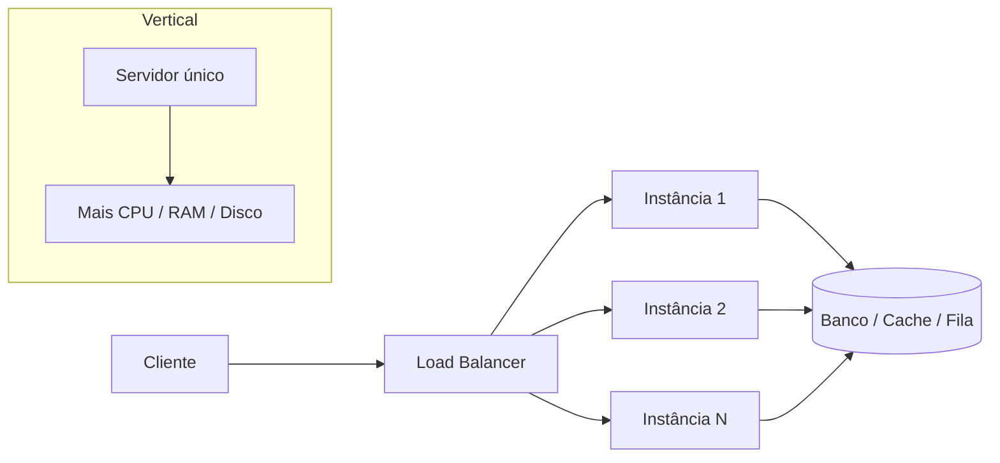

# Definicoes

## 1. O que é

Escalabilidade vertical e horizontal são duas formas de aumentar a capacidade de um sistema para atender mais demanda. Escalabilidade vertical, também chamada de scale up, consiste em tornar uma única máquina mais poderosa: mais CPU, mais RAM, mais disco, mais bandwidth. Escalabilidade horizontal, também chamada de scale out, consiste em adicionar mais instâncias de serviço, geralmente atrás de um balanceador de carga, para distribuir o tráfego.

No mercado, você verá os termos scale up / scale out, vertical scaling / horizontal scaling e, em alguns contextos, “escalar para cima” versus “escalar para fora”. A diferença essencial é que a vertical aumenta o tamanho de um nó; a horizontal aumenta o número de nós.

## 2. Por que existe (o problema que resolve)

O problema central é simples: um sistema precisa lidar com mais requisições, mais usuários, mais dados ou mais processamento do que uma única máquina consegue suportar. Antes da abordagem moderna de escalabilidade horizontal, a solução mais comum era comprar servidores maiores, com mais memória e CPU, e manter tudo em uma única instância. Isso funcionava bem até o ponto em que o gargalo era o próprio hardware, a disponibilidade ou o custo de manutenção.

Historicamente, o conceito de aumentar capacidade por meio de clusters e distribuição de carga é antigo, mas ganhou enorme relevância com a ascensão da internet, dos data centers e das plataformas cloud. Empresas como Amazon, Google, Netflix e Uber popularizaram o uso de arquiteturas distribuídas e de scale out como padrão operacional. O problema que esse conceito resolve é a limitação física e econômica de um único servidor, além da necessidade de tolerar falhas e crescer de forma contínua sem depender de uma única máquina.

## 3. Como funciona

A escalabilidade vertical funciona assim:

1. O sistema roda em uma instância única.
2. À medida que a carga cresce, o operador aumenta recursos dessa máquina: mais vCPUs, mais RAM, mais IOPS, mais armazenamento.
3. O sistema continua operando sem mudar sua arquitetura, desde que o software suporte o novo ambiente.
4. O limite vem quando a máquina atinge um teto de desempenho, custo, disponibilidade ou compatibilidade.

A escalabilidade horizontal funciona assim:

1. O sistema é projetado para rodar em múltiplas instâncias idênticas ou similares.
2. Um componente de entrada, normalmente um load balancer, distribui requisições entre as instâncias.
3. Cada instância executa uma cópia do mesmo serviço ou do mesmo módulo.
4. O tráfego é repartido para evitar sobrecarregar uma única máquina.
5. Quando a demanda aumenta, novas instâncias são adicionadas.
6. Quando uma instância falha, o tráfego é redirecionado para as demais.

Componentes envolvidos e papéis:

- Cliente: gera a requisição.
- Load balancer: decide para qual instância encaminhar cada requisição.
- Instâncias de aplicação: executam a lógica de negócio.
- Cache: reduz a carga no banco e acelera leituras.
- Banco de dados: pode ser compartilhado ou particionado; em arquiteturas horizontais, muitas vezes é necessário usar estratégias de replicação ou sharding.
- Fila de mensagens: desacopla processamento e melhora resiliência.
- Observabilidade: métricas, logs e tracing permitem identificar gargalos e falhas rapidamente.

A parte importante é que escala horizontal só funciona bem quando o sistema é projetado para ser distribuído. Aplicativos com estado local em memória, sessões presas a uma instância, arquivos locais ou dependências de um único nó tendem a se tornar frágeis quando multiplicados.

## 4. Casos de uso reais

Exemplos reais e conhecidos:

- APIs web de e-commerce: durante campanhas, Black Friday ou promoções, o tráfego cresce rapidamente. Escalar horizontalmente permite absorver picos com mais instâncias.
- Serviços de streaming e vídeo: Netflix e plataformas similares precisam servir milhões de usuários simultaneamente e usam replicação e distribuição de carga.
- Sistemas de reservas, pagamentos e checkout: exigem alta disponibilidade, tolerância a falha e capacidade de crescimento contínuo.
- Serviços de backend com arquitetura de microsserviços: cada serviço pode ser escalado independentemente.

Quando não usar:

- Quando a carga é pequena e o custo de operar múltiplas instâncias supera o ganho.
- Quando a aplicação é fortemente stateful e depende de uma única máquina para garantir consistência simples.
- Quando o sistema ainda é um monólito legado com dependências internas difíceis de distribuir.
- Quando a operação exige uma única fonte de verdade forte e simples, sem particionamento ou replicação complexa.

## 5. Cenários práticos e trade-offs

Cenário 1: API REST pública com pico de tráfego

- Uma aplicação monolítica roda em uma única instância e começa a perder performance.
- A equipe opta por adicionar mais instâncias atrás de um load balancer.
- O resultado é melhor capacidade e maior disponibilidade.
- Trade-offs: mais complexidade operacional, necessidade de health checks, sessão distribuída e maior custo.

Cenário 2: Falha de uma instância

- Uma das instâncias cai por um problema de rede ou por reinicialização.
- O balanceador para de encaminhar tráfego para ela.
- O sistema continua funcionando, mas a latência pode aumentar temporariamente enquanto o cluster se reorganiza.
- Trade-offs: maior resiliência, porém mais componentes para monitorar e mais possibilidades de inconsistência transitória.

Cenário 3: Banco de dados como gargalo

- A aplicação escala horizontalmente, mas o banco não acompanha.
- O resultado costuma ser um gargalo de leitura ou escrita, que não é resolvido apenas com mais instâncias de aplicação.
- Trade-offs: pode ser necessário cache, replicação, particionamento ou adoção de uma arquitetura mais sofisticada.

Trade-offs gerais:

- Latência: pode cair com mais capacidade, mas o balanceamento e a rede podem introduzir overhead.
- Consistência: sistemas distribuídos frequentemente precisam escolher entre disponibilidade e consistência forte.
- Custo: escala horizontal pode ser mais barata em picos, mas tende a aumentar custo operacional e de infraestrutura.
- Complexidade: mais instâncias, mais automação, mais observabilidade e mais cuidado com estado e sincronização.

## 6. Diagrama e fluxo visual

a) Diagrama em Mermaid



b) Prompt para geração de imagem

Prompt em inglês:

“Create a conceptual illustration comparing vertical scaling and horizontal scaling in distributed systems. Show one large powerful server on the left labeled ‘Vertical scaling: scale up’, with a single box growing larger and more powerful. On the right, show multiple smaller application instances behind a load balancer labeled ‘Horizontal scaling: scale out’, with traffic distributed evenly among them. Include subtle visual cues for cloud infrastructure, traffic arrows, database, cache, and failover. Style: clean technical infographic, modern blue and gray palette, minimalistic, high clarity.”

## 7. Exemplo aplicado — Java + Spring

A seguir, um exemplo simples e realista de um serviço Spring Boot que é stateless e, portanto, adequado para rodar em múltiplas instâncias atrás de um balanceador de carga.

```java
package com.example.orders;

import org.springframework.boot.SpringApplication;
import org.springframework.boot.autoconfigure.SpringBootApplication;
import org.springframework.http.ResponseEntity;
import org.springframework.stereotype.Service;
import org.springframework.web.bind.annotation.*;

import java.math.BigDecimal;
import java.util.UUID;

@SpringBootApplication
public class OrdersApplication {
    public static void main(String[] args) {
        SpringApplication.run(OrdersApplication.class, args);
    }
}

@RestController
@RequestMapping("/orders")
class OrderController {
    private final OrderService orderService;

    OrderController(OrderService orderService) {
        this.orderService = orderService;
    }

    @PostMapping
    public ResponseEntity<OrderResponse> create(@RequestBody CreateOrderRequest request) {
        OrderResponse response = orderService.create(request.customerId(), request.amount());
        return ResponseEntity.ok(response);
    }
}

@Service
class OrderService {
    public OrderResponse create(String customerId, BigDecimal amount) {
        // Este serviço não guarda estado local em memória para a sessão.
        // Ele pode ser executado em várias instâncias atrás de um load balancer.
        String orderId = UUID.randomUUID().toString();
        return new OrderResponse(orderId, "CREATED", customerId, amount);
    }
}

class CreateOrderRequest {
    private String customerId;
    private BigDecimal amount;

    public String getCustomerId() {
        return customerId;
    }

    public void setCustomerId(String customerId) {
        this.customerId = customerId;
    }

    public BigDecimal getAmount() {
        return amount;
    }

    public void setAmount(BigDecimal amount) {
        this.amount = amount;
    }
}

class OrderResponse {
    private final String id;
    private final String status;
    private final String customerId;
    private final BigDecimal amount;

    OrderResponse(String id, String status, String customerId, BigDecimal amount) {
        this.id = id;
        this.status = status;
        this.customerId = customerId;
        this.amount = amount;
    }

    public String getId() {
        return id;
    }

    public String getStatus() {
        return status;
    }

    public String getCustomerId() {
        return customerId;
    }

    public BigDecimal getAmount() {
        return amount;
    }
}
```

Pontos-chave:

- A aplicação é stateless: cada requisição pode ser atendida por qualquer instância.
- Isso facilita a implantação em múltiplas réplicas e é a base da escalabilidade horizontal.
- Em produção, o estado durável deve ir para um banco de dados, cache distribuído ou fila, e não ficar apenas na memória da instância.

## 8. Exemplo aplicado — TypeScript + NestJS

O mesmo princípio pode ser aplicado com NestJS de forma muito natural.

```ts
import { Controller, Post, Body, Injectable } from '@nestjs/common';
import { NestFactory } from '@nestjs/core';

@Injectable()
class OrderService {
  create(customerId: string, amount: number) {
    // Este serviço não depende de estado local da instância.
    // Ele pode rodar em várias replicas atrás de um balanceador.
    return {
      id: crypto.randomUUID(),
      status: 'CREATED',
      customerId,
      amount,
    };
  }
}

@Controller('orders')
class OrderController {
  constructor(private readonly orderService: OrderService) {}

  @Post()
  create(@Body() body: { customerId: string; amount: number }) {
    return this.orderService.create(body.customerId, body.amount);
  }
}

async function bootstrap() {
  const app = await NestFactory.createApplicationContext({
    module: class {
      static module = class {};
    },
  });
}

bootstrap();
```

Pontos-chave:

- O controlador e o serviço são simples e stateless.
- Isso torna a aplicação compatível com múltiplas instâncias e com balancement de carga.
- Se houver necessidade de persistência ou compartilhamento de estado, o próximo passo é integrar um banco ou um cache distribuído.

## 9. Comparação e armadilhas comuns

Comparação rápida com conceitos parecidos:

- Escalabilidade vertical x escalabilidade horizontal: a primeira aumenta o tamanho de um nó; a segunda aumenta o número de nós.
- Particionamento (sharding) x escalabilidade horizontal: sharding é uma técnica para dividir dados entre múltiplos bancos ou nós; a escalabilidade horizontal é o conceito mais amplo de adicionar mais nós ou instâncias.
- Replicação x escalabilidade horizontal: replicação cria cópias de dados ou serviços; horizontal scaling pode usar replicação como mecanismo, mas não é sinônimo.

Erros comuns na prática:

1. Pensar que “mais instâncias” resolve tudo sem revisar o banco de dados, o cache e os limites de conexão.
2. Manter estado local em memória em uma aplicação que deveria ser stateless.
3. Ignorar a necessidade de observabilidade, health checks e estratégias de failover.

## 10. Perguntas para fixação

1. Em que situação a escalabilidade vertical é preferível à escalabilidade horizontal?
2. Quais problemas aparecem quando uma aplicação stateless é implantada em múltiplas instâncias sem um plano de persistência e compartilhamento de estado?
3. Como você decidiria entre aumentar a capacidade de um único servidor ou adicionar mais instâncias em um cenário de pico de tráfego?
