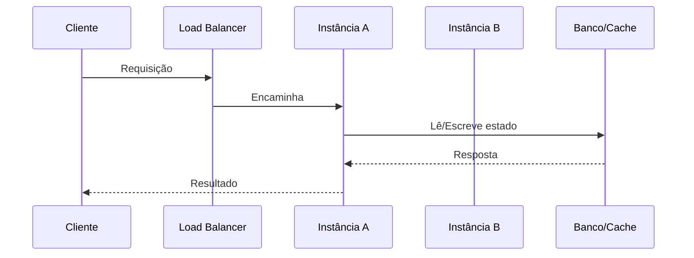

# Stateless vs Stateful

## 1. O que é
Stateless e stateful descrevem se um serviço ou componente precisa lembrar informação entre requisições para manter o comportamento correto. Em uma arquitetura stateless, cada chamada é autocontida: o servidor não depende de contexto anterior armazenado localmente para processar a próxima requisição. Em uma arquitetura stateful, o sistema preserva estado entre chamadas, como sessão, cursor, cache local, conexão persistente ou progresso de uma operação.

No mercado, você também encontrará os termos stateful/stateless, sessão no servidor versus sessão no cliente, e “sem estado” versus “com estado”. A distinção é importante porque impacta escalabilidade, disponibilidade, failover e consistência.

## 2. Por que existe (o problema que resolve)
O problema que esse conceito resolve é a capacidade de escalar e operar sistemas distribuídos de forma previsível. Quando um serviço é stateless, qualquer instância pode atender qualquer requisição, o que simplifica balanceamento de carga, recuperação de falhas e substituição de instâncias. Antes disso, arquiteturas com estado local em memória exigiam “sticky sessions” e dependiam de uma instância específica, o que dificultava a disponibilidade e a expansão horizontal.

A ideia se consolidou com o crescimento de aplicações web e de serviços em nuvem, especialmente quando empresas passaram a rodar múltiplas instâncias por trás de load balancers. O padrão se tornou essencial para sistemas que precisam de elasticidade, tolerância a falhas e implantação contínua.

## 3. Como funciona
Em um sistema stateless, o fluxo é simples:
1. O cliente envia uma requisição com tudo o que o servidor precisa.
2. O servidor processa a requisição sem depender de memória local antiga.
3. O resultado é retornado ao cliente.
4. O estado durável, se existir, é salvo em uma camada externa, como banco de dados, cache distribuído, fila ou armazenamento compartilhado.

Em um sistema stateful, o estado precisa sobreviver entre requisições:
1. O servidor cria ou recupera contexto associado ao cliente ou à operação.
2. Esse contexto é mantido em memória, sessão, conexão ou armazenamento persistente.
3. As requisições subsequentes consultam ou atualizam esse contexto.
4. Se a instância cair, esse estado pode ser perdido, a menos que exista replicação ou persistência externa.

Componentes envolvidos:
- Cliente: envia o pedido e, em alguns casos, mantém identidade ou token.
- Servidor: executa a lógica.
- Session store ou banco: armazena state quando necessário.
- Load balancer: distribui requisições nas instâncias do sistema.
- Cache/distribuição: reduz pressão sobre o banco e ajuda na consistência de leitura.

## 4. Casos de uso reais
- APIs REST e serviços de backend web: normalmente são stateless para facilitar balanceamento e escalabilidade.
- Sistemas de login e autenticação: tokens JWT ou sessões armazenadas em banco/cache permitem manter a aplicação stateless no servidor.
- Sistemas de processamento assíncrono: filas e workers são stateless por natureza, pois cada mensagem é processada independentemente.
- Aplicações de chat e sessões longas: podem ser stateful quando precisam manter conexões abertas e estado por usuário.

Quando não usar:
- Quando a lógica exige manter um estado rico e contínuo por sessão e a perda desse estado é inaceitável.
- Quando a aplicação depende de conexões persistentes, streams ou interações de longa duração que não cabem bem em uma abordagem stateless.
- Quando o custo de externalizar o estado supera o ganho em escalabilidade.

## 5. Cenários práticos e trade-offs
Cenário 1: API de pedidos
- A aplicação é stateless e pode ser escalada para 3, 10 ou 100 instâncias sem alterar a lógica.
- Trade-offs: mais simples de operar, porém exige persistência externa para dados sensíveis.

Cenário 2: Falha de instância em sistema stateful
- Uma sessão em memória é perdida se a instância cair.
- O cliente precisa reconectar ou reestabelecer a sessão.
- Trade-offs: maior complexidade operacional, mas talvez seja necessário para casos que exigem contexto contínuo.

Cenário 3: Sistema de streaming ou websocket
- O servidor precisa manter conexões abertas e estado por cliente.
- Trade-offs: melhor experiência interativa, mas menor simplicidade e menor facilidade de rebalanceamento.

Trade-offs gerais:
- Escalabilidade: stateless tende a ser melhor para horizontal scaling.
- Consistência: stateful pode simplificar certos fluxos, mas traz mais problemas de sincronização.
- Latência: stateful local pode ser mais rápido, mas menos resiliente.
- Complexidade: stateful muitas vezes exige mais cuidado com replicação e recuperação.

## 6. Diagrama e fluxo visual
a) Diagrama em Mermaid



b) Prompt para geração de imagem

“Create a conceptual illustration comparing stateless and stateful architectures. Show a stateless service with multiple identical servers behind a load balancer, each request handled independently, and a stateful service where a session is attached to a single server with a persistent connection. Use a clean cloud architecture style, blue and gray palette, arrows showing request flow and state storage.”

## 7. Exemplo aplicado — Java + Spring
```java
package com.example.orders;

import org.springframework.boot.SpringApplication;
import org.springframework.boot.autoconfigure.SpringBootApplication;
import org.springframework.web.bind.annotation.*;

@SpringBootApplication
public class OrdersApplication {
    public static void main(String[] args) {
        SpringApplication.run(OrdersApplication.class, args);
    }
}

@RestController
@RequestMapping("/orders")
class OrderController {
    private final OrderService orderService;

    OrderController(OrderService orderService) {
        this.orderService = orderService;
    }

    @PostMapping
    public OrderResponse create(@RequestBody CreateOrderRequest request) {
        return orderService.create(request.customerId(), request.amount());
    }
}

record CreateOrderRequest(String customerId, double amount) {}
record OrderResponse(String id, String status) {}

@Component
class OrderService {
    public OrderResponse create(String customerId, double amount) {
        return new OrderResponse("ord-123", "CREATED");
    }
}
```

Pontos-chave:
- O controller não depende de memória local entre requests.
- Cada chamada pode ser atendida por qualquer instância.
- Esse é o modelo ideal para escalabilidade horizontal.

## 8. Exemplo aplicado — TypeScript + NestJS
```ts
import { Controller, Post, Body, Injectable } from '@nestjs/common';
import { NestFactory } from '@nestjs/core';

@Injectable()
class OrderService {
  create(customerId: string, amount: number) {
    return { id: 'ord-123', status: 'CREATED' };
  }
}

@Controller('orders')
class OrderController {
  constructor(private readonly orderService: OrderService) {}

  @Post()
  create(@Body() body: { customerId: string; amount: number }) {
    return this.orderService.create(body.customerId, body.amount);
  }
}

async function bootstrap() {
  const app = await NestFactory.createApplicationContext({
    module: class {
      static module = class {};
    },
  });
}

bootstrap();
```

Pontos-chave:
- O serviço não armazena sessão nem estado local.
- A aplicação pode ser replicada sem problemas de dependência de instância.

## 9. Comparação e armadilhas comuns
Comparação rápida:
- Stateless x stateful: o primeiro não precisa preservar contexto; o segundo sim.
- Stateless x cache distribuído: cache é uma forma de estado compartilhado, mas não substitui a necessidade de modelar corretamente o estado da aplicação.

Erros comuns:
1. Armazenar sessão em memória do servidor sem perceber que a aplicação será escalada horizontalmente.
2. Confiar em “sticky sessions” como solução de longo prazo.
3. Misturar estado local com lógica de negócio e tornar o sistema dependente de uma única instância.

## 10. Perguntas para fixação
1. Em que cenários a abordagem stateless é claramente superior?
2. Quais problemas surgem quando uma aplicação stateful é replicada sem um plano de persistência de estado?
3. Como você diferenciaria uma sessão de usuário de um estado de aplicação compartilhado?
