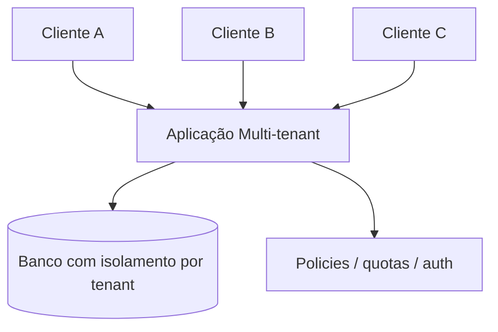

# Multi-tenant vs Single-tenant

## 1. O que é

Multi-tenant e single-tenant descrevem modelos de hospedagem e isolamento de clientes em uma plataforma. No modelo single-tenant, cada cliente ou organização possui seu próprio ambiente, infraestrutura ou instância isolada. No modelo multi-tenant, vários clientes compartilham a mesma infraestrutura, mas com isolamento lógico, segurança e políticas separadas.

Em alguns contextos, você verá os termos tenant isolation, shared infrastructure, dedicated instance e isolated environment. A diferença essencial é se o isolamento é físico, lógico ou ambos.

## 2. Por que existe (o problema que resolve)

O problema que esse conceito resolve é a forma de oferecer software de forma econômica e escalável a vários clientes. Antes do modelo multi-tenant, era comum provisionar uma infraestrutura dedicada para cada cliente, o que aumentava custo, operação e tempo de implantação. Com o crescimento de SaaS e plataformas cloud, tornou-se viável compartilhar recursos entre clientes e ainda manter segurança e isolamento suficiente.

Esse modelo ganhou força com empresas de software como Salesforce, Microsoft 365 e plataformas cloud públicas, que precisam servir dezenas de milhares de tenants com eficiência operacional.

## 3. Como funciona

No modelo single-tenant:

1. Cada cliente recebe uma instância separada ou um ambiente dedicado.
2. Os recursos podem ser dimensionados independentemente.
3. O isolamento é mais forte, mas o custo operacional é maior.

No modelo multi-tenant:

1. A aplicação serve vários clientes na mesma base de código e infraestrutura.
2. Cada tenant recebe um identificador lógico, como tenantId.
3. Os dados e as configurações são isolados por política e por camada de dados.
4. O controle de acesso, quotas, metadados e auditoria são aplicados por tenant.

Componentes envolvidos:

- Tenant: cliente que consome o serviço.
- Identity e autorização: definem quem acessa o que.
- Camada de aplicação: adiciona contexto de tenant nas operações.
- Banco de dados: pode usar esquema por tenant, banco separado ou particionamento compartilhado.
- Observabilidade: permite métricas e logs por tenant e por quota.

## 4. Casos de uso reais

- SaaS de CRM e ERP: o modelo multi-tenant é padrão para reduzir custo por cliente.
- Plataformas de colaboração e produtividade: muitos usuários e organizações distintas compartilham a mesma aplicação.
- B2B APIs: empresas diferentes usam a mesma plataforma, mas precisam de isolamento lógico.
- Ambientes regulatórios rígidos: single-tenant pode ser escolhido para maior controle e isolamento físico.

Quando não usar:

- Quando há requisitos fortes de isolamento físico, compliance ou auditoria.
- Quando clientes têm necessidades muito diferentes de performance ou configuração.
- Quando o custo de implementar isolamento lógico é maior do que o benefício.

## 5. Cenários práticos e trade-offs

Cenário 1: Plataforma SaaS para pequenas empresas

- O modelo multi-tenant permite compartilhar infraestrutura e reduzir custo por cliente.
- Trade-offs: risco de fuga de isolamento se a camada de segurança não for bem implementada.

Cenário 2: Cliente regulado com SLA forte

- O modelo single-tenant pode ser preferido para garantir recursos dedicados.
- Trade-offs: custo mais alto e menor eficiência de utilização.

Cenário 3: Picos de uso por tenant

- Em multi-tenant, um cliente pesado pode impactar outros se não houver quotas e isolamento de recursos.
- Trade-offs: melhor economia, mas mais complexidade para governança e contorno de noisy neighbor.

Trade-offs gerais:

- Custo: multi-tenant costuma ser mais econômico.
- Isolamento: single-tenant é mais simples de garantir.
- Complexidade operacional: multi-tenant exige mais governança e controle.
- Segurança: ambos demandam controles rigorosos, porém em níveis diferentes.

## 6. Diagrama e fluxo visual

a) Diagrama em Mermaid



b) Prompt para geração de imagem

“Create a conceptual diagram showing single-tenant versus multi-tenant architecture. On the left, show separate isolated environments for each customer with dedicated infrastructure. On the right, show multiple customers sharing the same application and database layer, each with separate logical boundaries and tenant labels. Use a modern SaaS style, blue, gray and green tones.”

## 7. Exemplo aplicado — Java + Spring

```java
package com.example.tenant;

import org.springframework.stereotype.Service;
import org.springframework.web.bind.annotation.*;

@RestController
@RequestMapping("/orders")
class OrderController {
    private final OrderService orderService;

    OrderController(OrderService orderService) {
        this.orderService = orderService;
    }

    @GetMapping
    public String list(@RequestHeader("X-Tenant-Id") String tenantId) {
        return orderService.listForTenant(tenantId);
    }
}

@Service
class OrderService {
    public String listForTenant(String tenantId) {
        return "Listing orders for tenant " + tenantId;
    }
}
```

Pontos-chave:

- O tenant é tratado explicitamente via header.
- As operações devem sempre aplicar o contexto do tenant.
- Em produção, isso deveria ser reforçado por autenticação e políticas de acesso.

## 8. Exemplo aplicado — TypeScript + NestJS

```ts
import { Controller, Get, Headers, Injectable } from '@nestjs/common';

@Injectable()
class OrderService {
  listForTenant(tenantId: string) {
    return `Listing orders for tenant ${tenantId}`;
  }
}

@Controller('orders')
class OrderController {
  constructor(private readonly orderService: OrderService) {}

  @Get()
  list(@Headers('x-tenant-id') tenantId: string) {
    return this.orderService.listForTenant(tenantId);
  }
}
```

Pontos-chave:

- O contexto do tenant é passado na requisição.
- A aplicação precisa garantir que o tenant nunca seja ignorado nas consultas e permissões.

## 9. Comparação e armadilhas comuns

Comparação rápida:

- Single-tenant: maior isolamento e controle, mas maior custo.
- Multi-tenant: maior eficiência, mas maior complexidade de segurança e isolamento.

Erros comuns:

1. Fazer isolamento apenas no código, sem reforço no banco e nas políticas de acesso.
2. Ignorar a necessidade de quotas e limites por tenant.
3. Tratar todos os clientes como iguais em termos de performance e risco.

## 10. Perguntas para fixação

1. Quando um sistema multi-tenant se torna um risco de segurança ou operação?
2. Como você implementaria isolamento de dados entre tenants em um banco compartilhado?
3. Quais sinais indicam que um single-tenant deveria ser migrado para multi-tenant?
