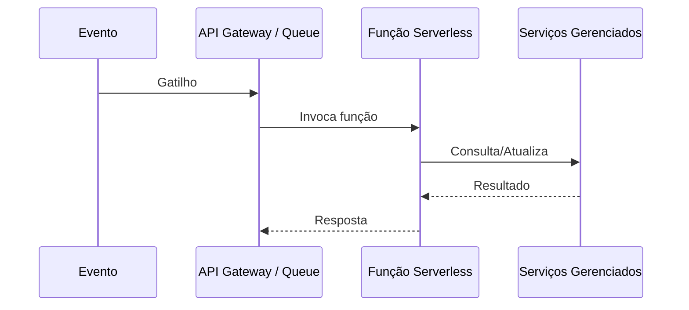

# Serverless Architecture

## 1. O que é
Serverless é um modelo de execução em que o provedor de nuvem gerencia a infraestrutura subjacente, enquanto o time de desenvolvimento foca apenas na lógica da aplicação. O termo pode ser enganoso, porque servidores ainda existem; o que “some” é a necessidade de provisionar, escalar e manter máquinas manualmente. Em geral, o modelo é baseado em funções sem estado, eventos e serviços gerenciados.

No mercado, você também verá os termos Functions as a Service (FaaS), event-driven architecture e backend como serviço. O ponto central é delegar a execução para um runtime gerenciado e pagar pelo uso efetivo.

## 2. Por que existe (o problema que resolve)
O problema que serverless resolve é a sobrecarga operacional de gerenciar infraestrutura. Antes desse modelo, equipes precisavam provisionar VMs, configurar escalabilidade, aplicar patches e lidar com capacidade. Isso gerava custo fixo e lentidão na entrega. Com o advento de nuvem e plataformas de execução sob demanda, tornou-se possível publicar funções e deixar que o provedor gerencie autoscaling, disponibilidade e execução.

A abordagem ganhou destaque com serviços como AWS Lambda, Azure Functions e Google Cloud Functions, e se tornou popular para APIs pequenas, integrações, automações e workloads event-driven.

## 3. Como funciona
O fluxo de uma função serverless normalmente é:
1. Um evento ocorre: requisição HTTP, mensagem em fila, alteração de objeto, evento de calendário etc.
2. O provedor de nuvem inicializa ou reutiliza um runtime para executar a função.
3. A função recebe o evento e executa a lógica.
4. O resultado é retornado ou publicado em outro canal.
5. O runtime é encerrado ou mantido em pool conforme a política do provedor.

Componentes envolvidos:
- Evento: gatilho de execução.
- Função: unidade de processamento.
- Runtime: ambiente de execução gerenciado.
- Serviços gerenciados: banco, fila, storage, gateway, autenticação.
- Observabilidade: logs, métricas e tracing.

## 4. Casos de uso reais
- Processamento de eventos e filas: imagens, upload, notificação, integrações.
- APIs pequenas e de baixa latência: backends de webhook e automações.
- ETL leve e pipelines de eventos: transformação de dados pontuais.
- Microserviços de funcionalidades específicas: por exemplo, geração de PDF ou validação de pagamentos.

Quando não usar:
- Quando o workload é contínuo e de longa duração, com alto custo de cold start.
- Quando a aplicação exige controle fino de rede, kernel, runtime ou isolamento forte.
- Quando o desenho de arquitetura depende de execução local e latência muito previsível.

## 5. Cenários práticos e trade-offs
Cenário 1: Processamento de upload de arquivo
- Ao receber o arquivo, uma função é invocada para gerar thumbnails e enviar notificação.
- Trade-offs: alta produtividade e baixa operação, mas sem controle direto sobre o ambiente.

Cenário 2: Falha de cold start
- Uma função sem uso recente leva mais tempo para iniciar.
- Trade-offs: custo menor em idle, porém latência inicial maior em picos ou em chamadas esporádicas.

Cenário 3: Pipeline com dependência de estado
- Se a função precisa de contexto longo ou estado compartilhado, pode exigir serviços externos.
- Trade-offs: mais modular e simples para eventos, porém menos adequado para workflows complexos.

Trade-offs gerais:
- Custo: ótimo para carga variável, menos interessante para uso contínuo.
- Operação: menos overhead, mas menos controle.
- Latência: pode ter picos por cold start.
- Complexidade: boa para eventos, ruim para aplicações monolíticas grandes e long-running.

## 6. Diagrama e fluxo visual
a) Diagrama em Mermaid



b) Prompt para geração de imagem

“Create a conceptual illustration of a serverless architecture. Show an event source triggering a serverless function, with cloud-managed services around it such as queue, database, and API gateway. Use a modern cloud-native style, blue and white palette, with a clean focus on event-driven execution and automatic scaling.”

## 7. Exemplo aplicado — Java + Spring
```java
package com.example.serverless;

import org.springframework.boot.SpringApplication;
import org.springframework.boot.autoconfigure.SpringBootApplication;
import org.springframework.context.annotation.Bean;

import java.util.function.Function;

@SpringBootApplication
public class ServerlessApp {
    public static void main(String[] args) {
        SpringApplication.run(ServerlessApp.class, args);
    }

    @Bean
    public Function<String, String> uppercase() {
        return value -> value.toUpperCase();
    }
}
```

Pontos-chave:
- A função é pequena e sem estado.
- O runtime gerencia execução e escala.
- Esse modelo funciona bem para transformações e eventos.

## 8. Exemplo aplicado — TypeScript + NestJS
```ts
import { NestFactory } from '@nestjs/core';
import { Module, Controller, Get } from '@nestjs/common';

@Controller()
class HealthController {
  @Get()
  health() {
    return { status: 'ok' };
  }
}

@Module({ controllers: [HealthController] })
class AppModule {}

export const handler = async () => {
  const app = await NestFactory.createApplicationContext(AppModule);
  return { status: 'ok' };
};
```

Pontos-chave:
- O handler pode ser invocado por um gateway ou evento.
- O código é simples e não depende de um servidor longo.

## 9. Comparação e armadilhas comuns
Comparação rápida:
- Serverless x container: serverless abstrai mais do runtime, enquanto containers dão mais controle.
- Serverless x monólito: serverless favorece modularização por evento; monólitos são mais simples para aplicações homogêneas.

Erros comuns:
1. Usar serverless para workloads long-running sem avaliar impacto de cold start.
2. Manter estado local em funções sem considerar durabilidade.
3. Ignorar observabilidade e limites de execução do provedor.

## 10. Perguntas para fixação
1. Quando serverless é mais vantajoso do que um container tradicional?
2. Quais limites operacionais devem ser avaliados antes de migrar para serverless?
3. Como você evitaria problemas de estado em uma função serverless?
