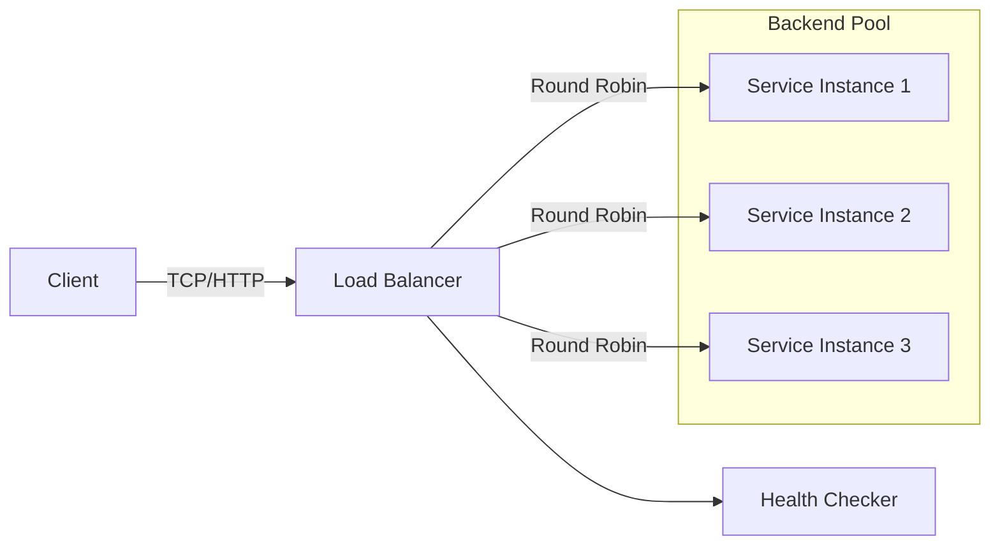

# Load Balancing

## 1. O que é

Load Balancing é o padrão de distribuir requisições ou conexões de entrada entre múltiplas instâncias de serviço para maximizar a utilização de recursos, reduzir latência e aumentar disponibilidade.

Sinônimos / nomes alternativos:

- Load balancer
- Traffic distribution
- Request balancing
- Traffic manager
- Load distribution

Variações / camadas reconhecidas:

- L4 Load Balancing (Transport Layer)
- L7 Load Balancing (Application Layer)
- Global Server Load Balancing (GSLB)
- Client-side load balancing
- DNS-based load balancing
- Hardware load balancing
- Software load balancing
- Kubernetes Service Load Balancing
- API Gateway / reverse proxy load balancing

## 2. Por que existe (o problema que resolve)

Load balancing surgiu porque, em sistemas de larga escala, um único servidor se torna gargalo e ponto único de falha. Antes dele, todo o tráfego era direcionado a poucas máquinas, resultando em saturação, falhas frequentes e tempo de resposta imprevisível.

A necessidade ficou clara com data centers e serviços de internet de alto volume, como o Google Search e o Yahoo no início dos anos 2000, quando proxies e balanceadores dedicados começaram a distribuir tráfego entre farm de servidores. O artigo original de L7 load balancing não tem um único paper canônico, mas a prática foi acelerada por empresas como Akamai, F5 Networks, e pelo uso de software como HAProxy e nginx.

## 3. Tipos e características

### 3.1 L4 Load Balancing

Como funciona:

- Opera na camada de transporte (TCP/UDP).
- Balanceia fluxos com base em IP de origem/destino, porta e protocolo.
- Não inspeciona payload HTTP.

Prós:

- Baixa latência e alto throughput.
- Funciona para TCP, UDP e protocolos binários.
- Transparente a cabeçalhos HTTP ou payload.

Contras:

- Não pode tomar decisões baseadas no conteúdo HTTP (URL, headers, cookies).
- Não consegue fazer roteamento inteligente por API ou host.

Camada:

- Rede / transporte.

Quando usar:

- Para tráfego TCP/UDP genérico, como banco de dados, Redis, gRPC, e UDP DNS.
- Quando a performance e o simples balanceamento de conexões forem críticos.

### 3.2 L7 Load Balancing

Como funciona:

- Opera na camada de aplicação.
- Inspeciona cabeçalhos e payload HTTP para decidir para qual back-end enviar a requisição.

Prós:

- Permite roteamento por hostname, path, método HTTP, cookies e headers.
- Suporta injeção de cabeçalhos, reescrita de URL e TLS offload.
- Facilitado para canary releases, blue-green e API Gateway.

Contras:

- Maior latência do que L4 devido ao parsing de HTTP.
- Requer mais recursos de CPU.

Camada:

- Aplicação.

Quando usar:

- Para APIs HTTP/HTTPS, REST, GraphQL, e aplicações web modernas.
- Quando é necessário roteamento avançado ou manipulação de cabeçalhos.

### 3.3 Global Server Load Balancing (GSLB)

Como funciona:

- Distribui tráfego entre múltiplas regiões ou data centers.
- Usa DNS, geo-localização, latência e saúde para direcionar clientes.

Prós:

- Permite alta disponibilidade geográfica.
- Reduz latência direcionando usuários para a região mais próxima.

Contras:

- Depende de tempo de vida (TTL) de DNS para convergência.
- Menos preciso para failover instantâneo.

Camada:

- Rede / DNS / infra global.

Quando usar:

- Para serviços multilocatados em várias regiões ou provedores.
- Quando a replicação geográfica e compliance regional são necessárias.

### 3.4 Client-side load balancing

Como funciona:

- O cliente escolhe o backend usando uma lista de instâncias e algoritmo local.
- Usa service discovery ou configurações empacotadas.

Prós:

- Evita ponto único de falha no balanceador.
- Reduz hops de rede.

Contras:

- A lógica de balanceamento fica distribuída e pode ser inconsistente.
- Requer service discovery confiável.

Camada:

- Aplicação / middleware cliente.

Quando usar:

- Em arquiteturas de microsserviços com service mesh ou bibliotecas como Netflix Ribbon.
- Quando o tráfego é intra-cluster e a latência de um salto extra é relevante.

### 3.5 DNS-based load balancing

Como funciona:

- O DNS retorna múltiplos endereços IP ou usa regras de geolocalização.
- O cliente escolhe um IP do conjunto retornado.

Prós:

- Simples e amplamente suportado.
- Pode ser usado sem proxy adicional.

Contras:

- Cache de DNS causa demora para propagar falhas.
- O cliente pode ignorar a ordem de resposta.

Camada:

- DNS / rede.

Quando usar:

- Para balanceamento global simples ou escalabilidade de alta disponibilidade.
- Quando não é necessário controle fino em nível de requisição.

### 3.6 Hardware vs software load balancing

Como funciona:

- Hardware balanceador usa appliances dedicados (F5, Citrix ADC).
- Software balanceador usa serviços em VM/container (HAProxy, nginx, Envoy).

Prós hardware:

- Geralmente alto throughput e recursos dedicados.
- Suporte enterprise e offload especializado.

Contras hardware:

- Custo alto e menor flexibilidade.

Prós software:

- Mais flexível e facilmente versionado.
- Boa integração com pipelines CI/CD.

Contras software:

- Pode exigir tuning e gestão de capacidade.

Camada:

- Infraestrutura.

Quando usar:

- Hardware para data centers tradicionais com SLAs rígidos.
- Software para nuvem, Kubernetes e ambientes dinâmicos.

## 4. Como funciona (mecanismo interno)

1. Recepção do tráfego: o balanceador recebe pacotes ou conexões de clientes.
2. Inspeção de contexto: identifica o protocolo, endereço e, no caso de L7, analisa headers e path.
3. Seleção de backend: aplica algoritmo de distribuição.
4. Checagem de saúde: verifica se instâncias estão saudáveis antes de rotear.
5. Roteamento: encaminha o tráfego para o servidor selecionado.
6. Persistência de sessão: opcionalmente mantém o cliente no mesmo backend usando sticky sessions.
7. Resposta: o backend responde, e o balanceador pode reescrever cabeçalhos ou terminar TLS.

Componentes envolvidos:

- Listener / frontend: porta exposta ao cliente.
- Health checker: executa probes HTTP/TCP/command para verificar saúde dos backends.
- Scheduler/algoritmo: calcula a instância destino.
- Connection proxy: reencaminha tráfego e potencialmente mantém estado.
- Monitor de estado: registra métricas e logs de balanceamento.

Algoritmos/estratégias comuns:

- Round Robin
- Least Connections
- Weighted Round Robin
- Hash-based / consistent hashing
- IP Hash
- Least Response Time
- Random
- URI Prefix / Path-based routing
- Header-based routing
- Canary / blue-green via route matching

## 5. Onde e como se aplica na prática

### Nível de máquina/processo único

- Um servidor local pode rodar nginx ou HAProxy para balancear entre processos locais em portas diferentes.
- Exemplo: `nginx` com upstream `localhost:8080` e `localhost:8081`.
- Vantagem: teste e desenvolvimento com pouca dependência externa.

### Nível de infraestrutura on-premise/self-managed

- Hardware: F5 BIG-IP, Citrix ADC, A10 Thunder.
- Software: HAProxy, nginx, Envoy, Traefik, Apache Traffic Server.
- Service proxy: Envoy como sidecar ou gateway para microserviços.
- Data center: Kemp LoadMaster e Cisco ACE.

### Nível de nuvem/managed service

- AWS: Elastic Load Balancing com Application Load Balancer (ALB), Network Load Balancer (NLB), Gateway Load Balancer (GWLB).
- GCP: Cloud Load Balancing com HTTP(S) Load Balancer, TCP/SSL Proxy, Network Load Balancer.
- Azure: Azure Load Balancer e Application Gateway.
- Cloudflare Load Balancer e Akamai Global Traffic Manager para GSLB.

### Nível de orquestração/Kubernetes

- Kubernetes Service tipo `LoadBalancer` ou `ClusterIP`.
- Ingress controllers: NGINX Ingress Controller, Traefik, Contour, Istio.
- Service Mesh: Istio, Linkerd e Consul usam proxies sidecar para L7 e L4.
- CoreDNS para DNS-based service discovery.

## 6. Casos de uso reais e quando NÃO usar

### Casos de uso reais

- Netflix: client-side load balancing e service discovery para centenas de microserviços. Tipo: client-side e L7 em runtime de aplicações.
- Twitch: NLB para UDP e WebRTC, ALB para APIs HTTP. Tipo: L4 para transporte, L7 para HTTP.
- GitHub: GSLB para tráfego global e failover entre regiões. Tipo: DNS-based e regional load balancing.
- Uber: L7 API Gateway para roteamento de endpoints e canary deployments. Tipo: L7 com path-based routing.
- Banco digital: HAProxy e F5 para tráfego financeiro sensível. Tipo: L4 para transações e L7 para APIs web.

### Quando NÃO usar ou evitar

- Evite client-side load balancing em ambientes sem service discovery confiável: causa falhas de ponta a ponta.
- Não use DNS-based balanceamento quando precisar de failover instantâneo: TTL de DNS retarda a recuperação.
- Evite L7 para tráfego UDP como DNS ou VoIP: não há parsing HTTP adequado.
- Cuidado com sticky sessions em escala alta: prejudica distribuição equilibrada e impede autoscaling efetivo.
- Não dependa apenas de hardware balancers em cloud-native: reduz flexibilidade e agilidade.

## 7. Cenários práticos e trade-offs

### Cenário 1: Pico de Black Friday

O pedido chega via ALB para uma frota de serviços de checkout. O balanceador distribui requisições e redireciona tráfego para instâncias saudáveis. Quando a carga sobe, a métrica de connections active no NLB dispara scale-out automático.

### Cenário 2: Falha de backend / caso de borda

Um pod de serviço apresenta erro. O health checker do HAProxy elimina a instância do pool. O balanceador redireciona apenas para backends saudáveis, evitando downtime.

### Cenário 3: Roteamento por path e canary

Um novo endpoint `/payment/v2` é roteado via nginx para um conjunto de instâncias canary. O tráfego normal vai para `payment-v1`, enquanto 10% das requisições para `/payment/v2` são direcionadas ao grupo de canary.

### Tabela de trade-offs

| Tipo / variação | Latência | Consistência | Custo operacional | Complexidade | Resiliência |
|---|---|---|---|---|---|
| L4 | Muito baixa | Média | Baixo | Baixa | Alta |
| L7 | Média | Alta | Médio | Médio | Alta |
| GSLB | Média | Baixa | Médio | Alto | Alta |
| Client-side | Baixa | Média | Moderado | Alto | Média |
| DNS-based | Muito baixa | Baixa | Muito baixo | Baixa | Média |

## 8. Diagrama e fluxo visual



**Prompt de imagem em inglês**

"Create a conceptual illustration of load balancing in a distributed application: a load balancer distributing HTTP and TCP traffic across multiple service instances, with health checks and region-aware routing. Show application layer routing and transport layer distribution in a modern cloud-native style."

## 9. Exemplo aplicado — Java + Spring

### Configuração com HAProxy

`haproxy.cfg`:

```cfg
frontend http-in
  bind *:80
  mode http
  default_backend app-backend

backend app-backend
  mode http
  balance roundrobin
  option httpchk GET /health
  server app1 10.0.0.11:8080 check
  server app2 10.0.0.12:8080 check
```

### Spring Boot

`pom.xml` dependencies:

```xml
<dependency>
  <groupId>org.springframework.boot</groupId>
  <artifactId>spring-boot-starter-web</artifactId>
</dependency>
```

`Application.java`:

```java
import org.springframework.boot.SpringApplication;
import org.springframework.boot.autoconfigure.SpringBootApplication;

@SpringBootApplication
public class Application {
  public static void main(String[] args) {
    SpringApplication.run(Application.class, args);
  }
}
```

`HealthController.java`:

```java
import org.springframework.http.ResponseEntity;
import org.springframework.web.bind.annotation.GetMapping;
import org.springframework.web.bind.annotation.RestController;

@RestController
public class HealthController {
  @GetMapping("/health")
  public ResponseEntity<String> health() {
    return ResponseEntity.ok("ok");
  }
}
```

Pontos-chave:

- O HAProxy faz L7 para HTTP e verifica `/health`.
- O Spring Boot expõe um endpoint de saúde simples.
- O balanceador decide o backend antes da aplicação processar a requisição.

## 10. Exemplo aplicado — TypeScript + NestJS

`package.json`:

```json
"dependencies": {
  "@nestjs/common": "^10.0.0",
  "@nestjs/core": "^10.0.0",
  "@nestjs/platform-express": "^10.0.0"
}
```

`main.ts`:

```ts
import { NestFactory } from '@nestjs/core';
import { AppModule } from './app.module';

async function bootstrap() {
  const app = await NestFactory.create(AppModule);
  app.enableShutdownHooks();
  await app.listen(3000);
}
bootstrap();
```

`app.controller.ts`:

```ts
import { Controller, Get } from '@nestjs/common';

@Controller()
export class AppController {
  @Get('health')
  health() {
    return { status: 'ok' };
  }
}
```

Pontos-chave:

- O NestJS roda na porta 3000, sendo balanceado por um proxy externo.
- A aplicação mantém um endpoint de saúde usado pelo load balancer.
- O balanceador gerencia a distribuição sem alterar a lógica de negócio.

## 11. Comparação e armadilhas comuns

### Comparação com failover passivo

- Load balancing distribui tráfego ativamente entre servidores saudáveis.
- Failover passivo apenas muda para um backup quando o primário falha.
- Diferença: balanceamento usa todos os recursos disponíveis; failover mantém recursos em standby.

### Comparação com service discovery

- Service discovery resolve instâncias disponíveis.
- Load balancing escolhe entre elas para enviar requisições.
- Diferença: discovery é mapa, balanceamento é decisão de roteamento.

### Erros comuns

- Não configurar health checks corretos: o load balancer continuará enviando tráfego a instâncias inativas.
- Usar sticky session em excesso: impede balanceamento efetivo e cria hotspots.
- Aplicar L7 para UDP: causa perda de pacotes e isolamento de protocolo.
- Ignorar DNS caching em GSLB: falhas não se propagam rapidamente.

## 12. Perguntas para fixação

- Qual a diferença técnica entre L4 e L7 load balancing?
- Quando é melhor usar client-side load balancing em vez de um balanceador central?
- Quais são as limitações de DNS-based load balancing para failover?
- Como sticky sessions afetam a escalabilidade e a resiliência?
- Quando vale a pena escolher hardware load balancer em vez de software load balancer?
