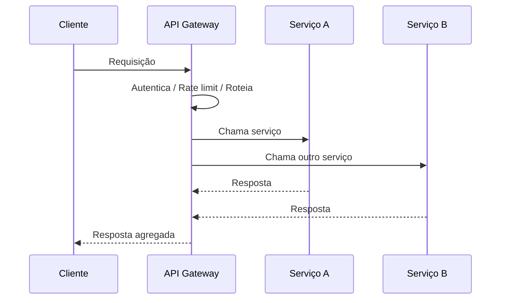
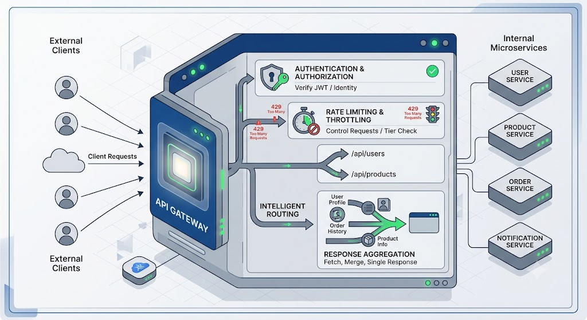

# API Gateway

## 1. O que é

Um API Gateway é um componente de entrada que centraliza o acesso a um conjunto de serviços internos. Ele recebe requisições do cliente, aplica políticas comuns e encaminha para os serviços adequados. Em muitos casos, ele funciona como um ponto único de entrada para autenticação, roteamento, rate limiting, transformação e agregação.

No mercado, você também encontrará os termos edge gateway, ingress controller, API management layer e reverse proxy com inteligência. A diferença principal é que um gateway não apenas encaminha tráfego, mas também exerce funções de controle e integração.

## 2. Por que existe (o problema que resolve)

O problema que ele resolve é a complexidade de expor vários serviços diretamente ao cliente. Sem um gateway, cada cliente precisaria conhecer diferentes endpoints, regras de segurança e contratos internos. Isso aumenta acoplamento, dificuldade de evolução e risco de exposição indevida. O gateway cria uma camada de abstração entre clientes e serviços internos.

Esse padrão ganhou relevância com o aumento de microsserviços e com a necessidade de controlar tráfego, segurança e evolução de contratos em ambientes distribuídos.

## 3. Como funciona

O fluxo típico é:

1. O cliente envia uma requisição para o gateway.
2. O gateway autentica e autoriza a chamada.
3. Ele aplica políticas como rate limiting, headers, quotas e tracing.
4. O gateway roteia a requisição para o serviço correto com base em path, versão, header ou regra de negócio.
5. Pode transformar o payload, fazer agregação ou responder diretamente com um BFF.
6. O resultado retorna ao cliente.

Componentes envolvidos:

- Cliente: consome o endpoint público.
- Gateway: ponto de entrada e camada de controle.
- Serviços internos: oferecem a lógica de negócio.
- Autorização e autenticação: protegem os recursos.
- Observabilidade: métricas, logs e tracing.

## 4. Casos de uso reais

- Microsserviços com um único ponto de entrada.
- Plataformas BFF para web e mobile.
- APIs públicas com controle de quota e segurança centralizada.
- Integrações com múltiplos backends e versões de contrato.

Quando não usar:

- Quando o sistema é pequeno e um único serviço basta.
- Quando o gateway se torna o gargalo principal e não há redundância.
- Quando a lógica de negócio precisa de uma separação rigorosa e não deve ser concentrada em um componente de entrada.

## 5. Cenários práticos e trade-offs

Cenário 1: BFF para mobile

- O gateway agrega dados de vários serviços e entrega uma resposta mais adequada ao cliente.
- Trade-offs: melhora a experiência do cliente, mas aumenta a complexidade do gateway.

Cenário 2: Falha do gateway

- Se houver uma única instância, ela vira ponto único de falha.
- Trade-offs: alta disponibilidade exige redundância e load balancer na frente.

Cenário 3: Rate limiting em picos de tráfego

- O gateway controla abuso e protege os serviços internos.
- Trade-offs: melhora segurança e estabilidade, mas pode rejeitar requisições legítimas se mal configurado.

Trade-offs gerais:

- Simplicidade: centraliza controle, mas pode se tornar um componente crítico.
- Latência: pode adicionar overhead por autenticação e transformação.
- Complexidade: facilita governança, mas aumenta o custo operacional.

## 6. Diagrama e fluxo visual

a) Diagrama em Mermaid



b) Prompt para geração de imagem

“Create a conceptual illustration of an API gateway in a microservices architecture. Show multiple internal services behind a central gateway that performs authentication, routing, rate limiting, and response aggregation. Use a modern cloud-native style with blue, gray and green tones.”



## 7. Exemplo aplicado — Java + Spring

```java
package com.example.gateway;

import org.springframework.boot.SpringApplication;
import org.springframework.boot.autoconfigure.SpringBootApplication;
import org.springframework.cloud.gateway.route.RouteLocator;
import org.springframework.cloud.gateway.route.builder.RouteLocatorBuilder;
import org.springframework.context.annotation.Bean;

@SpringBootApplication
public class GatewayApplication {
    public static void main(String[] args) {
        SpringApplication.run(GatewayApplication.class, args);
    }

    @Bean
    public RouteLocator routes(RouteLocatorBuilder builder) {
        return builder.routes()
            .route("orders", r -> r.path("/orders/**")
                .uri("http://orders-service"))
            .route("customers", r -> r.path("/customers/**")
                .uri("http://customers-service"))
            .build();
    }
}
```

Pontos-chave:

- O gateway roteia para diferentes serviços com base no path.
- Esse padrão simplifica o acesso do cliente e centraliza políticas.

## 8. Exemplo aplicado — TypeScript + NestJS

```ts
import { NestFactory } from '@nestjs/core';
import { Module, Controller, Get, Injectable } from '@nestjs/common';

@Controller('orders')
class OrdersController {
  @Get()
  getOrders() {
    return [{ id: 1, status: 'CREATED' }];
  }
}

@Module({ controllers: [OrdersController] })
class AppModule {}

async function bootstrap() {
  const app = await NestFactory.create(AppModule);
  await app.listen(3000);
}

bootstrap();
```

Pontos-chave:

- O NestJS pode atuar como um gateway simples ou como um serviço de entrada.
- Em ambientes maiores, esse ponto de entrada costuma evoluir para incluir autenticação, throttling e agregação.

## 9. Comparação e armadilhas comuns

Comparação rápida:

- API Gateway x Load Balancer: o primeiro adiciona lógica de controle; o segundo prioriza distribuição de tráfego.
- API Gateway x BFF: o BFF é uma aplicação específica de gateway para um cliente, enquanto o gateway pode servir múltiplos cenários.

Erros comuns:

1. Colocar lógica de negócio pesada dentro do gateway.
2. Fazer do gateway um único ponto de falha sem redundância.
3. Ignorar observabilidade e políticas de timeout.

## 10. Perguntas para fixação

1. Quando um API Gateway é mais adequado do que expor serviços diretamente?
2. Quais políticas você normalmente aplicaria em um gateway?
3. Como você evitaria que o gateway se torne um gargalo?
