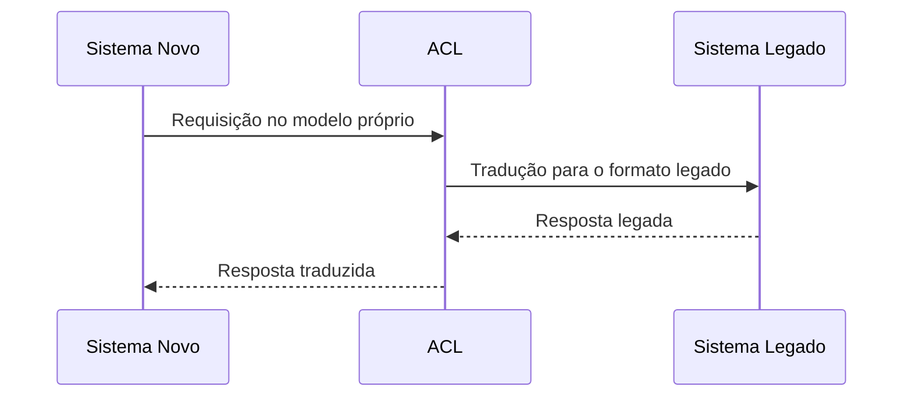

# Anti-Corruption Layer

## 1. O que é
O Anti-Corruption Layer, ou camada anti-corrupção, é uma camada de adaptação entre um sistema novo e um sistema legado ou um fornecedor externo. Seu papel é traduzir modelos, protocolos e contratos incompatíveis para impedir que a lógica de negócio do sistema novo seja contaminada por convenções antigas ou rígidas.

Também é conhecido como ACL, translation layer ou integration boundary. O conceito é especialmente útil quando se integra com serviços legados, sistemas de terceiros ou domínios com linguagem técnica incompatível.

## 2. Por que existe (o problema que resolve)
O problema que ele resolve é a incompatibilidade semântica e estrutural entre sistemas diferentes. Quando um sistema moderno tenta consumir um legado sem adaptação, o acoplamento vira um problema: mudanças no fornecedor, mudanças de contrato ou regras de negócio antigas vazam para o domínio atual. Isso gera fragilidade e dificulta evolução.

Esse padrão ganhou destaque em contextos de modernização de aplicações legadas e em integrações com sistemas de terceiros, onde o “modelo de domínio” de um lado não combina com o do outro.

## 3. Como funciona
O fluxo típico é:
1. O sistema novo recebe uma requisição ou evento.
2. A camada de adaptação traduz esse pedido para o formato esperado pelo sistema legado ou parceiro.
3. A resposta é convertida de volta para o modelo do domínio atual.
4. O restante da aplicação não precisa conhecer as particularidades do sistema remoto.

Componentes envolvidos:
- Sistema novo: domínio atual da aplicação.
- Sistema legado/terceiro: contrato incompatível.
- Adapter/ACL: traduz mensagens, modelos e regras.
- Modelos internos: representam a linguagem de domínio própria.
- Observabilidade: facilita rastreio de falhas e mapeamentos.

## 4. Casos de uso reais
- Modernização de sistemas legados com CRM, ERP ou mainframe.
- Integração com APIs externas de pagamentos, logística e identidade.
- Migração gradual de monólitos para microsserviços.
- Integração com provedores que usam contratos pouco amigáveis.

Quando não usar:
- Quando a integração é simples e os modelos são compatíveis.
- Quando o custo de criar uma camada de adaptação supera o benefício.
- Quando não há necessidade de isolação de domínio e o acoplamento é aceitável.

## 5. Cenários práticos e trade-offs
Cenário 1: Integração com ERP legado
- A camada ACL traduz ordens e status para o modelo do sistema atual.
- Trade-offs: reduz acoplamento, mas adiciona uma camada extra de manutenção.

Cenário 2: Falha de contrato externo
- O provider muda um campo ou um enum.
- Trade-offs: a ACL isolará o impacto, mas exige atualização e testes no adaptador.

Cenário 3: Migração gradual
- O sistema antigo e o novo coexistem por tempo.
- Trade-offs: a ACL facilita a transição, porém aumenta a superfície de integração.

Trade-offs gerais:
- Manutenibilidade: melhora muito, mas há custo de implementação.
- Complexidade: adiciona camada, mas reduz espalhamento de adaptações.
- Flexibilidade: facilita mudanças futuras, mas pode introduzir overhead.

## 6. Diagrama e fluxo visual
a) Diagrama em Mermaid



b) Prompt para geração de imagem

“Create a conceptual illustration of an anti-corruption layer between a modern application and a legacy system. Show a translation boundary that converts requests and responses between two incompatible domains, with clear visual separation and a clean integration architecture style.”

## 7. Exemplo aplicado — Java + Spring
```java
package com.example.acl;

import org.springframework.boot.SpringApplication;
import org.springframework.boot.autoconfigure.SpringBootApplication;
import org.springframework.web.bind.annotation.GetMapping;
import org.springframework.web.bind.annotation.RestController;

@SpringBootApplication
public class AclApplication {
    public static void main(String[] args) {
        SpringApplication.run(AclApplication.class, args);
    }
}

@RestController
class CustomerController {
    private final LegacyCustomerAdapter adapter;

    CustomerController(LegacyCustomerAdapter adapter) {
        this.adapter = adapter;
    }

    @GetMapping("/customers/1")
    public CustomerDto getCustomer() {
        LegacyCustomer legacy = adapter.fetchLegacyCustomer(1L);
        return new CustomerDto(legacy.id(), legacy.fullName());
    }
}

record CustomerDto(Long id, String name) {}

class LegacyCustomerAdapter {
    public LegacyCustomer fetchLegacyCustomer(Long id) {
        return new LegacyCustomer(id, "Maria Silva");
    }
}

record LegacyCustomer(Long id, String fullName) {}
```

Pontos-chave:
- A classe adapter traduz o modelo legado para o modelo do sistema atual.
- O restante da aplicação não precisa conhecer detalhes do contrato externo.

## 8. Exemplo aplicado — TypeScript + NestJS
```ts
import { Controller, Get, Injectable } from '@nestjs/common';
import { NestFactory } from '@nestjs/core';

class LegacyCustomer {
  constructor(public id: number, public fullName: string) {}
}

class CustomerDto {
  constructor(public id: number, public name: string) {}
}

@Injectable()
class LegacyCustomerAdapter {
  fetchLegacyCustomer(id: number): LegacyCustomer {
    return new LegacyCustomer(id, 'Maria Silva');
  }
}

@Controller('customers')
class CustomerController {
  constructor(private readonly adapter: LegacyCustomerAdapter) {}

  @Get(':id')
  getCustomer(id: string) {
    const legacy = this.adapter.fetchLegacyCustomer(Number(id));
    return new CustomerDto(legacy.id, legacy.fullName);
  }
}

async function bootstrap() {
  const app = await NestFactory.createApplicationContext({ module: class {} as any });
  await app.init();
}

bootstrap();
```

Pontos-chave:
- O adapter isolou o contrato do sistema legado do controller.
- Isso facilita evolução sem que o domínio atual fique acoplado ao modelo antigo.

## 9. Comparação e armadilhas comuns
Comparação rápida:
- ACL x adapter comum: o ACL é um adapter estrategicamente posicionado em uma fronteira de integração.
- ACL x API gateway: o gateway controla tráfego; o ACL traduz modelos e contratos.

Erros comuns:
1. Transformar a ACL em uma camada de negócio, em vez de uma camada de adaptação.
2. Deixar a tradução espalhada pelo código.
3. Ignorar testes de compatibilidade com o sistema externo.

## 10. Perguntas para fixação
1. Quando uma ACL é justificável em vez de simplesmente consumir a API externa diretamente?
2. Como você evitaria que a lógica de negócio vazasse para o adaptador?
3. Quais sinais indicam que um contrato externo está se tornando um problema estrutural?
