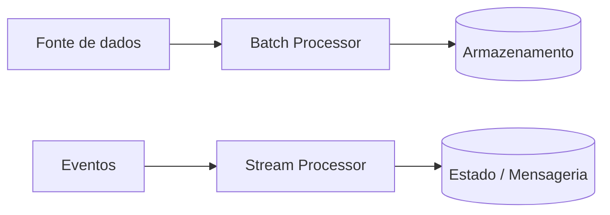

# Batch vs Stream Processing

## 1. O que é
Batch processing e stream processing são dois modelos de processamento de dados. No batch, os dados são coletados em blocos e processados em intervalos definidos, como uma hora, um dia ou um lote de arquivos. No stream, os dados são processados continuamente, à medida que chegam, com baixa latência e sem esperar por um lote completo.

Esses modelos são frequentemente confundidos porque ambos tratam de processamento de eventos, mas diferem em tempo de resposta, latência e forma de execução. O primeiro privilegia eficiência e volume; o segundo privilegia tempo real.

## 2. Por que existe (o problema que resolve)
O problema que resolve é a diferença entre workloads que podem esperar e workloads que precisam responder imediatamente. Antes da popularização de sistemas de streaming, muitos processos eram feitos em lotes, como relatórios diários, consolidação contábil e processamento de arquivos. Com o crescimento de eventos e necessidades de tempo real, surgiu o processamento contínuo para aplicações como monitoramento, fraude, recomendações e logs.

A evolução das plataformas de dados e dos mensageiros distribuídos trouxe esse modelo à tona com ferramentas como Kafka, Flink, Spark Streaming e serviços de eventos.

## 3. Como funciona
Batch processing:
1. Os dados são coletados em um período ou em um conjunto.
2. O sistema lê o lote, aplica regras e produz um resultado.
3. O resultado é persistido e pode ser consumido depois.

Stream processing:
1. Eventos chegam continuamente.
2. O sistema processa cada evento ou janela de eventos.
3. O resultado é emitido em tempo real ou com baixa latência.
4. O estado pode ser mantido em memória, em um store externo ou em janelas de agregação.

Componentes envolvidos:
- Fonte de dados: arquivos, eventos, filas, logs.
- Processador: aplica a lógica de transformação ou agregação.
- Armazenamento: banco, data lake ou estado de janela.
- Mensageria: desacopla produtores e consumidores.
- Observabilidade: métricas e monitoramento de throughput e atraso.

## 4. Casos de uso reais
- Batch: geração de relatórios financeiros, processamento de contas, ETL noturno.
- Stream: detecção de fraude em tempo real, dashboards de operação, recomendação dinâmica.
- Ambos: pipelines de dados híbridos, com batch para histórico e stream para tempo real.

Quando não usar:
- Batch em cenários que exigem resposta imediata.
- Stream em cenários onde o volume é baixo e a simplicidade do lote é suficiente.
- Stream quando a consistência e o replay de eventos se tornam muito complexos.

## 5. Cenários práticos e trade-offs
Cenário 1: Relatório diário
- O sistema acumula dados ao longo do dia e gera o relatório à meia-noite.
- Trade-offs: simples, previsível, mas não em tempo real.

Cenário 2: Detecção de fraude
- Cada transação é analisada logo após sua ocorrência.
- Trade-offs: baixa latência, mas mais complexidade e maior cuidado com estado.

Cenário 3: Falha de consumidor na stream
- Um consumidor cai e perde eventos se não houver replay ou persistência.
- Trade-offs: maior resiliência com filas e checkpoints, mas mais custo operacional.

Trade-offs gerais:
- Latência: stream é melhor para tempo real; batch é melhor para volume e custo.
- Complexidade: stream normalmente exige mais infraestrutura e observabilidade.
- Consistência: batch costuma ser mais simples de modelar; stream lida com eventos e janelas.

## 6. Diagrama e fluxo visual
a) Diagrama em Mermaid



b) Prompt para geração de imagem

“Create a conceptual illustration comparing batch processing and stream processing. Show a batch pipeline collecting data in intervals and a continuous stream pipeline processing events in real time, with arrows, queues, and storage components.”

## 7. Exemplo aplicado — Java + Spring
```java
package com.example.batch;

import org.springframework.batch.core.Job;
import org.springframework.batch.core.Step;
import org.springframework.batch.core.configuration.annotation.EnableBatchProcessing;
import org.springframework.batch.core.configuration.annotation.JobBuilderFactory;
import org.springframework.batch.core.configuration.annotation.StepBuilderFactory;
import org.springframework.batch.item.file.FlatFileItemReader;
import org.springframework.batch.item.file.mapping.DefaultLineMapper;
import org.springframework.boot.SpringApplication;
import org.springframework.boot.autoconfigure.SpringBootApplication;
import org.springframework.context.annotation.Bean;

@SpringBootApplication
@EnableBatchProcessing
public class BatchApp {
    public static void main(String[] args) {
        SpringApplication.run(BatchApp.class, args);
    }

    @Bean
    public Job job(JobBuilderFactory jobs, StepBuilderFactory steps) {
        return jobs.get("importJob")
            .start(step(steps))
            .build();
    }

    @Bean
    public Step step(StepBuilderFactory steps) {
        return steps.get("importStep")
            .chunk(100)
            .reader(reader())
            .writer(items -> items.forEach(System.out::println))
            .build();
    }

    @Bean
    public FlatFileItemReader<String> reader() {
        FlatFileItemReader<String> reader = new FlatFileItemReader<>();
        reader.setLineMapper(new DefaultLineMapper<>());
        return reader;
    }
}
```

Pontos-chave:
- O processamento é feito em chunks, o que é típico de batch.
- O fluxo é previsível e adequado para volume grande.

## 8. Exemplo aplicado — TypeScript + NestJS
```ts
import { Injectable, OnModuleInit } from '@nestjs/common';
import { NestFactory } from '@nestjs/core';

@Injectable()
class StreamProcessor implements OnModuleInit {
  onModuleInit() {
    setInterval(() => {
      const event = { id: Date.now(), type: 'payment' };
      this.process(event);
    }, 1000);
  }

  process(event: any) {
    console.log('Processing event', event);
  }
}

async function bootstrap() {
  const app = await NestFactory.createApplicationContext({ module: class {} as any });
  await app.init();
}

bootstrap();
```

Pontos-chave:
- O processamento ocorre continuamente, com baixa latência.
- Isso é o modelo mais adequado para eventos em tempo real.

## 9. Comparação e armadilhas comuns
Comparação rápida:
- Batch x stream: batch trabalha com lotes; stream com eventos contínuos.
- ETL x event processing: ETL costuma ser batch; event processing tende a ser stream.

Erros comuns:
1. Usar stream para workloads que não precisam de tempo real.
2. Ignorar replay e durabilidade em pipelines de eventos.
3. Acreditar que stream resolve automaticamente problemas de latência sem arquitetura adequada.

## 10. Perguntas para fixação
1. Quando batch é preferível a stream?
2. O que acontece se um consumidor de stream cair e não houver replay?
3. Como você decidiria entre processar uma transação em lote ou em tempo real?
