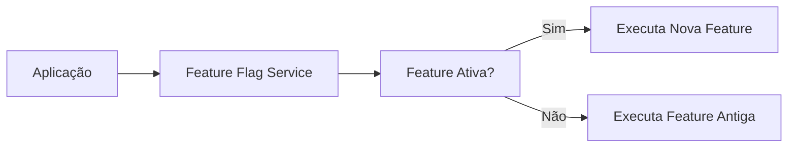

# Feature Flags e Toggles

## 1. O que é
Feature flags, ou feature toggles, são mecanismos que permitem habilitar ou desabilitar funcionalidades em tempo de execução sem precisar fazer um novo deploy completo. Em vez de “desligar” uma feature no código por meio de uma nova versão, a equipe usa uma configuração, uma variável ou um painel para controlar o comportamento do sistema.

No mercado, você também verá os termos runtime flags, kill switches e progressive rollout. O objetivo central é reduzir risco e aumentar controle sobre a liberação de mudanças.

## 2. Por que existe (o problema que resolve)
O problema que resolve é o risco de lançar alterações grandes e de difícil reversão. Antes desse padrão, mudanças grandes eram liberadas como parte de deploys completos, o que tornava rollback mais difícil e aumentava impacto em caso de erro. Com feature flags, é possível liberar gradualmente, testar com um subconjunto de usuários e desligar rapidamente uma função problemática.

Esse padrão se popularizou bastante em times de produto e engenharia que adotam releases contínuas e experimentação.

## 3. Como funciona
O fluxo usual é:
1. O código é preparado para avaliar uma condição de feature flag.
2. A flag é lida de uma configuração, banco, serviço de configuração ou variável de ambiente.
3. O sistema decide se a funcionalidade deve estar ativa ou não.
4. A flag pode ser alterada em tempo de execução sem redeploy.

Componentes envolvidos:
- Feature flag service ou config store: armazena o estado das flags.
- Aplicação: lê o estado e decide o comportamento.
- Operação/Produto: controla a flag para rollout ou rollback.
- Observabilidade: mede impacto e erros.

## 4. Casos de uso reais
- Lançamento gradual de features novas.
- A/B testing e experimentos.
- Desligar rapidamente funcionalidades com problemas.
- Habilitar funcionalidade para um subconjunto de clientes.

Quando não usar:
- Quando a feature flag se torna uma forma de “if espalhado” e piora a manutenção.
- Quando o sistema não suporta configuração dinâmica ou o custo de implementação é alto demais.
- Quando a regra de negócio está tão incorporada ao código que a flag não traz benefício real.

## 5. Cenários práticos e trade-offs
Cenário 1: Lançamento gradual
- A equipe libera a feature para 5% dos usuários primeiro.
- Trade-offs: menor risco, mas mais complexidade operacional e de monitoramento.

Cenário 2: Rollback rápido
- Uma nova integração gera erros em produção.
- Trade-offs: a flag permite desligar a feature rapidamente, mas exige processo de governança.

Cenário 3: Flag mal gerenciada
- A feature fica presa em vários ambientes e estados diferentes.
- Trade-offs: maior flexibilidade, mas risco de “flag debt”.

Trade-offs gerais:
- Velocidade: aumenta muito a agilidade de release.
- Complexidade: a arquitetura ganha mais pontos de decisão condicional.
- Confiabilidade: melhora em rollback, mas exige disciplina de governança.

## 6. Diagrama e fluxo visual
a) Diagrama em Mermaid



b) Prompt para geração de imagem

“Create a conceptual illustration of feature flags in a software system. Show an application evaluating a runtime flag from a configuration service, enabling or disabling a new feature, with a dashboard or switch indicating the rollout state.”

## 7. Exemplo aplicado — Java + Spring
```java
package com.example.flags;

import org.springframework.boot.SpringApplication;
import org.springframework.boot.autoconfigure.SpringBootApplication;
import org.springframework.beans.factory.annotation.Value;
import org.springframework.web.bind.annotation.GetMapping;
import org.springframework.web.bind.annotation.RestController;

@SpringBootApplication
public class FlagsApplication {
    public static void main(String[] args) {
        SpringApplication.run(FlagsApplication.class, args);
    }
}

@RestController
class FeatureController {
    @Value("${feature.new-checkout:false}")
    private boolean newCheckoutEnabled;

    @GetMapping("/checkout")
    public String checkout() {
        if (newCheckoutEnabled) {
            return "Using new checkout flow";
        }
        return "Using legacy checkout flow";
    }
}
```

Pontos-chave:
- A feature flag é lida via configuração e pode ser alterada sem novo deploy.
- Essa abordagem reduz risco em releases graduais.

## 8. Exemplo aplicado — TypeScript + NestJS
```ts
import { Controller, Get, Injectable } from '@nestjs/common';
import { NestFactory } from '@nestjs/core';

@Injectable()
class FeatureService {
  isNewCheckoutEnabled(): boolean {
    return process.env.FEATURE_NEW_CHECKOUT === 'true';
  }
}

@Controller('checkout')
class CheckoutController {
  constructor(private readonly featureService: FeatureService) {}

  @Get()
  checkout() {
    return this.featureService.isNewCheckoutEnabled()
      ? 'Using new checkout flow'
      : 'Using legacy checkout flow';
  }
}

async function bootstrap() {
  const app = await NestFactory.createApplicationContext({ module: class {} as any });
  await app.init();
}

bootstrap();
```

Pontos-chave:
- A flag é lida em tempo de execução a partir de uma variável de ambiente.
- Esse modelo é simples e útil para ambiente de desenvolvimento e produção.

## 9. Comparação e armadilhas comuns
Comparação rápida:
- Feature flag x config flag: feature flags geralmente controlam comportamento de produto; config flags controlam infra ou comportamento técnico.
- Feature flag x rollout manual: a flag dá controle dinâmico; o rollout manual depende de processo e deploy.

Erros comuns:
1. Acumular flags sem estratégia de remoção.
2. Colocar lógica de negócio em vários pontos com flags espalhadas.
3. Ignorar métricas e governança de rollout.

## 10. Perguntas para fixação
1. Como você reduziria o risco de um release usando feature flags?
2. Quais critérios você usaria para remover uma feature flag antiga?
3. Quando uma feature flag deixa de ser uma boa ideia?
