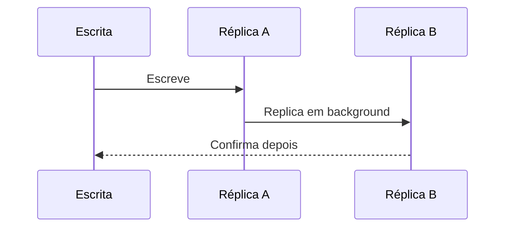

# Strong Consistency vs Eventual Consistency

## 1. O que é

Strong consistency e eventual consistency descrevem diferentes garantias de visibilidade de dados em sistemas distribuídos. Em strong consistency, uma leitura depois de uma escrita retorna o valor mais recente, como se houvesse uma única cópia consistente do dado. Em eventual consistency, as cópias podem divergir temporariamente, mas, com o tempo, convergem para um estado consistente.

No mercado, você também verá os termos consistency model, linearizability e convergent replication. A diferença central está no compromisso entre disponibilidade, latência e correção observada pelo cliente.

## 2. Por que existe (o problema que resolve)

O problema que esse conceito resolve é a dificuldade de manter uma visão única e imediata do estado em sistemas distribuídos. Quando dados são replicados em vários nós, o sistema precisa escolher entre responder rapidamente e garantir que o valor lido seja o mais recente. Antes dessa discussão, muitos sistemas operavam com uma única base ou um único servidor, o que simplificava a consistência, mas limitava escalabilidade e disponibilidade.

Esse tema ficou central na teoria de sistemas distribuídos e na prática de bancos e redes, especialmente com a necessidade de replicated storage, sharding e computação em nuvem.

## 3. Como funciona

Strong consistency:

1. A escrita é aplicada em um quorum ou em um mecanismo que garante uma visão global.
2. A leitura só retorna valores que já foram propagados de forma segura.
3. O sistema sacrifica latência ou disponibilidade em alguns cenários para manter uma visão forte.

Eventual consistency:

1. A escrita é aceita em uma réplica ou partição.
2. As outras réplicas são atualizadas de forma assíncrona.
3. As leituras podem retornar versões antigas temporariamente.
4. A convergência ocorre depois do propagação.

Componentes envolvidos:

- Réplicas: cópias do dado.
- Quorum: conjunto mínimo de nós para validar uma operação.
- Replication protocol: coordena propagação.
- Cliente: observa a consistência percebida.

## 4. Casos de uso reais

- Strong consistency: sistemas bancários, controle de estoque, reservas e autenticação crítica.
- Eventual consistency: redes sociais, feeds, notícias, caches e recomendação.

Quando não usar:

- Strong consistency em sistemas onde a latência e a disponibilidade precisam ser muito altas e o custo de coordenação é proibitivo.
- Eventual consistency em cenários onde o cliente precisa ver sempre o estado mais recente imediatamente.

## 5. Cenários práticos e trade-offs

Cenário 1: Reserva de bilhete

- O sistema precisa garantir que uma única vaga não seja vendida duas vezes.
- Trade-offs: mais coordenado e mais lento, mas correto.

Cenário 2: Feed de redes sociais

- O sistema aceita um post e o exibe depois para alguns usuários.
- Trade-offs: melhor performance, mas possíveis atrasos na propagação.

Cenário 3: Falha de réplica

- Uma réplica fica desconectada e recebe escrita antiga.
- Trade-offs: eventual consistency permite continuidade, mas exige reconcilição.

Trade-offs gerais:

- Latência: strong consistency tende a ser mais lenta.
- Disponibilidade: eventual consistency geralmente é mais disponível.
- Complexidade: ambas exigem desenho cuidadoso, mas a eventual costuma exigir mais mecanismos de reconciliação.

## 6. Diagrama e fluxo visual

a) Diagrama em Mermaid



b) Prompt para geração de imagem

“Create a conceptual illustration of strong consistency versus eventual consistency in distributed systems. Show a single authoritative write path on one side and asynchronous replica propagation on the other, with visual cues for latency and convergence.”

## 7. Exemplo aplicado — Java + Spring

```java
package com.example.consistency;

import org.springframework.boot.SpringApplication;
import org.springframework.boot.autoconfigure.SpringBootApplication;
import org.springframework.transaction.annotation.Transactional;
import org.springframework.web.bind.annotation.PostMapping;
import org.springframework.web.bind.annotation.RequestBody;
import org.springframework.web.bind.annotation.RestController;

@SpringBootApplication
public class ConsistencyApp {
    public static void main(String[] args) {
        SpringApplication.run(ConsistencyApp.class, args);
    }
}

@RestController
class InventoryController {
    private final InventoryService inventoryService;

    InventoryController(InventoryService inventoryService) {
        this.inventoryService = inventoryService;
    }

    @PostMapping("/inventory")
    @Transactional
    public String reserve(@RequestBody ReserveRequest request) {
        return inventoryService.reserve(request.itemId(), request.quantity());
    }
}

record ReserveRequest(String itemId, int quantity) {}

class InventoryService {
    public String reserve(String itemId, int quantity) {
        return "Reserved " + quantity + " units of " + itemId;
    }
}
```

Pontos-chave:

- A operação é tratada de forma coordenada e consistente.
- Esse padrão é apropriado quando a correção imediata é crítica.

## 8. Exemplo aplicado — TypeScript + NestJS

```ts
import { Injectable } from '@nestjs/common';

@Injectable()
class EventualStoreService {
  private cache = new Map<string, number>();

  async publish(userId: string, event: string) {
    this.cache.set(userId, (this.cache.get(userId) ?? 0) + 1);
    return { ok: true, event };
  }
}
```

Pontos-chave:

- O exemplo mostra um modelo em que a atualização é aceita rapidamente e propagada depois.
- É uma forma simples de representar eventual consistency.

## 9. Comparação e armadilhas comuns

Comparação rápida:

- Strong consistency x eventual consistency: a primeira garante visibilidade imediata; a segunda prioriza disponibilidade e performance.
- Consistency x durability: consistência é sobre visibilidade de estado; durabilidade é sobre persistência segura.

Erros comuns:

1. Assumir que toda leitura precisa ser forte em todos os cenários.
2. Ignorar a necessidade de reconciliação em sistemas com múltiplas réplicas.
3. Confundir latência de propagação com falha lógica do sistema.

## 10. Perguntas para fixação

1. Em que situação a strong consistency é indispensável?
2. Como você explicaria eventual consistency para um time de produto?
3. Quais sinais indicam que um sistema distribuído está sacrificando consistência demais?
