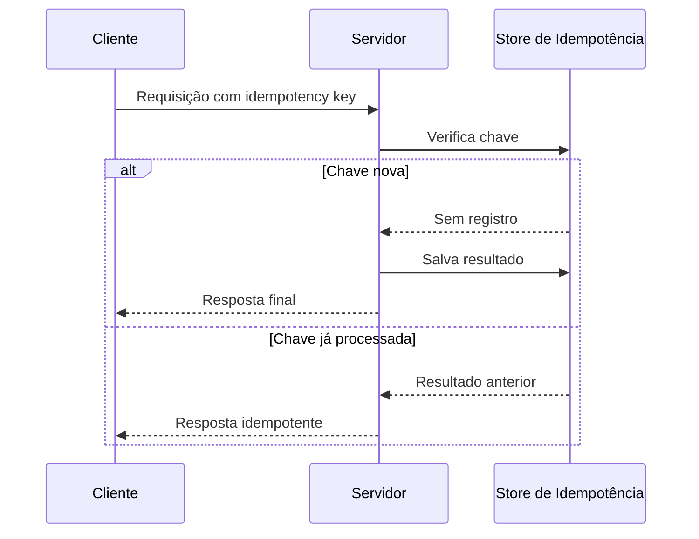

# Idempotência

## 1. O que é
Idempotência é a propriedade de uma operação em que executar a mesma ação múltiplas vezes produz o mesmo efeito de executá-la uma única vez. Em outras palavras, uma requisição repetida não deve causar efeitos colaterais duplicados quando a operação já foi aplicada.

No mercado, você também encontrará os termos idempotent operation, safely retryable e idempotency key. Esse conceito é fundamental em APIs, filas, pagamentos e integrações distribuídas, onde retries são comuns.

## 2. Por que existe (o problema que resolve)
O problema que resolve é a repetição de operações em ambientes distribuídos. Rede instável, timeouts, retries e falhas de processamento podem levar a duplicidade. Sem idempotência, um cliente pode enviar duas vezes a mesma compra, a mesma cobrança ou a mesma criação de recurso.

Esse conceito se tornou essencial em sistemas de pagamento, APIs públicas e arquiteturas com mensagens, onde a confiabilidade e a segurança das operações são críticas.

## 3. Como funciona
A ideia é garantir que uma operação tenha um identificador lógico ou uma regra natural de deduplicação. O fluxo costuma ser:
1. O cliente envia uma operação com um identificador único, como idempotency key.
2. O servidor verifica se essa chave já foi processada.
3. Se ainda não foi, executa a operação e registra o resultado.
4. Se já foi, retorna o mesmo resultado sem reexecutar a ação.

Componentes envolvidos:
- Cliente: envia a chave de idempotência.
- Servidor: armazena estado de execução.
- Store de deduplicação: registra chaves e respostas.
- Operação: lógica de negócio que deve ser segura para reexecução.

## 4. Casos de uso reais
- Pagamentos e cobranças.
- Criação de recursos via API.
- Processamento de mensagens e filas.
- Integrações com serviços externos que podem retryar.

Quando não usar:
- Quando a operação não tem efeito colateral e o retry é seguro por natureza.
- Quando não existe um mecanismo confiável de persistência para registrar a chave.
- Quando a duplicidade é aceitável para o domínio.

## 5. Cenários práticos e trade-offs
Cenário 1: Retry de pagamento
- O cliente não recebe confirmação e reenvia a requisição.
- Trade-offs: evita cobrança duplicada, mas exige persistência do resultado.

Cenário 2: Falha de resposta
- O servidor processa a operação, mas a resposta não chega ao cliente.
- Trade-offs: o controle de idempotência melhora confiabilidade, mas custa armazenamento e latência extra.

Cenário 3: Operação não idempotente
- Uma operação de “incrementar contador” nem sempre é idempotente por natureza.
- Trade-offs: pode ser necessário redesignar o contrato para incluir identificador semântico.

Trade-offs gerais:
- Confiabilidade: melhora muito.
- Armazenamento: exige uma camada de deduplicação.
- Complexidade: adiciona regras e estado ao fluxo.

## 6. Diagrama e fluxo visual
a) Diagrama em Mermaid



b) Prompt para geração de imagem

“Create a conceptual illustration of idempotency in distributed systems. Show a client sending a request with an idempotency key, a server checking a deduplication store, and the same request being safely retried without duplicate side effects.”

## 7. Exemplo aplicado — Java + Spring
```java
package com.example.idempotency;

import org.springframework.boot.SpringApplication;
import org.springframework.boot.autoconfigure.SpringBootApplication;
import org.springframework.web.bind.annotation.*;

import java.util.Map;
import java.util.concurrent.ConcurrentHashMap;

@SpringBootApplication
public class IdempotencyApp {
    public static void main(String[] args) {
        SpringApplication.run(IdempotencyApp.class, args);
    }
}

@RestController
class PaymentController {
    private final Map<String, String> store = new ConcurrentHashMap<>();

    @PostMapping("/payments")
    public String create(@RequestHeader("Idempotency-Key") String key, @RequestBody PaymentRequest request) {
        if (store.containsKey(key)) {
            return store.get(key);
        }
        String response = "Processed payment for " + request.amount();
        store.put(key, response);
        return response;
    }
}

record PaymentRequest(String amount) {}
```

Pontos-chave:
- A chave de idempotência permite reprocessar sem duplicar efeito.
- O store pode ser substituído por Redis, banco ou cache distribuído em produção.

## 8. Exemplo aplicado — TypeScript + NestJS
```ts
import { Controller, Post, Headers, Body, Injectable } from '@nestjs/common';
import { NestFactory } from '@nestjs/core';

@Injectable()
class IdempotencyService {
  private store = new Map<string, string>();

  process(key: string, amount: string) {
    if (this.store.has(key)) {
      return this.store.get(key);
    }
    const result = `Processed payment for ${amount}`;
    this.store.set(key, result);
    return result;
  }
}

@Controller('payments')
class PaymentController {
  constructor(private readonly service: IdempotencyService) {}

  @Post()
  create(@Headers('idempotency-key') key: string, @Body() body: { amount: string }) {
    return this.service.process(key, body.amount);
  }
}
```

Pontos-chave:
- O controle é simples e efetivo para retries.
- Em ambientes distribuídos, a mesma lógica deve ser persistida fora da instância local.

## 9. Comparação e armadilhas comuns
Comparação rápida:
- Idempotência x retry: retry pode repetir; idempotência torna essa repetição segura.
- Idempotência x deduplicação: deduplicação é a implementação prática; idempotência é a propriedade do contrato.

Erros comuns:
1. Ignorar a necessidade de persistir o resultado da operação.
2. Tratar idempotência como “se der erro, tenta de novo” sem identidade lógica.
3. Aplicar idempotência em operações que não são semanticamente repetíveis.

## 10. Perguntas para fixação
1. Como você implementaria idempotência para uma API de pagamento?
2. Quais problemas surgem se a chave de idempotência não for persistida?
3. Quando uma operação não deve ser considerada idempotente?
