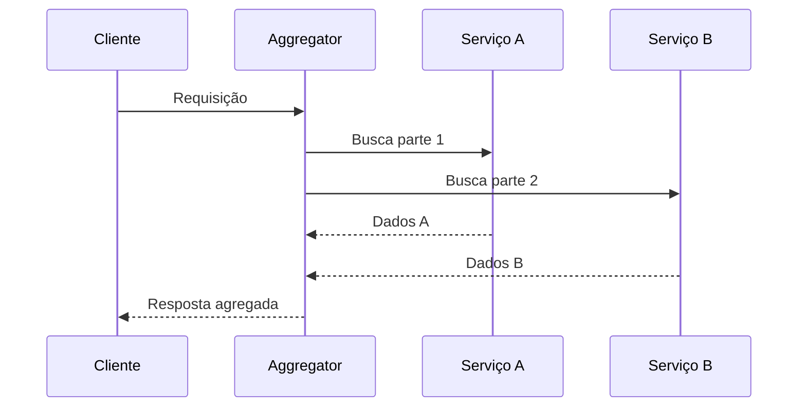

# Aggregator Pattern

## 1. O que é
O Aggregator Pattern é um padrão de design usado quando uma operação precisa reunir dados ou comportamentos de múltiplas fontes e entregar uma resposta unificada ao cliente. Em vez de o consumidor conversar diretamente com cada backend, um componente intermediário executa as chamadas, consolida os resultados e produz uma resposta coerente.

Em arquitetura de microsserviços, esse padrão é muito comum para compor respostas complexas e evitar que o cliente conheça a estrutura interna do sistema.

## 2. Por que existe (o problema que resolve)
O problema que resolve é a fragmentação de dados e a necessidade de compor respostas a partir de vários serviços. Sem esse padrão, o cliente teria de fazer múltiplas chamadas e combinar os resultados por conta própria, o que aumenta complexidade, acoplamento e chance de falhas. O padrão centraliza essa composição em um componente dedicado.

Esse estilo se tornou importante com a adoção de microsserviços, onde um recurso de negócio pode estar distribuído entre vários serviços menores.

## 3. Como funciona
O fluxo típico é:
1. O cliente faz uma requisição ao agregador.
2. O agregador invoca os serviços necessários, geralmente em paralelo.
3. Ele combina os resultados em uma resposta única.
4. O resultado final é retornado ao cliente.

Componentes envolvidos:
- Cliente: faz a requisição de alto nível.
- Agregador: orquestra e combina os dados.
- Serviços participantes: fornecem partes da resposta.
- Cache/timeout: melhora performance e evita dependências lentas.
- Observabilidade: mede latência e degradação.

## 4. Casos de uso reais
- BFFs para mobile e web.
- Dashboards com dados de vários serviços.
- Compras e checkout com dados de estoque, pagamento e entrega.
- Portais empresariais que precisam reunir múltiplos domínios.

Quando não usar:
- Quando a composição é simples e pode ser feita no lado do cliente.
- Quando o agregado se torna um monólito lógico e concentra muita regra de negócio.
- Quando a latência da composição é inaceitável para o cenário.

## 5. Cenários práticos e trade-offs
Cenário 1: BFF de pedido
- O agregador busca dados do pedido, do cliente e do estoque.
- Trade-offs: melhora experiência do cliente, mas aumenta latência total.

Cenário 2: Falha parcial de um serviço
- Um dos serviços responde com erro ou timeout.
- Trade-offs: o agregador pode retornar uma resposta parcial ou fallback, mas isso exige decisão de contrato.

Cenário 3: Agregação pesada
- O agregador precisa combinar dezenas de chamadas.
- Trade-offs: ganho em simplicidade de consumo, mas custo operacional e latência maior.

Trade-offs gerais:
- Latência: tende a aumentar com múltiplas chamadas.
- Consistência: pode haver visões diferentes se os dados não forem consistentes.
- Complexidade: melhora a experiência do cliente, mas exige orquestração e tratamento de falhas.

## 6. Diagrama e fluxo visual
a) Diagrama em Mermaid



b) Prompt para geração de imagem

“Create a conceptual illustration of the aggregator pattern in a microservices architecture. Show a client sending a request to an aggregator service that calls several backend services and merges their outputs into a single response.”

## 7. Exemplo aplicado — Java + Spring
```java
package com.example.aggregator;

import org.springframework.boot.SpringApplication;
import org.springframework.boot.autoconfigure.SpringBootApplication;
import org.springframework.web.bind.annotation.GetMapping;
import org.springframework.web.bind.annotation.RestController;
import org.springframework.web.client.RestTemplate;

import java.util.concurrent.CompletableFuture;

@SpringBootApplication
public class AggregatorApp {
    public static void main(String[] args) {
        SpringApplication.run(AggregatorApp.class, args);
    }
}

@RestController
class OrderController {
    private final RestTemplate restTemplate = new RestTemplate();

    @GetMapping("/orders/1")
    public OrderView getOrder() {
        CompletableFuture<String> customer = CompletableFuture.supplyAsync(() -> restTemplate.getForObject("http://customer-service/customer/1", String.class));
        CompletableFuture<String> inventory = CompletableFuture.supplyAsync(() -> restTemplate.getForObject("http://inventory-service/inventory/1", String.class));

        return new OrderView(customer.join(), inventory.join());
    }
}

record OrderView(String customer, String inventory) {}
```

Pontos-chave:
- O agregador faz múltiplas chamadas e une os resultados.
- Em produção, seria importante tratar timeouts e fallbacks.

## 8. Exemplo aplicado — TypeScript + NestJS
```ts
import { Controller, Get, Injectable } from '@nestjs/common';
import { NestFactory } from '@nestjs/core';

@Injectable()
class AggregatorService {
  async getOrderView() {
    const [customer, inventory] = await Promise.all([
      fetch('http://customer-service/customer/1').then(r => r.text()),
      fetch('http://inventory-service/inventory/1').then(r => r.text()),
    ]);

    return { customer, inventory };
  }
}

@Controller('orders')
class OrderController {
  constructor(private readonly aggregatorService: AggregatorService) {}

  @Get('1')
  async getOrder() {
    return this.aggregatorService.getOrderView();
  }
}
```

Pontos-chave:
- O padrão usa composição paralela para reduzir o tempo total da operação.
- O agregador centraliza a lógica de orquestração.

## 9. Comparação e armadilhas comuns
Comparação rápida:
- Aggregator pattern x API gateway: o primeiro compõe dados; o segundo centraliza entrada e políticas.
- Aggregator x orchestration service: muitas vezes os termos se sobrepõem, mas o aggregator é mais focado em composição de resposta.

Erros comuns:
1. Colocar lógica de negócio pesada dentro do agregador.
2. Ignorar timeouts e fallback.
3. Aumentar demais a latência por muitas chamadas em série.

## 10. Perguntas para fixação
1. Quando o Aggregator Pattern é mais útil do que expor os serviços diretamente?
2. Como você evitaria que um agregador vire um “god object”?
3. Quais estratégias de fallback você usaria quando um dos serviços do agregado falha?
