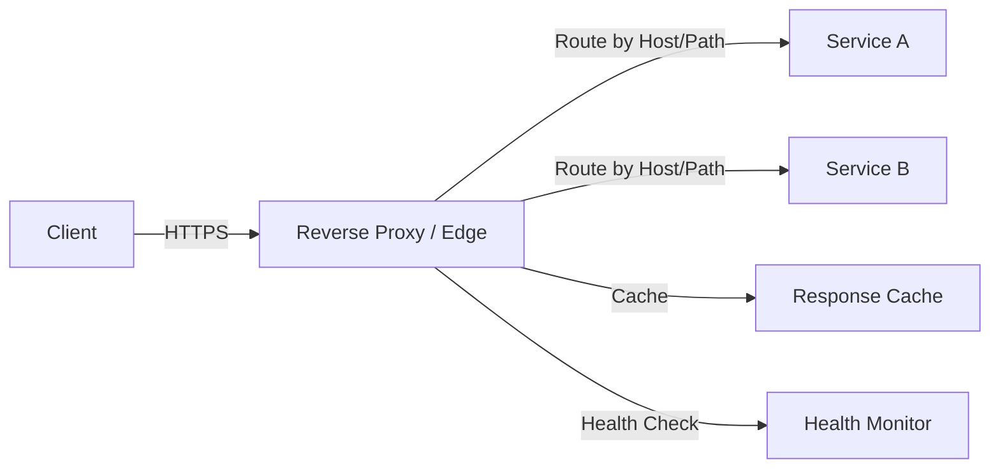

## 1. O que é

Proxy reverso é um componente de rede que recebe requisições de clientes e as encaminha para servidores de backend. Ele atua como intermediário na borda da infraestrutura, escondendo a topologia interna e aplicando políticas de entrada.

Sinônimos: reverse proxy, inbound proxy, edge proxy, gateway de borda.

Tipos/camadas:

- Reverse proxy tradicional
- Load balancer de camada 7
- API gateway
- TLS/SSL termination proxy
- Caching proxy
- Web accelerator / CDN edge proxy
- Ingress controller (Kubernetes)

## 2. Por que existe (o problema que resolve)

Proxy reverso surgiu para resolver problemas de escalabilidade, segurança e gerenciamento de tráfego. Antes dele, clientes se conectavam diretamente aos servidores de aplicação, expondo cada instância e exigindo configuração de DNS e IP para todas.

Sistemas web antigos como Apache HTTP Server e NGINX foram os primeiros a popularizar a ideia de um ponto de terminação unificado. Nos data centers pré-cloud, isso permitia centralizar SSL, autenticação e cache sem mudar cada backend.

## 3. Tipos e características

### Reverse proxy tradicional

Como funciona: aceita conexões de clientes e reencaminha para servidores internos.
Prós: abstrai backends, centraliza segurança e logging.
Contras: adiciona um salto extra de rede e pode ser ponto único de falha se não for redundante.
Camada: aplicação/transporte.
Quando usar: sempre que quiser separar tráfego público de infraestrutura interna.

### Load balancer de camada 7

Como funciona: distribui requisições HTTP/HTTPS com base em headers, cookies, paths ou conteúdo.
Prós: permite roteamento inteligente e sticky sessions.
Contras: maior complexidade e latência do que balanceadores TCP simples.
Camada: aplicação.
Quando usar: APIs, microserviços e aplicações web com rotas distintas.

### API gateway

Como funciona: além de proxy, aplica autenticação, rate limiting, transformação de payload e roteamento para microserviços.
Prós: centraliza políticas de API e monitoramento.
Contras: pode crescer em complexidade e gerar acoplamento se abusado.
Camada: aplicação / fronteira de API.
Quando usar: arquitetura de microserviços com APIs públicas ou B2B.

### TLS/SSL termination proxy

Como funciona: finaliza a sessão TLS no proxy e encaminha tráfego em plain HTTP para o backend.
Prós: simplifica gestão de certificados e offloads de CPU dos servidores.
Contras: requer confiança na rede interna ou criptografia adicional.
Camada: transporte.
Quando usar: em bordas onde se deseja centralizar certificados.

### Caching proxy

Como funciona: armazena respostas de backend para servir clientes sem atingir o servidor de origem.
Prós: reduz carga no backend e melhora latência.
Contras: precisa gerenciar invalidação e freshness.
Camada: aplicação.
Quando usar: conteúdo estático ou respostas que podem ser cacheadas.

### Web accelerator / CDN edge proxy

Como funciona: proxies distribuídos geograficamente que atendem conteúdo próximo ao usuário.
Prós: baixa latência global e redução de tráfego de origem.
Contras: complexidade de cache invalidation e consistência.
Camada: aplicação/rede.
Quando usar: aplicações com usuários globais e conteúdo estático pesado.

### Ingress controller (Kubernetes)

Como funciona: implementa um reverse proxy para rotas definidas em objetos `Ingress`.
Prós: integra-se com Kubernetes e permite rotas dinâmicas por serviço.
Contras: depende da configuração correta do cluster e da especificação Ingress.
Camada: orquestração/Kubernetes.
Quando usar: em clusters Kubernetes para expor serviços HTTP/HTTPS.

## 4. Como funciona (mecanismo interno)

Um proxy reverso geralmente contém estes componentes:

- Listener de entrada: aceita conexões TCP/UDP e termina TLS.
- Parser HTTP/HTTPS: interpreta requests e headers.
- Roteador: escolhe backend com base em regras de path, host, headers ou peso.
- Balanceador: distribui requisições entre instâncias sadias.
- Health checker: monitora saúde dos backends.
- Cache: armazena respostas e serve eventos de cache hit.
- Middleware de política: aplica autenticação, rate limiting, rewrites e injeção de headers.

Algoritmos/estratégias usados:

- Round-robin, least-connections, IP-hash, weighted balancing.
- Path-based routing e host-based routing.
- TLS termination e re-encryption.
- HTTP/2 multiplexing, connection pooling e keepalive.
- Cache control / stale-while-revalidate.

## 5. Onde e como se aplica na prática

### Nível de máquina/processo único

Um único servidor NGINX ou HAProxy pode ser configurado como reverse proxy para um backend Node.js ou Spring Boot.

### Nível de infraestrutura on-premise/self-managed

Ferramentas reais: NGINX, HAProxy, Apache HTTP Server, Envoy, Traefik, Varnish.

### Nível de nuvem/managed service

AWS: Application Load Balancer (ALB), Network Load Balancer (NLB), AWS API Gateway, CloudFront.
GCP: Cloud Load Balancing, Cloud CDN, API Gateway.
Azure: Azure Application Gateway, Azure Front Door, Azure API Management.

### Nível de orquestração/Kubernetes

Kubernetes: ingress-nginx, Traefik Ingress Controller, Istio Gateway, Ambassador, Kong Ingress.

## 6. Casos de uso reais e quando NÃO usar

### Casos de uso reais

1. Netflix: reverse proxy e API gateway para roteamento de tráfego entre clientes e microserviços.
2. GitHub: NGINX como borda para TLS termination e caching de ativos estáticos.
3. Shopify: load balancers de camada 7 para distribuir tráfego web e roteamento de lojas.
4. Kubernetes ingress: clusters de e-commerce usando ingress controllers para expor serviços.

### Quando NÃO usar ou evitar

- Aplicações internas simples sem múltiplos backends: o proxy reverso adiciona complexidade desnecessária.
- Se a rede interna não for segura: TLS termination deve ser seguida por re-encryption ou VPN.
- Quando cada backend precisa expor IPs diretos por requisito de auditoria: o reverse proxy pode ocultar a topologia.
- Para tráfego UDP não-HTTP sem suporte do proxy: escolha balanceadores L4.

## 7. Cenários práticos e trade-offs

### Cenário 1: roteamento por path

Um site serve `/api` para um cluster de microserviços e `/static` para um CDN. O reverse proxy encaminha de forma transparente.

### Cenário 2: falha de backend

Um backend fica offline e o health checker remove a instância do pool. O proxy passa a roteirizar apenas para backends sadios.

### Cenário 3: TLS termination

O proxy recebe HTTPS, termina TLS e envia HTTP para o backend, reduzindo carga de criptografia no servidor de aplicação.

| Tipo | Latência | Consistência | Custo operacional | Complexidade de implementação | Resiliência |
|---|---|---|---|---|---|
| Reverse proxy tradicional | Baixa | Alto | Baixo | Médio | Alto |
| Load balancer L7 | Baixa | Alto | Médio | Médio | Alto |
| API gateway | Médio | Alto | Alto | Alto | Alto |
| TLS termination proxy | Baixa | Alto | Médio | Médio | Médio |
| Caching proxy | Muito baixa (cache hit) | Médio | Médio | Alto | Médio |
| Ingress controller | Baixa | Alto | Médio | Médio | Alto |

## 8. Diagrama e fluxo visual

a) Mermaid:



b) Prompt de imagem:
"Conceptual illustration of a reverse proxy gateway at the edge of a network, terminating TLS, routing HTTP requests to backend services, caching responses, and performing load balancing."

## 9. Exemplo aplicado — Java + Spring

```java
@Configuration
public class ProxyHeadersConfig {

  @Bean
  public WebServerFactoryCustomizer<TomcatServletWebServerFactory> customize() {
    return factory -> factory.addConnectorCustomizers(connector -> {
      connector.setScheme("https");
      connector.setSecure(true);
      connector.setProperty("proxyName", "proxy.example.com");
      connector.setProperty("proxyPort", "443");
    });
  }
}

@RestController
public class ApiController {

  @GetMapping("/api/data")
  public ResponseEntity<String> data() {
    return ResponseEntity.ok("data from backend");
  }
}
```

Comentários: o Spring Boot pode ser configurado para funcionar atrás de um reverse proxy, respeitando cabeçalhos `X-Forwarded-For` e `X-Forwarded-Proto`.

## 10. Exemplo aplicado — TypeScript + NestJS

```ts
import { NestFactory } from '@nestjs/core';
import { AppModule } from './app.module';

async function bootstrap() {
  const app = await NestFactory.create(AppModule);
  app.setGlobalPrefix('api');
  app.enable('trust proxy');
  await app.listen(3000);
}
bootstrap();

@Controller('items')
export class ItemsController {
  @Get()
  findAll() {
    return { items: ['a', 'b', 'c'] };
  }
}
```

Comentários: `app.enable('trust proxy')` permite que o NestJS interprete corretamente `X-Forwarded-*` quando está atrás de um reverse proxy.

## 11. Comparação e armadilhas comuns

Comparação com forward proxy: um forward proxy atua em nome do cliente para acessar servidores externos; o reverse proxy atua em nome do servidor para atender clientes.

Erros comuns:

- não configurar `X-Forwarded-For` e `X-Forwarded-Proto`: leva a logs e URLs incorretos.
- terminar TLS no proxy sem criptografar a rede interna: expõe tráfego sensível.
- usar proxy sem health checks: cliente ainda pode ser roteado para backends falhos.
- acumular lógica de business no API gateway: torna o proxy um monólito e cria acoplamento.

## 12. Perguntas para fixação

1. Qual a diferença principal entre reverse proxy e forward proxy?
2. Quando você escolheria um API gateway em vez de um reverse proxy simples?
3. Quais são os riscos de usar TLS termination sem re-encryption interna?
4. Como um reverse proxy ajuda a escalar microserviços com roteamento por host e path?
5. Por que um caching proxy pode reduzir carga de backend, e quais são os desafios de invalidação?
