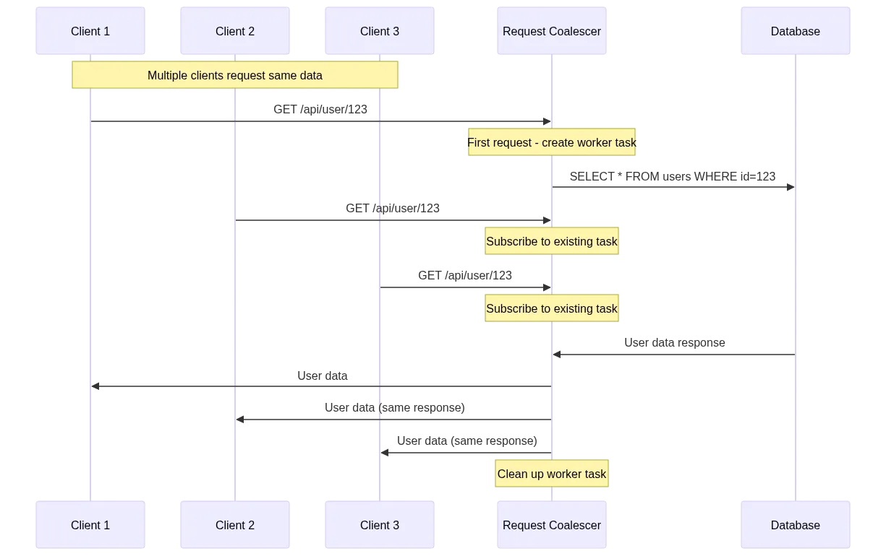

# Definicoes

Request Coalescing, também conhecido como deduplicação de solicitações ou padrão de voo único, é uma técnica de otimização de recursos que mescla várias solicitações simultâneas idênticas em uma única execução. Quando vários clientes solicitam o mesmo recurso simultaneamente, apenas uma solicitação real é executada e todos os solicitantes compartilham o resultado.

Esse padrão é excelente para evitar trabalhos duplicados, reduzir a carga do servidor e melhorar a eficiência do cache, especialmente em cenários com alta concorrência para recursos idênticos.

## Principais características

- Mescla solicitações simultâneas idênticas.
- Executa a solicitação apenas uma vez por chave única.
- Compartilha resultados entre todos os solicitantes.
- Reduz o uso de recursos e o trabalho duplicado.
- Evita cenários de remanhados de trovões.

- Benefícios:
  - Economia significativa de recursos: Pode reduzir execuções duplicadas em 70-90% em cenários de alta concorrência.
  - Eficiência aprimorada do cache: Melhores taxas de acerto quando várias solicitações precisam dos mesmos dados.
  - Evita o rebascão de trovões: Evita serviços de back-end esmagadores durante os picos.
  - Custos de infraestrutura mais baixos: Redução do uso de CPU, memória e rede.

- Desvantagens:
  - Nenhuma melhoria de latência individual: Não ajuda o desempenho de solicitação única.
  - Complexidade de implementação: Requer geração e limpeza cuidadosas de chaves.
  - Sobrecarga de memória: Deve rastrear solicitações pendentes e seus futuros.
  - Potenciais gargalos: As operações compartilhadas podem se tornar pontos únicos de falha.
