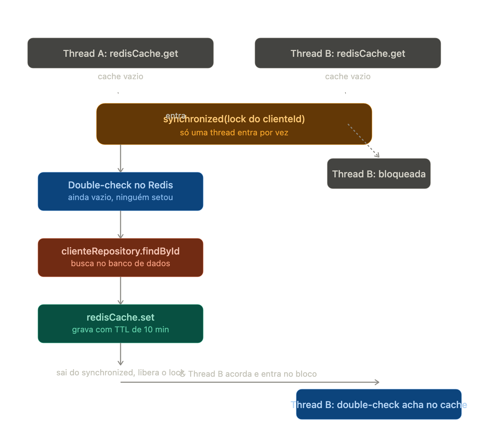

# Definições

Cache é uma cópia de dados guardada num lugar de acesso mais rápido, pra evitar recalcular ou rebuscar algo caro toda vez. "Caro" pode significar: lento (disco vs memória), distante (rede), ou custoso (query complexa, chamada a serviço externo).

A troca fundamental do cache é sempre: velocidade vs consistência. Todo problema de cache, no fundo, é sobre até que ponto você tolera dados desatualizados em troca de performance.

- Reduz tempo de resposta e consumo de recursos mais eficiente;
- Evita overhead de acoes repetitivas e tambem caras para o banco de dados;
- Pode melhorar a eficiencia de outras consultas na base de dados;
- Aumenta escalabilidade, disponibilidade e reduz single point of failure;
- Nao atende todos os casos, as vezes voce requer "strong consistency";
- Custo aumenta
- Arquitetura se torna mais "complexa" em quantidade de tecnologias
- Precisa gerenciar o TTL e a Invalidacao

## Camadas de Cache

- `CDN (CloudFront, Cloudflare)`: cacheia respostas HTTP inteiras, perto geograficamente do usuário. Ótimo pra assets estáticos, não tanto pra dados por usuário.
- `Cache distribuído (Redis, Memcached)`: compartilhado entre múltiplas instâncias do seu serviço. É o mais comum em arquitetura de microserviços.
- `Cache local/in-process (Caffeine, Guava Cache, EhCache)`: vive na memória da própria JVM. Mais rápido que Redis (sem ida à rede), mas não compartilhado entre instâncias — cada réplica tem sua própria cópia.
- `Cache do banco`: buffer pool do Postgres, query cache — geralmente você não controla diretamente, mas influencia via índices e queries.

## Estratégias de cache

### Cache-Aside (Lazy Loading) — a mais comum

**Definição didática**: a aplicação é responsável por checar o cache primeiro; se não tiver (cache miss), busca no banco e escreve no cache pra próxima vez.

```java
public Cliente buscarCliente(String clienteId) {
    // 1. tenta o cache
    Cliente cliente = redisCache.get(clienteId);
    if (cliente != null) return cliente; // cache hit

    // 2. cache miss: busca no banco
    cliente = clienteRepository.findById(clienteId);

    // 3. popula o cache pra próxima vez
    redisCache.set(clienteId, cliente, Duration.ofMinutes(10));
    return cliente;
}
```

- **Vantagem**: só cacheia o que é realmente lido (não desperdiça memória com dados nunca acessados).
- **Desvantagem**: primeira leitura é sempre lenta (cache miss), e se você não invalidar direito, dados ficam desatualizados.

### Read-Through

**Definição didática**: parecido com Cache-Aside, mas quem busca no banco em caso de miss não é a aplicação — é o próprio cache, de forma transparente (a aplicação só fala com o cache, nunca diretamente com o banco).

O Read-Through é usado principalmente em sistemas com muitas leituras onde a aplicação precisa simplificar o código, transferindo a responsabilidade de buscar os dados para o próprio sistema de cache. Ele atua como um intermediário inteligente, lendo diretamente do banco quando o dado não está no cache e guardando-o automaticamente.

No Cache-Aside, a lógica de "se não tem no cache, busca no banco" mora no seu método `buscarCliente`. No Read-Through, essa lógica é configurada uma vez, dentro do próprio cache — e o restante da aplicação só chama `cache.get(id)`, sem saber que existe um banco por trás. Um `LoadingCache` do Caffeine deixa isso concreto:

```java
LoadingCache<String, Cliente> clienteCache = Caffeine.newBuilder()
    .expireAfterWrite(Duration.ofMinutes(10))
    .build(clienteId -> clienteRepository.findById(clienteId)); // o "loader" — só roda em miss

public Cliente buscarCliente(String clienteId) {
    return clienteCache.get(clienteId); // nunca fala com o repository diretamente
}
```

Repare que `buscarCliente` não tem mais nenhum `if (cliente != null)` — o cache decide sozinho quando buscar no banco. Essa é a diferença prática real: não é uma mudança de comportamento (o resultado é o mesmo do Cache-Aside), é uma mudança de **onde a responsabilidade mora**.

### Write-Through

**Definição didática**: toda escrita vai para o cache e para o banco, de forma síncrona, na mesma operação — o cache nunca fica desatualizado porque ele é atualizado no mesmo momento do commit.

```java
public void atualizarLimiteCredito(String clienteId, BigDecimal novoLimite) {
    // escreve no banco E no cache, atomicamente (do ponto de vista lógico)
    clienteRepository.updateLimite(clienteId, novoLimite);
    redisCache.set(clienteId, novoLimite);
}
```

- **Vantagem**: cache sempre consistente com o banco.
- **Desvantagem**: escrita fica mais lenta (duas operações), e você paga o custo de cache mesmo pra dados que talvez nunca sejam lidos.

### Write-Behind (Write-Back)

**Definição didática**: a escrita vai só para o cache primeiro (rápido), e o cache é responsável por persistir no banco de forma assíncrona, em batch, depois.

```java
public void registrarEvento(Evento evento) {
    cache.put(evento.getId(), evento); // rápido, retorna na hora
    // um processo em background, periodicamente, faz flush pro banco
}
```

- **Vantagem**: escrita extremamente rápida.
- **Desvantagem**: risco real de perda de dados se o cache cair antes do flush — isso é perigoso demais para dados financeiros (nunca use write-behind para saldo, débito de limite, transações — só para coisas como métricas, logs, contadores de views).

### Write-Around

**Definição didática**: a escrita vai direto pro banco, ignorando o cache; o cache só é populado quando alguém ler aquele dado depois (na prática, combina com Cache-Aside na leitura).

Bom pra dados escritos com frequência mas raramente lidos logo em seguida (ex: logs de auditoria) — evita poluir o cache com coisa que não vai ser lida de novo tão cedo.

## O problema mais difícil de cache: invalidação

Existe uma piada clássica em engenharia: "tem só dois problemas difíceis em ciência da computação: cache invalidation e naming things." Isso porque:

### TTL (Time To Live)

A forma mais simples: o dado expira depois de X segundos/minutos, independente de mudar ou não.

```java
redisCache.set(clienteId, cliente, Duration.ofMinutes(5));
```

Simples, mas você aceita ficar até 5 minutos com dado desatualizado.

### Invalidação ativa (event-based)

Quando o dado muda no banco, você explicitamente remove ou atualiza a entrada do cache.

```java
public void atualizarLimiteCredito(String clienteId, BigDecimal novoLimite) {
    clienteRepository.updateLimite(clienteId, novoLimite);
    redisCache.evict(clienteId); // remove do cache — próxima leitura vai buscar fresco
}
```

Isso combina muito bem com o que você já estuda de Outbox Pattern: o evento de "LimiteAtualizado" que você publica no SNS/SQS pode também disparar invalidação de cache em outros serviços que dependem daquele dado.

## Cache Stampede (Thundering Herd)

Cache Stampede acontece quando uma chave de cache expira e várias requisições simultâneas tentam repopular o mesmo dado ao mesmo tempo, sobrecarregando o banco justamente no momento em que o cache deveria estar protegendo ele.

Quando uma chave expira e 1.000 requisições chegam pedindo o mesmo dado, todas sofrem cache miss ao mesmo tempo — e todas vão bater no banco simultaneamente para reconstruir o valor. O mesmo problema se multiplica quando isso acontece para várias chaves diferentes ao mesmo tempo: cada chave gera seu próprio pico de requisições concorrentes, e os picos se somam sobre o banco.

### Por que o Jitter sozinho não resolve

O TTL é gerado no momento em que o dado é gravado no Redis. A partir daí ele começa a contar. Quando expira, qualquer requisição que busca essa chave vai tentar reconstruir o cache. Se 1.000 requisições chegam nesse exato momento e não existe nenhum controle:

- Todas as 1.000 vão fazer o `setCache` simultaneamente.
- Cada uma tenta setar seu próprio TTL (com ou sem jitter), mas o TTL final é sempre o de quem escreveu por último — as outras 999 escritas foram desperdiçadas.
- O banco já sofreu com 1.000 queries desnecessárias antes que qualquer TTL fizesse diferença.

**O jitter não resolve concorrência na mesma chave.** Ele resolve outro problema: evitar que muitas chaves diferentes expirem no mesmo instante. São dois problemas distintos:

| Problema | Estratégia que resolve |
|---|---|
| 1.000 requisições concorrentes na **mesma chave** | Lock / SingleFlight / Request Coalescing |
| 1 milhão de chaves **diferentes** expirando no mesmo segundo | TTL com Jitter |

### Estratégias para resolver Cache Stampede

#### Estratégia 1 — Lock (Distributed Lock / Mutex)

Garante que apenas uma requisição, entre todas que chegam simultaneamente, acesse o banco e reconstrua o cache. As demais aguardam ou recebem o valor já pronto.



Esse trecho é uma implementação manual do padrão que o Spring costuma resolver com @Cacheable + sync = true, mas aqui feito na mão com synchronized e um Map de locks por clienteId. O que acontece:

1. Thread A e Thread B batem no método quase ao mesmo tempo, ambas veem o cache vazio no primeiro get.
2. Só uma delas consegue entrar no bloco synchronized — o lock é obtido via locks.computeIfAbsent(clienteId, ...), ou seja, cada clienteId tem seu próprio monitor, então clientes diferentes não travam uns aos outros.
3. A Thread B fica bloqueada esperando a Thread A sair do bloco.
4. A Thread A faz o double-check: confere de novo o Redis (porque, em teoria, outra thread já poderia ter processado e setado o valor enquanto ela esperava para entrar no lock).
5. Como ainda está vazio, ela busca no banco (findById) e grava no Redis com TTL de 10 minutos.
6. Ao sair do synchronized, libera o lock. A Thread B acorda, entra no bloco, faz seu próprio double-check e agora encontra o valor no cache — evitando outra consulta ao banco.

```java
public Cliente buscarClienteComLock(String clienteId) {
    Cliente cliente = redisCache.get(clienteId);
    if (cliente != null) return cliente;

    // só uma thread por vez recalcula esse clienteId
    synchronized (locks.computeIfAbsent(clienteId, k -> new Object())) {
        cliente = redisCache.get(clienteId); // double-check, outra thread pode ter setado
        if (cliente != null) return cliente;

        cliente = clienteRepository.findById(clienteId);
        redisCache.set(clienteId, cliente, Duration.ofMinutes(10));
    }
    return cliente;
}
```

Em sistemas com múltiplas instâncias, esse lock precisa ser distribuído (ex: `SET NX` no Redis), já que um `synchronized` local só protege a própria JVM.

**Quando usar:** sistemas distribuídos com múltiplas instâncias competindo pela mesma chave.

#### Estratégia 2 — SingleFlight / Request Coalescing

Enquanto o Lock impede que múltiplas *instâncias* reconstruam o cache, o Request Coalescing evita que múltiplas requisições *dentro do mesmo processo* dupliquem trabalho: elas compartilham a mesma operação (Promise/Future) em andamento.

Se 50 requisições chegam ao mesmo tempo pedindo `produto:42` e o cache está vazio, só a primeira dispara a busca no banco — as outras 49 simplesmente esperam o resultado dessa mesma chamada, em vez de disparar 49 queries idênticas.

```java
private final Map<String, CompletableFuture<Produto>> emAndamento = new ConcurrentHashMap<>();

public CompletableFuture<Produto> buscarProduto(String produtoId) {
    Produto cacheado = redisCache.get(produtoId);
    if (cacheado != null) {
        return CompletableFuture.completedFuture(cacheado);
    }

    // se já existe uma busca em andamento pra essa chave, reaproveita ela
    return emAndamento.computeIfAbsent(produtoId, id ->
        CompletableFuture.supplyAsync(() -> produtoRepository.findById(id))
            .thenApply(produto -> {
                redisCache.set(id, produto, Duration.ofMinutes(10));
                return produto;
            })
            .whenComplete((r, e) -> emAndamento.remove(id)) // libera a chave ao terminar
    );
}
```

**Quando usar:** aplicações com uma única instância, ou como camada extra dentro de cada instância mesmo já tendo um lock distribuído.

#### Estratégia 3 — TTL com Jitter

Jitter = "ruído aleatório". Em vez de todas as chaves terem exatamente o mesmo TTL, você adiciona uma pequena variação aleatória em cada uma, pra que não expirem todas no mesmo segundo — mesmo que tenham sido criadas no mesmo momento.

Isso resolve o problema de **muitas chaves diferentes** expirando juntas — não o de concorrência numa chave só (por isso ele geralmente é usado *junto* com lock ou coalescing, depois que a escrita já está garantida por um deles).

Imagine 1 milhão de chaves `produto:1` até `produto:1.000.000`, todas criadas às 10h com TTL de 1 hora:

```
Sem jitter:
11:00 → 1 milhão de chaves expiram ao mesmo tempo

Com jitter (TTL base + variação aleatória):
10:56 → algumas expiram
10:58 → outras
11:01 → outras
11:04 → outras
```

```java
public void popularCacheTaxas(List<Produto> produtos) {
    for (Produto produto : produtos) {
        BigDecimal taxa = calcularTaxaCET(produto);
        // TTL base de 24h + até 30 minutos de variação aleatória
        long jitterSegundos = ThreadLocalRandom.current().nextLong(0, 30 * 60);
        Duration ttlComJitter = Duration.ofHours(24).plusSeconds(jitterSegundos);
        redisCache.set("taxa_cet_" + produto.getId(), taxa, ttlComJitter);
    }
}
```

Repare o que muda: das 500 chaves, cada uma expira num momento ligeiramente diferente, espalhado numa janela de 30 minutos:

```
00:00:00 → produto 1 expira
00:00:03 → produto 47 expira
00:00:11 → produto 203 expira
00:04:22 → produto 88 expira
...
00:29:58 → produto 412 expira
```

O banco recebe a mesma quantidade total de queries, mas espalhadas no tempo — o que ele absorve tranquilamente:

```
Sem jitter                          Com jitter
Carga no banco                      Carga no banco
     │                                   │
     │        ┃ ← pico de 1000           │      ▂▃▅▆▇▆▅▃▂  ← distribuído
     │        ┃   req simultâneas        │  ▂▂▂▂▂▂▂▂▂▂▂▂▂▂
     │________┃________________          │________________
           00:00                              23:55    00:30
```

**Quando usar:** sempre que muitas chaves compartilham o mesmo TTL.

#### Estratégia 4 — Refresh-Ahead

Em vez de esperar o cache expirar de verdade, você recalcula proativamente um pouco antes do TTL vencer. Assim nunca acontece um miss simultâneo — o dado é atualizado em background enquanto o valor antigo (ainda válido) continua servindo as requisições.

```java
@Scheduled(fixedRate = 5 * 60 * 1000) // roda a cada 5 minutos
public void refreshAheadTaxasPopulares() {
    List<String> chavesPopulares = List.of("taxa_cet_1", "taxa_cet_2", "taxa_cet_3");

    for (String chave : chavesPopulares) {
        Duration ttlRestante = redisCache.getTtl(chave);

        // se falta menos de 2 minutos pra expirar, já recalcula agora
        if (ttlRestante != null && ttlRestante.toMinutes() < 2) {
            BigDecimal novaTaxa = calcularTaxaCET(buscarProdutoDaChave(chave));
            redisCache.set(chave, novaTaxa, Duration.ofMinutes(10));
        }
    }
}
```

**Quando usar:** chaves muito acessadas e com padrão de acesso previsível (ex: taxas, configs, catálogos populares).

#### Estratégia 5 — Stale-While-Revalidate (SWR)

Quando o cache expira, em vez de bloquear a requisição esperando o recálculo, você retorna o valor antigo (stale) imediatamente e dispara a atualização em background. A próxima requisição já pega o valor novo.

```java
public Cliente buscarClienteSWR(String clienteId) {
    CacheEntry<Cliente> entry = redisCache.getComMetadados(clienteId);

    if (entry == null) {
        // não tem nem valor stale, precisa buscar de forma síncrona
        Cliente cliente = clienteRepository.findById(clienteId);
        redisCache.set(clienteId, cliente, Duration.ofMinutes(10));
        return cliente;
    }

    if (entry.isExpirado()) {
        // devolve o valor stale na hora, e atualiza em background
        CompletableFuture.runAsync(() -> {
            Cliente atualizado = clienteRepository.findById(clienteId);
            redisCache.set(clienteId, atualizado, Duration.ofMinutes(10));
        });
    }

    return entry.getValor(); // stale ou fresco, sempre retorna rápido
}
```

**Quando usar:** quando baixa latência importa mais do que ter o dado 100% atualizado em todo momento.

#### Estratégia 6 — Cache Warming (Background Cache Warming)

Pré-aquece chaves populares antes que sejam solicitadas de novo — geralmente após deploy, restart, ou de forma agendada — para que o cache nunca chegue a ficar vazio para os dados mais acessados.

```java
@EventListener(ApplicationReadyEvent.class) // roda assim que a aplicação sobe
public void aquecerCacheNoStartup() {
    List<Produto> produtosMaisAcessados = produtoRepository.findTopMaisAcessados(100);

    for (Produto produto : produtosMaisAcessados) {
        BigDecimal taxa = calcularTaxaCET(produto);
        long jitterSegundos = ThreadLocalRandom.current().nextLong(0, 30 * 60);
        redisCache.set(
            "taxa_cet_" + produto.getId(),
            taxa,
            Duration.ofHours(24).plusSeconds(jitterSegundos)
        );
    }
}
```

**Quando usar:** dados muito populares, ou logo após deploy/restart, quando o cache está totalmente frio.

### Lock de cache vs Lock de dados — não confundir

- **Lock otimista/pessimista** → protege dados (garante consistência, evita condição de corrida sobre o mesmo registro).
- **Lock para cache stampede** → protege recursos (evita trabalho duplicado e sobrecarga no banco).

Usam o mesmo conceito de exclusão mútua, mas resolvem problemas diferentes. Isso importa na prática: mais adiante, na seção sobre limite de crédito, veremos um caso onde nenhum lock de cache resolve o problema — porque o que precisa de proteção não é o cache, é o dado em si.

### Resumo das estratégias de Stampede

| Estratégia | Como funciona | Quando usar |
|---|---|---|
| **Distributed Lock (Mutex)** | Apenas uma instância reconstrói o cache; as demais aguardam ou tentam de novo. | Sistemas distribuídos com múltiplas instâncias. |
| **SingleFlight / Request Coalescing** | Requisições idênticas compartilham a mesma execução (Promise/Future) em andamento. | Uma única instância, ou como camada extra dentro de cada instância. |
| **TTL com Jitter** | Adiciona variação aleatória ao TTL para evitar expiração simultânea de muitas chaves. | Sempre que muitas chaves compartilham o mesmo TTL. |
| **Refresh-Ahead** | Atualiza o cache um pouco antes do TTL expirar de verdade. | Chaves muito acessadas e com padrão previsível. |
| **Stale-While-Revalidate** | Retorna o valor expirado por um curto período enquanto atualiza em background. | Quando baixa latência importa mais que dado 100% atualizado. |
| **Cache Warming** | Pré-carrega o cache antes que ele seja necessário. | Dados populares, após deploy ou restart. |

Em sistemas distribuídos reais, é comum combinar várias dessas técnicas: **Redis + distributed lock + TTL com jitter + stale-while-revalidate**, cada uma cobrindo uma fatia diferente do problema.

## Cache Penetration

**Definição didática**: quando alguém busca repetidamente por uma chave que não existe — nem no cache, nem no banco — e cada busca sempre bate no banco porque nunca há cache hit pra algo que não existe.

Isso é fácil de confundir com Cache Stampede, mas são problemas diferentes: no Stampede a chave *existe* e expira, gerando um pico temporário de reconstrução. No Penetration a chave *nunca existiu* — não há TTL, não há expiração, e sem uma defesa explícita, cada requisição pra esse ID vira uma query no banco pra sempre, indefinidamente.

Isso é especialmente perigoso porque pode virar vetor de ataque: alguém consultando `clienteId` aleatórios ou sequenciais que não existem consegue gerar carga sustentada no banco sem nunca disparar um cache hit — uma forma barata de negação de serviço (DoS) contra a camada de dados.

**Solução**: cachear também o "não encontrado" (valor nulo/sentinel) por um tempo curto, assim a ausência também vira cache hit.

```java
public Cliente buscarCliente(String clienteId) {
    Object cached = redisCache.get(clienteId);
    if (cached == NULL_SENTINEL) return null; // já sabemos que não existe
    if (cached != null) return (Cliente) cached;

    Cliente cliente = clienteRepository.findById(clienteId);
    if (cliente == null) {
        redisCache.set(clienteId, NULL_SENTINEL, Duration.ofSeconds(30)); // cacheia a ausência
        return null;
    }
    redisCache.set(clienteId, cliente, Duration.ofMinutes(10));
    return cliente;
}
```

**Quando usar:** endpoints públicos ou de alto volume que recebem IDs vindos de fora (usuário, integração externa) — qualquer lugar onde IDs inexistentes podem ser consultados repetidamente.

## Políticas de eviction (quando o cache está cheio)

Cache tem tamanho limitado (memória é cara). Quando enche, algo precisa sair. As políticas mais comuns:

- **LRU (Least Recently Used)**: remove o que não é acessado há mais tempo. A mais usada por padrão (Redis, Caffeine).
- **LFU (Least Frequently Used)**: remove o que é acessado com menos frequência (não importa quando foi a última vez, importa quantas vezes no total).
- **FIFO**: remove o mais antigo a entrar, independente de uso.
- **TTL-based**: remove por expiração de tempo, não por pressão de memória.

```java
// Exemplo Caffeine (cache local Java) configurando LRU-like com tamanho máximo
Cache<String, Cliente> cache = Caffeine.newBuilder()
    .maximumSize(10_000)
    .expireAfterWrite(Duration.ofMinutes(10))
    .build();
```

## Distribuído: consistência entre múltiplas instâncias

Se você tem 5 réplicas do seu serviço, cada uma com cache local (Caffeine), você tem 5 cópias potencialmente diferentes do mesmo dado. Isso é ok pra dados que toleram alguma inconsistência (ex: configuração, feature flags), mas é perigoso pra dado financeiro.

Cache distribuído (Redis) resolve isso tendo uma única fonte de cache compartilhada entre todas as instâncias:

```
Instância 1 ─┐
Instância 2 ─┼──→ Redis (fonte única de cache) ──→ Banco
Instância 3 ─┘
```

Mas isso introduz uma pergunta importante: Redis vira um novo ponto de falha/gargalo? Por isso, em produção, Redis normalmente roda em cluster com réplicas (Redis Sentinel ou Redis Cluster) — mesma lógica de HA que você já viu em PostgreSQL primary/replica.

### Multi-layer caching (L1 + L2)

Uma combinação comum e poderosa: cache local (L1, rapidíssimo, mas por instância) + cache distribuído (L2, um pouco mais lento, mas compartilhado).

```java
public Cliente buscarCliente(String clienteId) {
    // L1: cache local (Caffeine) — nanossegundos
    Cliente cliente = localCache.getIfPresent(clienteId);
    if (cliente != null) return cliente;

    // L2: cache distribuído (Redis) — ida à rede, mas ainda rápido
    cliente = redisCache.get(clienteId);
    if (cliente != null) {
        localCache.put(clienteId, cliente); // popula L1 pra próxima
        return cliente;
    }

    // L3: banco
    cliente = clienteRepository.findById(clienteId);
    redisCache.set(clienteId, cliente, Duration.ofMinutes(10));
    localCache.put(clienteId, cliente);
    return cliente;
}
```

## Caching aplicado ao domínio de crédito

Vale pensar no que faz sentido cachear e no que NUNCA deve ser cacheado num sistema de crédito:

### Bom pra cache

- Score de crédito consultado no bureau (Serasa/SPC) — consulta cara, e um score não muda a cada segundo. TTL de algumas horas.
- Tabelas de referência: taxas de CET, tabelas de amortização SAC/Price, parâmetros de PD/LGD.
- Resultado de regras de política de crédito que não mudam com frequência.
- Dados de perfil do cliente (nome, CPF, dados cadastrais) — mudam raramente.

### Nunca cachear (ou cachear com extremo cuidado)

- **Limite de crédito disponível em tempo real** — se você cachear isso e servir um valor stale, corre o risco de aprovar dois créditos simultâneos que juntos estouram o limite real (race condition clássica).
- **Saldo de conta / status de pagamento**: qualquer coisa que, se errada, causa problema financeiro real.

É aqui que vale reforçar a distinção feita lá em Cache Stampede entre lock de cache e lock de dados: um lock distribuído (Redis `SET NX`) resolve *quem reconstrói o cache* — mas não impede duas transações concorrentes de lerem o mesmo limite disponível e ambas decidirem aprovar. O problema do limite de crédito não é reconstrução de cache, é consistência do dado em si. Por isso a solução aqui não é nenhuma das seis estratégias de Stampede: é ler direto do banco com lock pessimista, ou usar TCC (Try-Confirm/Cancel), ou versionamento otimista (`@Version` do JPA) na própria entidade.

A regra mental: cache dados que, se estiverem levemente desatualizados, não causam dano financeiro ou de compliance. Tudo que envolve dinheiro em movimento (débito, limite, saldo) deve ser lido fresco ou protegido com locking/versionamento otimista no dado, não com cache.

## Cache em nível de HTTP (bônus, relevante pra API Gateway)

```
Cache-Control: max-age=300, private
ETag: "abc123"
```

- `Cache-Control: max-age`: por quanto tempo o cliente/CDN pode reutilizar sem revalidar.
- `ETag` + `If-None-Match`: permite o cliente perguntar "ainda é essa versão?" e o servidor responder 304 Not Modified sem reenviar o payload inteiro — economiza banda mesmo quando o cache "expirou" mas o dado não mudou.

Isso é relevante pro seu Gateway: rotas de consulta (ex: `GET /tabelas-taxas`) podem ter cache HTTP agressivo; rotas de mutação (ex: `POST /aprovar-credito`) nunca devem ser cacheadas.

## Resumo mental

1. Cache-Aside é o padrão default — decore esse primeiro.
2. Read-Through é o mesmo comportamento do Cache-Aside, só muda quem é responsável por buscar em caso de miss.
3. Write-Through quando consistência do cache importa mais que velocidade de escrita.
4. Write-Behind só para dados não-críticos (nunca em fintech pra saldo/limite).
5. TTL + jitter resolve a maioria dos casos simples de chaves diferentes expirando juntas; locking, coalescing e refresh-ahead resolvem stampede na mesma chave.
6. Cache Penetration se resolve cacheando o "não existe" — problema diferente de Stampede, mesma família de sintoma (carga excessiva no banco).
7. Multi-layer (L1 local + L2 distribuído) é o que sistemas de alta escala realmente usam.
8. Em domínio financeiro: cache é ferramenta de leitura de dados estáveis, nunca de controle de estado transacional — lock de cache não substitui lock de dados.
