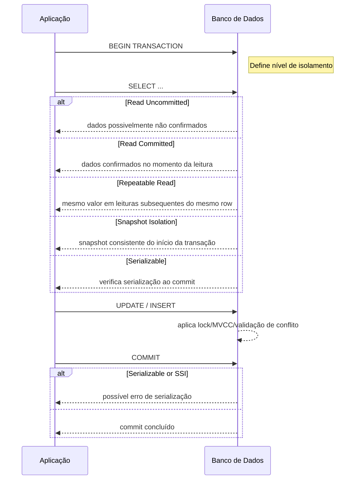

## 1. O que é

Isolation level em transações de banco de dados é o parâmetro que define quanto uma transação deve ficar isolada de outras transações concorrentes durante leituras e gravações. Em outras palavras, é uma política de controle de concorrência que determina quais anomalias de leitura e gravação são permitidas e quais devem ser evitadas.

### O verdadeiro objetivo do isolamento

- O objetivo não é "bloquear tudo".
- É garantir que outra transação não tome decisões com base em um estado inconsistente.
- O isolamento não "trava o banco inteiro". Ele atua apenas sobre os dados envolvidos na transação (linhas, índices, intervalos de chaves etc.), dependendo da operação e do nível de isolamento.
- O isolamento não é por tabela, e sim pelo recurso necessário.
- Dependendo do banco e da operação, o recurso pode ser:
  - uma linha (o mais comum);
  - um intervalo de índices (gap lock/range lock em alguns bancos);
  - uma página de dados (em alguns mecanismos);
  - uma tabela inteira (mais raro, mas pode acontecer em operações específicas).

___

Sinônimos/nomes usados no mercado:

- Nível de isolamento
- Isolation level
- Isolation mode
- Database isolation
- Transaction isolation

Variações/camadas/tipos reconhecidos:

- Read Uncommitted
- Read Committed
- Repeatable Read
- Serializable
- Snapshot Isolation
- Cursor Stability / Read Stability (variação histórica / implementação específica)

## 2. Por que existe (o problema que resolve)

O problema que motivou os níveis de isolamento é o conflito entre concorrência e consistência em sistemas transacionais. Em sistemas de banco de dados, várias transações podem ler e escrever os mesmos dados ao mesmo tempo. Sem controle, isso geraria anomalias como leituras sujas, leituras não repetíveis e phantoms.

Antes dos níveis de isolamento, sistemas primitivos aceitavam leituras incoerentes ou bloqueavam tudo, reduzindo dramaticamente a escalabilidade. Historicamente, o conceito ganhou forma com a formalização de ACID e do SQL ANSI/ISO em meados dos anos 1980 e 1990, e recebeu maior clareza com o trabalho de Jim Gray e, especialmente, o paper clássico de Hal Berenson et al. "A Critique of ANSI SQL Isolation Levels" (SIGMOD 1995).

O isolamento existe porque:

- transações precisam ver um estado coerente do banco;
- o banco deve evitar leituras de dados ainda não confirmados;
- o sistema deve equilibrar desempenho versus garantia de consistência;
- diferentes aplicações têm requisitos distintos de correção e latência.

## 3. Tipos e características

### Read Uncommitted

Como funciona:

- permite que uma transação leia dados escritos por outra transação antes dela ser confirmada (dirty read).
- geralmente implementado sem bloqueios de leitura ou com bloqueios de escopo muito curto.

Prós:

- maior taxa de paralelismo e menor latência de leitura.
- overhead de bloqueio muito baixo.

Contras:

- permite leituras sujas, o que pode causar decisões incorretas no aplicativo.
- quase nunca é aceitável em OLTP real.

Camada de infraestrutura:

- internamente no mecanismo do banco de dados, no gerenciador de bloqueios ou no gerenciador de versões.

Quando é escolha certa:

- cargas analíticas onde imprecisão momentânea é tolerável;
- sistemas de logging / auditoria que só precisam de "quase" dados reais.

### Read Committed

Como funciona:

- garante que uma transação só leia dados confirmados.
- leituras de dados não confirmados são evitadas, mas leituras repetidas podem retornar valores diferentes se outra transação confirmar uma alteração entre leituras.
- implementações comuns: bloqueios de leitura compartilhados liberados após cada leitura (SQL Server, Oracle, PostgreSQL em modo tradicional) ou MVCC com snapshot no início de cada instrução.

Prós:

- evita leituras sujas.
- bom compromisso entre consistência e concorrência.

Contras:

- não evita leituras não repetíveis.
- não protege contra phantoms.

Camada de infraestrutura:

- nível do mecanismo de armazenamento/transação do banco de dados.

Quando é escolha certa:

- OLTP de média a alta taxa onde leituras estáveis entre múltiplas consultas na mesma transação não são obrigatórias.
- consultas ad hoc e processos de pagamento que toleram revalidação na aplicação.

### Repeatable Read

Como funciona:

- garante que se uma transação ler um registro, leituras subsequentes do mesmo registro retornem o mesmo valor.
- em motores baseados em 2PL, mantém bloqueios de leitura até o fim da transação.
- em MVCC, cria um snapshot estável no início da transação para as leituras de rows já observados.

Prós:

- evita leituras sujas e leituras não repetíveis.
- dá previsibilidade para transações que fazem várias leituras do mesmo dado.

Contras:

- não elimina phantoms em todas as implementações ANSI originais.
- pode aumentar contenção e risco de deadlock devido a bloqueios mantidos por mais tempo.

Camada de infraestrutura:

- mecanismo de bloqueio + gerenciamento de transações.

Quando é escolha certa:

- relatórios consistentes dentro de uma transação que lê várias vezes os mesmos registros.
- operações de reserva de recursos onde a re-leitura de uma linha deve retornar o mesmo estado.

### Serializable

Como funciona:

- garante que o resultado das transações concorrentes é equivalente a uma execução serial.
- implementações práticas: locking estrito de 2 fases (STRICT 2PL), predicate locking, serializable snapshot isolation (SSI).
- bloqueios ou verificações de conflito abrangem leituras e escritas até o fim da transação.

Prós:

- fornece a maior garantia de consistência e elimina todas as anomalias clássicas do ANSI.
- é o modo mais seguro para lógica de negócio crítica.

Contras:

- maior latência e menor throughput.
- maior custo operacional: tuning, detecção/retentativa de conflitos e deadlocks.

Camada de infraestrutura:

- mecanismo de transação, lock manager e, em MVCC, detector de dependência de leitura/escrita.

Quando é escolha certa:

- sistemas financeiros, contabilidade, inventário com regras de integridade fortes.
- quando a aplicação não pode tolerar anomalies mesmo em carga alta.

### Snapshot Isolation

Como funciona:

- cada transação lê um snapshot consistente do banco no momento em que começa.
- não vê os writes de transações concorrentes até elas serem confirmadas.
- a escrita detecta conflitos de atualização em row-level no commit.
- não é parte do ANSI SQL original, mas é muito comum em PostgreSQL, Oracle, SQL Server e MySQL/InnoDB.

Prós:

- elimina leituras sujas e não repetíveis para leituras dentro da transação.
- alto paralelismo em leituras.

Contras:

- não evita "write skew" e algumas anomalias de serialização sem extensões como SSI.
- em alguns bancos, pode consumir mais armazenamento temporário por versões de row.

Camada de infraestrutura:

- MVCC, gerenciador de versões e coletor de lixo de versões.

Quando é escolha certa:

- aplicações que precisam de consistência de leitura sem sacrificar muito concorrência.
- quando o banco já oferece suporte nativo e a aplicação pode tratar conflitos no commit.

### Cursor Stability / Read Stability

Como funciona:

- varia por produto, mas em geral mantém bloqueios de leitura apenas durante o cursor ou instrução.
- não garante repetibilidade entre leituras distantes; é um modo intermediário entre Read Committed e Repeatable Read.

Prós:

- menos bloqueios duradouros do que Repeatable Read.
- preço menor de contenção para alguns padrões de acesso.

Contras:

- ainda permite anomalias parecidas com leituras não repetíveis e phantoms.

Camada de infraestrutura:

- gerenciador de bloqueios no nível de cursor/instrução.

Quando é escolha certa:

- aplicações legadas que usam cursores e não precisam de transações longas consistentes.

## 4. Como funciona (mecanismo interno)

1. Início da transação

- o cliente envia um BEGIN/START TRANSACTION.
- o banco de dados aloca uma transação no Transaction Manager.
- o Isolation Level determina as regras de leitura e escrita:
  - quais locks são adquiridos;
  - se uma leitura usa snapshot ou bloqueio compartilhado;
  - se o commit exige validação de conflitos.

1. Leitura de dados

- no modo Read Uncommitted: o sistema pode ler diretamente a versão mais recente, mesmo não confirmada.
- no modo Read Committed: uma leitura consulta apenas versões confirmadas ou aguarda bloqueios exclusivos.
- no modo Repeatable Read: o mesmo registro lido retorna o mesmo valor; o sistema mantém bloqueios de leitura ou leu de um snapshot.
- no modo Snapshot Isolation: a leitura acessa uma versão histórica imutável do row conforme o snapshot da transação.
- no modo Serializable: leituras podem adquirir locks ou gerar dependências de sequência que serão verificadas no commit.

1. Escrita de dados

- escrita geralmente adquire um bloqueio exclusivo (X-lock) no row/page.
- em MVCC, escreve-se uma nova versão e o row antigo permanece para outros snapshots.
- no commit, há validação de conflitos dependendo do nível:
  - Read Committed: apenas garante que os dados eram confirmados na leitura.
  - Snapshot Isolation: valida write-write conflicts e, em SSI, também read-write.
  - Serializable: verifica se a execução é equivalente a uma serialização.

1. Commit/Rollback

- commit libera locks e torna novas versões visíveis.
- rollback descarta mudanças e relê versões originais.
- em bancos que suportam SSI, o commit pode falhar com um erro de serialização, forçando retry na aplicação.

Componentes envolvidos:

- Transaction Manager: registra a transação, seus locks e seu snapshot.
- Lock Manager: controla S-locks e X-locks, detecta deadlocks.
- MVCC Version Store: guarda múltiplas versões de linhas e controla visibilidade.
- Storage Engine: aplica mudanças persistentes no disco/SSD.
- Query Executor: decide se uma operação deve usar snapshot, lock ou validação.

Algoritmos e estratégias mais usados:

- Strict Two-Phase Locking (Strict 2PL): bloqueia em compartilhado/exclusivo e só libera no commit.
- Multiversion Concurrency Control (MVCC): mantém versões imutáveis para permitir leituras sem bloqueios.
- Optimistic Concurrency Control (OCC): validam no commit, aplicável a Snapshot Isolation.
- Serializable Snapshot Isolation (SSI): combinam MVCC com verificações de dependência para garantir serializabilidade.
- Predicate Locking / Range Locking: necessários para prevenir phantoms no modo serializable.

## 5. Onde e como se aplica na prática

### Nível de máquina/processo único

- SQLite: oferece `SERIALIZABLE` e `READ UNCOMMITTED`, mas no modo default o `SERIALIZABLE` é implementado com locks de banco inteiro e `READ UNCOMMITTED` usa cópia de páginas.
- H2 Database: configurações `TRANSACTION_READ_UNCOMMITTED`, `TRANSACTION_READ_COMMITTED`, `TRANSACTION_REPEATABLE_READ`, `TRANSACTION_SERIALIZABLE` para testes locais.
- Postgres em um único processo/instância self-managed: `default_transaction_isolation` no `postgresql.conf`.

### Nível de infraestrutura on-premise/self-managed

- PostgreSQL: suporta `READ UNCOMMITTED` (mapeado para `READ COMMITTED`), `READ COMMITTED`, `REPEATABLE READ`, `SERIALIZABLE` e `SNAPSHOT` internamente via MVCC.
- MySQL/InnoDB: suporta `READ UNCOMMITTED`, `READ COMMITTED`, `REPEATABLE READ` e `SERIALIZABLE`; o `REPEATABLE READ` padrão usa MVCC e é fortemente consistente em relação a phantoms.
- Oracle Database: nomeia `READ COMMITTED` e `SERIALIZABLE`, com `FLASHBACK QUERY` para snapshot-like reads.
- Microsoft SQL Server: `READ UNCOMMITTED`, `READ COMMITTED`, `REPEATABLE READ`, `SERIALIZABLE`, `SNAPSHOT` e `READ_COMMITTED_SNAPSHOT`.
- CockroachDB / YugabyteDB: implementam `SERIALIZABLE` ou `Snapshot Isolation` distribuído como padrão.

### Nível de nuvem/managed service

- AWS RDS for PostgreSQL / Aurora PostgreSQL: suporta os mesmos níveis do PostgreSQL; `default_transaction_isolation` pode ser ajustado no parâmetro DB.
- AWS RDS for MySQL / Aurora MySQL: expõe `transaction_isolation` nas configurações.
- Google Cloud SQL: oferece Postgres e MySQL com suporte a isolation levels do motor.
- Google Cloud Spanner: fornece `READ_COMMITTED` e leituras `snapshot` consistentes com timestamp, mas o modelo é mais próximo de serializabilidade em operações de leitura/grav.
- Azure SQL Database: suporta o mesmo portfólio de SQL Server, incluindo `SNAPSHOT` e `READ_COMMITTED_SNAPSHOT`.
- Azure Database for PostgreSQL: configuração de isolamento igual a PostgreSQL.
- Amazon Aurora PostgreSQL: padrão `READ COMMITTED` com MVCC, `SERIALIZABLE` também disponível.

### Nível de orquestração/Kubernetes

- o isolamento não é um objeto Kubernetes nativo; ele é configurado na instância do banco de dados executada no cluster.
- com `StatefulSet` e `ConfigMap`, você define `postgresql.conf` ou `my.cnf` para ajustar `default_transaction_isolation` ou `transaction-isolation`.
- operadores de banco como `CrunchyPostgres Operator`, `Percona Kubernetes Operator`, `Zookeeper Operator` para CockroachDB e `YugabyteDB Operator` expõem campos de configuração para isolamento.
- em Istio/Envoy, o isolamento aparece indiretamente no tráfego de banco, mas não como uma funcionalidade de rede.

## 6. Casos de uso reais e quando NÃO usar

Casos reais:

1. E-commerce checkout (venda de ingressos, estoque): `SERIALIZABLE` ou `REPEATABLE READ` para garantir que inventário não seja disputado de forma incorreta.
2. Sistema bancário / pagamentos: `SERIALIZABLE` em operações críticas de débito/crédito ou `SNAPSHOT` com verificação de conflito de write-write.
3. Aplicação OLTP tradicional com muitas leituras e poucas escritas: `READ COMMITTED` no PostgreSQL ou Oracle oferece bom desempenho.
4. Data warehouse ou análise de logs: `READ UNCOMMITTED` pode ser aceitável em cargas de mineração de dados ou ETL não sensíveis.
5. Microserviço de catálogo de produtos: `REPEATABLE READ` para garantir visibilidade estável de inventário durante um carrinho de compra.
6. Banco de dados distribuído como CockroachDB/Yugabyte: `SERIALIZABLE` pode ser o padrão, pois esses sistemas já projetam transações com garantia de serialização distribuída.

Quando NÃO usar ou evitar:

- `READ UNCOMMITTED` em qualquer aplicação financeira ou de inventário; causa leituras sujas perigosas.
- `SERIALIZABLE` em workloads de alta concorrência sem retry apropriado; pode reduzir throughput e gerar muitos conflitos.
- `REPEATABLE READ` em transações longas que lêem muitos registros; aumenta contenção e deadlocks.
- `SNAPSHOT ISOLATION` sem tratamento de write skew em regras de integridade complexas; pode gerar inconsistências lógicas.
- `READ COMMITTED` em transações que precisam de consistência de várias leituras dentro da mesma transação; não é adequado para cestas de compra multi-step sem compensação.

## 7. Cenários práticos e trade-offs

### Cenário 1: pico de vendas em e-commerce (escala/pico)

Uma loja online processa 5.000 pedidos por minuto em Black Friday. Cada pedido verifica estoque e reserva unidades.

- `READ COMMITTED` lê o estoque atual e, ao confirmar, usa `SELECT ... FOR UPDATE` para bloquear a linha de produto.
- se o pedido for bem-sucedido, o estoque é decrementado e a transação confirma.
- caso contrário, o banco libera o lock.

Resultado:

- alta concorrência passa, mas leituras repetidas dentro da transação não são garantidas.
- se dois pedidos lerem o mesmo estoque e tentarem atualizar, o lock exclusivo evita oversell.

### Cenário 2: sistema de faturamento e write skew (caso de borda)

Dois contadores atacam entradas distintas e atualizam dois saldos relacionados. Cada transação lê o saldo do outro antes de gravar.

- com `SNAPSHOT ISOLATION`, ambas podem ver uma visão consistente inicial e gravar sem conflito direto.
- o resultado pode violar uma regra financeira global (`saldo1 + saldo2 >= limite`) sem que haja conflito de write-write.
- se o banco usar `SERIALIZABLE` ou SSI, um dos commits falha e a aplicação precisa retry.

Resultado:

- `SNAPSHOT ISOLATION` é rápido, mas pode mascarar anomalias lógicas.
- `SERIALIZABLE` garante correção, mas pode reduzir throughput e exigir retries.

### Cenário 3: recuperação após deadlock em banco self-managed

Um sistema de CRM tem transações simultâneas que atualizam conta e histórico.

- `REPEATABLE READ` mantém locks compartilhados até o fim da transação.
- duas transações competem por locks inversos e o lock manager detecta deadlock.
- o banco aborta uma transação e a outra prossegue.

Resultado:

- transação abortada deve retry no aplicativo.
- sem retry, a operação falha mesmo que os dados fossem consistentes.

### Tabela de trade-offs

| Tipo | Latência | Consistência | Custo operacional | Complexidade de implementação | Resiliência |
|---|---|---|---|---|---|
| Read Uncommitted | Muito baixa | Baixa | Baixo | Baixa | Alta para leitura, baixa para correção |
| Read Committed | Baixa | Média | Médio | Média | Boa com menos bloqueios |
| Repeatable Read | Média | Alta | Médio/Alto | Médio | Boa, mas sujeito a deadlocks |
| Snapshot Isolation | Média | Alta (sem write skew) | Médio | Médio | Boa se bem monitorado |
| Serializable | Alta | Muito alta | Alto | Alto | Alta, mas sensível a conflitos |

## 8. Diagrama e fluxo visual



Prompt para imagem em inglês:
"A conceptual illustration of database transaction isolation levels, showing concurrent transactions with different visibility rules, locks, and snapshot versions. Emphasize Read Uncommitted, Read Committed, Repeatable Read, Serializable, and Snapshot Isolation with a clean schematic style and data flow arrows. Suitable for a technical architecture diagram."

## 9. Exemplo aplicado — Java + Spring

```java
package com.example.transaction;

import org.springframework.beans.factory.annotation.Autowired;
import org.springframework.stereotype.Service;
import org.springframework.transaction.annotation.Isolation;
import org.springframework.transaction.annotation.Transactional;

@Service
public class OrderService {

    @Autowired
    private OrderRepository orderRepository;

    @Autowired
    private ProductRepository productRepository;

    @Transactional(isolation = Isolation.SERIALIZABLE)
    public void reserveProduct(String productId, int quantity) {
        Product product = productRepository.findByIdForUpdate(productId)
            .orElseThrow(() -> new IllegalArgumentException("Produto não encontrado"));

        if (product.getStock() < quantity) {
            throw new IllegalStateException("Estoque insuficiente");
        }

        product.setStock(product.getStock() - quantity);
        productRepository.save(product);

        Order order = new Order(productId, quantity);
        orderRepository.save(order);
    }
}
```

Comentários chave:

- `@Transactional(isolation = Isolation.SERIALIZABLE)` força o Spring a usar nível serializável para a transação.
- `findByIdForUpdate` deve ser implementado como `SELECT ... FOR UPDATE` no repositório para garantir bloqueio exclusivo.
- em PostgreSQL, esse código garante que duas reservas concorrentes não decrementarão o mesmo estoque em excesso.

Configuração de integração com PostgreSQL em `application.properties`:

```properties
spring.datasource.url=jdbc:postgresql://db-host:5432/shop
spring.datasource.username=appuser
spring.datasource.password=secret
spring.jpa.properties.hibernate.connection.isolation=8
spring.jpa.properties.hibernate.default_schema=public
```

- `hibernate.connection.isolation=8` refere-se a `Connection.TRANSACTION_SERIALIZABLE`.
- `spring.jpa.properties.hibernate.default_schema` não é necessário para isolamento, mas mostra configuração típica.

## 10. Exemplo aplicado — TypeScript + NestJS

```typescript
import { Injectable } from '@nestjs/common';
import { DataSource } from 'typeorm';
import { Product } from './entities/product.entity';
import { Order } from './entities/order.entity';

@Injectable()
export class OrderService {
  constructor(private readonly dataSource: DataSource) {}

  async reserveProduct(productId: string, quantity: number): Promise<void> {
    await this.dataSource.transaction(
      'SERIALIZABLE',
      async (manager) => {
        const product = await manager.findOne(Product, {
          where: { id: productId },
          lock: { mode: 'pessimistic_write' },
        });

        if (!product) {
          throw new Error('Produto não encontrado');
        }

        if (product.stock < quantity) {
          throw new Error('Estoque insuficiente');
        }

        product.stock -= quantity;
        await manager.save(product);

        const order = manager.create(Order, {
          productId,
          quantity,
          createdAt: new Date(),
        });
        await manager.save(order);
      },
    );
  }
}
```

Comentários chave:

- `dataSource.transaction('SERIALIZABLE', ...)` abre uma transação com isolamento serializável.
- `lock: { mode: 'pessimistic_write' }` garante lock exclusivo para evitar race conditions.
- este padrão funciona bem com PostgreSQL e MySQL/InnoDB.

## 11. Comparação e armadilhas comuns

Comparação com conceitos próximos:

- Isolation Level vs Consistency Model: isolation level é a garantia local de cada transação no banco de dados, enquanto consistency model (como eventual consistency ou strong consistency) descreve como réplicas e caches convergem no sistema distribuído.
- Snapshot Isolation vs Optimistic Concurrency Control: snapshot isolation é uma forma de leitura consistente que usa MVCC, enquanto OCC refere-se à estratégia de só validar conflito no commit. Você pode ter snapshot isolation com OCC, mas não todo OCC é snapshot isolation.

Erros comuns de implementação:

1. assumir que `REPEATABLE READ` elimina phantoms em todos os bancos
   - perigoso porque algumas implementações ANSI ainda permitem phantoms sob Repeatable Read.
2. usar `SNAPSHOT ISOLATION` sem tratar write skew
   - perigoso porque regras de negócio que dependem de múltiplas linhas podem ser violadas mesmo sem conflito direto.
3. esquecer retry em `SERIALIZABLE`
   - perigoso porque o banco pode abortar transações por serialização, exigindo retry transparente para evitar falhas do usuário.
4. trocar transações longas por `READ UNCOMMITTED`
   - perigoso porque reduz a integridade dos dados e pode fazer com que relatórios consumam valores temporários errados.

## 12. Perguntas para fixação

1. Qual a diferença exata entre `READ COMMITTED` e `REPEATABLE READ` em termos de anomalias permitidas?
2. Por que `SERIALIZABLE` pode ser caro em termos de throughput, e quando ainda assim vale a pena usá-lo?
3. Como `SNAPSHOT ISOLATION` difere de `SERIALIZABLE` e qual anomalia lógica ele não evita?
4. Em que cenários você escolheria `READ COMMITTED` em vez de `REPEATABLE READ` ou `SNAPSHOT ISOLATION`?
5. Como o mecanismo interno de MVCC ajuda nos níveis de isolamento, e quais componentes do banco de dados são responsáveis por isso?

___
___

# RESUMO DIDATICO

# Transaction Isolation Level

## O que é?

O **Transaction Isolation Level** define **o que uma transação pode enxergar enquanto outras transações estão executando**.

Seu objetivo é evitar inconsistências causadas por acessos concorrentes ao banco de dados.

> Em outras palavras: ele define as regras de visibilidade entre transações.

---

# Relação com `@Transactional`

No Spring, o `@Transactional` é responsável por:

- abrir uma transação (`BEGIN`);
- executar o método;
- realizar `COMMIT` ou `ROLLBACK`;
- opcionalmente definir o **Isolation Level**.

Exemplo:

```java
@Transactional(isolation = Isolation.READ_COMMITTED)
public void processarPedido() {
    ...
}
```

Se nenhum isolamento for informado:

```java
@Transactional
public void processarPedido() {
    ...
}
```

o Spring utiliza:

```java
Isolation.DEFAULT
```

que corresponde ao padrão configurado no banco de dados.

Exemplos:

| Banco | Padrão |
|--------|--------|
| PostgreSQL | READ COMMITTED |
| Oracle | READ COMMITTED |
| MySQL (InnoDB) | REPEATABLE READ |

---

# O que o Isolation Level faz?

Imagine duas requisições.

### Requisição 1

```java
@Transactional
public void pagarPedido() {
    pedido.setPago(true);

    // ainda não deu commit
}
```

### Requisição 2

```java
Pedido pedido = repository.findById(id);
```

Pergunta:

A requisição 2 deve enxergar:

```text
true
```

ou

```text
false
```

No **READ COMMITTED**, ela verá:

```text
false
```

pois o `true` ainda não foi confirmado (`COMMIT`).

Assim, nenhuma outra transação toma decisões baseadas em dados ainda não persistidos.

---

# Isolation Level NÃO é Lock

É importante entender que:

```text
Isolation Level != Lock
```

O Isolation Level define **as regras**.

Já o banco decide **como implementar essas regras**.

Ele pode utilizar:

- MVCC (versionamento de linhas)
- Row Locks
- Table Locks
- Predicate Locks
- ou uma combinação dessas técnicas

---

# Fluxo simplificado

```text
@Transactional
        │
        ▼
Abre a transação
        │
        ▼
Define o nível de isolamento
        │
        ▼
Banco garante esse isolamento
        │
        ├── MVCC
        ├── Row Locks
        ├── Table Locks
        └── Outros mecanismos
```

---

# MVCC (PostgreSQL)

O PostgreSQL utiliza bastante **MVCC (Multi-Version Concurrency Control)**.

Em vez de bloquear leituras, ele cria versões dos registros.

Exemplo:

Estado inicial:

```text
Saldo = 1000
```

Uma transação altera para:

```text
Saldo = 900
```

Enquanto ela não faz commit:

- transações antigas continuam vendo `1000`;
- transações novas (após o commit) verão `900`.

Assim, leituras não precisam ficar bloqueadas.

---

# Quando ocorre Lock?

Os locks normalmente aparecem em operações como:

```sql
UPDATE
DELETE
INSERT
SELECT ... FOR UPDATE
```

Exemplo:

```sql
SELECT *
FROM conta
WHERE id = 1
FOR UPDATE;
```

Nesse caso, o banco bloqueia aquela linha até o fim da transação.

---

# Escopo do Lock

O banco tenta bloquear **apenas o recurso necessário**.

Normalmente:

- uma linha;
- um intervalo de índices;
- uma página;
- raramente uma tabela inteira.

Não significa que o banco inteiro ficará bloqueado.

---

# Cenário 1 — Linhas diferentes

```text
Req1 -> UPDATE id = 1

Req2 -> UPDATE id = 2

Req3 -> UPDATE id = 3
```

Todas podem executar em paralelo.

---

# Cenário 2 — Mesma linha

```text
Req1 -> UPDATE id = 1

Req2 -> UPDATE id = 1

Req3 -> UPDATE id = 1
```

Agora existe disputa.

O banco faz algo semelhante a:

```text
Req1
 │
 │ (possui o lock)
 ▼

Req2 (esperando)

Req3 (esperando)

Req4 (esperando)
```

Quando a primeira transação realiza:

```text
COMMIT
```

o lock é liberado e a próxima continua.

---

# Existe uma fila?

Sim.

Não é exatamente uma pilha.

É mais parecido com uma fila de espera por locks.

Quem tenta acessar um recurso já bloqueado ficará aguardando sua liberação (ou poderá falhar por timeout/deadlock, dependendo do banco e da configuração).

---

# Problemas que os Isolation Levels evitam

## Dirty Read

Ler um dado que ainda não recebeu `COMMIT`.

Exemplo:

```
Transação A

UPDATE saldo = 500

(ainda sem commit)
```

Outra transação lê:

```
500
```

Depois:

```
ROLLBACK
```

Na verdade, aquele saldo nunca existiu oficialmente.

---

## Non Repeatable Read

A mesma consulta retorna valores diferentes dentro da mesma transação.

Exemplo:

```
SELECT saldo

1000
```

Outra transação altera:

```
700
```

Nova consulta:

```
700
```

---

## Phantom Read

Uma consulta retorna uma quantidade diferente de registros.

Exemplo:

Primeira consulta:

```
3 pedidos
```

Outra transação insere:

```
novo pedido
```

Segunda consulta:

```
4 pedidos
```

---

## Lost Update

Duas transações leem o mesmo valor.

Saldo:

```
1000
```

Transação A:

```
1000 - 100 = 900
```

Transação B:

```
1000 - 200 = 800
```

Quem salvar por último sobrescreve a outra atualização.

Resultado incorreto:

```
800
```

Quando o correto seria:

```
700
```

---

# Níveis de isolamento

| Isolation | Dirty Read | Non Repeatable | Phantom | Uso |
|------------|------------|----------------|----------|-----|
| Read Uncommitted | ❌ Permite | ❌ Permite | ❌ Permite | Quase nunca |
| Read Committed | ✅ Evita | ❌ Permite | ❌ Permite | CRUDs e APIs |
| Repeatable Read | ✅ Evita | ✅ Evita | Depende do banco (PostgreSQL evita via MVCC) | Relatórios |
| Serializable | ✅ Evita | ✅ Evita | ✅ Evita | Financeiro, estoque, reservas |

---

# Quando usar cada um?

## Read Committed

Padrão para:

- APIs REST
- CRUD
- Microsserviços

É suficiente para a maioria das aplicações.

---

## Repeatable Read

Quando toda a leitura precisa permanecer consistente durante toda a transação.

Exemplos:

- geração de relatórios;
- processamento em lote;
- importações.

---

## Serializable

Quando não é aceitável qualquer anomalia de concorrência.

Exemplos:

- sistemas bancários;
- reserva de assentos;
- controle de estoque crítico;
- pagamentos.

---

# Boas práticas

- Mantenha transações curtas.
- Evite chamadas HTTP dentro de `@Transactional`.
- Evite operações demoradas enquanto mantém locks.
- Utilize o nível padrão (`READ COMMITTED`) na maioria dos casos.
- Suba o nível de isolamento apenas quando houver necessidade de negócio.

---

# Resumo

- `@Transactional` abre e fecha uma transação.
- O **Isolation Level** define o que outras transações podem enxergar.
- O banco implementa esse isolamento utilizando MVCC, locks ou outros mecanismos.
- O banco tenta bloquear apenas o mínimo necessário.
- Leituras normalmente não bloqueiam (especialmente no PostgreSQL).
- Escritas concorrentes sobre o mesmo registro normalmente geram espera ou conflito.
- Quanto maior o nível de isolamento, maior a consistência e menor a concorrência.
- Quanto menor o nível de isolamento, maior a concorrência e menor a proteção contra inconsistências.
