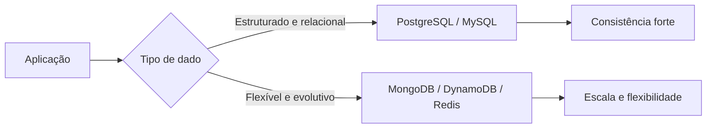

# SQL vs NoSQL

## 1. O que é

SQL e NoSQL são duas famílias de modelos de persistência com pressupostos diferentes. Bancos SQL, como PostgreSQL e MySQL, organizam dados em tabelas com esquema rígido e usam SQL para consultas relacionais e transações ACID. Bancos NoSQL, como MongoDB, Cassandra, Redis e DynamoDB, priorizam flexibilidade de schema, escalabilidade horizontal ou modelos de acesso específicos, em vez de um modelo relacional único.

Na prática, o termo "NoSQL" não significa "sem SQL" em todos os casos; ele descreve um conjunto de abordagens que se afastam do modelo relacional tradicional para atender requisitos diferentes de consistência, desempenho e evolução de schema.

## 2. Por que existe (o problema que resolve)

O modelo relacional dominou por décadas porque resolve muito bem integridade e consistência para dados estruturados e inter-relacionados. No entanto, ao crescer em escala, sistemas distribuídos começaram a encontrar limitações: joins caros, esquema rígido, dificuldades para escalar verticalmente e necessidade de modelos de dados que acompanhem mutações rápidas. Isso motivou o surgimento de alternativas orientadas a performance, disponibilidade e flexibilidade.

A origem histórica está ligada ao movimento de sistemas web de alto volume nas décadas de 2000 e 2010, especialmente em empresas como Google, Amazon, Facebook e LinkedIn, que precisavam de soluções diferentes para dados de sessão, logs, recomendação e cache.

## 3. Como funciona

A diferença central está no modelo de dados e no contrato de consistência.

- Bancos SQL trabalham com tabelas, colunas, chaves primárias, chaves estrangeiras e joins. Eles são excelentes para dados que exigem integridade referencial e transações atômicas.
- Bancos NoSQL adotam modelos como documento, chave-valor, coluna ampla, grafo ou stream. Cada um otimiza um tipo específico de acesso.

Em um sistema SQL tradicional, o banco assume o papel de repositório central com regras de integridade. Em NoSQL, a aplicação muitas vezes assume mais responsabilidade na modelagem e na consistência, principalmente quando o sistema é distribuído.

## 4. Casos de uso reais

- Sistemas financeiros transacionais: contas, contratos, parcelas, saldos e auditoria costumam ficar melhor em SQL, por causa de integridade e ACID.
- Catálogos e perfis flexíveis: produtos com atributos diferentes, preferências e documentos variáveis se encaixam melhor em documentos.
- Cache e sessões: Redis é quase padrão para chave-valor e baixa latência.
- Logs, métricas e eventos: bancos de séries temporais ou busca full-text são melhores que um modelo relacional puro.

Não usar NoSQL como resposta automática. Se o problema exige joins complexos, forte consistência e consultas transacionais rígidas, um banco relacional costuma ser a escolha mais segura.

## 5. Cenários práticos e trade-offs

- Cenário 1: um sistema de crédito precisa registrar contratos, parcelas e pagamentos. SQL oferece consistência forte e reduz risco de divergência contábil.
- Cenário 2: uma plataforma de onboarding com perfis diferentes por produto e canal muda o schema com frequência. Um banco documental evita colunas nulas e migrações agressivas.
- Cenário 3: falha de uma réplica ou de um nó de um cluster. NoSQL distribuído pode continuar operando, mas a consistência pode ser eventual.

Trade-offs:

- SQL: maior consistência, mas maior rigidez e custo de escala horizontal.
- NoSQL: mais flexibilidade e escala, mas menor suporte a transações complexas e maior responsabilidade de modelagem.

## 6. Diagrama e fluxo visual



Prompt de imagem:
"A conceptual architectural illustration comparing a relational database and a NoSQL database, with a client application choosing between structured tables and flexible documents, clean modern style, blue and green colors, minimalistic technical design."

## 7. Exemplo aplicado — Java + Spring

```java
import org.springframework.data.annotation.Id;
import org.springframework.data.relational.core.mapping.Table;
import org.springframework.data.repository.CrudRepository;
import org.springframework.stereotype.Service;

@Table("contratos")
record Contrato(@Id Long id, String clienteId, String status, java.math.BigDecimal valor) {}

interface ContratoRepository extends CrudRepository<Contrato, Long> {}

@Service
class ContratoService {
    private final ContratoRepository repository;

    ContratoService(ContratoRepository repository) {
        this.repository = repository;
    }

    public Contrato aprovar(Long id) {
        Contrato contrato = repository.findById(id).orElseThrow();
        contrato = new Contrato(contrato.id(), contrato.clienteId(), "APROVADO", contrato.valor());
        return repository.save(contrato);
    }
}
```

Pontos-chave: o modelo relacional é ideal quando você precisa de integridade forte e consultas transacionais sobre dados bem definidos.

## 8. Exemplo aplicado — TypeScript + NestJS

```ts
import { Injectable } from '@nestjs/common';
import { InjectRepository } from '@nestjs/typeorm';
import { Repository } from 'typeorm';
import { Entity, PrimaryGeneratedColumn, Column } from 'typeorm';

@Entity()
class Contrato {
  @PrimaryGeneratedColumn()
  id: number;

  @Column()
  clienteId: string;

  @Column()
  status: string;

  @Column('decimal')
  valor: number;
}

@Injectable()
class ContratoService {
  constructor(
    @InjectRepository(Contrato)
    private readonly repo: Repository<Contrato>,
  ) {}

  async aprovar(id: number): Promise<Contrato> {
    const contrato = await this.repo.findOneByOrFail({ id });
    contrato.status = 'APROVADO';
    return this.repo.save(contrato);
  }
}
```

Pontos-chave: o exemplo mostra como o modelo relacional continua sendo a base certa para transações financeiras e regras de negócio robustas.

## 9. Comparação e armadilhas comuns

Compare com bancos orientados a documentos e chave-valor. A armadilha mais comum é escolher NoSQL por "escalar melhor" sem analisar se o sistema precisa de joins, transações ou consistência forte.

Erros comuns:

- Usar NoSQL para dados que precisam de integridade referencial forte.
- Ignorar a complexidade de modelagem no lado da aplicação.
- Achar que NoSQL resolve tudo por ser "mais moderno".

## 10. Perguntas para fixação

1. Quais requisitos normalmente empurram um sistema para um modelo relacional em vez de um modelo documental?
2. Como o trade-off entre consistência e flexibilidade muda conforme a escala do sistema?
3. Quando um sistema híbrido faz mais sentido do que escolher apenas uma família de banco?
