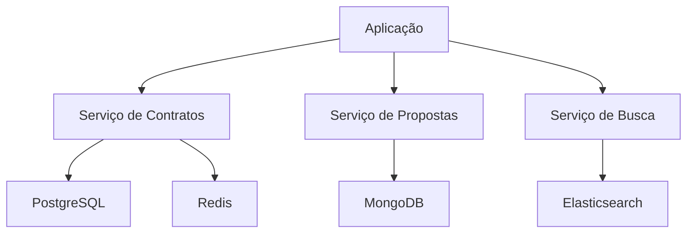

# Persistência poliglota

## 1. O que é

Persistência poliglota é a estratégia de usar mais de um tipo de banco de dados dentro do mesmo sistema, escolhendo cada tecnologia de acordo com o modelo de dados e o padrão de acesso. Também é conhecida como polyglot persistence ou multi-model persistence, embora o termo mais comum na indústria seja "persistência poliglota". O conceito é simples: não existe um banco universal que seja ótimo para tudo.

Essa abordagem é particularmente útil em arquiteturas orientadas a domínios, onde diferentes partes do sistema têm necessidades muito diferentes de consistência, latência e flexibilidade de schema.

## 2. Por que existe (o problema que resolve)

A ideia nasceu da necessidade de fugir do monobanco relacional quando o volume, a diversidade de dados e a complexidade operacional cresceram. Em sistemas de grande porte, um único banco relacional passou a ser um gargalo para dados como cache, eventos, buscas e métricas. A solução não era apenas "mais hardware", mas escolher tecnologias específicas para cada caso.

Esse padrão ganhou força com grandes plataformas de internet, como Amazon, Google e Netflix, que precisavam combinar bancos relacionais com sistemas distribuídos de chave-valor, documentos, busca e streams.

## 3. Como funciona

A arquitetura funciona por especialização. O sistema identifica grupos de dados e decide qual tipo de persistência melhor serve a cada um deles.

Componentes típicos:

- Banco relacional para o núcleo transacional.
- Banco documental para dados heterogêneos ou evolutivos.
- Cache em Redis para leituras de alta velocidade.
- Motor de busca para consultas full-text.
- Pipeline de eventos para integração entre contextos.

O fluxo é geralmente assim: a aplicação grava no repositório mais adequado para cada caso e integra os resultados por serviço ou por camada de aplicação, em vez de tentar encaixar tudo em um único modelo.

## 4. Casos de uso reais

- Sistemas financeiros: contratos, pagamentos e saldos em SQL; cache de score em Redis.
- Plataformas de e-commerce: catálogo em documento; pedidos e estoque em relacional.
- Sistemas de busca: logs e documentos em Elasticsearch/OpenSearch.
- Sistemas de recomendação e fraud detection: grafos para relacionamentos complexos.

Não usar quando a complexidade operacional supera o ganho. Em times pequenos e domínios simples, manter um único banco costuma ser mais produtivo.

## 5. Cenários práticos e trade-offs

- Cenário 1: um serviço de análise de crédito usa PostgreSQL para contratos e MongoDB para propostas com schema mutável.
- Cenário 2: uma falha de rede entre serviços faz uma consulta de leitura depender de um cache antigo; o sistema precisa lidar com staleness.
- Cenário 3: um novo recurso exige uma view muito diferente de consulta; a equipe cria um read model separado em Elasticsearch.

Trade-offs:

- Maior flexibilidade, mas mais complexidade operacional.
- Menos acoplamento entre modelos, mas maior esforço de integração.
- Melhor performance local, mas maior custo de observabilidade e governança.

## 6. Diagrama e fluxo visual



Prompt de imagem:
"A modern system design illustration showing a single application using multiple databases: PostgreSQL for transactions, MongoDB for flexible documents, Redis for cache, and Elasticsearch for search, connected by clean arrows, microservices architecture, technical style."

## 7. Exemplo aplicado — Java + Spring

```java
@Service
public class CreditProposalService {
    private final ProposalRepository proposalRepository;
    private final ContractRepository contractRepository;
    private final RedisTemplate<String, String> redisTemplate;

    public CreditProposalService(ProposalRepository proposalRepository,
                                 ContractRepository contractRepository,
                                 RedisTemplate<String, String> redisTemplate) {
        this.proposalRepository = proposalRepository;
        this.contractRepository = contractRepository;
        this.redisTemplate = redisTemplate;
    }

    public Proposal createProposal(Proposal proposal) {
        Proposal saved = proposalRepository.save(proposal);
        contractRepository.save(new Contract(saved.getCustomerId(), "EM_ANALISE"));
        redisTemplate.opsForValue().set("proposal:" + saved.getId(), saved.getId());
        return saved;
    }
}
```

Pontos-chave: o serviço usa diferentes repositórios para atender necessidades diferentes de armazenamento, em vez de empurrar tudo para um único modelo.

## 8. Exemplo aplicado — TypeScript + NestJS

```ts
@Injectable()
export class ProposalService {
  constructor(
    private readonly proposalRepo: ProposalRepository,
    private readonly contractRepo: ContractRepository,
    private readonly cacheService: CacheService,
  ) {}

  async createProposal(dto: CreateProposalDto) {
    const proposal = await this.proposalRepo.create(dto);
    await this.contractRepo.create({ customerId: dto.customerId, status: 'EM_ANALISE' });
    await this.cacheService.set(`proposal:${proposal.id}`, proposal.id);
    return proposal;
  }
}
```

Pontos-chave: o padrão é aplicado de forma explícita na camada de serviço, deixando claro que cada subsistema possui uma persistência especializada.

## 9. Comparação e armadilhas comuns

Compare com um modelo monolítico de banco único. A armadilha mais comum é pensar que persistência poliglota é "usar muitos bancos" sem uma razão de arquitetura clara.

Erros comuns:

- Adotar múltiplos bancos sem critérios claros de separação.
- Criar inconsistências entre contextos sem um plano de integração.
- Exagerar na complexidade operacional para problemas simples.

## 10. Perguntas para fixação

1. Qual é a diferença entre persistência poliglota e simplesmente usar vários bancos por hábito?
2. Como a separação por bounded context influencia a decisão de tecnologia de persistência?
3. Quais sinais mostram que um sistema está se tornando muito complexo por excesso de heterogeneidade de dados?
