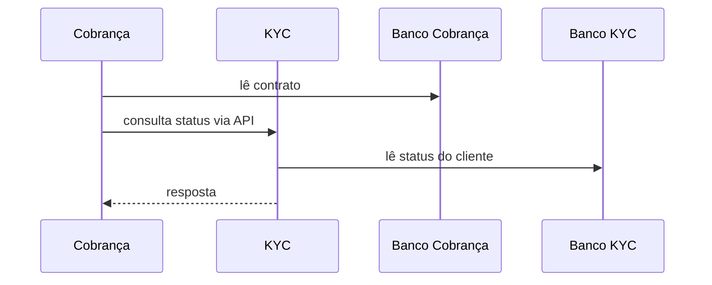

# Database-per-service vs shared database

## 1. O que é

Database-per-service é um padrão arquitetural em que cada microsserviço possui seu próprio banco de dados, acessado exclusivamente por ele. Shared database, por outro lado, é quando vários serviços compartilham o mesmo banco e, muitas vezes, o mesmo schema. O primeiro reforça encapsulamento; o segundo favorece conveniência operacional.

Em termos práticos, o debate não é entre "um banco" e "vários bancos", mas entre isolamento de contexto e compartilhamento implícito de dados.

## 2. Por que existe (o problema que resolve)

O padrão surgiu como resposta à fragilidade de compartilhamento de schema entre serviços independentes. Quando vários times escrevem na mesma base, qualquer mudança estrutural vira um risco de impacto cruzado. A ideia central é preservar o princípio de bounded context: cada serviço controla seu próprio modelo de dados.

Esse modelo se popularizou com a adoção de microsserviços em empresas como Netflix, Amazon e Uber, onde a autonomia de times e a redução de acoplamento se tornaram estratégicas.

## 3. Como funciona

No modelo database-per-service:

- Cada serviço tem um banco próprio ou um schema isolado.
- Nenhum outro serviço faz leitura direta do banco.
- A integração entre serviços acontece via API, eventos ou filas.

No modelo shared database:

- Um mesmo banco é usado por vários serviços.
- Há acoplamento implícito por schema e por lógica SQL.
- Alterações em uma tabela podem impactar vários serviços.

A decisão geralmente reflete o grau de autonomia desejado entre equipes e a maturidade da arquitetura.

## 4. Casos de uso reais

- Microsserviços de cobrança, KYC e onboarding: banco próprio por serviço.
- Monólitos em migração gradual: shared database como fase intermediária.
- Sistemas legados com evolução controlada: shared database por necessidade de compatibilidade.

Não usar database-per-service quando o custo operacional e a complexidade de integração forem maiores do que os benefícios. Em um sistema pequeno, um banco compartilhado pode ser suficiente.

## 5. Cenários práticos e trade-offs

- Cenário 1: uma mudança no modelo de cobrança não deve impactar o serviço de KYC; database-per-service preserva isso.
- Cenário 2: durante uma migração de monólito para microsserviços, a equipe mantém um banco compartilhado temporariamente.
- Cenário 3: uma consulta cruzada de dados entre serviços exige composição por API ou eventos, aumentando a latência.

Trade-offs:

- Database-per-service: mais autonomia e isolamento, mas mais complexidade de integração.
- Shared database: mais simples na fase inicial, mas mais acoplamento e risco de quebra.

## 6. Diagrama e fluxo visual



Prompt de imagem:
"An architecture diagram comparing a shared database among multiple services versus each service owning its own database, with clear boundaries, APIs between services, technical illustration."

## 7. Exemplo aplicado — Java + Spring

```java
@Service
public class CobrancaService {
    private final ContratoRepository contratoRepository;
    private final KycClient kycClient;

    public CobrancaService(ContratoRepository contratoRepository, KycClient kycClient) {
        this.contratoRepository = contratoRepository;
        this.kycClient = kycClient;
    }

    public boolean podeIniciarCobranca(String clienteId) {
        Contrato contrato = contratoRepository.findByClienteId(clienteId);
        KycStatusResponse kyc = kycClient.buscarStatus(clienteId);
        return contrato.isAtivo() && kyc.isAprovado();
    }
}
```

Pontos-chave: a lógica depende de uma chamada explícita entre serviços, em vez de um join escondido no banco.

## 8. Exemplo aplicado — TypeScript + NestJS

```ts
@Injectable()
export class BillingService {
  constructor(
    private readonly contratoRepo: ContratoRepository,
    private readonly kycClient: KycClient,
  ) {}

  async podeIniciarCobranca(clienteId: string): Promise<boolean> {
    const contrato = await this.contratoRepo.findByClienteId(clienteId);
    const kyc = await this.kycClient.buscarStatus(clienteId);
    return contrato.ativo && kyc.aprovado;
  }
}
```

Pontos-chave: a integração é feita por interface de serviço, o que deixa explícito o limite entre os contextos.

## 9. Comparação e armadilhas comuns

Compare com um monólito tradicional, onde um banco compartilhado é quase inevitável. A principal armadilha é achar que "microsserviço" significa simplesmente separar serviços mas continuar fazendo joins entre bases.

Erros comuns:

- Criar serviços sem autonomia de dados.
- Fazer consultas cross-database sem estratégia clara de consistência.
- Tratar shared database como arquitetura final em vez de etapa de transição.

## 10. Perguntas para fixação

1. Por que database-per-service reduz o acoplamento entre times?
2. Em que situações shared database ainda faz sentido?
3. Quais mecanismos substituem joins entre bancos diferentes na arquitetura distribuída?
