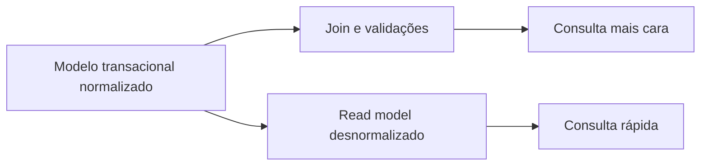

# Normalização e desnormalização

## 1. O que é

Normalização é o processo de organizar os dados para eliminar redundância e reduzir anomalias, de modo que cada fato seja representado em um único lugar e relações sejam expressas por chaves. Desnormalização é o processo inverso: deliberadamente duplicar dados para melhorar o desempenho de leitura, aceitando maior complexidade de escrita e sincronização. Em termos simples, normalizar prioriza integridade; desnormalizar prioriza velocidade de leitura.

No mercado, esses termos são usados com frequência em bancos relacionais, mas o mesmo raciocínio se aplica a modelos de leitura, views materializadas e caches.

## 2. Por que existe (o problema que resolve)

A normalização surgiu para tratar problemas clássicos de redundância: inconsistência de dados, atualizações parciais e dificuldade de manutenção. O modelo relacional, com suas formas normais, resolveu isso de forma elegante. Porém, em sistemas de alta leitura, a estrutura normalizada costuma exigir muitos joins e maior custo de acesso.

A desnormalização existe justamente para quebrar esse trade-off, especialmente em cenários como dashboards, extratos, painéis e endpoints muito acessados.

## 3. Como funciona

Na normalização:

- cada entidade recebe seu próprio conjunto de dados;
- relações são representadas por chaves estrangeiras;
- a atualização de um dado é feita em um único ponto.

Na desnormalização:

- uma informação é copiada para outra tabela, documento ou view;
- a leitura fica mais simples e barata;
- a escrita exige atualização em múltiplos lugares ou sincronização assíncrona.

A regra prática é: manter o modelo transacional normalizado e construir read models desnormalizados quando a leitura justificar.

## 4. Casos de uso reais

- Sistemas bancários: dados contábeis e transacionais em modelo normalizado.
- Extratos e painéis: modelos desnormalizados para consultas frequentes.
- E-commerce: catálogo e histórico de pedidos com views otimizadas.

Não usar desnormalização de forma indiscriminada. Se o volume de leitura não justificar, a complexidade adicional pode ser um custo ruim.

## 5. Cenários práticos e trade-offs

- Cenário 1: um extrato de cliente com nome, contrato e parcelas. O modelo normalizado exige vários joins; o desnormalizado resolve em uma única leitura.
- Cenário 2: um serviço de cobrança atualiza o status do cliente; se a view desnormalizada não for atualizada, a leitura pode ficar stale.
- Cenário 3: uma falha no processo de sincronização pode deixar dados divergentes entre o write model e o read model.

Trade-offs:

- Normalização: mais consistência e menos redundância, mas mais joins e mais custo de leitura.
- Desnormalização: leitura mais rápida, mas maior risco de inconsistência e maior custo de manutenção.

## 6. Diagrama e fluxo visual



Prompt de imagem:
"A conceptual diagram illustrating normalized transactional data versus a denormalized read model, with duplicate fields intentionally stored for quick access, clean system design style."

## 7. Exemplo aplicado — Java + Spring

```java
@Entity
@Table(name = "extrato_cliente_view")
public class ExtratoClienteView {
    @Id
    private String parcelaId;
    private String clienteId;
    private String clienteNome;
    private String clienteCpf;
    private BigDecimal valorContrato;
    private BigDecimal valorParcela;
    private String statusParcela;
}

@Repository
public interface ExtratoClienteViewRepository extends JpaRepository<ExtratoClienteView, String> {
    List<ExtratoClienteView> findByClienteIdOrderByVencimento(String clienteId);
}
```

Pontos-chave: o modelo de leitura é achatado para evitar joins caros e entregar uma resposta pronta para o consumidor.

## 8. Exemplo aplicado — TypeScript + NestJS

```ts
@Entity()
export class ExtratoClienteView {
  @PrimaryGeneratedColumn('uuid')
  parcelaId: string;

  @Column()
  clienteId: string;

  @Column()
  clienteNome: string;

  @Column()
  statusParcela: string;
}

@Injectable()
export class ExtratoService {
  constructor(private readonly repo: Repository<ExtratoClienteView>) {}

  async buscarExtrato(clienteId: string) {
    return this.repo.find({ where: { clienteId } });
  }
}
```

Pontos-chave: o read model é tratado como estrutura de consulta e não como fonte de verdade operacional.

## 9. Comparação e armadilhas comuns

Compare com modelos totalmente normalizados. A armadilha mais comum é desnormalizar sem medir o impacto real na leitura e sem um plano para sincronização.

Erros comuns:

- Duplicar dados sem necessidade.
- Ignorar o custo de manter a sincronização atualizada.
- Misturar write model e read model sem separar responsabilidades.

## 10. Perguntas para fixação

1. Quando a normalização deixa de ser a melhor escolha?
2. Quais problemas a desnormalização tenta resolver?
3. Como um sistema pode combinar normalização e desnormalização sem perder consistência?
