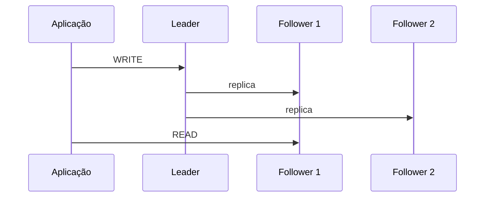

# Replicação leader-follower

## 1. O que é
Replicação leader-follower é um padrão em que uma instância primária, chamada leader, recebe todas as escritas e replica os dados para uma ou mais instâncias secundárias, chamadas followers. O objetivo é aumentar a disponibilidade, oferecer leitura distribuída e proteger o sistema contra falhas de uma instância. Também é conhecida como replication master-slave, embora o termo moderno mais comum seja leader-follower.

## 2. Por que existe (o problema que resolve)
Esse padrão surgiu para resolver o problema de disponibilidade e escala de leitura. Quando um único banco passa a receber muitas leituras, ele vira gargalo. A replicação permite distribuir a carga de leitura para réplicas e manter um backup operacional do estado do banco.

Historicamente, esse padrão foi amplamente adotado em bancos relacionais e sistemas distribuídos desde os anos 1990 e 2000, especialmente em ambientes de alta disponibilidade.

## 3. Como funciona
O fluxo normalmente é:
1. A aplicação escreve no leader.
2. O leader grava os dados localmente e registra a alteração em seu log de reprodução.
3. Os followers leem esse log e aplicam as mudanças em suas cópias.
4. Leituras podem ser feitas no leader ou em followers, dependendo da consistência desejada.

O principal desafio é a consistência entre cópias. Se uma leitura for feita em um follower logo após a escrita no leader, pode retornar um valor antigo.

## 4. Casos de uso reais
- Bancos de dados transacionais com alto volume de leitura.
- Sistemas de e-commerce com catálogos e histórico de pedidos.
- Aplicações que precisam de failover rápido sem interrupção completa.

Não usar quando o sistema exige consistência imediata em todas as cópias para cada leitura. Nesse caso, o modelo pode ser inadequado.

## 5. Cenários práticos e trade-offs
- Cenário 1: um site com milhões de leitores por dia usa followers para reduzir carga no leader.
- Cenário 2: durante uma falha do leader, um follower é promovido. Há um pequeno intervalo em que escritas podem ficar indisponíveis.
- Cenário 3: uma leitura em follower pode retornar dados slightly stale.

Trade-offs:
- Melhor disponibilidade e escala de leitura, mas mais complexidade de consistência.
- Menor carga no leader, mas maior latência em alguns cenários de leitura.

## 6. Diagrama e fluxo visual


Prompt de imagem:
"A clean system design illustration of a database replication topology with one leader and multiple followers, arrows showing writes to the leader and reads to followers, modern technical style."

## 7. Exemplo aplicado — Java + Spring
```java
@Service
public class PaymentService {
    private final PaymentRepository paymentRepository;

    public PaymentService(PaymentRepository paymentRepository) {
        this.paymentRepository = paymentRepository;
    }

    @Transactional
    public Payment create(Payment payment) {
        return paymentRepository.save(payment);
    }
}
```

Pontos-chave: a aplicação escreve no banco primário e depende da infraestrutura de replicação para propagar a mudança.

## 8. Exemplo aplicado — TypeScript + NestJS
```ts
@Injectable()
export class PaymentService {
  constructor(private readonly repo: Repository<Payment>) {}

  async create(payment: Payment) {
    return this.repo.save(payment);
  }
}
```

Pontos-chave: o código não precisa saber se a escrita foi replicada; essa responsabilidade fica na camada de banco.

## 9. Comparação e armadilhas comuns
Compare com replicação multi-leader e sharding. A armadilha mais comum é assumir que todas as réplicas são imediatamente consistentes.

Erros comuns:
- Ler de replicas sem entender o modelo de consistência.
- Ignorar o tempo de failover.
- Não testar cenários de split-brain ou lag de replicação.

## 10. Perguntas para fixação
1. Qual é o papel do leader em uma topologia leader-follower?
2. Por que leituras em followers podem retornar dados antigos?
3. Como esse padrão se diferencia de um modelo multi-leader?
