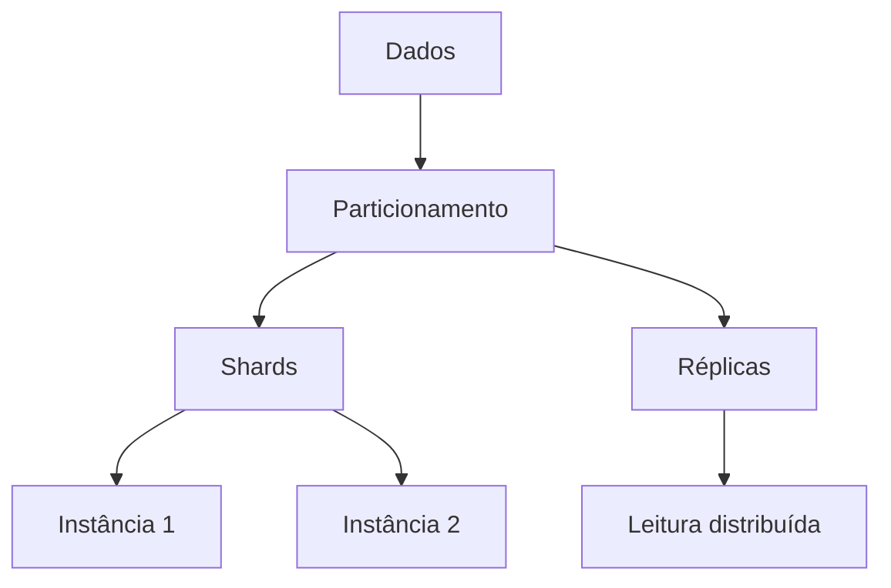

# Particionamento vs sharding vs replicação

## 1. O que é

Particionamento, sharding e replicação são estratégias para distribuir dados e carga, mas com objetivos diferentes. Particionamento é a divisão lógica ou física de dados em partes menores. Sharding é uma forma de particionamento horizontal em que cada partição é armazenada em uma instância separada. Replicação é a cópia dos dados para múltiplas instâncias para melhorar disponibilidade e leitura. Muitas pessoas usam esses termos de forma confusa, mas eles não são sinônimos.

## 2. Por que existe (o problema que resolve)

Essas técnicas surgem porque um único banco não escala bem indefinidamente. O problema é sempre o mesmo: volume, throughput, latência e disponibilidade. Particionar e replicar permitem contornar limites de CPU, disco, memória e rede.

## 3. Como funciona

- Particionamento: divide dados em pedaços, que podem ser verticais ou horizontais.
- Sharding: particiona horizontalmente, geralmente por chave como clienteId, e distribui os shards entre nós.
- Replicação: cria cópias dos dados em múltiplos nós para leitura distribuída e tolerância a falhas.

Em sistemas reais, essas técnicas são frequentemente combinadas.

## 4. Casos de uso reais

- Bancos de dados com milhões de clientes e alta carga de leitura.
- Serviços de logs, analytics e caches distribuídos.
- Sistemas que precisam de alta disponibilidade e resiliência.

Não usar sharding quando o volume não justifica a complexidade. Particionamento simples muitas vezes é mais barato.

## 5. Cenários práticos e trade-offs

- Cenário 1: um banco relacional com forte volume de dados é particionado por faixa de datas.
- Cenário 2: um serviço de clientes é sharded por customerId para distribuir carga.
- Cenário 3: uma réplica fica atrasada e uma leitura retorna estado antigo.

Trade-offs:

- Replicação melhora disponibilidade, mas pode introduzir staleness.
- Sharding melhora escala, mas complicates queries cross-shard.

## 6. Diagrama e fluxo visual



Prompt de imagem:
"A conceptual architecture diagram distinguishing partitioning, sharding, and replication with labels and arrows, technical style."

## 7. Exemplo aplicado — Java + Spring

```java
@Service
public class CustomerService {
    public Customer findById(String customerId) {
        return repository.findById(customerId).orElseThrow();
    }
}
```

Pontos-chave: o código não precisa conhecer os detalhes de particionamento; a infraestrutura resolve o roteamento.

## 8. Exemplo aplicado — TypeScript + NestJS

```ts
@Injectable()
export class CustomerService {
  async findById(customerId: string) {
    return this.repo.findOne(customerId);
  }
}
```

Pontos-chave: o padrão é invisível na aplicação; o foco está na forma como o banco distribui o dado.

## 9. Comparação e armadilhas comuns

Compare com replicação multi-leader e particionamento vertical. A armadilha mais comum é assumir que sharding e particionamento são a mesma coisa.

Erros comuns:

- Usar sharding sem uma shard key bem pensada.
- Confiar em réplicas sem estratégia de consistência.
- Fazer queries cross-shard sem planejamento.

## 10. Perguntas para fixação

1. Qual é a diferença essencial entre particionamento e sharding?
2. Quando replicação é preferível a sharding?
3. Por que queries cross-shard costumam ser mais caras?
