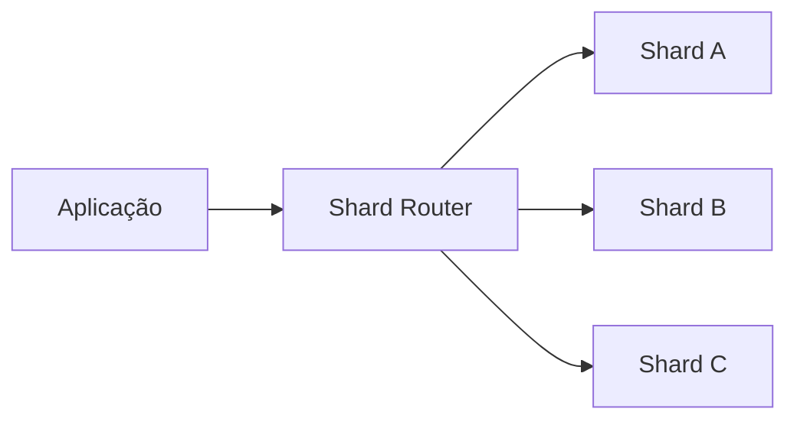

# Database sharding

## 1. O que é

Sharding é a técnica de dividir um conjunto de dados em múltiplas partições, chamadas shards, distribuídas entre diferentes instâncias ou servidores. Cada shard armazena uma parte do dado, normalmente com o mesmo schema, e a aplicação decide em qual shard uma chave deve cair. O conceito é um tipo de particionamento horizontal.

Também é chamado de horizontal partitioning e, em muitos contextos, de data partitioning.

## 2. Por que existe (o problema que resolve)

O sharding existe porque um único banco não escala indefinidamente. Ele atinge limites de CPU, IOPS, memória, tamanho de índice e conexões. Quando a carga de leitura e escrita cresce além do que uma instância consegue suportar, a solução é espalhar os dados.

Essa abordagem se tornou comum em sistemas de grande escala, como redes sociais, plataformas de e-commerce, sistemas de pagamentos e data platforms.

## 3. Como funciona

O componente central é a shard key, que determina em qual shard um registro será armazenado. Para uma operação por cliente, fazer o roteamento por customerId é extremamente natural.

Fluxo típico:

1. A aplicação calcula um hash ou escolhe uma chave de partição.
2. O roteador decide qual shard receberá a operação.
3. A consulta é enviada apenas para esse shard.
4. Em casos cross-shard, o sistema precisa fan-out para vários shards.

## 4. Casos de uso reais

- Bancos de clientes e contratos em larga escala.
- Sistemas com grande volume de transações por tenant ou por usuário.
- Dados de eventos e logs distribuídos.

Não usar quando a carga não justifica o custo operacional. Sharding torna o sistema mais complexo e pode aumentar o custo de operações e debugging.

## 5. Cenários práticos e trade-offs

- Cenário 1: um banco de clientes é distribuído por customerId; cada leitura de um cliente vai a um shard único.
- Cenário 2: uma consulta para todos os contratos aprovados hoje exige acesso a todos os shards.
- Cenário 3: um shard quente pode se tornar um gargalo se poucos clientes dominarem o volume.

Trade-offs:

- Escala horizontal, mas complexidade de roteamento e rebalancing.
- Queries locais são rápidas, mas queries globais ficam caras.

## 6. Diagrama e fluxo visual



Prompt de imagem:
"A technical illustration of database sharding where a request router sends data to multiple shards, each shard storing a subset of customer data, modern system design style."

## 7. Exemplo aplicado — Java + Spring

```java
@Component
public class ShardRouter {
    private final List<DataSource> shards;

    public ShardRouter(List<DataSource> shards) {
        this.shards = shards;
    }

    public DataSource resolve(String customerId) {
        int index = Math.floorMod(customerId.hashCode(), shards.size());
        return shards.get(index);
    }
}
```

Pontos-chave: o roteamento usa uma chave determinística para garantir que um cliente vá sempre ao mesmo shard.

## 8. Exemplo aplicado — TypeScript + NestJS

```ts
@Injectable()
export class ShardRouter {
  constructor(private readonly shards: DataSource[]) {}

  resolve(customerId: string): DataSource {
    const index = Math.abs(hash(customerId)) % this.shards.length;
    return this.shards[index];
  }
}
```

Pontos-chave: o roteamento é feito no lado da aplicação ou em uma camada intermediária, antes da consulta.

## 9. Comparação e armadilhas comuns

Compare com particionamento vertical e replicação. A armadilha mais comum é escolher uma shard key ruim, o que gera hot shards e desequilíbrio.

Erros comuns:

- Shardar por campo com baixa cardinalidade.
- Ignorar queries cross-shard.
- Não planejar rebalancing e expansão.

## 10. Perguntas para fixação

1. O que é uma shard key e por que ela é tão importante?
2. Quando sharding é preferível a uma única instância maior?
3. Que tipo de consulta se torna caro em um sistema sharded?
