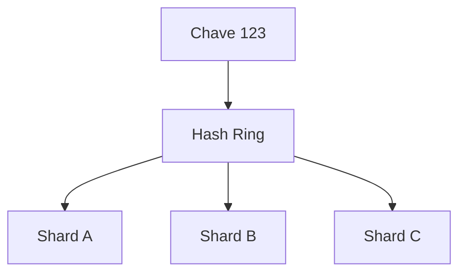

# Consistent hashing

## 1. O que é

Consistent hashing é uma técnica de distribuição de chaves em um anel circular de hashes, usada para minimizar o impacto de adicionar ou remover nós em um sistema distribuído. Em vez de redistribuir quase tudo quando a topologia muda, ele preserva a maior parte do mapeamento existente. Também é chamado de hash consistente.

## 2. Por que existe (o problema que resolve)

O problema clássico de hash simples com módulo $N$ é que qualquer mudança no número de nós muda quase todas as associações. Se você passa de 4 para 5 shards, a maioria das chaves muda de destino. Isso gera migração massiva de dados e alto custo operacional. O consistent hashing resolve esse problema com rebalanceamento parcial.

A técnica ficou popular em sistemas distribuídos como Cassandra, DynamoDB, Memcached e Kafka.

## 3. Como funciona

O algoritmo posiciona tanto os nós quanto as chaves em um espaço circular de hashes. Uma chave é atribuída ao primeiro nó encontrado no sentido horário a partir de sua posição.

Fluxo:

1. Cada shard recebe uma posição no anel.
2. Cada chave também recebe uma posição.
3. A chave é roteada para o próximo shard no sentido horário.
4. Ao adicionar ou remover um shard, apenas uma fração das chaves precisa ser redistribuída.

## 4. Casos de uso reais

- Sistemas de cache distribuído.
- Bancos distribuídos e sharded.
- Kafka, DynamoDB e Cassandra.

Não usar quando o número de nós é quase fixo e a complexidade do algoritmo não vale o ganho. Em sistemas pequenos, hashing simples pode ser suficiente.

## 5. Cenários práticos e trade-offs

- Cenário 1: adicionar um novo nó em um cluster de cache não obriga rehash de todas as chaves.
- Cenário 2: um nó falha e apenas uma parte das chaves precisa ser remapeada.
- Cenário 3: distribuição desigual pode acontecer se poucos nós forem usados; virtual nodes corrigem isso.

Trade-offs:

- Menor movimento de dados em rebalancing, mas implementação mais sofisticada.
- Melhor estabilidade operacional, mas distribuição pode ficar desigual sem virtual nodes.

## 6. Diagrama e fluxo visual



Prompt de imagem:
"A circular hash ring diagram showing keys mapped to shards with minimal remapping on node changes, modern technical illustration."

## 7. Exemplo aplicado — Java + Spring

```java
public class ConsistentHashRing {
    private final SortedMap<Long, String> ring = new TreeMap<>();

    public void addNode(String node) {
        ring.put(hash(node), node);
    }

    public String locate(String key) {
        long hash = hash(key);
        SortedMap<Long, String> tail = ring.tailMap(hash);
        return tail.isEmpty() ? ring.firstEntry().getValue() : tail.firstEntry().getValue();
    }

    private long hash(String value) {
        return value.hashCode();
    }
}
```

Pontos-chave: a chave é associada ao nó mais próximo no sentido horário, o que reduz o impacto de rebalanceamento.

## 8. Exemplo aplicado — TypeScript + NestJS

```ts
export class ConsistentHashRing {
  private ring = new Map<number, string>();

  addNode(node: string) {
    this.ring.set(this.hash(node), node);
  }

  locate(key: string) {
    const hash = this.hash(key);
    const entries = Array.from(this.ring.entries()).sort(([a], [b]) => a - b);
    const next = entries.find(([position]) => position >= hash);
    return next?.[1] ?? entries[0]?.[1];
  }

  private hash(value: string) {
    return Array.from(value).reduce((acc, ch) => acc + ch.charCodeAt(0), 0);
  }
}
```

Pontos-chave: o algoritmo é simples e suficientemente realista para explicar o conceito em uma implementação de prova de conceito.

## 9. Comparação e armadilhas comuns

Compare com hash simples por módulo. A principal armadilha é ignorar a distribuição desigual e não usar virtual nodes quando necessário.

Erros comuns:

- Implementar hash simples $\bmod N$ e achar que é suficiente.
- Não considerar nós com capacidade diferente.
- Ignorar como a função de hash afeta a distribuição.

## 10. Perguntas para fixação

1. Por que o hashing simples por módulo causa rebalanceamento massivo?
2. Como o anel circular reduz esse impacto?
3. O que são virtual nodes e qual problema eles resolvem?
