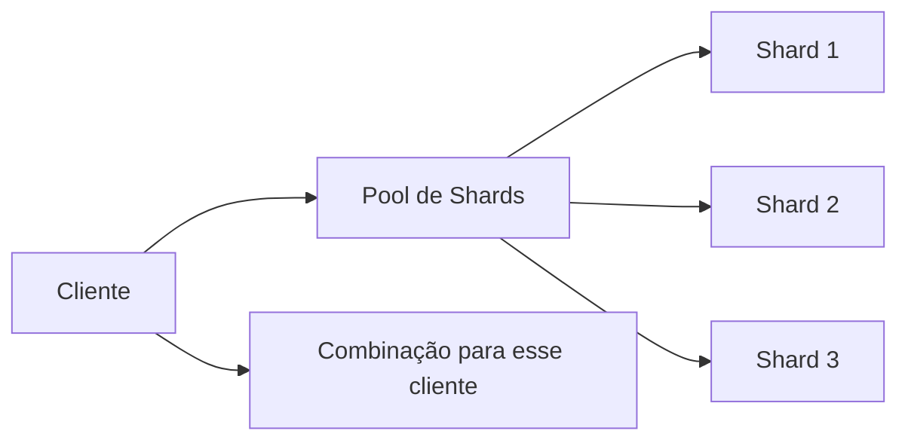

# Shuffle sharding

## 1. O que é
Shuffle sharding é uma técnica de isolamento de falhas em sistemas distribuídos em que cada cliente ou tenant é atribuído a um conjunto de múltiplos shards, em vez de um único shard. O nome vem do fato de que a atribuição é feita de forma distribuída e pseudo-aleatória, reduzindo o impacto de um shard problemático sobre o restante do sistema. Também é conhecido como sharding por combinação ou sharding de isolamento.

## 2. Por que existe (o problema que resolve)
Em sharding tradicional, um cliente ou tenant pode ficar preso a um shard específico. Se esse shard sofre degradação, ele afeta todos os clientes associados a ele. Esse efeito é conhecido como blast radius. O shuffle sharding existe para reduzir esse raio de impacto, isolando melhor clientes e cargas problemáticas.

A técnica ganhou notoriedade em plataformas de grande escala da AWS e de outros provedores de infraestrutura.

## 3. Como funciona
Em vez de alocar uma chave a um único shard, o sistema escolhe uma combinação de shards para essa chave. Por exemplo, cada tenant pode ser mapeado para dois shards de um pool maior. Se um shard falha, o cliente tem o fallback no outro shard da combinação, e o efeito de degradação fica restrito a uma fração menor do universo de clientes.

## 4. Casos de uso reais
- Multi-tenant systems com clientes grandes e com picos de uso.
- Serviços de API com isolamento de cargas por tenant.
- Infraestrutura de DNS e gateway em ambientes de grande escala.

Não usar quando o sistema é pequeno ou não sofre de problemas de blast radius significativos. A complexidade extra pode não valer a pena.

## 5. Cenários práticos e trade-offs
- Cenário 1: um parceiro institucional gera volume muito alto e degrada um shard; com shuffle sharding, o impacto é diluído.
- Cenário 2: um shard cai; o sistema usa o segundo shard da combinação e continua parcialmente disponível.
- Cenário 3: o custo operacional aumenta porque o roteamento precisa considerar mais de um shard por cliente.

Trade-offs:
- Melhor isolamento de falhas, mas maior complexidade de roteamento.
- Menor blast radius, mas mais custo de coordenação e failover.

## 6. Diagrama e fluxo visual


Prompt de imagem:
"A conceptual diagram for shuffle sharding showing one customer assigned to multiple shards in a pool, with failover paths and isolated blast radius, modern technical style."

## 7. Exemplo aplicado — Java + Spring
```java
public class ShuffleShardAssigner {
    private final List<String> pool;
    private final int shardsPerClient;

    public ShuffleShardAssigner(List<String> pool, int shardsPerClient) {
        this.pool = pool;
        this.shardsPerClient = shardsPerClient;
    }

    public List<String> assign(String clientId) {
        List<String> shuffled = new ArrayList<>(pool);
        Collections.shuffle(shuffled, new Random(clientId.hashCode()));
        return shuffled.subList(0, shardsPerClient);
    }
}
```

Pontos-chave: a atribuição é determinística e usa a identidade do cliente para construir a combinação de shards.

## 8. Exemplo aplicado — TypeScript + NestJS
```ts
export class ShuffleShardAssigner {
  constructor(
    private readonly pool: string[],
    private readonly shardsPerClient: number,
  ) {}

  assign(clientId: string): string[] {
    const shuffled = [...this.pool].sort(() => 0.5 - Math.random());
    return shuffled.slice(0, this.shardsPerClient);
  }
}
```

Pontos-chave: a ideia é a mesma, embora a implementação em TypeScript seja mais simplificada para fins didáticos.

## 9. Comparação e armadilhas comuns
Compare com consistent hashing. A armadilha é confundir isolamento de falha com rebalanceamento. O primeiro reduz blast radius; o segundo reduz movimento de dados.

Erros comuns:
- Aplicar shuffle sharding sem necessidade real de isolamento.
- Escolher combinações muito pequenas e perder efeito de proteção.
- Não tratar corretamente o failover entre os shards da combinação.

## 10. Perguntas para fixação
1. Qual problema do sharding tradicional o shuffle sharding tenta reduzir?
2. Como a combinação de shards melhora a tolerância a falhas?
3. Em que cenários essa técnica faz mais sentido do que um sharding simples?
