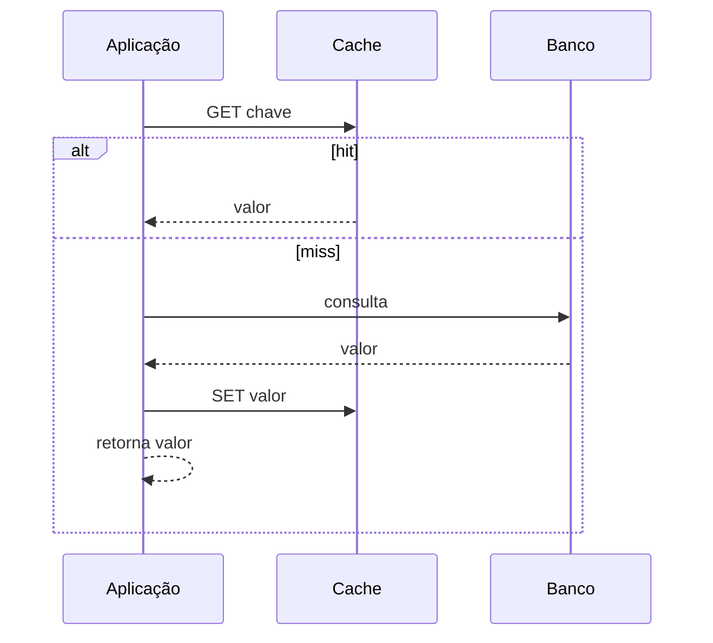

# Cache-aside

## 1. O que é
Cache-aside, também chamado de lazy loading, é um padrão em que a aplicação consulta o cache antes de buscar o banco. Se o item estiver no cache, ele é retornado imediatamente; se não estiver, a aplicação busca no banco, popula o cache e só então retorna o valor. Esse padrão é muito comum em sistemas com Redis, Memcached e outros armazenamentos em memória.

Também é conhecido como lazy cache loading e, em alguns contextos, read-through quando a camada de cache é transparente.

## 2. Por que existe (o problema que resolve)
O problema é a latência e a carga excessiva do banco de dados. Em sistemas com grande volume de leitura, consultar o banco para cada requisição pode se tornar caro. O cache reduz essa pressão e melhora a latência média.

Esse padrão se popularizou com a disseminação de caches distribuídos em aplicações web e APIs de alto tráfego.

## 3. Como funciona
O fluxo é simples:
1. A aplicação tenta ler a chave do cache.
2. Se houver um hit, retorna o valor.
3. Se houver um miss, busca no banco.
4. O valor é colocado no cache com um TTL.
5. Em caso de atualização, o cache é invalidado ou substituído.

O ponto mais importante é a estratégia de invalidação. Em geral, invalidar após a escrita é mais seguro do que atualizar o cache diretamente em uma operação concorrente.

## 4. Casos de uso reais
- Perfis de usuário e dados de catálogo.
- Consultas repetidas de score de crédito.
- Sessões, tokens e configurações.

Não usar para dados que mudam com muita frequência e exigem leitura sempre fresca, como saldo em tempo real de uma conta durante uma transação crítica.

## 5. Cenários práticos e trade-offs
- Cenário 1: um endpoint de consulta de cliente recebe milhares de requisições; o cache reduz o número de acessos ao banco.
- Cenário 2: a chave expira e várias requisições simultâneas batem no banco ao mesmo tempo — problema conhecido como cache stampede.
- Cenário 3: um dado muda e o cache continua antigo até a invalidação, gerando staleness.

Trade-offs:
- Menor latência, mas maior complexidade de invalidation.
- Menos carga no banco, mas risco de dados desatualizados.

## 6. Diagrama e fluxo visual


Prompt de imagem:
"A sequence diagram of cache-aside pattern showing application checking cache first, then database on miss, and updating cache, modern technical illustration."

## 7. Exemplo aplicado — Java + Spring
```java
@Service
public class CustomerService {
    private final CustomerRepository repository;
    private final RedisTemplate<String, Customer> redis;

    public CustomerService(CustomerRepository repository, RedisTemplate<String, Customer> redis) {
        this.repository = repository;
        this.redis = redis;
    }

    public Customer findById(String id) {
        String key = "customer:" + id;
        Customer cached = redis.opsForValue().get(key);
        if (cached != null) {
            return cached;
        }

        Customer customer = repository.findById(id).orElseThrow();
        redis.opsForValue().set(key, customer, Duration.ofMinutes(10));
        return customer;
    }
}
```

Pontos-chave: a aplicação faz o controle explícito de leitura e escrita de cache.

## 8. Exemplo aplicado — TypeScript + NestJS
```ts
@Injectable()
export class CustomerService {
  constructor(
    private readonly repo: CustomerRepository,
    private readonly cache: CacheService,
  ) {}

  async findById(id: string) {
    const key = `customer:${id}`;
    const cached = await this.cache.get<Customer>(key);
    if (cached) return cached;

    const customer = await this.repo.findById(id);
    await this.cache.set(key, customer, 600);
    return customer;
  }
}
```

Pontos-chave: o padrão é simples e eficaz em aplicações que fazem leituras repetidas de dados estáveis.

## 9. Comparação e armadilhas comuns
Compare com write-through e read-through. A armadilha mais comum é tratar o cache como fonte de verdade, o que não é verdade em cache-aside.

Erros comuns:
- Não invalidar o cache em escrita.
- Ignorar cache stampede e cache avalanche.
- Achar que o cache sempre terá dados frescos.

## 10. Perguntas para fixação
1. O que acontece em um cache miss?
2. Como o padrão lida com escritas?
3. Quais problemas podem ocorrer quando muitas requisições encontram um miss ao mesmo tempo?
