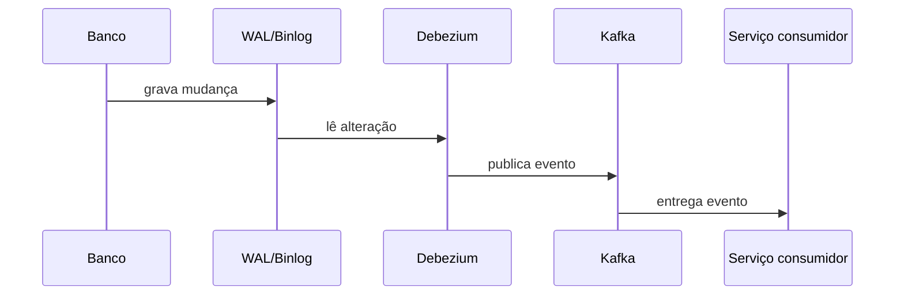

# Change Data Capture (CDC)

## 1. O que é
Change Data Capture, ou CDC, é o processo de observar mudanças no banco de dados e transformá-las em eventos que podem ser consumidos por outros sistemas. Em vez de depender da aplicação para publicar eventos manualmente, o CDC lê as mudanças diretamente do log de transações do banco. Também é conhecido como database event streaming.

## 2. Por que existe (o problema que resolve)
O problema é o risco de inconsistência entre o estado do banco e os eventos publicados para outras partes do sistema. Se uma mudança for feita diretamente no banco — por migração, correção manual ou hotfix — uma aplicação que dependa de eventos explícitos pode não saber disso. O CDC resolve esse problema observando o próprio log de alteração do banco.

Ferramentas como Debezium popularizaram esse padrão, especialmente em arquiteturas que usam Kafka e microserviços.

## 3. Como funciona
O fluxo é geralmente:
1. O banco grava a alteração em seu log de transações.
2. Um conector CDC lê esse log.
3. O conector transforma a mudança em um evento estruturado.
4. O evento é publicado em um broker, como Kafka.

O componente mais importante é o log de transações do banco, como o WAL do PostgreSQL ou o binlog do MySQL.

## 4. Casos de uso reais
- Sincronização entre serviços.
- Atualização de read models e materialized views.
- Auditoria e analytics em tempo real.

Não usar quando os dados não precisam ser propagados ou quando você quer um contrato de evento explícito e controlado pela aplicação. Nesse caso, transactional outbox pode ser mais adequado.

## 5. Cenários práticos e trade-offs
- Cenário 1: um contrato é aprovado no banco e um downstream é notificado sem código explícito de publicação.
- Cenário 2: um desenvolvedor realiza um update direto em uma tabela e o CDC captura isso automaticamente.
- Cenário 3: um consumidor depende do schema físico da tabela e quebra quando uma coluna é renomeada.

Trade-offs:
- Menos risco de esquecer eventos, mas mais acoplamento ao schema do banco.
- Boa observabilidade, mas maior complexidade operacional de streaming e transformação.

## 6. Diagrama e fluxo visual


Prompt de imagem:
"A technical diagram showing a database transaction log feeding a CDC connector that publishes events to Kafka for downstream services."

## 7. Exemplo aplicado — Java + Spring
```java
@Component
public class CustomerChangeListener {
    @KafkaListener(topics = "customer-changes")
    public void onMessage(String payload) {
        System.out.println("Evento CDC recebido: " + payload);
    }
}
```

Pontos-chave: a aplicação consome eventos produzidos a partir das mudanças do banco, sem depender de publicação manual no fluxo principal.

## 8. Exemplo aplicado — TypeScript + NestJS
```ts
@Injectable()
export class CustomerChangeConsumer {
  @EventPattern('customer-changes')
  handle(payload: string) {
    console.log('Evento CDC recebido:', payload);
  }
}
```

Pontos-chave: o componente atua como consumidor de eventos e não precisa conhecer detalhes de como a mudança foi capturada.

## 9. Comparação e armadilhas comuns
Compare com transactional outbox. A principal armadilha é confundir captura de mudança com publicação de domínio; o CDC é observacional, enquanto outbox é explícito.

Erros comuns:
- Acoplar consumidores ao schema físico da tabela.
- Ignorar a necessidade de transformação de eventos.
- Não planejar backpressure e recuperação de falhas.

## 10. Perguntas para fixação
1. Como o CDC evita que eventos sejam esquecidos?
2. Qual é a diferença entre CDC e transactional outbox?
3. Por que o schema físico do banco pode se tornar um problema para consumidores?
