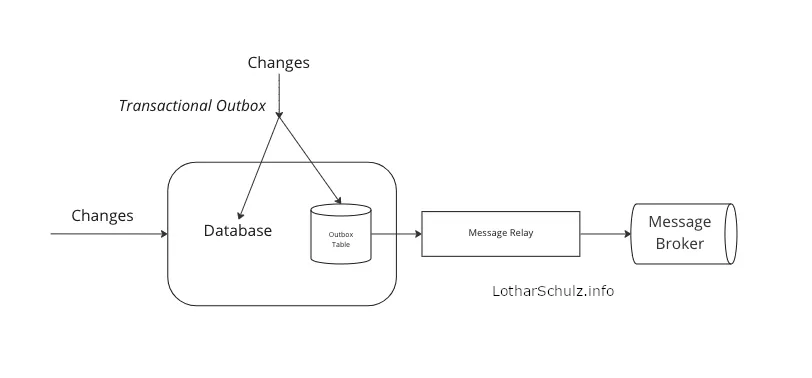
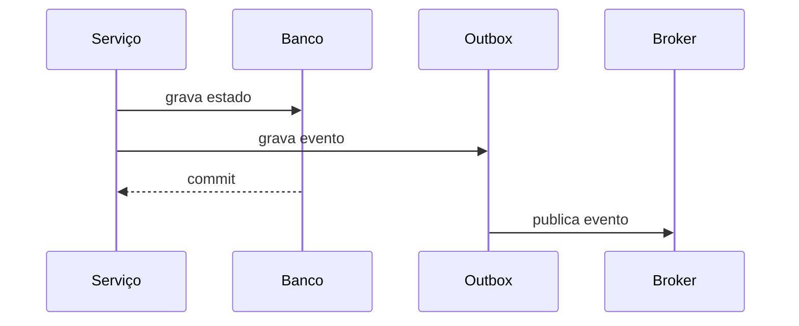

# Transactional outbox



## 1. O que é

Transactional outbox é um padrão usado para garantir que uma mudança de negócio e a publicação de um evento relacionado ocorram de forma atômica. Em vez de publicar o evento diretamente no broker, a aplicação grava o evento em uma tabela outbox dentro da mesma transação do dado de negócio. Assim, ou o estado e o evento são persistidos juntos, ou nenhum deles é. Também é conhecido como outbox pattern.

## 2. Por que existe (o problema que resolve)

O problema é a inconsistência entre o banco e o broker. Se a aplicação grava o estado no banco e depois tenta publicar o evento, pode haver falha no meio do caminho. O resultado pode ser um estado alterado sem evento correspondente ou um evento publicado sem a mudança no banco. O outbox resolve isso com atomicidade transacional.

## 3. Como funciona

O funcionamento é simples:

1. A transação de negócio grava o estado no banco.
2. Na mesma transação, grava-se uma linha na tabela outbox com o evento a publicar.
3. O commit da transação confirma as duas gravações juntas.
4. Um processador, normalmente um relay ou um CDC, lê a tabela outbox e publica o evento.
5. A linha é marcada como enviada ou removida.

## 4. Casos de uso reais

- Microsserviços que precisam de integração assíncrona.
- Processamento de pedidos, pagamentos e aprovações.
- Fluxos de domínio com dependência entre serviços.

Não usar quando a publicação do evento não precisa ser confiável ou quando o sistema aceita perda temporária de eventos e pode reprocessar manualmente.

## 5. Cenários práticos e trade-offs

- Cenário 1: um pedido é criado e um evento de pedido-criado é publicado para o estoque e para o pagamento.
- Cenário 2: a aplicação falha entre a gravação do pedido e a publicação; o outbox evita o estado órfão.
- Cenário 3: a tabela outbox cresce sem limpeza e precisa de política de retenção.

Trade-offs:

- Mais confiabilidade, mas mais complexidade operacional.
- Maior segurança de consistência, mas maior volume de dados na tabela outbox.

## 6. Diagrama e fluxo visual



Prompt de imagem:
"A sequence diagram of the transactional outbox pattern showing business data and event written atomically to the database and then published to a broker."

## 7. Exemplo aplicado — Java + Spring

```java
@Entity
@Table(name = "outbox_events")
public class OutboxEvent {
    @Id
    private UUID id;
    private String aggregateId;
    private String type;
    private String payload;
    private boolean published;
}

@Service
public class OrderService {
    private final OrderRepository orderRepository;
    private final OutboxRepository outboxRepository;

    @Transactional
    public void createOrder(Order order) {
        orderRepository.save(order);
        outboxRepository.save(new OutboxEvent(UUID.randomUUID(), order.getId(), "OrderCreated", "{}", false));
    }
}
```

Pontos-chave: o evento e a alteração de domínio são persistidos na mesma transação.

## 8. Exemplo aplicado — TypeScript + NestJS

```ts
@Injectable()
export class OrderService {
  constructor(
    private readonly orderRepo: OrderRepository,
    private readonly outboxRepo: OutboxRepository,
  ) {}

  async createOrder(order: Order) {
    await this.orderRepo.save(order);
    await this.outboxRepo.save({ id: uuid(), aggregateId: order.id, type: 'OrderCreated', payload: '{}', published: false });
  }
}
```

Pontos-chave: o padrão funciona bem também em aplicações NestJS, desde que a transação envolva tanto o estado quanto o outbox.

## 9. Comparação e armadilhas comuns

Compare com CDC. A principal armadilha é pensar que outbox é opcional se o sistema já usa eventos; ele é uma garantia de consistência, não só um mecanismo de publicação.

Erros comuns:

- Publicar o evento fora da transação.
- Não limpar ou reprocessar eventos pendentes.
- Não tratar idempotência no consumidor.

## 10. Perguntas para fixação

1. Por que publicar o evento fora da transação é arriscado?
2. Como o outbox evita inconsistência entre o banco e o broker?
3. Qual é a diferença prática entre outbox e CDC?
