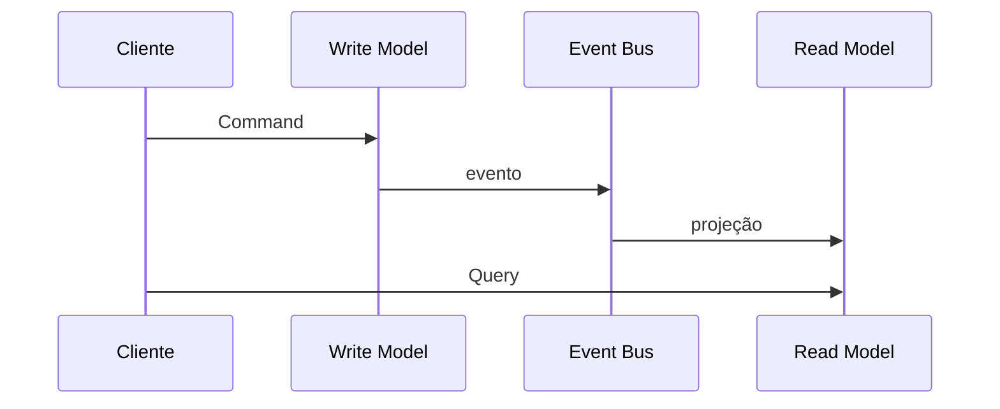

# CQRS

## 1. O que é

CQRS, ou Command Query Responsibility Segregation, é um padrão em que operações de escrita e leitura são modeladas separadamente. Comandos mudam o estado; queries consultam dados. Em vez de usar um único modelo para tudo, o sistema separa o modelo de escrita do modelo de leitura. Também é conhecido como separação entre comando e consulta.

## 2. Por que existe (o problema que resolve)

O problema é que um único modelo de dados não costuma ser ótimo para todas as operações. Em sistemas complexos, o lado de escrita precisa de regras de negócio e consistência; o lado de leitura precisa de performance, filtros e agregações. Unir os dois em um único modelo gera trade-offs ruins.

Esse padrão se tornou popular em sistemas com alta complexidade de leitura e baixa frequência de escrita, como dashboards, busca, analytics e painéis operacionais.

## 3. Como funciona

O fluxo normalmente é:

1. A aplicação envia um comando para o write model.
2. O write model valida regras de negócio e altera o estado.
3. O evento de domínio é publicado.
4. Um handler projeta esse evento para um read model otimizado.
5. A query consome o read model, não o write model.

## 4. Casos de uso reais

- Dashboards financeiros e operacionais.
- Buscas e filtros complexos.
- Extratos, histórico e painéis.

Não usar quando o sistema é simples e leitura/escrita têm o mesmo formato. Nesse caso, o ganho não compensa o custo de sincronização.

## 5. Cenários práticos e trade-offs

- Cenário 1: um contrato é aprovado e um read model é atualizado para exibir o status rapidamente.
- Cenário 2: o read model fica um pouco atrasado, causando consistência eventual.
- Cenário 3: uma query complexa é muito cara no write model, mas simples no read model.

Trade-offs:

- Melhor desempenho de leitura, mas mais complexidade de sincronização.
- Mais liberdade de modelagem, mas maior custo operacional.

## 6. Diagrama e fluxo visual



Prompt de imagem:
"A diagram of CQRS showing commands updating a write model, events projected into a read model, and queries served from the read model."

## 7. Exemplo aplicado — Java + Spring

```java
@Service
public class ContractCommandService {
    private final ContractRepository repository;

    @Transactional
    public void approve(String contractId) {
        Contract contract = repository.findById(contractId).orElseThrow();
        contract.approve();
        repository.save(contract);
    }
}
```

Pontos-chave: o comando atualiza o modelo de escrita com as regras de negócio.

## 8. Exemplo aplicado — TypeScript + NestJS

```ts
@Injectable()
export class ContractCommandService {
  constructor(private readonly repo: ContractRepository) {}

  async approve(contractId: string) {
    const contract = await this.repo.findById(contractId);
    contract.status = 'APPROVED';
    await this.repo.save(contract);
  }
}
```

Pontos-chave: o write model permanece focado em mudanças válidas e consistentes.

## 9. Comparação e armadilhas comuns

Compare com CRUD tradicional. A armadilha mais comum é implementar CQRS por moda, sem necessidade real de separação de modelos.

Erros comuns:

- Criar read models sem estratégia de atualização.
- Esperar consistência imediata entre write model e read model.
- Aumentar a complexidade sem ganho de performance.

## 10. Perguntas para fixação

1. Qual é a diferença essencial entre comando e query no CQRS?
2. Por que o read model pode ser diferente do write model?
3. O que significa consistência eventual nesse contexto?
