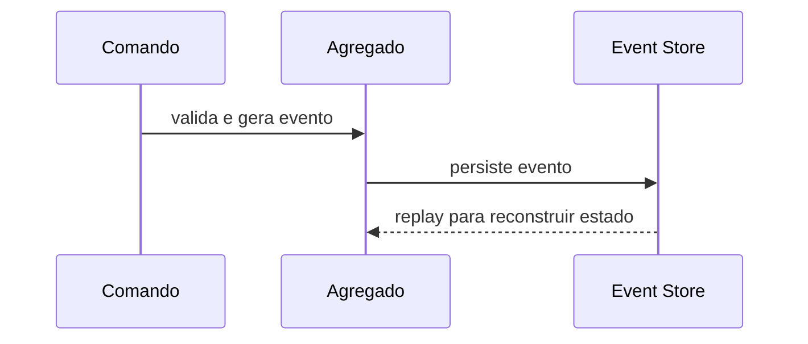

# Event sourcing

## 1. O que é

Event sourcing é um padrão em que o estado atual de um agregado é reconstruído a partir de uma sequência completa de eventos de domínio, em vez de ser armazenado apenas como um snapshot final. Em vez de "gravar o estado atual", você grava "o que aconteceu". Também é conhecido como event-sourced architecture.

## 2. Por que existe (o problema que resolve)

O problema é que o estado atual de um sistema muitas vezes não preserva a história das mudanças. Se você só grava o valor final, não consegue facilmente auditar, reprocessar, reproduzir ou debugar o comportamento do sistema. O event sourcing resolve isso mantendo um histórico explícito de mudanças.

Essa abordagem é muito usada em sistemas financeiros, de auditoria e de domínio complexo.

## 3. Como funciona

O fluxo é:

1. A aplicação recebe um comando.
2. O agregado valida e gera um evento de domínio.
3. O evento é persistido em um log de eventos.
4. O estado atual é reconstruído aplicando os eventos em ordem.
5. Snapshots podem ser usados para melhorar a performance.

## 4. Casos de uso reais

- Sistemas financeiros e contábeis.
- Auditoria, compliance e rastreabilidade.
- Regras de negócio complexas com histórico importante.

Não usar quando o domínio é simples, o histórico não tem valor e o custo operacional for alto demais.

## 5. Cenários práticos e trade-offs

- Cenário 1: uma conta bancária precisa mostrar todo o histórico de movimentações.
- Cenário 2: um bug de negócio precisa ser reprocessado e o histórico é essencial.
- Cenário 3: o replay de eventos pode ser custoso se não houver snapshots.

Trade-offs:

- Excelente auditoria e reprocessamento, mas maior complexidade de modelagem.
- Mais flexibilidade de evolução, mas maior custo de implementação e operação.

## 6. Diagrama e fluxo visual



Prompt de imagem:
"A conceptual diagram of event sourcing showing domain events stored in an event log and replayed to rebuild current state."

## 7. Exemplo aplicado — Java + Spring

```java
public record AccountOpened(String accountId, String customerId) {}

@Service
public class AccountService {
    private final EventStore store;

    public void openAccount(String accountId, String customerId) {
        store.append(accountId, List.of(new AccountOpened(accountId, customerId)));
    }
}
```

Pontos-chave: o estado não é sobrescrito; o sistema grava eventos que descrevem o que aconteceu.

## 8. Exemplo aplicado — TypeScript + NestJS

```ts
@Injectable()
export class AccountService {
  constructor(private readonly eventStore: EventStore) {}

  async openAccount(accountId: string, customerId: string) {
    await this.eventStore.append(accountId, [{ type: 'AccountOpened', data: { accountId, customerId } }]);
  }
}
```

Pontos-chave: o padrão preserva o histórico em vez de perder a evolução do agregado.

## 9. Comparação e armadilhas comuns

Compare com CRUD tradicional. A armadilha mais comum é usar event sourcing sem necessidade real de replay ou auditoria.

Erros comuns:

- Tratar eventos como comandos.
- Ignorar versionamento de eventos.
- Não implementar snapshots quando necessário.

## 10. Perguntas para fixação

1. Qual é a diferença entre armazenar o estado atual e armazenar eventos?
2. Por que event sourcing ajuda em auditoria?
3. Quando o replay de eventos pode ser custoso?
