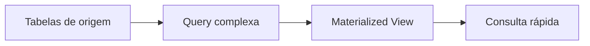

# Materialized view

## 1. O que é
Uma materialized view é uma cópia física do resultado de uma consulta, armazenada como uma tabela. Diferente de uma view comum, ela não recalcula a consulta a cada leitura; ela mantém um estado materializado que pode ser atualizado periodicamente ou por evento. Em outras palavras, é uma forma de pré-computar dados para leitura rápida.

## 2. Por que existe (o problema que resolve)
O problema é o custo de joins, agregações e cálculos complexos em tempo real. Quando uma consulta é muito cara, o sistema pode materializar o resultado em um objeto persistido para reduzir a latência e a carga sobre o banco principal.

Esse padrão é muito usado em dashboards, relatórios e consultas de alto volume.

## 3. Como funciona
O processo é:
1. Uma consulta complexa é executada sobre as tabelas de origem.
2. O resultado é persistido como uma tabela ou view materializada.
3. A leitura é feita a partir dessa tabela, não da consulta original.
4. A view é atualizada por refresh, trigger, CDC ou evento.

## 4. Casos de uso reais
- Scores e indicadores agregados.
- Extratos e histórico de cliente.
- Relatórios e painéis operacionais.

Não usar quando o dado precisa estar sempre instantaneamente atualizado e a janela de atualização não é aceitável.

## 5. Cenários práticos e trade-offs
- Cenário 1: um painel de risco precisa calcular média de score por cliente; a materialized view evita recomputar isso a cada acesso.
- Cenário 2: a view é atualizada em intervalo de 5 minutos e, nesse período, o valor pode estar desatualizado.
- Cenário 3: uma falha no refresh faz a view ficar inconsistente até a próxima tentativa.

Trade-offs:
- Leitura mais rápida, mas consistência eventual.
- Menor custo computacional em leitura, mas maior custo de manutenção e atualização.

## 6. Diagrama e fluxo visual


Prompt de imagem:
"A diagram of a materialized view showing complex source tables feeding a precomputed read model for fast dashboard queries."

## 7. Exemplo aplicado — Java + Spring
```java
@Service
public class CustomerScoreService {
    private final CustomerScoreRepository repository;

    public CustomerScore getScore(String customerId) {
        return repository.findByCustomerId(customerId).orElseThrow();
    }
}
```

Pontos-chave: a leitura é feita a partir de uma estrutura precomputada, economizando joins e agregações.

## 8. Exemplo aplicado — TypeScript + NestJS
```ts
@Injectable()
export class CustomerScoreService {
  constructor(private readonly repo: CustomerScoreRepository) {}

  async getScore(customerId: string) {
    return this.repo.findByCustomerId(customerId);
  }
}
```

Pontos-chave: o read model é tratado como uma tabela de consulta especializada.

## 9. Comparação e armadilhas comuns
Compare com views comuns. A armadilha é achar que materialized view resolve problemas de consistência instantânea.

Erros comuns:
- Esperar atualização imediata sem mecanismo de refresh.
- Não definir política de refresh e retenção.
- Usar materialized views para dados que mudam o tempo todo sem necessidade real.

## 10. Perguntas para fixação
1. Qual é a diferença entre uma view comum e uma materialized view?
2. Quando uma materialized view se torna útil?
3. Que tipo de problema ela resolve no lado da leitura?
