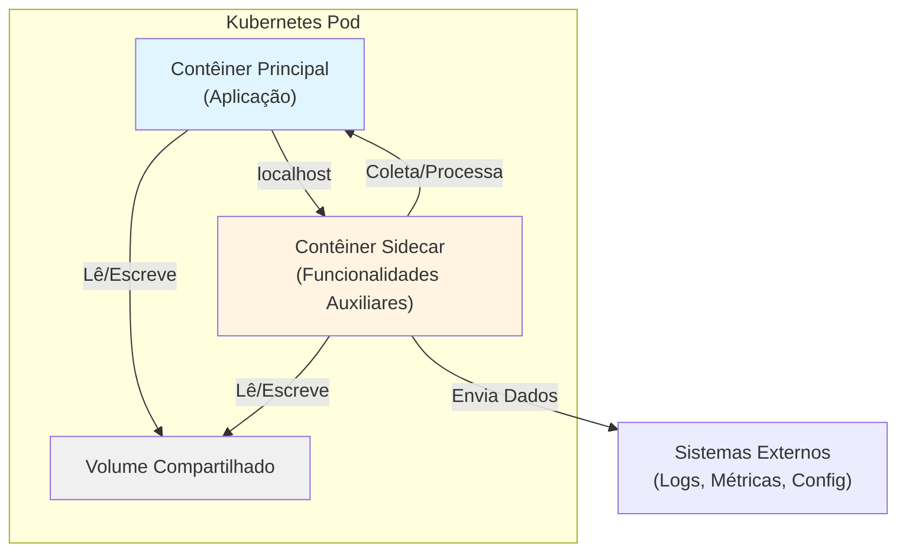

# Sidecar Pattern

## 1. O que é
O Sidecar Pattern é um padrão de arquitetura de contêineres onde um contêiner auxiliar (o "sidecar") é implantado junto ao contêiner principal da aplicação para fornecer funcionalidades complementares ou de suporte. O sidecar compartilha o mesmo ciclo de vida, rede e armazenamento do contêiner principal, criando uma unidade coesa de deploy. Também é conhecido como "companion container" ou "helper container pattern".

## 2. Por que existe (o problema que resolve)
Antes do Sidecar Pattern, funcionalidades cross-cutting como logging, monitoring, configuração, e comunicação com serviços externos eram embutidas diretamente na aplicação principal. Isso criava vários problemas: acoplamento entre lógica de negócio e infraestrutura, dificuldade de manutenção, violação do princípio de responsabilidade única, e impossibilidade de atualizar componentes de infraestrutura sem redeploy da aplicação. O padrão surgiu com a popularização de microserviços e orquestradores de contêineres como Kubernetes, permitindo separar responsabilidades mantendo a coesão operacional.

## 3. Como funciona
O Sidecar Pattern funciona através dos seguintes componentes e mecanismos:

- **Contêiner Principal**: Executa a lógica de negócio da aplicação, focado exclusivamente no domínio do problema.
- **Contêiner Sidecar**: Executa funcionalidades auxiliares (logging, monitoring, proxies, etc.) que complementam o contêiner principal.
- **Pod (Kubernetes)**: Agrupa ambos os contêineres, compartilhando o mesmo namespace de rede (localhost), volumes de armazenamento e ciclo de vida.
- **Comunicação via Localhost**: O sidecar se comunica com o contêiner principal através de localhost, eliminando latência de rede e simplificando a configuração.
- **Ciclo de Vida Compartilhado**: Se o contêiner principal falha, o sidecar é reiniciado. Se o sidecar falha, o pod é considerado não-saudável.

O sidecar pode interceptar tráfego de rede, coletar métricas, processar logs, gerenciar configurações, ou atuar como proxy para serviços externos, tudo de forma transparente para a aplicação principal.

## 4. Casos de uso reais

**Casos de uso comuns:**
- **Netflix**: Utiliza sidecars para streaming de logs e métricas em seus microserviços
- **Google**: Emprega sidecars para autenticação e autorização via Istio em serviços GCP
- **AWS App Mesh**: Usa sidecars para gerenciar comunicação entre serviços em ECS/EKS
- **Datadog Agent**: Sidecar para coleta de métricas e traces em ambientes Kubernetes
- **Logstash/Fluentd**: Sidecars para agregação e envio de logs para sistemas centralizados

**Quando NÃO usar:**
- Quando a funcionalidade pode ser implementada como biblioteca na aplicação principal
- Quando o sidecar adiciona latência inaceitável ao caminho crítico
- Quando a aplicação é monolítica e não se beneficia da separação de responsabilidades
- Quando o overhead de gerenciar múltiplos contêineres supera os benefícios

## 5. Cenários práticos e trade-offs

**Cenário 1: Coleta de Métricas**
Uma aplicação Spring Boot precisa enviar métricas para Prometheus. Um sidecar com o Prometheus Node Exporter coleta métricas do sistema e da aplicação, expõe no endpoint /metrics, e o Prometheus scrape periodicamente. A aplicação não precisa saber sobre Prometheus.

**Cenário 2: Proxy de Configuração**
Aplicação precisa ler configurações de um serviço central (ex: Consul, Vault). Um sidecar faz polling periódico, atualiza arquivos de configuração compartilhados via volume, e a aplicação relê os arquivos. Se o sidecar falhar, a aplicação continua com a última configuração conhecida.

**Cenário 3 (Falha): Sidecar de Logging Congestionado**
Um sidecar de logs tenta enviar logs para um sistema centralizado que está lento. O buffer do sidecar enche, começa a descartar logs, e eventualmente consome toda a memória do pod, causando OOM kill do contêiner principal. A aplicação falha porque o sidecar falhou.

**Trade-offs:**
- **Latência**: Sidecars podem adicionar latência no caminho de comunicação (ex: proxy sidecar)
- **Complexidade Operacional**: Mais contêineres para monitorar, debugar e gerenciar
- **Consumo de Recursos**: Cada sidecar consome CPU, memória e rede adicionais
- **Acoplamento Operacional**: Sidecar e aplicação principal estão acoplados no mesmo pod
- **Flexibilidade**: Permite atualizar componentes de infraestrutura sem mudar a aplicação

## 6. Diagrama e fluxo visual

**a) Diagrama Mermaid:**



**b) Prompt para geração de imagem:**

"A modern technical diagram showing the Sidecar Pattern in container architecture. A main application container (blue) on the left, connected to a smaller sidecar container (orange) on the right, both inside a rounded rectangle representing a Kubernetes Pod. The sidecar container has arrows pointing to external systems for logging, monitoring, and configuration. The containers share a storage volume at the bottom. Clean, professional, technical illustration style with clear labels and modern color palette."

## 7. Exemplo aplicado — Java + Spring

```java
// Application.java - Contêiner Principal
@SpringBootApplication
@RestController
public class Application {
    
    private static final Logger logger = LoggerFactory.getLogger(Application.class);
    
    @GetMapping("/api/data")
    public ResponseEntity<String> getData() {
        logger.info("Processing request for /api/data");
        
        // Lógica de negócio - não sabe sobre o sidecar de logs
        String result = processData();
        
        logger.info("Request completed successfully");
        return ResponseEntity.ok(result);
    }
    
    private String processData() {
        return "Processed data at " + LocalDateTime.now();
    }
    
    public static void main(String[] args) {
        SpringApplication.run(Application.class, args);
    }
}

// application.yml
server:
  port: 8080
logging:
  file:
    name: /var/log/app/application.log  # Volume compartilhado com sidecar
  pattern:
    console: "%d{yyyy-MM-dd HH:mm:ss} - %msg%n"
    file: "%d{yyyy-MM-dd HH:mm:ss} [%thread] %-5level %logger{36} - %msg%n"
```

**Dockerfile para contêiner principal:**
```dockerfile
FROM eclipse-temurin:17-jdk-alpine
COPY target/app.jar /app/app.jar
WORKDIR /app
EXPOSE 8080
ENTRYPOINT ["java", "-jar", "app.jar"]
```

**Dockerfile para sidecar de logs:**
```dockerfile
FROM fluent/fluentd:v1.16-1
COPY fluent.conf /fluentd/etc/fluent.conf
# Volume compartilhado para ler logs da aplicação
VOLUME /var/log/app
```

**fluent.conf (sidecar):**
```xml
<source>
  @type tail
  path /var/log/app/application.log
  pos_file /var/log/fluentd-app.log.pos
  tag app.logs
  format json
</source>

<match app.**>
  @type elasticsearch
  host elasticsearch.logging.svc.cluster.local
  port 9200
  logstash_format true
  logstash_prefix app-logs
</match>
```

**Ponto-chave:** A aplicação escreve logs em um volume compartilhado, e o sidecar Fluentd lê esses logs e envia para Elasticsearch, sem a aplicação precisar saber sobre Elasticsearch.

## 8. Exemplo aplicado — TypeScript + NestJS

```typescript
// app.controller.ts - Contêiner Principal
import { Controller, Get, Logger } from '@nestjs/common';

@Controller()
export class AppController {
  private readonly logger = new Logger(AppController.name);

  @Get('/api/data')
  getData(): string {
    this.logger.log('Processing request for /api/data');
    
    // Lógica de negócio - não sabe sobre o sidecar
    const result = this.processData();
    
    this.logger.log('Request completed successfully');
    return result;
  }

  private processData(): string {
    return `Processed data at ${new Date().toISOString()}`;
  }
}

// app.module.ts
import { Module } from '@nestjs/common';
import { AppController } from './app.controller';
import { AppService } from './app.service';

@Module({
  imports: [],
  controllers: [AppController],
  providers: [AppService],
})
export class AppModule {}
```

**Dockerfile para contêiner principal:**
```dockerfile
FROM node:18-alpine
WORKDIR /app
COPY package*.json ./
RUN npm ci --only=production
COPY dist ./dist
EXPOSE 3000
CMD ["node", "dist/main"]
```

**Dockerfile para sidecar (Prometheus Exporter):**
```dockerfile
FROM prom/node-exporter:latest
# Configura para ler métricas da aplicação via localhost
```

**kubernetes-deployment.yaml:**
```yaml
apiVersion: apps/v1
kind: Deployment
metadata:
  name: app-with-sidecar
spec:
  replicas: 3
  selector:
    matchLabels:
      app: myapp
  template:
    metadata:
      labels:
        app: myapp
    spec:
      containers:
        - name: app
          image: myapp:latest
          ports:
            - containerPort: 3000
          volumeMounts:
            - name: logs
              mountPath: /var/log/app
        
        - name: log-sidecar
          image: fluent/fluentd:v1.16-1
          volumeMounts:
            - name: logs
              mountPath: /var/log/app
            - name: config
              mountPath: /fluentd/etc
        
        - name: metrics-sidecar
          image: prom/node-exporter:latest
          ports:
            - containerPort: 9100
      
      volumes:
        - name: logs
          emptyDir: {}
        - name: config
          configMap:
            name: fluentd-config
```

**Ponto-chave:** O pod contém três contêineres: a aplicação, um sidecar para logs, e um sidecar para métricas. Todos compartilham o mesmo ciclo de vida e podem se comunicar via localhost.

## 9. Comparação e armadilhas comuns

**Comparação com padrões similares:**
- **Sidecar vs Ambassador**: O Sidecar foca em funcionalidades auxiliares internas (logs, métricas), enquanto o Ambassador foca em comunicação externa (proxy, load balancing).
- **Sidecar vs Adapter**: O Adapter transforma dados entre protocolos diferentes, enquanto o Sidecar adiciona funcionalidades sem necessariamente transformar dados.
- **Sidecar vs Multi-Container Pod**: Sidecar é um caso específico de multi-container pod onde o contêiner auxiliar suporta o principal.

**Armadilhas comuns:**
1. **Over-engineering**: Criar sidecars para funcionalidades simples que poderiam ser bibliotecas
2. **Resource Starvation**: Não configurar limits/requests adequados, causando que o sidecar consuma recursos do contêiner principal
3. **Tight Coupling**: Sidecar e aplicação principal ficam muito acoplados, dificultando atualizações independentes
4. **Ignoring Failure Modes**: Não tratar falhas do sidecar adequadamente (ex: se o sidecar de logs falha, a aplicação deve continuar?)
5. **Network Latency**: Usar sidecar como proxy para todo tráfego sem considerar o impacto na latência

## 10. Perguntas para fixação

1. Em um cenário de produção, o sidecar de logs está consumindo muita memória e causando OOM kills do pod inteiro. Como você diagnosticaria e resolveria esse problema?

2. Você precisa implementar autenticação JWT em todos os seus microserviços. Você usaria um sidecar para validar tokens ou uma biblioteca compartilhada? Justifique sua decisão considerando trade-offs de latência, manutenção e segurança.

3. Desenhe a arquitetura de um sistema que usa múltiplos sidecars (logs, métricas, config, tracing) em um único pod. Quais são os riscos dessa abordagem e como você mitigaria cada um deles?
