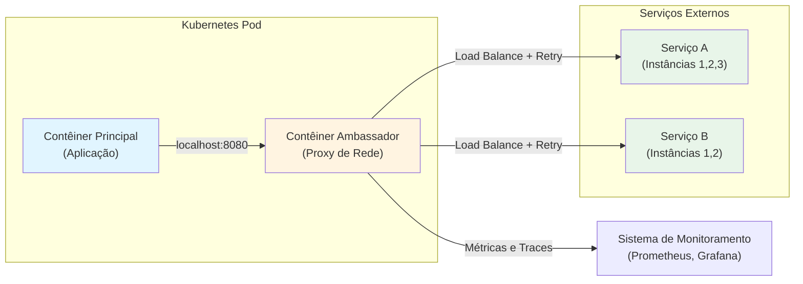

# Ambassador Pattern

## 1. O que é
O Ambassador Pattern é um padrão de arquitetura onde um contêiner auxiliar (o "ambassador") atua como proxy entre a aplicação principal e serviços externos, gerenciando comunicação, load balancing, retry, circuit breaking e outras funcionalidades de rede. O ambassador compartilha o mesmo pod da aplicação, permitindo comunicação via localhost, mas é responsável por toda a interação com o mundo externo. Também é conhecido como "sidecar proxy" ou "service proxy pattern".

## 2. Por que existe (o problema que resolve)
Antes do Ambassador Pattern, aplicações precisavam implementar lógica de rede diretamente no código: retry logic, timeout handling, load balancing, service discovery, circuit breaking, etc. Isso resultava em código duplicado, complexidade desnecessária, e dificuldade de manutenção. Além disso, mudanças em políticas de rede exigiam redeploy da aplicação. O padrão surgiu com a necessidade de desacoplar lógica de negócio de lógica de infraestrutura de rede, permitindo que equipes de aplicação foquem no domínio enquanto equipes de plataforma gerenciam comunicação de rede. É um padrão fundamental em service meshes como Istio, Linkerd e Consul Connect.

## 3. Como funciona
O Ambassador Pattern funciona através dos seguintes componentes e mecanismos:

- **Contêiner Principal**: Executa a lógica de negócio, fazendo requisições para localhost (não sabe sobre serviços externos)
- **Contêiner Ambassador**: Proxy que intercepta requisições do contêiner principal e as encaminha para serviços externos
- **Pod (Kubernetes)**: Agrupa ambos os contêineres, permitindo comunicação via localhost
- **Service Discovery**: Ambassador descobre dinamicamente endpoints de serviços externos
- **Load Balancing**: Ambassador distribui tráfego entre múltiplas instâncias de serviços
- **Resiliência**: Implementa retry, timeout, circuit breaking e fallback
- **Observabilidade**: Coleta métricas, logs e traces de toda comunicação de rede

O ambassador geralmente opera em modo transparente: a aplicação faz requisições para localhost:PORT, e o ambassador redireciona para o serviço externo apropriado. Isso permite mudar endpoints, implementar canary deployments, ou adicionar políticas de rede sem modificar a aplicação.

## 4. Casos de uso reais

**Casos de uso comuns:**
- **Netflix Zuul**: Ambassador para roteamento de requisições entre microserviços
- **Istio Envoy**: Sidecar proxy que implementa ambassador pattern para service mesh
- **AWS App Mesh**: Usa Envoy como ambassador para gerenciar comunicação entre serviços em EKS
- **Linkerd**: Usa proxy Rust como ambassador para observabilidade e resiliência
- **NGINX Ingress Controller**: Ambassador para roteamento de tráfego externo para serviços internos

**Quando NÃO usar:**
- Quando a aplicação tem requisitos de rede muito simples (poucos serviços, sem necessidade de resiliência)
- Quando a latência adicionada pelo proxy é inaceitável (ex: sistemas de alta frequência)
- Quando a aplicação precisa de controle direto sobre conexões de rede (ex: WebSocket customizado)
- Quando o overhead operacional de gerenciar proxies supera os benefícios

## 5. Cenários práticos e trade-offs

**Cenário 1: Load Balancing com Retry**
Uma aplicação precisa chamar um serviço de pagamento que tem 3 instâncias. O ambassador implementa round-robin load balancing, retry com exponential backoff (3 tentativas), e circuit breaking. Se uma instância falha, o ambassador automaticamente redireciona para outra. A aplicação apenas chama localhost:8080/payments.

**Cenário 2: Canary Deployment**
Nova versão de um serviço de recomendação foi implantada. O ambassador roteia 10% do tráfego para a nova versão (v2) e 90% para a antiga (v1). Métricas são coletadas para comparar performance. Se v2 tiver problemas, o ambassador instantaneamente redireciona 100% para v1 sem mudar a aplicação.

**Cenário 3 (Falha): Ambassador com Circuit Breaker Mal Configurado**
O circuit breaker do ambassador está configurado com threshold muito baixo. Após poucas falhas em um serviço externo, o circuit breaker abre e todas as requisições começam a falhar com fallback. O serviço externo recupera, mas o circuit breaker não fecha automaticamente, causando degradação desnecessária. A aplicação não sabe que o problema é no ambassador.

**Trade-offs:**
- **Latência**: Adiciona 1-5ms de latência por hop (proxy)
- **Complexidade**: Mais componentes para configurar, monitorar e debugar
- **Visibilidade**: Permite observabilidade profunda de toda comunicação de rede
- **Flexibilidade**: Permite mudar políticas de rede sem redeploy da aplicação
- **Resiliência**: Centraliza lógica de retry, circuit breaking e fallback
- **Custo**: Recursos adicionais para executar proxies em cada pod

## 6. Diagrama e fluxo visual

**a) Diagrama Mermaid:**



**b) Prompt para geração de imagem:**

"A modern technical diagram showing the Ambassador Pattern in container architecture. A main application container (blue) on the left, connected to an ambassador proxy container (orange) in the middle. The ambassador container has multiple arrows branching out to different external services (green) representing load balancing. Another arrow goes from the ambassador to a monitoring system (purple). All containers are inside a rounded rectangle representing a Kubernetes Pod. Clean, professional, technical illustration style with clear labels and modern color palette."

## 7. Exemplo aplicado — Java + Spring

```java
// PaymentController.java - Contêiner Principal
@RestController
@RequestMapping("/api")
public class PaymentController {
    
    private static final Logger logger = LoggerFactory.getLogger(PaymentController.class);
    
    // Não sabe sobre o ambassador - apenas chama localhost
    @PostMapping("/payments")
    public ResponseEntity<PaymentResponse> processPayment(@RequestBody PaymentRequest request) {
        logger.info("Processing payment for amount: {}", request.getAmount());
        
        // Chama serviço externo via localhost (ambassador proxy)
        PaymentResponse response = callPaymentService(request);
        
        logger.info("Payment processed successfully: {}", response.getTransactionId());
        return ResponseEntity.ok(response);
    }
    
    private PaymentResponse callPaymentService(PaymentRequest request) {
        // Usa RestTemplate para chamar localhost (ambassador redireciona para serviço real)
        RestTemplate restTemplate = new RestTemplate();
        String url = "http://localhost:8080/payments"; // Ambassador proxy
        
        HttpHeaders headers = new HttpHeaders();
        headers.setContentType(MediaType.APPLICATION_JSON);
        
        HttpEntity<PaymentRequest> entity = new HttpEntity<>(request, headers);
        return restTemplate.postForObject(url, entity, PaymentResponse.class);
    }
}

// application.yml
server:
  port: 3000
payment:
  service:
    url: http://localhost:8080  # Ambassador proxy, não o serviço real
```

**Dockerfile para contêiner principal:**
```dockerfile
FROM eclipse-temurin:17-jdk-alpine
COPY target/payment-service.jar /app/payment-service.jar
WORKDIR /app
EXPOSE 3000
ENTRYPOINT ["java", "-jar", "payment-service.jar"]
```

**Dockerfile para ambassador (Envoy):**
```dockerfile
FROM envoyproxy/envoy:v1.28
COPY envoy.yaml /etc/envoy/envoy.yaml
EXPOSE 8080 9901
CMD ["/usr/local/bin/envoy", "-c", "/etc/envoy/envoy.yaml"]
```

**envoy.yaml (ambassador):**
```yaml
static_resources:
  listeners:
    - name: listener_0
      address:
        socket_address:
          address: 0.0.0.0
          port_value: 8080
      filter_chains:
        - filters:
            - name: envoy.filters.network.http_connection_manager
              typed_config:
                stat_prefix: ingress_http
                route_config:
                  name: local_route
                  virtual_hosts:
                    - name: backend
                      domains: ["*"]
                      routes:
                        - match: { prefix: "/payments" }
                          route:
                            cluster: payment_service
                            timeout: 5s
                            retry_policy:
                              retry_on: 5xx
                              num_retries: 3
                http_filters:
                  - name: envoy.filters.http.router
  clusters:
    - name: payment_service
      connect_timeout: 1s
      type: STRICT_DNS
      lb_policy: ROUND_ROBIN
      load_assignment:
        cluster_name: payment_service
        endpoints:
          - lb_endpoints:
              - endpoint:
                  address:
                    socket_address:
                      address: payment-service.production.svc.cluster.local
                      port_value: 8080
      circuit_breakers:
        thresholds:
          - priority: DEFAULT
            max_connections: 100
            max_pending_requests: 50
            max_requests: 100

admin:
  access_log_path: /dev/stdout
  address:
    socket_address:
      address: 0.0.0.0
      port_value: 9901
```

**Ponto-chave:** A aplicação chama localhost:8080, e o Envoy ambassador redireciona para o serviço real com load balancing, retry e circuit breaking configurados no envoy.yaml.

## 8. Exemplo aplicado — TypeScript + NestJS

```typescript
// payment.controller.ts - Contêiner Principal
import { Controller, Post, Body, Logger } from '@nestjs/common';
import { PaymentService } from './payment.service';

@Controller('api')
export class PaymentController {
  private readonly logger = new Logger(PaymentController.name);

  constructor(private readonly paymentService: PaymentService) {}

  @Post('payments')
  async processPayment(@Body() request: PaymentRequest): Promise<PaymentResponse> {
    this.logger.log(`Processing payment for amount: ${request.amount}`);
    
    // Chama serviço externo via localhost (ambassador proxy)
    const response = await this.paymentService.processPayment(request);
    
    this.logger.log(`Payment processed successfully: ${response.transactionId}`);
    return response;
  }
}

// payment.service.ts
import { Injectable, HttpService } from '@nestjs/common';
import { AxiosRequestConfig } from 'axios';

@Injectable()
export class PaymentService {
  constructor(private readonly httpService: HttpService) {}

  async processPayment(request: PaymentRequest): Promise<PaymentResponse> {
    // Chama localhost (ambassador redireciona para serviço real)
    const config: AxiosRequestConfig = {
      method: 'POST',
      url: 'http://localhost:8080/payments', // Ambassador proxy
      data: request,
      timeout: 5000,
    };

    const response = await this.httpService.request(config).toPromise();
    return response.data;
  }
}

// interfaces.ts
export interface PaymentRequest {
  amount: number;
  currency: string;
  customerId: string;
}

export interface PaymentResponse {
  transactionId: string;
  status: string;
  timestamp: string;
}
```

**Dockerfile para contêiner principal:**
```dockerfile
FROM node:18-alpine
WORKDIR /app
COPY package*.json ./
RUN npm ci --only=production
COPY dist ./dist
EXPOSE 3000
CMD ["node", "dist/main"]
```

**Dockerfile para ambassador (NGINX):**
```dockerfile
FROM nginx:alpine
COPY nginx.conf /etc/nginx/nginx.conf
EXPOSE 8080
CMD ["nginx", "-g", "daemon off;"]
```

**nginx.conf (ambassador):**
```nginx
events {
    worker_connections 1024;
}

http {
    upstream payment_service {
        least_conn;
        server payment-service-1.production.svc.cluster.local:8080 max_fails=3 fail_timeout=30s;
        server payment-service-2.production.svc.cluster.local:8080 max_fails=3 fail_timeout=30s;
        server payment-service-3.production.svc.cluster.local:8080 max_fails=3 fail_timeout=30s;
    }

    server {
        listen 8080;
        
        location /payments {
            proxy_pass http://payment_service;
            proxy_next_upstream error timeout invalid_header http_500 http_502 http_503 http_504;
            proxy_connect_timeout 2s;
            proxy_send_timeout 5s;
            proxy_read_timeout 5s;
            proxy_set_header Host $host;
            proxy_set_header X-Real-IP $remote_addr;
            proxy_set_header X-Forwarded-For $proxy_add_x_forwarded_for;
        }
    }
}
```

**kubernetes-deployment.yaml:**
```yaml
apiVersion: apps/v1
kind: Deployment
metadata:
  name: payment-service
spec:
  replicas: 3
  selector:
    matchLabels:
      app: payment-service
  template:
    metadata:
      labels:
        app: payment-service
    spec:
      containers:
        - name: app
          image: payment-service:latest
          ports:
            - containerPort: 3000
          env:
            - name: PAYMENT_SERVICE_URL
              value: "http://localhost:8080"
        
        - name: ambassador
          image: nginx:alpine
          ports:
            - containerPort: 8080
          volumeMounts:
            - name: nginx-config
              mountPath: /etc/nginx/nginx.conf
              subPath: nginx.conf
      
      volumes:
        - name: nginx-config
          configMap:
            name: nginx-ambassador-config
```

**Ponto-chave:** O NGINX ambassador implementa load balancing, health checks e failover. A aplicação apenas chama localhost:8080, e o ambassador gerencia toda a complexidade de rede.

## 9. Comparação e armadilhas comuns

**Comparação com padrões similares:**
- **Ambassador vs Sidecar**: Ambassador é um tipo específico de sidecar focado em comunicação de rede, enquanto sidecar é mais genérico (pode ser para logs, métricas, etc.)
- **Ambassador vs Adapter**: Adapter transforma dados entre protocolos diferentes, enquanto Ambassador foca em roteamento e resiliência de rede
- **Ambassador vs Service Mesh**: Ambassador é o componente individual (proxy), enquanto Service Mesh é a infraestrutura completa que gerencia múltiplos ambassadors

**Armadilhas comuns:**
1. **Over-engineering**: Implementar ambassador para comunicação simples que não precisa de load balancing ou retry
2. **Misconfigured Timeouts**: Timeouts muito curtos causam falhas desnecessárias, muito longos causam cascading failures
3. **Circuit Breaker Thresholds**: Thresholds muito sensíveis causam opening prematuro, muito permissivos não protegem contra failures
4. **Ignoring Metrics**: Não monitorar métricas do ambassador (latência, error rate, circuit breaker state)
5. **DNS Caching**: Ambassador com DNS caching pode não atualizar endpoints quando serviços mudam

## 10. Perguntas para fixação

1. Você tem um serviço que chama 3 serviços externos diferentes. Você usaria um único ambassador para todos ou múltiplos ambassadors (um por serviço)? Quais são os trade-offs de cada abordagem?

2. O ambassador está implementando retry com exponential backoff, mas você está observando que o sistema está sobrecarregado durante picos de tráfego. Como você ajustaria a configuração do retry para evitar thundering herd problem?

3. Desenhe a arquitetura de um sistema que usa ambassador pattern para implementar canary deployment. Como você garantiria que o ambassador possa instantaneamente redirecionar 100% do tráfego de volta para a versão antiga se a nova versão tiver problemas?
