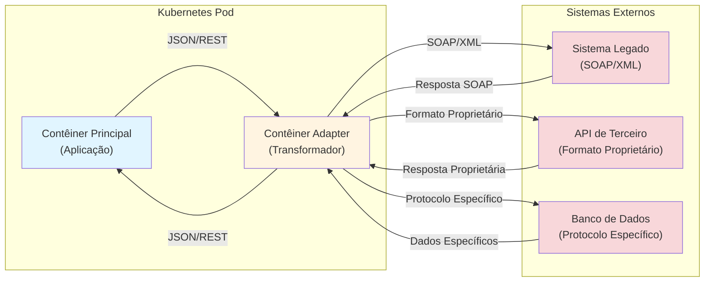

# Adapter Pattern

## 1. O que é
O Adapter Pattern é um padrão de arquitetura de contêineres onde um contêiner auxiliar (o "adapter") transforma dados entre diferentes protocolos, formatos ou interfaces, permitindo que a aplicação principal se comunique com sistemas externos que têm interfaces incompatíveis. O adapter compartilha o mesmo pod da aplicação, atuando como uma camada de tradução transparente. Também é conhecido como "wrapper pattern" ou "translator pattern" no contexto de contêineres.

## 2. Por que existe (o problema que resolve)
Antes do Adapter Pattern em contêineres, aplicações precisavam implementar lógica de transformação de dados diretamente no código da aplicação. Isso criava problemas: acoplamento entre lógica de negócio e detalhes de integração, código difícil de testar, e impossibilidade de reutilizar lógica de adaptação entre diferentes serviços. Além disso, mudanças em interfaces externas exigiam modificação e redeploy da aplicação. O padrão surgiu com a necessidade de integrar sistemas legados, APIs de terceiros com formatos diferentes, e serviços que usam protocolos distintos, mantendo a aplicação principal isolada dessas complexidades.

## 3. Como funciona
O Adapter Pattern funciona através dos seguintes componentes e mecanismos:

- **Contêiner Principal**: Executa a lógica de negócio usando um formato/protocolo interno padronizado
- **Contêiner Adapter**: Recebe dados em um formato/protocolo, transforma para o formato esperado pela aplicação (e vice-versa)
- **Pod (Kubernetes)**: Agrupa ambos os contêineres, permitindo comunicação via localhost
- **Transformação de Dados**: Adapter converte entre formatos (JSON/XML, gRPC/REST, diferentes schemas)
- **Protocol Translation**: Adapter traduz entre protocolos diferentes (ex: SOAP → REST, TCP → HTTP)
- **Interface Normalization**: Adapter expõe uma interface consistente para sistemas externos com interfaces variadas

O adapter geralmente opera em modo bidirecional: recebe requisições da aplicação, transforma para o formato externo, envia para o serviço externo, recebe a resposta, transforma de volta para o formato interno, e retorna para a aplicação. Isso permite que a aplicação principal trabalhe sempre com um formato consistente, independentemente de quantos sistemas externos diferentes ela precisa integrar.

## 4. Casos de uso reais

**Casos de uso comuns:**
- **Integração com Sistemas Legados**: Adapter transforma requisições REST em chamadas SOAP para sistemas legados
- **API Gateway Interno**: Adapter normaliza respostas de diferentes APIs de terceiros para um formato interno
- **Protocol Translation**: Adapter converte chamadas gRPC da aplicação para REST para serviços externos
- **Database Adapter**: Adapter traduz queries de um ORM para SQL específico de diferentes bancos
- **Message Queue Adapter**: Adapter transforma mensagens entre formatos de diferentes brokers (Kafka, RabbitMQ, SQS)

**Quando NÃO usar:**
- Quando a transformação é trivial e pode ser feita com uma biblioteca
- Quando a aplicação e o sistema externo já usam o mesmo protocolo/formato
- Quando a latência adicionada pelo adapter é inaceitável
- Quando o adapter adiciona complexidade que não é justificada pelo benefício

## 5. Cenários práticos e trade-offs

**Cenário 1: Integração com Sistema Legado SOAP**
Uma aplicação moderna Spring Boot precisa integrar com um sistema legado que expõe apenas serviços SOAP. O adapter recebe requisições JSON da aplicação, transforma para SOAP XML, chama o serviço legado, recebe a resposta SOAP, transforma para JSON, e retorna para a aplicação. A aplicação nunca sabe que está falando com SOAP.

**Cenário 2: Normalização de APIs de Terceiros**
Uma aplicação precisa integrar com 3 serviços de pagamento diferentes (Stripe, PayPal, Adyen). Cada um tem um formato de API diferente. O adapter expõe uma interface unificada para a aplicação, e internamente traduz para o formato específico de cada provedor. Se um novo provedor for adicionado, apenas o adapter precisa mudar.

**Cenário 3 (Falha): Adapter com Transformação Perda de Precisão**
Um adapter transforma dados monetários entre sistemas. O sistema externo usa float com precisão limitada, enquanto a aplicação interna usa decimal com alta precisão. Durante a transformação, ocorre perda de precisão (ex: 10.005 → 10.01). Isso causa discrepâncias nos cálculos financeiros, mas o adapter não valida a precisão após a transformação.

**Trade-offs:**
- **Latência**: Adiciona overhead de transformação (serialização/deserialização)
- **Complexidade**: Mais componentes para manter e debugar
- **Isolamento**: Aplicação principal isolada de complexidades de integração
- **Reutilização**: Lógica de adaptação pode ser reutilizada entre diferentes serviços
- **Testabilidade**: Adapter pode ser testado independentemente da aplicação
- **Manutenção**: Mudanças em interfaces externas exigem apenas atualização do adapter

## 6. Diagrama e fluxo visual

**a) Diagrama Mermaid:**



**b) Prompt para geração de imagem:**

"A modern technical diagram showing the Adapter Pattern in container architecture. A main application container (blue) on the left, connected to an adapter container (orange) in the middle. The adapter container has multiple arrows connecting to different external systems with different colors and shapes (red squares, green circles, purple triangles) representing different protocols and formats. The adapter transforms between these different formats. All containers are inside a rounded rectangle representing a Kubernetes Pod. Clean, professional, technical illustration style with clear labels and modern color palette."

## 7. Exemplo aplicado — Java + Spring

```java
// PaymentController.java - Contêiner Principal
@RestController
@RequestMapping("/api")
public class PaymentController {
    
    private static final Logger logger = LoggerFactory.getLogger(PaymentController.class);
    
    @Autowired
    private PaymentService paymentService;
    
    @PostMapping("/payments")
    public ResponseEntity<PaymentResponse> processPayment(@RequestBody PaymentRequest request) {
        logger.info("Processing payment for amount: {}", request.getAmount());
        
        // Chama serviço interno - não sabe sobre SOAP ou formatos externos
        PaymentResponse response = paymentService.processPayment(request);
        
        logger.info("Payment processed successfully: {}", response.getTransactionId());
        return ResponseEntity.ok(response);
    }
}

// PaymentService.java - Contêiner Principal
@Service
public class PaymentService {
    
    @Autowired
    private RestTemplate restTemplate;
    
    @Value("${payment.adapter.url}")
    private String adapterUrl;
    
    public PaymentResponse processPayment(PaymentRequest request) {
        // Chama adapter via localhost (adapter transforma para SOAP)
        String url = adapterUrl + "/payments";
        
        HttpHeaders headers = new HttpHeaders();
        headers.setContentType(MediaType.APPLICATION_JSON);
        
        HttpEntity<PaymentRequest> entity = new HttpEntity<>(request, headers);
        return restTemplate.postForObject(url, entity, PaymentResponse.class);
    }
}

// application.yml
server:
  port: 3000
payment:
  adapter:
    url: http://localhost:8080  # Adapter container
```

**Dockerfile para contêiner principal:**
```dockerfile
FROM eclipse-temurin:17-jdk-alpine
COPY target/payment-service.jar /app/payment-service.jar
WORKDIR /app
EXPOSE 3000
ENTRYPOINT ["java", "-jar", "payment-service.jar"]
```

**Dockerfile para adapter (SOAP):**
```dockerfile
FROM eclipse-temurin:17-jdk-alpine
COPY target/soap-adapter.jar /app/soap-adapter.jar
WORKDIR /app
EXPOSE 8080
ENTRYPOINT ["java", "-jar", "soap-adapter.jar"]
```

**SoapAdapterController.java - Contêiner Adapter:**
```java
@RestController
@RequestMapping("/payments")
public class SoapAdapterController {
    
    private static final Logger logger = LoggerFactory.getLogger(SoapAdapterController.class);
    
    @Autowired
    private SoapClient soapClient;
    
    @PostMapping
    public PaymentResponse processPayment(@RequestBody PaymentRequest request) {
        logger.info("Adapter: Transforming JSON to SOAP");
        
        // Transforma JSON para SOAP
        SoapPaymentRequest soapRequest = transformToSoap(request);
        
        // Chama sistema legado SOAP
        SoapPaymentResponse soapResponse = soapClient.callLegacySystem(soapRequest);
        
        // Transforma SOAP de volta para JSON
        PaymentResponse response = transformFromSoap(soapResponse);
        
        logger.info("Adapter: SOAP response transformed to JSON");
        return response;
    }
    
    private SoapPaymentRequest transformToSoap(PaymentRequest request) {
        SoapPaymentRequest soapRequest = new SoapPaymentRequest();
        soapRequest.setAmount(request.getAmount());
        soapRequest.setCurrency(request.getCurrency());
        soapRequest.setCustomerId(request.getCustomerId());
        // Adiciona namespaces e elementos SOAP específicos
        return soapRequest;
    }
    
    private PaymentResponse transformFromSoap(SoapPaymentResponse soapResponse) {
        PaymentResponse response = new PaymentResponse();
        response.setTransactionId(soapResponse.getTransactionId());
        response.setStatus(soapResponse.getStatus());
        response.setTimestamp(soapResponse.getTimestamp());
        return response;
    }
}

// SoapClient.java
@Component
public class SoapClient {
    
    public SoapPaymentResponse callLegacySystem(SoapPaymentRequest request) {
        // Implementação de chamada SOAP usando Spring WS ou similar
        // URL: http://legacy-system.company.com/soap/PaymentService
        // Transforma objeto Java para envelope SOAP XML
        // Faz requisição HTTP POST
        // Parse resposta SOAP XML para objeto Java
        return new SoapPaymentResponse();
    }
}
```

**Ponto-chave:** A aplicação principal trabalha apenas com JSON, enquanto o adapter transforma para SOAP XML para comunicar com o sistema legado. Se o sistema legado mudar, apenas o adapter precisa ser atualizado.

## 8. Exemplo aplicado — TypeScript + NestJS

```typescript
// payment.controller.ts - Contêiner Principal
import { Controller, Post, Body, Logger } from '@nestjs/common';
import { PaymentService } from './payment.service';

@Controller('api')
export class PaymentController {
  private readonly logger = new Logger(PaymentController.name);

  constructor(private readonly paymentService: PaymentService) {}

  @Post('payments')
  async processPayment(@Body() request: PaymentRequest): Promise<PaymentResponse> {
    this.logger.log(`Processing payment for amount: ${request.amount}`);
    
    // Chama serviço interno - não sabe sobre formatos externos
    const response = await this.paymentService.processPayment(request);
    
    this.logger.log(`Payment processed successfully: ${response.transactionId}`);
    return response;
  }
}

// payment.service.ts - Contêiner Principal
import { Injectable, HttpService } from '@nestjs/common';
import { ConfigService } from '@nestjs/config';

@Injectable()
export class PaymentService {
  constructor(
    private readonly httpService: HttpService,
    private readonly configService: ConfigService,
  ) {}

  async processPayment(request: PaymentRequest): Promise<PaymentResponse> {
    // Chama adapter via localhost (adapter transforma para formato externo)
    const adapterUrl = this.configService.get('PAYMENT_ADAPTER_URL');
    const response = await this.httpService
      .post(`${adapterUrl}/payments`, request)
      .toPromise();
    return response.data;
  }
}

// interfaces.ts
export interface PaymentRequest {
  amount: number;
  currency: string;
  customerId: string;
}

export interface PaymentResponse {
  transactionId: string;
  status: string;
  timestamp: string;
}
```

**Dockerfile para contêiner principal:**
```dockerfile
FROM node:18-alpine
WORKDIR /app
COPY package*.json ./
RUN npm ci --only=production
COPY dist ./dist
EXPOSE 3000
CMD ["node", "dist/main"]
```

**Dockerfile para adapter:**
```dockerfile
FROM node:18-alpine
WORKDIR /app
COPY package*.json ./
RUN npm ci --only=production
COPY dist ./dist
EXPOSE 8080
CMD ["node", "dist/main"]
```

**adapter.controller.ts - Contêiner Adapter:**
```typescript
import { Controller, Post, Body, Logger } from '@nestjs/common';
import { AdapterService } from './adapter.service';

@Controller('payments')
export class AdapterController {
  private readonly logger = new Logger(AdapterController.name);

  constructor(private readonly adapterService: AdapterService) {}

  @Post()
  async processPayment(@Body() request: PaymentRequest): Promise<PaymentResponse> {
    this.logger.log('Adapter: Transforming to external format');
    
    // Transforma para formato externo (ex: formato proprietário)
    const externalRequest = this.adapterService.transformToExternal(request);
    
    // Chama serviço externo
    const externalResponse = await this.adapterService.callExternalService(externalRequest);
    
    // Transforma de volta para formato interno
    const response = this.adapterService.transformFromExternal(externalResponse);
    
    this.logger.log('Adapter: Response transformed to internal format');
    return response;
  }
}

// adapter.service.ts - Contêiner Adapter
import { Injectable, HttpService } from '@nestjs/common';

@Injectable()
export class AdapterService {
  constructor(private readonly httpService: HttpService) {}

  transformToExternal(request: PaymentRequest): ExternalPaymentRequest {
    // Transforma para formato proprietário do serviço externo
    return {
      payment_amount: request.amount,
      currency_code: request.currency,
      customer_id: request.customerId,
      // Adiciona campos específicos do formato externo
      api_version: '2.0',
      timestamp: new Date().toISOString(),
    };
  }

  transformFromExternal(response: ExternalPaymentResponse): PaymentResponse {
    // Transforma de volta para formato interno
    return {
      transactionId: response.tx_id,
      status: response.payment_status,
      timestamp: response.processed_at,
    };
  }

  async callExternalService(
    request: ExternalPaymentRequest,
  ): Promise<ExternalPaymentResponse> {
    // Chama serviço externo com formato proprietário
    const response = await this.httpService
      .post('https://external-payment-api.com/v2/process', request)
      .toPromise();
    return response.data;
  }
}

// interfaces.ts (Adapter)
export interface ExternalPaymentRequest {
  payment_amount: number;
  currency_code: string;
  customer_id: string;
  api_version: string;
  timestamp: string;
}

export interface ExternalPaymentResponse {
  tx_id: string;
  payment_status: string;
  processed_at: string;
}
```

**kubernetes-deployment.yaml:**
```yaml
apiVersion: apps/v1
kind: Deployment
metadata:
  name: payment-service
spec:
  replicas: 3
  selector:
    matchLabels:
      app: payment-service
  template:
    metadata:
      labels:
        app: payment-service
    spec:
      containers:
        - name: app
          image: payment-service:latest
          ports:
            - containerPort: 3000
          env:
            - name: PAYMENT_ADAPTER_URL
              value: "http://localhost:8080"
        
        - name: adapter
          image: payment-adapter:latest
          ports:
            - containerPort: 8080
          env:
            - name: EXTERNAL_API_URL
              value: "https://external-payment-api.com"
```

**Ponto-chave:** O adapter transforma entre o formato interno da aplicação e o formato proprietário da API externa. A aplicação principal não precisa saber sobre os detalhes da API externa.

## 9. Comparação e armadilhas comuns

**Comparação com padrões similares:**
- **Adapter vs Ambassador**: Adapter foca em transformação de dados/protocolos, enquanto Ambassador foca em roteamento e resiliência de rede
- **Adapter vs Sidecar**: Adapter é um tipo específico de sidecar focado em transformação, enquanto sidecar é mais genérico
- **Adapter vs Facade**: Adapter adapta interfaces existentes, enquanto Facade simplifica interfaces complexas (mas não manda a interface original)

**Armadilhas comuns:**
1. **Loss of Information**: Transformações perdem informações importantes (ex: precisão decimal, metadados)
2. **Error Handling**: Não tratar adequadamente erros de transformação (ex: campos obrigatórios faltando)
3. **Performance Overhead**: Transformações complexas causam latência excessiva
4. **Version Mismatch**: Adapter não é atualizado quando a interface externa muda, causando falhas silenciosas
5. **Testing Gaps**: Não testar casos de borda na transformação (valores nulos, tipos inesperados)

## 10. Perguntas para fixação

1. Você precisa integrar sua aplicação com 5 sistemas legados diferentes, cada um com um protocolo diferente (SOAP, TCP, FTP, custom binary, mainframe). Você usaria um único adapter para todos ou múltiplos adapters? Como você estruturaria a arquitetura?

2. O adapter está transformando dados monetários entre sistemas. Durante a transformação, você percebe que há perda de precisão em alguns casos. Como você implementaria validação e tratamento de erros para garantir que a perda de precisão não cause problemas financeiros?

3. Desenhe a arquitetura de um sistema que usa adapter pattern para implementar uma estratégia de multi-tenancy onde diferentes tenants usam diferentes provedores de pagamento. Como você garantiria que o adapter possa facilmente adicionar novos provedores sem modificar a aplicação principal?
