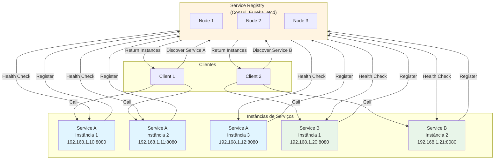

# Service Discovery e Service Registry

## 1. O que é
Service Discovery é o processo pelo quais serviços em um sistema distribuído encontram e se comunicam uns com os outros dinamicamente, sem hardcoding de endereços IP ou portas. Service Registry é um componente central que mantém um catálogo atualizado de todas as instâncias de serviços disponíveis, seus endereços, metadados e estado de saúde. Também é conhecido como "dynamic service discovery" ou "service registration pattern".

## 2. Por que existe (o problema que resolve)
Antes do Service Discovery, aplicações usavam endereços IP hardcoded ou arquivos de configuração estáticos para se comunicar. Isso criava problemas graves: impossibilidade de escalar horizontalmente, dificuldade de lidar com falhas de instâncias, necessidade de redeploy ao mudar infraestrutura, e impossibilidade de implementar features como canary deployments ou blue-green deployments. O padrão surgiu com a popularização de microserviços e ambientes cloud nativos, onde instâncias são efêmeras e endereços IP mudam constantemente. Netflix Eureka foi um dos primeiros implementações populares, seguido por Consul, etcd, Zookeeper e soluções cloud-native como Kubernetes Service Discovery.

## 3. Como funciona
O Service Discovery funciona através dos seguintes componentes e mecanismos:

- **Service Registry**: Banco de dados distribuído que armazena informações sobre serviços (nome, endereço, porta, metadados, health status)
- **Service Registration**: Processo pelo qual uma instância de serviço se registra no registry ao iniciar
- **Health Checking**: Verificação periódica do estado de saúde das instâncias registradas
- **Service Discovery**: Processo pelo qual um cliente consulta o registry para encontrar instâncias disponíveis de um serviço
- **Load Balancing**: Distribuição de tráfego entre múltiplas instâncias saudáveis
- **Deregistration**: Remoção automática de instâncias que falham health checks ou são desligadas gracefulmente

Existem dois modelos principais:
- **Client-side Discovery**: Cliente consulta o registry diretamente e escolhe qual instância chamar (ex: Netflix Eureka)
- **Server-side Discovery**: Cliente faz requisição para um load balancer/router que consulta o registry (ex: Kubernetes Service, AWS ALB)

O registry deve ser altamente disponível, eventualmente consistente, e tolerante a partições de rede (CAP theorem trade-offs).

## 4. Casos de uso reais

**Casos de uso comuns:**
- **Netflix**: Usa Eureka para service discovery em sua plataforma de streaming com milhares de microserviços
- **Kubernetes**: Implementa service discovery nativo via DNS e Services para pods efêmeros
- **HashiCorp Consul**: Usado por empresas como Lyft, Citrix e Slack para service discovery e configuration
- **AWS**: Usa Cloud Map para service discovery em ECS, EKS e Lambda
- **Spring Cloud**: Integrado com Eureka, Consul e Zookeeper para aplicações Java

**Quando NÃO usar:**
- Quando o sistema tem poucos serviços estáticos que não escalam frequentemente
- Quando a latência adicional de consultar o registry é inaceitável
- Quando o sistema é monolítico e não se beneficia de service discovery
- Quando a complexidade operacional do registry supera os benefícios

## 5. Cenários práticos e trade-offs

**Cenário 1: Auto-scaling com Service Discovery**
Uma aplicação de e-commerce tem um serviço de pedidos que escala automaticamente de 3 para 10 instâncias durante Black Friday. Cada nova instância se registra no Consul automaticamente. O serviço de catálogo descobre as novas instâncias via Consul e distribui tráfego igualmente. Quando o pico passa, instâncias são desligadas e removidas do registry automaticamente.

**Cenário 2: Multi-region Service Discovery**
Uma empresa tem serviços em AWS us-east-1 e eu-west-1. O Consul está configurado com datacenters multi-region. Serviços na região east podem descobrir serviços na região west para failover cross-region. O registry mantém informações sobre latência e custo de cada região para roteamento inteligente.

**Cenário 3 (Falha): Split Brain com Registry**
O cluster do service registry sofre uma partição de rede. Metade dos nós não consegue se comunicar com a outra metade. Instâncias de serviço se registram em apenas uma parte do cluster. Clientes consultam a parte que não tem essas instâncias e recebem listas incompletas, causando 503 errors e degradação do sistema.

**Trade-offs:**
- **Consistência vs Disponibilidade**: Registries geralmente escolhem disponibilidade (AP) sobre consistência forte (CP)
- **Latência**: Consultas ao registry adicionam latência a cada chamada de serviço
- **Complexidade Operacional**: Registry é um componente crítico que precisa ser altamente disponível
- **Flexibilidade**: Permite escalar, fazer canary deployments e blue-green deployments facilmente
- **Resiliência**: Automaticamente remove instâncias não saudáveis do tráfego
- **Custo**: Recursos adicionais para manter o registry e health checks

## 6. Diagrama e fluxo visual

**a) Diagrama Mermaid:**



**b) Prompt para geração de imagem:**

"A modern technical diagram showing Service Discovery and Service Registry architecture. A central service registry component (orange hexagon) in the middle, connected to multiple service instances on the right (blue and green circles representing different services). Client applications on the left (purple squares) query the registry to discover available services. Health check arrows go from the registry to service instances. Registration arrows go from service instances to the registry. Clean, professional, technical illustration style with clear labels and modern color palette."

## 7. Exemplo aplicado — Java + Spring

```java
// Application.java - Serviço que se registra
@SpringBootApplication
@EnableDiscoveryClient
@RestController
public class OrderService {
    
    private static final Logger logger = LoggerFactory.getLogger(OrderService.class);
    
    @Autowired
    private DiscoveryClient discoveryClient;
    
    @Value("${server.port}")
    private int port;
    
    @GetMapping("/orders/{id}")
    public ResponseEntity<Order> getOrder(@PathVariable String id) {
        logger.info("Processing order {} on port {}", id, port);
        
        Order order = new Order(id, "Product-" + id, 99.99);
        return ResponseEntity.ok(order);
    }
    
    @GetMapping("/services")
    public ResponseEntity<List<String>> getServices() {
        // Lista todos os serviços registrados
        return ResponseEntity.ok(discoveryClient.getServices());
    }
    
    @GetMapping("/service-instances/{serviceId}")
    public ResponseEntity<List<ServiceInstance>> getServiceInstances(@PathVariable String serviceId) {
        // Lista instâncias de um serviço específico
        return ResponseEntity.ok(discoveryClient.getInstances(serviceId));
    }
    
    public static void main(String[] args) {
        SpringApplication.run(OrderService.class, args);
    }
}

// Order.java
public class Order {
    private String id;
    private String product;
    private double amount;
    
    public Order(String id, String product, double amount) {
        this.id = id;
        this.product = product;
        this.amount = amount;
    }
    
    // Getters e setters
}

// application.yml
server:
  port: ${PORT:8080}
spring:
  application:
    name: order-service
  cloud:
    consul:
      host: consul.service-registry.svc.cluster.local
      port: 8500
      discovery:
        service-name: order-service
        health-check-path: /actuator/health
        health-check-interval: 10s
        prefer-ip-address: true
```

**Dockerfile:**
```dockerfile
FROM eclipse-temurin:17-jdk-alpine
COPY target/order-service.jar /app/order-service.jar
WORKDIR /app
EXPOSE 8080
ENTRYPOINT ["java", "-jar", "order-service.jar"]
```

**ClientService.java - Cliente que descobre serviços:**
```java
@Service
public class CatalogService {
    
    private static final Logger logger = LoggerFactory.getLogger(CatalogService.class);
    
    @Autowired
    private DiscoveryClient discoveryClient;
    
    @Autowired
    private LoadBalancerClient loadBalancer;
    
    @Autowired
    private RestTemplate restTemplate;
    
    public Order getOrderFromOrderService(String orderId) {
        // Descobre instâncias do order-service
        List<ServiceInstance> instances = discoveryClient.getInstances("order-service");
        
        if (instances.isEmpty()) {
            throw new RuntimeException("No order-service instances available");
        }
        
        // Usa load balancer para escolher instância
        ServiceInstance instance = loadBalancer.choose("order-service");
        String url = instance.getUri().toString() + "/orders/" + orderId;
        
        logger.info("Calling order-service at: {}", url);
        
        return restTemplate.getForObject(url, Order.class);
    }
}
```

**Ponto-chave:** A aplicação se registra automaticamente no Consul via @EnableDiscoveryClient. O cliente usa DiscoveryClient para encontrar instâncias do order-service dinamicamente, sem hardcoding de endereços IP.

## 8. Exemplo aplicado — TypeScript + NestJS

```typescript
// main.ts - Serviço que se registra
import { NestFactory } from '@nestjs/core';
import { AppModule } from './app.module';
import { ConsulConfig } from './consul.config';

async function bootstrap() {
  const app = await NestFactory.create(AppModule);
  
  const port = process.env.PORT || 3000;
  await app.listen(port);
  
  // Registra no Consul
  const consulConfig = new ConsulConfig();
  await consulConfig.register({
    name: 'order-service',
    address: process.env.HOSTNAME || 'localhost',
    port: parseInt(port.toString()),
    check: {
      http: `http://${process.env.HOSTNAME || 'localhost'}:${port}/health`,
      interval: '10s',
    },
  });
  
  console.log(`Order service listening on port ${port}`);
}
bootstrap();
```

**consul.config.ts:**
```typescript
import { Consul } from 'consul';

export class ConsulConfig {
  private consul: Consul;

  constructor() {
    this.consul = new Consul({
      host: process.env.CONSUL_HOST || 'consul.service-registry.svc.cluster.local',
      port: parseInt(process.env.CONSUL_PORT || '8500'),
    });
  }

  async register(service: any): Promise<void> {
    try {
      await this.consul.agent.service.register(service);
      console.log(`Service ${service.name} registered successfully`);
    } catch (error) {
      console.error('Failed to register service:', error);
    }
  }

  async deregister(serviceId: string): Promise<void> {
    try {
      await this.consul.agent.service.deregister(serviceId);
      console.log(`Service ${serviceId} deregistered successfully`);
    } catch (error) {
      console.error('Failed to deregister service:', error);
    }
  }

  async discover(serviceName: string): Promise<any[]> {
    try {
      const services = await this.consul.agent.service.list();
      const serviceIds = Object.keys(services).filter(
        (id) => id.startsWith(serviceName),
      );

      const instances = await Promise.all(
        serviceIds.map(async (id) => {
          const service = await this.consul.agent.service.get(id);
          return service;
        }),
      );

      return instances;
    } catch (error) {
      console.error('Failed to discover services:', error);
      return [];
    }
  }
}
```

**order.controller.ts:**
```typescript
import { Controller, Get, Param, Logger } from '@nestjs/common';

@Controller('orders')
export class OrderController {
  private readonly logger = new Logger(OrderController.name);

  @Get(':id')
  getOrder(@Param('id') id: string): Order {
    this.logger.log(`Processing order ${id}`);
    return {
      id,
      product: `Product-${id}`,
      amount: 99.99,
    };
  }
}

interface Order {
  id: string;
  product: string;
  amount: number;
}
```

**catalog.service.ts - Cliente que descobre serviços:**
```typescript
import { Injectable, Logger } from '@nestjs/common';
import { HttpService } from '@nestjs/axios';
import { ConsulConfig } from './consul.config';
import { firstValueFrom } from 'rxjs';

@Injectable()
export class CatalogService {
  private readonly logger = new Logger(CatalogService.name);

  constructor(
    private readonly httpService: HttpService,
    private readonly consulConfig: ConsulConfig,
  ) {}

  async getOrderFromOrderService(orderId: string): Promise<Order> {
    // Descobre instâncias do order-service
    const instances = await this.consulConfig.discover('order-service');

    if (instances.length === 0) {
      throw new Error('No order-service instances available');
    }

    // Escolhe instância aleatória (round-robin simples)
    const instance = instances[Math.floor(Math.random() * instances.length)];
    const url = `http://${instance.Address}:${instance.Port}/orders/${orderId}`;

    this.logger.log(`Calling order-service at: ${url}`);

    const response = await firstValueFrom(
      this.httpService.get<Order>(url),
    );
    return response.data;
  }
}
```

**Dockerfile:**
```dockerfile
FROM node:18-alpine
WORKDIR /app
COPY package*.json ./
RUN npm ci --only=production
COPY dist ./dist
EXPOSE 3000
CMD ["node", "dist/main"]
```

**kubernetes-deployment.yaml:**
```yaml
apiVersion: apps/v1
kind: Deployment
metadata:
  name: order-service
spec:
  replicas: 3
  selector:
    matchLabels:
      app: order-service
  template:
    metadata:
      labels:
        app: order-service
    spec:
      containers:
        - name: order-service
          image: order-service:latest
          ports:
            - containerPort: 3000
          env:
            - name: CONSUL_HOST
              value: "consul.service-registry.svc.cluster.local"
            - name: HOSTNAME
              valueFrom:
                fieldRef:
                  fieldPath: status.podIP
            - name: PORT
              value: "3000"
          livenessProbe:
            httpGet:
              path: /health
              port: 3000
            initialDelaySeconds: 30
            periodSeconds: 10
```

**Ponto-chave:** A aplicação se registra no Consul ao iniciar. O cliente consulta o Consul para descobrir instâncias disponíveis do order-service, permitindo escalabilidade horizontal e tolerância a falhas.

## 9. Comparação e armadilhas comuns

**Comparação com conceitos similares:**
- **Service Discovery vs Load Balancing**: Service Discovery encontra instâncias, Load Balancing distribui tráfego entre elas
- **Client-side vs Server-side Discovery**: Client-side (cliente escolhe instância) vs Server-side (load balancer escolhe)
- **Service Registry vs API Gateway**: Registry armazena informações de serviços, Gateway roteia tráfego baseado em regras

**Armadilhas comuns:**
1. **Stale Data**: Clientes cacheiam informações do registry por muito tempo, chamando instâncias que já morreram
2. **Hardcoded Registry Addresses**: Endereços do registry hardcoded no código, dificultando mudanças de infraestrutura
3. **Ignoring Health Checks**: Não implementar health checks adequados, deixando instâncias não saudáveis no tráfego
4. **Single Point of Failure**: Registry sem alta disponibilidade, causando falha em cascada quando o registry cai
5. **Over-registration**: Instâncias se registram mas não se desregistram ao desligar, causando acúmulo de entradas inválidas

## 10. Perguntas para fixação

1. Você está usando client-side discovery com Eureka. Durante um pico de tráfego, o registry fica sobrecarregado e responde lentamente. Como você implementaria caching no cliente para reduzir a carga no registry enquanto garante que instâncias mortas não sejam chamadas?

2. Você tem serviços em múltiplas regiões (us-east-1, eu-west-1, ap-southeast-1). Como você configuraria o service registry para permitir cross-region discovery enquanto minimiza latência e custo de chamadas cross-region?

3. Desenhe a arquitetura de um sistema que usa service discovery para implementar canary deployment. Como você garantiria que apenas 10% do tráfego vá para a nova versão do serviço, e que o sistema possa instantaneamente redirecionar 100% de volta para a versão antiga se houver problemas?
