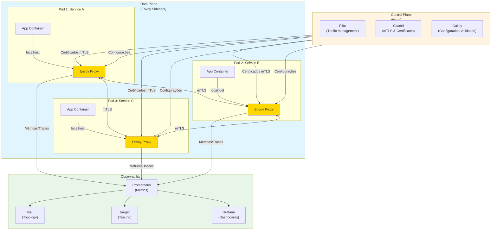

# Service Mesh

## 1. O que é
Service Mesh é uma camada de infraestrutura dedicada para gerenciar comunicação entre microserviços, fornecendo funcionalidades como service discovery, load balancing, encryption, observabilidade, resiliência e segurança de forma transparente às aplicações. É implementado através de proxies sidecar (geralmente Envoy) injetados em cada pod, controlados por um plano de controle centralizado. Também é conhecido como "service mesh architecture" ou "microservices mesh".

## 2. Por que existe (o problema que resolve)
Antes do Service Mesh, funcionalidades cross-cutting como TLS mTLS, observabilidade distribuída, rate limiting, circuit breaking e traffic splitting eram implementadas em cada microserviço individualmente, resultando em código duplicado, inconsistências, e alto custo de manutenção. Além disso, linguagens diferentes tinham bibliotecas diferentes para as mesmas funcionalidades. O Service Mesh surgiu com a necessidade de padronizar e centralizar essas funcionalidades em ambientes de microserviços complexos. Linkerd (2016) foi o primeiro service mesh, seguido por Istio (2017) que se tornou o padrão de facto na indústria, ambos utilizando o proxy Envoy como data plane.

## 3. Como funciona
O Service Mesh funciona através de dois componentes principais:

- **Data Plane**: Proxies sidecar (geralmente Envoy) injetados em cada pod que interceptam todo o tráfego de rede entrada/saída
- **Control Plane**: Componente centralizado (ex: Istiod) que configura e gerencia os proxies do data plane

**Mecanismos:**
- **Sidecar Injection**: Proxy é automaticamente injetado em cada pod via admission webhook do Kubernetes
- **Traffic Interception**: Proxy intercepta todo o tráfego via iptables/iptables-redirection
- **Configuration Distribution**: Control plane distribui configurações (rotas, policies, TLS certs) para os proxies
- **Service Discovery**: Proxy descobre dinamicamente endpoints de serviços via Kubernetes DNS ou service registry
- **Load Balancing**: Proxy implementa algoritmos (round-robin, least-conn, weighted) para distribuir tráfego
- **mTLS**: Proxy gerencia certificados TLS automáticos entre serviços (mutual TLS)
- **Observabilidade**: Proxy coleta métricas, logs e distributed traces de toda comunicação
- **Resiliency**: Proxy implementa retry, timeout, circuit breaking e fault injection

O control plane usa CRDs (Custom Resource Definitions) do Kubernetes para definir policies (VirtualService, DestinationRule, Gateway, AuthorizationPolicy, etc.) que são traduzidas em configurações do proxy.

## 4. Casos de uso reais

**Casos de uso comuns:**
- **Google**: Usa Istio internamente para gerenciar comunicação entre milhares de microserviços
- **IBM**: Implementou Istio em sua plataforma Cloud Foundry e IBM Cloud
- **Salesforce**: Usa service mesh para observabilidade e segurança entre microserviços
- **Airbnb**: Implementou service mesh customizado baseado em Envoy para gerenciar tráfego
- **Lyft**: Criador do Envoy proxy, usa service mesh para gerenciar comunicação entre serviços

**Quando NÃO usar:**
- Quando o sistema tem poucos microserviços (menos de 10-15)
- Quando a complexidade operacional do service mesh supera os benefícios
- Quando a equipe não tem expertise em operar infraestrutura complexa
- Quando a latência adicionada pelos proxies é inaceitável (ex: sistemas de alta frequência)

## 5. Cenários práticos e trade-offs

**Cenário 1: Canary Deployment com Service Mesh**
Uma empresa quer lançar nova versão do serviço de pagamentos. O service mesh é configurado para rotear 5% do tráfego para v2 e 95% para v1. Métricas são coletadas automaticamente pelo mesh (latência, error rate, throughput). Se v2 tiver problemas, o mesh instantaneamente redireciona 100% para v1 via mudança de configuração no control plane, sem redeploy.

**Cenário 2: mTLS Automático entre Serviços**
Todos os serviços precisam se comunicar de forma segura. O service mesh automaticamente gera e roda certificados TLS para cada serviço, implementa mTLS (mutual TLS) entre todos os serviços, e roda certificados antes que expirem. As aplicações não precisam implementar nenhuma lógica de TLS.

**Cenário 3 (Falha): Control Plane Downgrade**
O control plane do service mesh fica indisponível devido a um bug. Os proxies continuam funcionando com a última configuração conhecida, mas não recebem atualizações. Uma nova versão de um serviço é implantada, mas os proxies não redirecionam tráfego para ela porque não receberam a nova configuração. O sistema opera em modo degradado até o control plane ser restaurado.

**Trade-offs:**
- **Complexidade Operacional**: Service mesh adiciona significativa complexidade operacional (control plane, proxies, CRDs)
- **Latência**: Cada hop adiciona 1-5ms de latência (proxy sidecar)
- **Consumo de Recursos**: Cada pod executa um proxy adicional (CPU, memória)
- **Observabilidade**: Visibilidade profunda de toda comunicação entre serviços
- **Segurança**: mTLS automático e policies de autorização centralizadas
- **Flexibilidade**: Traffic splitting, canary deployments, fault injection sem mudar código

## 6. Diagrama e fluxo visual

**a) Diagrama Mermaid:**



**b) Prompt para geração de imagem:**

"A modern technical diagram showing Service Mesh architecture. A control plane component (orange hexagon) at the top, connected to multiple pods below. Each pod contains an application container (blue) and an Envoy proxy sidecar (yellow). The proxies communicate with each other via mTLS (green arrows). The control plane distributes configurations and certificates to all proxies. On the right, an observability stack (Prometheus, Grafana, Jaeger, Kiali) receives metrics and traces from all proxies. Clean, professional, technical illustration style with clear labels and modern color palette."

## 7. Exemplo aplicado — Java + Spring

```java
// OrderController.java - Aplicação (sem código de service mesh)
@RestController
@RequestMapping("/api/orders")
public class OrderController {
    
    private static final Logger logger = LoggerFactory.getLogger(OrderController.class);
    
    @Autowired
    private PaymentServiceClient paymentServiceClient;
    
    @PostMapping
    public ResponseEntity<Order> createOrder(@RequestBody OrderRequest request) {
        logger.info("Creating order for customer: {}", request.getCustomerId());
        
        // Chama serviço de pagamentos - service mesh gerencia mTLS, retry, etc.
        PaymentResponse payment = paymentServiceClient.processPayment(request.getPayment());
        
        Order order = new Order(UUID.randomUUID().toString(), request, payment);
        logger.info("Order created: {}", order.getId());
        
        return ResponseEntity.ok(order);
    }
}

// PaymentServiceClient.java - Cliente HTTP (sem código de service mesh)
@Service
public class PaymentServiceClient {
    
    private static final Logger logger = LoggerFactory.getLogger(PaymentServiceClient.class);
    
    @Autowired
    private RestTemplate restTemplate;
    
    @Value("${payment.service.url}")
    private String paymentServiceUrl;
    
    public PaymentResponse processPayment(PaymentRequest request) {
        // Service mesh intercepta essa chamada e aplica:
        // - mTLS automático
        // - Retry com exponential backoff
        // - Circuit breaking
        // - Distributed tracing
        // - Metrics collection
        
        String url = paymentServiceUrl + "/payments";
        logger.info("Calling payment service at: {}", url);
        
        HttpHeaders headers = new HttpHeaders();
        headers.setContentType(MediaType.APPLICATION_JSON);
        
        HttpEntity<PaymentRequest> entity = new HttpEntity<>(request, headers);
        return restTemplate.postForObject(url, entity, PaymentResponse.class);
    }
}

// application.yml
server:
  port: 8080
spring:
  application:
    name: order-service
payment:
  service:
    url: http://payment-service:8080  # Kubernetes service name
```

**Dockerfile:**
```dockerfile
FROM eclipse-temurin:17-jdk-alpine
COPY target/order-service.jar /app/order-service.jar
WORKDIR /app
EXPOSE 8080
ENTRYPOINT ["java", "-jar", "order-service.jar"]
```

**Istio VirtualService (traffic management):**
```yaml
apiVersion: networking.istio.io/v1beta1
kind: VirtualService
metadata:
  name: payment-service
spec:
  hosts:
    - payment-service
  http:
    - match:
        - headers:
            x-canary:
              exact: "true"
      route:
        - destination:
            host: payment-service
            subset: v2
          weight: 100
    - route:
        - destination:
            host: payment-service
            subset: v1
          weight: 90
        - destination:
            host: payment-service
            subset: v2
          weight: 10
```

**Istio DestinationRule (load balancing):**
```yaml
apiVersion: networking.istio.io/v1beta1
kind: DestinationRule
metadata:
  name: payment-service
spec:
  host: payment-service
  trafficPolicy:
    loadBalancer:
      simple: LEAST_CONN
    connectionPool:
      tcp:
        maxConnections: 100
      http:
        http1MaxPendingRequests: 50
        maxRequestsPerConnection: 3
    circuitBreaker:
      consecutiveErrors: 5
      interval: 30s
      baseEjectionTime: 30s
  subsets:
    - name: v1
      labels:
        version: v1
    - name: v2
      labels:
        version: v2
```

**Ponto-chave:** A aplicação não tem código de service mesh. Todo o tráfego é interceptado pelo Envoy proxy injetado automaticamente, que aplica mTLS, retry, circuit breaking, e coleta métricas configuradas via Istio CRDs.

## 8. Exemplo aplicado — TypeScript + NestJS

```typescript
// order.controller.ts - Aplicação (sem código de service mesh)
import { Controller, Post, Body, Logger } from '@nestjs/common';
import { OrderService } from './order.service';

@Controller('api/orders')
export class OrderController {
  private readonly logger = new Logger(OrderController.name);

  constructor(private readonly orderService: OrderService) {}

  @Post()
  async createOrder(@Body() request: OrderRequest): Promise<Order> {
    this.logger.log(`Creating order for customer: ${request.customerId}`);
    
    // Service mesh gerencia toda a comunicação de rede
    const order = await this.orderService.createOrder(request);
    
    this.logger.log(`Order created: ${order.id}`);
    return order;
  }
}

// order.service.ts - Serviço (sem código de service mesh)
import { Injectable, Logger } from '@nestjs/common';
import { HttpService } from '@nestjs/axios';
import { ConfigService } from '@nestjs/config';
import { firstValueFrom } from 'rxjs';

@Injectable()
export class OrderService {
  private readonly logger = new Logger(OrderService.name);

  constructor(
    private readonly httpService: HttpService,
    private readonly configService: ConfigService,
  ) {}

  async createOrder(request: OrderRequest): Promise<Order> {
    // Service mesh intercepta essa chamada e aplica:
    // - mTLS automático
    // - Retry com exponential backoff
    // - Circuit breaking
    // - Distributed tracing
    // - Metrics collection
    
    const paymentServiceUrl = this.configService.get('PAYMENT_SERVICE_URL');
    const paymentResponse = await firstValueFrom(
      this.httpService.post<PaymentResponse>(
        `${paymentServiceUrl}/payments`,
        request.payment,
      ),
    );

    const order: Order = {
      id: crypto.randomUUID(),
      customerId: request.customerId,
      items: request.items,
      payment: paymentResponse,
      status: 'created',
      createdAt: new Date().toISOString(),
    };

    return order;
  }
}

// interfaces.ts
export interface OrderRequest {
  customerId: string;
  items: OrderItem[];
  payment: PaymentRequest;
}

export interface OrderItem {
  productId: string;
  quantity: number;
  price: number;
}

export interface PaymentRequest {
  amount: number;
  currency: string;
  method: string;
}

export interface PaymentResponse {
  transactionId: string;
  status: string;
  timestamp: string;
}

export interface Order {
  id: string;
  customerId: string;
  items: OrderItem[];
  payment: PaymentResponse;
  status: string;
  createdAt: string;
}
```

**Dockerfile:**
```dockerfile
FROM node:18-alpine
WORKDIR /app
COPY package*.json ./
RUN npm ci --only=production
COPY dist ./dist
EXPOSE 3000
CMD ["node", "dist/main"]
```

**Istio PeerAuthentication (mTLS):**
```yaml
apiVersion: security.istio.io/v1beta1
kind: PeerAuthentication
metadata:
  name: default
spec:
  mtls:
    mode: STRICT
```

**Istio AuthorizationPolicy (RBAC):**
```yaml
apiVersion: security.istio.io/v1beta1
kind: AuthorizationPolicy
metadata:
  name: payment-service-policy
spec:
  selector:
    matchLabels:
      app: payment-service
  rules:
    - from:
        - source:
            principals: ["cluster.local/ns/default/sa/order-service"]
      to:
        - operation:
            methods: ["POST"]
            paths: ["/api/payments"]
```

**kubernetes-deployment.yaml (com automatic sidecar injection):**
```yaml
apiVersion: apps/v1
kind: Deployment
metadata:
  name: order-service
spec:
  replicas: 3
  selector:
    matchLabels:
      app: order-service
  template:
    metadata:
      labels:
        app: order-service
        version: v1
      annotations:
        sidecar.istio.io/inject: "true"  # Habilita injeção automática
    spec:
      serviceAccountName: order-service
      containers:
        - name: order-service
          image: order-service:latest
          ports:
            - containerPort: 3000
          env:
            - name: PAYMENT_SERVICE_URL
              value: "http://payment-service:8080"
```

**Ponto-chave:** A aplicação NestJS não tem código de service mesh. O Envoy proxy é injetado automaticamente via annotation `sidecar.istio.io/inject: "true"`, e todas as políticas de segurança, resiliência e observabilidade são configuradas via Istio CRDs.

## 9. Comparação e armadilhas comuns

**Comparação com conceitos similares:**
- **Service Mesh vs API Gateway**: Service Mesh gerencia comunicação leste-oeste (serviço-serviço), API Gateway gerencia comunicação norte-sul (cliente-serviço)
- **Service Mesh vs Ambassador Pattern**: Ambassador é um proxy individual, Service Mesh é uma infraestrutura completa que gerencia múltiplos proxies
- **Service Mesh vs Kubernetes Service**: Kubernetes Service faz load balancing L4, Service Mesh faz L7 com features avançadas

**Armadilhas comuns:**
1. **Over-engineering**: Implementar service mesh para sistemas simples com poucos serviços
2. **Ignoring Resource Impact**: Não considerar o overhead de CPU/memória dos proxies em cada pod
3. **Complex Configuration**: Configurar mal VirtualServices e DestinationRules, causando routing loops ou tráfego incorreto
4. **Monitoring Gaps**: Não monitorar o control plane e proxies, levando a problemas não detectados
5. **Version Conflicts**: Usar versões incompatíveis de Istio/Kubernetes, causando problemas de injeção de sidecar

## 10. Perguntas para fixação

1. Você tem um cluster Kubernetes com 100 microserviços e está considerando implementar Istio. Como você calcularia o custo adicional de recursos (CPU, memória) dos proxies sidecar, e como você justificaria esse investimento para a liderança?

2. O control plane do service mesh está indisponível devido a uma falha. Como você projetaria a arquitetura para garantir que os proxies continuem operando com a última configuração conhecida, e como você monitoraria esse estado degradado?

3. Você precisa implementar uma política de rate limiting por usuário no service mesh. Como você configuraria isso usando Istio, e quais são as limitações de fazer rate limiting no nível de service mesh vs implementar na aplicação?
