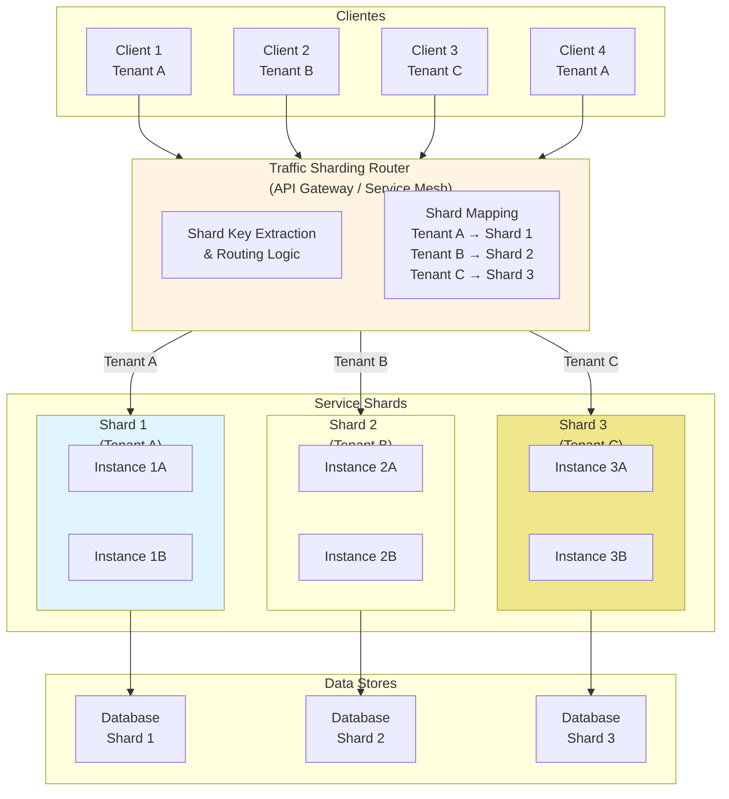

# Traffic Sharding

## 1. O que é
Traffic Sharding é o padrão de arquitetura onde o tráfego de um serviço é dividido em múltiplas partições (shards) baseado em critérios específicos como ID de usuário, região geográfica, tenant ID, ou hash de requisição. Cada shard é processado por um conjunto independente de instâncias do serviço, permitindo isolamento, escalabilidade granular e otimização de recursos. Também é conhecido como "traffic partitioning", "request routing" ou "data-aware routing".

## 2. Por que existe (o problema que resolve)
Antes do Traffic Sharding, todos os usuários/tenants compartilhavam o mesmo pool de recursos, criando problemas: noisy neighbor effects (um tenant pesado afeta outros), dificuldade de escalabilidade granular (escalar todo o serviço quando apenas um subset precisa), impossibilidade de isolamento de falhas (um bug afeta todos os usuários), e custos sub-ótimos (não é possível usar infraestrutura diferente para diferentes workloads). O padrão surgiu com a popularização de SaaS multi-tenant e sistemas de larga escala, onde diferentes usuários/tenants têm requisitos muito diferentes. Empresas como Google, Uber e Airbnb usam traffic sharding extensivamente para gerenciar tráfego em escala.

## 3. Como funciona
O Traffic Sharding funciona através dos seguintes componentes e mecanismos:

- **Shard Key**: Atributo usado para determinar qual shard uma requisição pertence (user ID, tenant ID, region, hash)
- **Shard Router**: Componente que avalia o shard key e roteia a requisição para o shard apropriado
- **Shard Instances**: Conjunto de instâncias de serviço dedicadas a processar requisições de um shard específico
- **Shard Mapping**: Configuração que define quais critérios mapeiam para quais shards
- **Consistent Hashing**: Algoritmo que distribui uniformemente tráfego entre shards e minimiza remapping quando shards são adicionados/removidos

**Mecanismos de Roteamento:**
- **Header-based Routing**: Shard key é extraído de headers HTTP (ex: X-Tenant-ID)
- **Path-based Routing**: Shard key é extraído do path da URL (ex: /api/tenants/{id}/orders)
- **Cookie-based Routing**: Shard key é armazenado em cookie para sessões stateful
- **Geo-based Routing**: Shard key é derivado da localização geográfica do cliente
- **Hash-based Routing**: Shard key é um hash de um atributo (ex: hash(user_id) % num_shards)

O router pode ser implementado em diferentes camadas: API Gateway, Load Balancer, Service Mesh (via VirtualService), ou application-level routing.

## 4. Casos de uso reais

**Casos de uso comuns:**
- **Uber**: Usa traffic sharding por cidade/região para isolar falhas e otimizar latência
- **Airbnb**: Shard por listing ID para distribuir carga de busca de acomodações
- **Stripe**: Shard por merchant ID para isolar dados e processamento de pagamentos
- **Slack**: Shard por workspace ID para isolar tenants enterprise
- **Google**: Shard por user ID para distribuir tráfego em data centers globais

**Quando NÃO usar:**
- Quando o sistema tem poucos usuários/tenants que não justificam a complexidade
- Quando o overhead de gerenciar múltiplos shards supera os benefícios
- Quando o tráfego é uniforme e não há noisy neighbor effects
- Quando a aplicação não pode ser facilmente particionada (forte acoplamento entre dados)

## 5. Cenários práticos e trade-offs

**Cenário 1: Multi-tenant SaaS com Enterprise Customers**
Uma plataforma SaaS tem 1000 tenants, sendo 10 enterprise customers que geram 80% do tráfego. O traffic sharding é configurado para rotear enterprise customers para shards dedicados com mais recursos e SLA garantido, enquanto customers regulares compartilham shards menores. Se um enterprise customer tem um pico de tráfego, apenas o shard dele escala, não afetando outros tenants.

**Cenário 2: Geo-based Sharding para Latência**
Uma aplicação global tem usuários em EU, Europa e Ásia. O traffic sharding roteia usuários baseado em sua localização geográfica para shards na região mais próxima. Isso reduz latência e permite compliance com data residency laws (dados de usuários europeiros ficam em servidores na Europa).

**Cenário 3 (Falha): Shard Hotspot**
Um shard key mal escolhido (ex: hash de timestamp) causa que todas as requisições em um determinado período vão para o mesmo shard. Durante Black Friday, o shard correspondente ao período de pico fica sobrecarregado e falha, enquanto outros shards estão ociosos. O sistema inteiro degrada porque o shard crítico não consegue processar o tráfego.

**Trade-offs:**
- **Complexidade Operacional**: Mais shards, mais instâncias, mais configurações para gerenciar
- **Resource Efficiency**: Permite alocar recursos baseado em workload real de cada shard
- **Isolamento**: Falhas em um shard não afetam outros shards
- **Scalability**: Escalabilidade granular (escalar apenas shards que precisam)
- **Cost**: Possível reduzir custos usando infraestrutura diferente para diferentes shards
- **Data Locality**: Pode otimizar latência e compliance com data residency

## 6. Diagrama e fluxo visual

**a) Diagrama Mermaid:**



**b) Prompt para geração de imagem:**

"A modern technical diagram showing Traffic Sharding architecture. Multiple clients on the left (different colors representing different tenants) sending requests to a central traffic sharding router (orange hexagon). The router distributes traffic to three different service shards (blue, green, yellow) based on tenant ID. Each shard has its own database instance (matching colors). Clean, professional, technical illustration style with clear labels and modern color palette showing isolation between shards."

## 7. Exemplo aplicado — Java + Spring

```java
// TenantContext.java - Contexto do tenant
public class TenantContext {
    private static final ThreadLocal<String> currentTenant = new ThreadLocal<>();
    
    public static void setTenant(String tenantId) {
        currentTenant.set(tenantId);
    }
    
    public static String getTenant() {
        return currentTenant.get();
    }
    
    public static void clear() {
        currentTenant.remove();
    }
}

// TenantInterceptor.java - Interceptor para extrair tenant ID
@Component
public class TenantInterceptor implements HandlerInterceptor {
    
    @Override
    public boolean preHandle(HttpServletRequest request, 
                           HttpServletResponse response, 
                           Object handler) {
        String tenantId = request.getHeader("X-Tenant-ID");
        if (tenantId != null) {
            TenantContext.setTenant(tenantId);
        }
        return true;
    }
    
    @Override
    public void afterCompletion(HttpServletRequest request, 
                                HttpServletResponse response, 
                                Object handler, Exception ex) {
        TenantContext.clear();
    }
}

// OrderController.java - Controlador com tenant context
@RestController
@RequestMapping("/api/orders")
public class OrderController {
    
    private static final Logger logger = LoggerFactory.getLogger(OrderController.class);
    
    @Autowired
    private OrderService orderService;
    
    @PostMapping
    public ResponseEntity<Order> createOrder(@RequestBody OrderRequest request) {
        String tenantId = TenantContext.getTenant();
        logger.info("Creating order for tenant: {}", tenantId);
        
        Order order = orderService.createOrder(request, tenantId);
        return ResponseEntity.ok(order);
    }
}

// OrderService.java - Serviço com routing baseado em tenant
@Service
public class OrderService {
    
    private static final Logger logger = LoggerFactory.getLogger(OrderService.class);
    
    @Autowired
    private RestTemplate restTemplate;
    
    @Value("${shard.base.url}")
    private String shardBaseUrl;
    
    public Order createOrder(OrderRequest request, String tenantId) {
        // Determina qual shard baseado no tenant ID
        String shardUrl = getShardUrl(tenantId);
        
        logger.info("Routing order to shard: {}", shardUrl);
        
        HttpHeaders headers = new HttpHeaders();
        headers.setContentType(MediaType.APPLICATION_JSON);
        headers.set("X-Tenant-ID", tenantId);
        
        HttpEntity<OrderRequest> entity = new HttpEntity<>(request, headers);
        return restTemplate.postForObject(shardUrl + "/orders", entity, Order.class);
    }
    
    private String getShardUrl(String tenantId) {
        // Consistent hashing para determinar shard
        int shardNum = Math.abs(tenantId.hashCode()) % 3;
        return shardBaseUrl + "-shard" + shardNum;
    }
}

// application.yml
server:
  port: 8080
shard:
  base:
    url: http://order-service
```

**Dockerfile:**
```dockerfile
FROM eclipse-temurin:17-jdk-alpine
COPY target/order-service.jar /app/order-service.jar
WORKDIR /app
EXPOSE 8080
ENTRYPOINT ["java", "-jar", "order-service.jar"]
```

**Istio VirtualService (traffic sharding):**
```yaml
apiVersion: networking.istio.io/v1beta1
kind: VirtualService
metadata:
  name: order-service
spec:
  hosts:
    - order-service
  http:
    - match:
        - headers:
            x-tenant-id:
              regex: "tenant-[a-c].*"
      route:
        - destination:
            host: order-service
            subset: shard1
    - match:
        - headers:
            x-tenant-id:
              regex: "tenant-[d-m].*"
      route:
        - destination:
            host: order-service
            subset: shard2
    - match:
        - headers:
            x-tenant-id:
              regex: "tenant-[n-z].*"
      route:
        - destination:
            host: order-service
            subset: shard3
```

**Istio DestinationRule (shard subsets):**
```yaml
apiVersion: networking.istio.io/v1beta1
kind: DestinationRule
metadata:
  name: order-service
spec:
  host: order-service
  subsets:
    - name: shard1
      labels:
        shard: "1"
    - name: shard2
      labels:
        shard: "2"
    - name: shard3
      labels:
        shard: "3"
```

**Ponto-chave:** O tráfego é roteado baseado no header X-Tenant-ID. O Istio VirtualService usa regex para determinar qual shard (subset) receberá a requisição baseado no tenant ID.

## 8. Exemplo aplicado — TypeScript + NestJS

```typescript
// tenant.context.ts - Contexto do tenant
import { AsyncLocalStorage } from 'async_hooks';

export interface TenantContext {
  tenantId: string;
}

const asyncLocalStorage = new AsyncLocalStorage<TenantContext>();

export class TenantContextService {
  static setTenant(tenantId: string): void {
    const store = asyncLocalStorage.getStore();
    if (store) {
      store.tenantId = tenantId;
    }
  }

  static getTenant(): string | undefined {
    const store = asyncLocalStorage.getStore();
    return store?.tenantId;
  }

  static run<T>(tenantId: string, callback: () => T): T {
    return asyncLocalStorage.run({ tenantId }, callback);
  }
}

// tenant.middleware.ts - Middleware para extrair tenant ID
import { Injectable, NestMiddleware } from '@nestjs/common';
import { Request, Response, NextFunction } from 'express';
import { TenantContextService } from './tenant.context';

@Injectable()
export class TenantMiddleware implements NestMiddleware {
  use(req: Request, res: Response, next: NextFunction) {
    const tenantId = req.headers['x-tenant-id'] as string;
    if (tenantId) {
      TenantContextService.setTenant(tenantId);
    }
    next();
  }
}

// order.controller.ts - Controlador com tenant context
import { Controller, Post, Body, Logger } from '@nestjs/common';
import { OrderService } from './order.service';
import { TenantContextService } from './tenant.context';

@Controller('api/orders')
export class OrderController {
  private readonly logger = new Logger(OrderController.name);

  constructor(private readonly orderService: OrderService) {}

  @Post()
  async createOrder(@Body() request: OrderRequest): Promise<Order> {
    const tenantId = TenantContextService.getTenant();
    this.logger.log(`Creating order for tenant: ${tenantId}`);

    const order = await this.orderService.createOrder(request, tenantId);
    return order;
  }
}

// order.service.ts - Serviço com routing baseado em tenant
import { Injectable, Logger } from '@nestjs/common';
import { HttpService } from '@nestjs/axios';
import { ConfigService } from '@nestjs/config';
import { firstValueFrom } from 'rxjs';

@Injectable()
export class OrderService {
  private readonly logger = new Logger(OrderService.name);

  constructor(
    private readonly httpService: HttpService,
    private readonly configService: ConfigService,
  ) {}

  async createOrder(request: OrderRequest, tenantId: string): Promise<Order> {
    // Determina qual shard baseado no tenant ID
    const shardUrl = this.getShardUrl(tenantId);

    this.logger.log(`Routing order to shard: ${shardUrl}`);

    const response = await firstValueFrom(
      this.httpService.post<Order>(`${shardUrl}/orders`, request, {
        headers: {
          'Content-Type': 'application/json',
          'X-Tenant-ID': tenantId,
        },
      }),
    );

    return response.data;
  }

  private getShardUrl(tenantId: string): string {
    // Consistent hashing para determinar shard
    const hash = this.hashCode(tenantId);
    const shardNum = Math.abs(hash) % 3;
    const baseUrl = this.configService.get('SHARD_BASE_URL');
    return `${baseUrl}-shard${shardNum}`;
  }

  private hashCode(str: string): number {
    let hash = 0;
    for (let i = 0; i < str.length; i++) {
      const char = str.charCodeAt(i);
      hash = (hash << 5) - hash + char;
      hash = hash & hash; // Convert to 32bit integer
    }
    return hash;
  }
}

// interfaces.ts
export interface OrderRequest {
  customerId: string;
  items: OrderItem[];
  total: number;
}

export interface OrderItem {
  productId: string;
  quantity: number;
  price: number;
}

export interface Order {
  id: string;
  tenantId: string;
  customerId: string;
  items: OrderItem[];
  total: number;
  status: string;
  createdAt: string;
}
```

**Dockerfile:**
```dockerfile
FROM node:18-alpine
WORKDIR /app
COPY package*.json ./
RUN npm ci --only=production
COPY dist ./dist
EXPOSE 3000
CMD ["node", "dist/main"]
```

**kubernetes-deployment.yaml (shard 1):**
```yaml
apiVersion: apps/v1
kind: Deployment
metadata:
  name: order-service-shard1
spec:
  replicas: 3
  selector:
    matchLabels:
      app: order-service
      shard: "1"
  template:
    metadata:
      labels:
        app: order-service
        shard: "1"
    spec:
      containers:
        - name: order-service
          image: order-service:latest
          ports:
            - containerPort: 3000
          env:
            - name: SHARD_BASE_URL
              value: "http://order-service"
            - name: SHARD_ID
              value: "1"
```

**kubernetes-deployment.yaml (shard 2):**
```yaml
apiVersion: apps/v1
kind: Deployment
metadata:
  name: order-service-shard2
spec:
  replicas: 2
  selector:
    matchLabels:
      app: order-service
      shard: "2"
  template:
    metadata:
      labels:
        app: order-service
        shard: "2"
    spec:
      containers:
        - name: order-service
          image: order-service:latest
          ports:
            - containerPort: 3000
          env:
            - name: SHARD_BASE_URL
              value: "http://order-service"
            - name: SHARD_ID
              value: "2"
```

**Ponto-chave:** Cada shard tem seu próprio deployment com diferentes números de réplicas. O routing é feito baseado no tenant ID via consistent hashing, e o Istio pode ser usado para rotear tráfego para os shards apropriados.

## 9. Comparação e armadilhas comuns

**Comparação com conceitos similares:**
- **Traffic Sharding vs Database Sharding**: Traffic sharding roteia tráfego para diferentes instâncias de serviço, database sharding particiona dados em diferentes bancos
- **Traffic Sharding vs Load Balancing**: Load balancing distribui tráfego uniformemente, traffic sharding distribui baseado em critérios específicos
- **Traffic Sharding vs Canary Deployment**: Canary deployment roteia versões diferentes do serviço, traffic sharding roteia tenants/usuários diferentes

**Armadilhas comuns:**
1. **Hotspot Shards**: Shard key mal escolhido causa desbalanceamento de tráfego (ex: todos enterprise customers vão para o mesmo shard)
2. **Cross-shard Dependencies**: Serviços precisam de dados de múltiplos shards, causando latência e complexidade
3. **Shard Rebalancing**: Adicionar/remover shards requer remapping complexo de tenants, causando downtime
4. **Monitoring Gaps**: Não monitorar cada shard individualmente, levando a problemas não detectados em shards específicos
5. **Data Consistency**: Dificuldade de manter consistência entre shards quando há cross-shard transactions

## 10. Perguntas para fixação

1. Você tem um sistema multi-tenant com 1000 tenants, sendo 50 enterprise customers que geram 90% do tráfego. Como você projetaria uma estratégia de traffic sharding para garantir que enterprise customers tenham SLA garantido sem afetar customers regulares, e como você implementaria failover cross-shard?

2. O shard key atual é baseado em tenant ID, mas você está observando que alguns tenants têm picos de tráfego muito maiores que outros, causando hotspots. Como você implementaria dynamic sharding para automaticamente rebalancear tenants entre shards baseado em carga real?

3. Desenhe a arquitetura de um sistema que usa traffic sharding por região geográfica (US, EU, APAC). Como você garantiria que usuários que viajam entre regiões continuem acessando seus dados consistentemente, e como você implementaria failover cross-region quando uma região cai?
