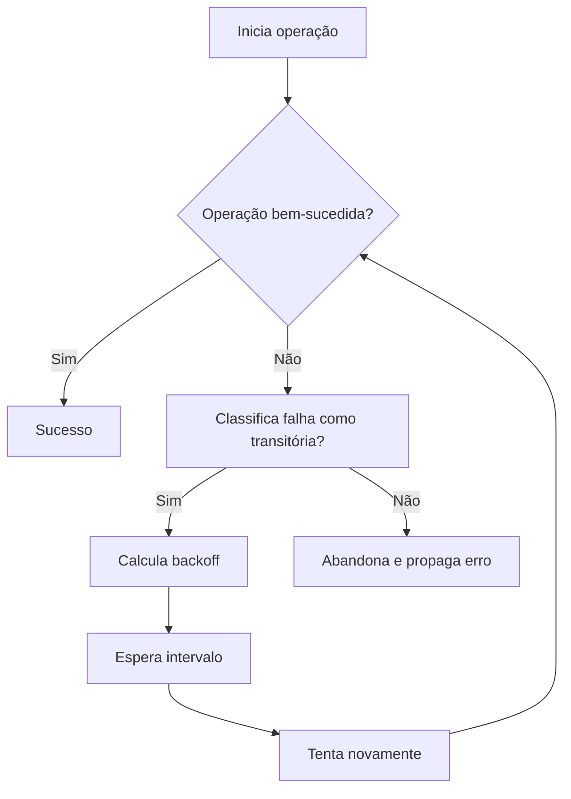

# Backoff

## 1. O que é

Backoff é uma estratégia de atraso intencional entre tentativas de repetição de uma operação após uma falha. A ideia central é simples: em vez de tentar novamente imediatamente, o sistema espera um intervalo crescente, reduzindo a pressão sobre a dependência afetada e aumentando a chance de a falha transitória desaparecer.

Em sistemas distribuídos, backoff é frequentemente usado junto com retry, mas o conceito é mais amplo: ele define como o sistema deve "resfriar" antes de tentar de novo.

Nomes alternativos e sinônimos usados no mercado:

- Retry backoff
- Delay strategy
- Cooldown strategy
- Backoff policy
- Exponential backoff
- Jittered retry
- Throttling-aware retry

Variações/tipos mais comuns:

- Fixed Backoff
- Linear Backoff
- Exponential Backoff
- Fibonacci Backoff
- Adaptive Backoff
- Backoff em filas

## 2. Por que existe (o problema que resolve)

O problema que backoff resolve é o fenômeno de re-tentativas agressivas em sistemas sob falha. Quando uma dependência externa falha temporariamente, se todos os clientes tentarem novamente de forma imediata e em massa, o sistema afetado pode sofrer um efeito em cascata: mais carga, mais timeout, mais falhas e, consequentemente, mais retries. Isso é conhecido como retry storm.

Antes de estratégias de backoff bem planejadas, sistemas tendiam a piorar o próprio problema. Em redes e serviços distribuídos, uma única falha transitória podia se transformar em uma onda de retries simultâneos que saturava threads, conexões, filas e CPU.

A origem histórica é antiga e está profundamente ligada à computação em rede. Em protocolos de comunicação, mecanismos de retransmissão com espera progressiva foram adotados para evitar colisões e congestionamento. Na prática moderna, o conceito se consolidou em sistemas distribuídos e em arquiteturas orientadas a APIs, filas e microsserviços, sobretudo com a popularização de clientes HTTP, brokers de mensagens e APIs de terceiros.

Embora o termo seja usado em muitos contextos, o uso mais comum hoje vem da combinação de:

- retry policies em clientes
- backpressure em sistemas assíncronos
- políticas de cooldown em serviços e filas
- congestion control em protocolos de rede

## 3. Tipos e características

### Fixed Backoff

Como funciona:

- O sistema espera sempre o mesmo intervalo entre tentativas.
- Exemplo: 200 ms entre todas as tentativas.

Prós específicos:

- Simples de implementar e entender.
- Bom para cenários previsíveis e quando o tempo de recuperação é relativamente estável.

Contras específicos:

- Não adapta bem a picos de carga.
- Pode continuar sobrecarregando a dependência se a falha persistir.

Camada de infraestrutura:

- Aplicação, clientes HTTP, bibliotecas de retry e consumidores de fila.

Quando escolher:

- Quando a dependência costuma recuperar em um tempo conhecido e curto.
- Quando a simplicidade é mais importante do que otimização sofisticada.

### Linear Backoff

Como funciona:

- O atraso cresce de forma linear, por exemplo: 100 ms, 200 ms, 300 ms, 400 ms.

Prós específicos:

- Mais gradual que o fixed backoff.
- Mais fácil de calibrar do que exponential backoff em alguns cenários.

Contras específicos:

- Ainda pode gerar pressão excessiva em falhas longas.
- Não reage tão bem a picos de congestionamento quanto o exponential.

Camada de infraestrutura:

- Aplicação e middleware.

Quando escolher:

- Quando se deseja uma política mais controlada do que fixed, mas sem a agressividade do exponential.

### Exponential Backoff

Como funciona:

- O intervalo cresce de forma exponencial, por exemplo: 100 ms, 200 ms, 400 ms, 800 ms, 1600 ms.
- Em muitas implementações, é combinado com jitter para evitar sincronização.

Prós específicos:

- Muito eficaz contra retry storms.
- Reduz a carga acumulada sobre a dependência em falhas prolongadas.
- É o padrão mais comum em produção.

Contras específicos:

- Pode aumentar bastante a latência total em operações que precisam terminar rápido.
- Requer cuidado de configuração para não tornar a operação muito lenta.

Camada de infraestrutura:

- Aplicação, SDKs de clientes, gateways, brokers de mensagens, serviços de fila e APIs externas.

Quando escolher:

- Quando a dependência pode estar sobrecarregada ou instável.
- Quando a carga de retries simultâneos é um risco real.

### Fibonacci Backoff

Como funciona:

- O atraso segue a sequência de Fibonacci: 1, 1, 2, 3, 5, 8, etc., ou uma variação escalada por um fator de tempo.

Prós específicos:

- Tem um crescimento mais suave que o exponential em alguns cenários.
- Pode ser útil quando se quer uma política mais conservadora do que o exponential puro.

Contras específicos:

- Menos comum e menos intuitivo para equipes que já operam com exponential backoff.
- Pode ser mais difícil de justificar em dashboards e políticas de SRE.

Camada de infraestrutura:

- Aplicação, clientes de integração e componentes de processamento concorrente.

Quando escolher:

- Quando a equipe quer uma estratégia mais gradual e previsível, mas ainda não quer fixed backoff.

### Adaptive Backoff

Como funciona:

- O atraso é ajustado dinamicamente com base em sinais observáveis, como latência recente, taxa de erro, saturação de CPU, ocupação da fila ou tempo de resposta da dependência.

Prós específicos:

- Se adapta ao comportamento real do sistema.
- Melhor resposta a variação de carga e degradação gradual.

Contras específicos:

- Mais complexo de implementar e operar.
- Requer métricas e observabilidade adequadas.

Camada de infraestrutura:

- Aplicação, controladores de carga, gateways, service mesh e sistemas de processamento distribuído.

Quando escolher:

- Em sistemas com carga variável, latência flutuante e necessidade de autoajuste.

### Backoff em filas

Como funciona:

- Em vez de tentar imediatamente, um consumidor de fila adia o processamento de uma mensagem após falha ou erro de processamento.
- O atraso pode crescer entre reprocessamentos de uma mesma mensagem ou de mensagens do mesmo tipo.

Prós específicos:

- Muito útil para evitar reprocessamento agressivo em filas.
- Ajuda a reduzir o efeito de mensagens “poison” ou consumidores lentos.

Contras específicos:

- Pode aumentar o tempo de processamento de mensagens críticas.
- Requer estratégia de DLQ (Dead Letter Queue) para evitar retenção indefinida.

Camada de infraestrutura:

- Mensageria, processamento assíncrono, integração e consumers de fila.

Quando escolher:

- Quando o problema é com mensagens, eventos ou jobs em fila.
- Quando falhas de processamento são temporárias e precisam ser reavaliadas mais tarde.

## 4. Como funciona (mecanismo interno)

O mecanismo interno de backoff geralmente segue este fluxo:

1. Uma operação é executada.
2. Se ela falha por um erro transitório, o mecanismo calcula um atraso.
3. O sistema espera esse intervalo.
4. Reexecuta a operação.
5. Repete até atingir um limite de tentativas ou um critério de desistência.

Componentes envolvidos:

- Cliente ou componente executor: dispara a operação.
- Estratégia de backoff: define quanto tempo esperar.
- Política de retry: define quantas tentativas, qual erro considerar transitório e o critério de parada.
- Jitter generator: introduz aleatoriedade para evitar sincronização.
- Scheduler/timer: controla o atraso real.
- Observabilidade: métricas, logs e tracing para medir retry rate, latência e falhas.
- Circuit breaker: em muitos sistemas, é combinado com backoff para evitar sobrecarga contínua.

Algoritmos e estratégias comuns:

- Fixed delay: atraso constante.
- Linear backoff: aumento linear.
- Exponential backoff: atraso = base × 2^n.
- Full jitter: atraso aleatório dentro de um intervalo.
- Equal jitter: mistura de atraso fixo e aleatório.
- Decorrelated jitter: usa uma distribuição mais independente para evitar sincronização.
- Fibonacci backoff: segue uma progressão de Fibonacci.

Um exemplo prático de exponential backoff com jitter:

- tentativa 1: espera 100 ms
- tentativa 2: espera 200 ms
- tentativa 3: espera 400 ms
- tentativa 4: espera 800 ms
- tentativa 5: espera 1600 ms

Se houver jitter, o tempo real pode ser algo como 100 ms + aleatório, 200 ms + aleatório, e assim por diante.

O objetivo do jitter é evitar que muitos clientes decidam tentar novamente ao mesmo tempo. Isso reduz o risco de um novo pico de carga sincronizado.

## 5. Onde e como se aplica na prática

### Nível de máquina/processo único

Backoff aparece em código local em uma única instância, por exemplo:

- um cliente HTTP tentando uma API externa
- uma aplicação que reprocessa uma mensagem após falha temporária
- uma lib de retry embutida no processo

Exemplos práticos:

- um worker simples que tenta buscar dados do Redis novamente
- uma aplicação Java que tenta conectar a um banco após uma queda de rede
- um processo que reenvia eventos para um serviço externo

### Nível de infraestrutura on-premise/self-managed

Ferramentas concretas e padrões reais:

- NGINX: pode atuar com políticas de retry e timeouts em upstreams, embora a implementação exata dependa da configuração e do contexto.
- HAProxy: suporta ajustes de timeout, health checks e reenvio controlado.
- Envoy: oferece retry policies, circuit breaking e timeouts em proxies e service mesh.
- Kafka: consumidores podem implementar backoff para reprocessar mensagens após falhas.
- RabbitMQ: consumers podem adiar reprocessamento e implementar políticas de redelivery.
- Redis: clientes podem usar retry e backoff ao lidar com failover, timeouts e reconexão.
- PostgreSQL/MySQL: clientes podem reabrir conexões e aplicar backoff em operações de reconexão.

### Nível de nuvem/managed service

Principais clouds e serviços reais:

- AWS: API Gateway, ELB/ALB/NLB, SQS, SNS, DynamoDB, Step Functions, Lambda, EventBridge
- GCP: Cloud Load Balancing, Cloud Pub/Sub, Cloud Run, Cloud Functions, GKE
- Azure: Azure Load Balancer, Application Gateway, Service Bus, Azure Functions, AKS

Em cloud, o backoff é frequentemente aplicado em:

- clientes SDKs para APIs gerenciadas
- filas gerenciadas como SQS e Service Bus
- operações de retry automáticas em serviços de mensagens e gateways
- políticas de retry em clientes de bancos e cache distribuídos

### Nível de orquestração/Kubernetes

No Kubernetes, backoff aparece em vários pontos:

- probes e liveness/readiness podem influenciar a reinicialização de pods
- controllers de jobs e workers podem implementar retry com backoff
- Service Mesh como Istio pode aplicar retries, timeouts e circuit breakers entre serviços
- Ingress controllers podem ter políticas de retry e timeouts em upstreams

Em ambientes Kubernetes, o conceito vira parte da resiliência operacional e da estratégia de recuperação do sistema.

## 6. Casos de uso reais e quando NÃO usar

Casos de uso reais:

1. APIs externas de terceiros: um cliente que tenta chamar uma API de pagamento pode usar exponential backoff com jitter quando a API responde 429 ou 503.
2. Microsserviços em produção: um serviço que depende de outro pode aplicar retry com backoff ao conversar com um downstream temporariamente indisponível.
3. Consumidores de fila: Kafka ou RabbitMQ podem reprocessar mensagens após falha com delay crescente.
4. Banco de dados e cache distribuído: reconexão e re-tentativa após failover ou timeout de rede.
5. Sistemas de notificação e integrações: envio de e-mail, SMS ou webhook pode ser refeito após falha transitória.
6. Edge e gateways: Envoy ou NGINX podem repetir uma requisição para outro upstream após erro temporário.

Quando NÃO usar ou evitar:

- Quando a falha é permanente, como validação de entrada ou erro de negócio.
- Quando a operação não é idempotente e reexecução pode causar efeitos colaterais duplicados.
- Quando a latência máxima da operação é crítica e o atraso adicional quebraria o SLA.
- Quando o sistema já está em degradação severa e retries apenas aumentam a carga.
- Quando a causa da falha é um bug de código e não um problema transitório.
- Quando o mecanismo já está protegido por um circuit breaker e a melhor ação é interromper temporariamente o fluxo.

## 7. Cenários práticos e trade-offs

### Cenário 1: Falha transitória de uma API externa

Passo a passo:

1. O cliente envia uma requisição.
2. A API responde 503 ou timeout.
3. O cliente usa exponential backoff com jitter.
4. Espera 200 ms e tenta novamente.
5. Se o downstream ainda estiver instável, espera 400 ms, depois 800 ms.
6. Se a dependência se recuperar, a operação completa com sucesso.

### Cenário 2: Pico de carga e retry storm

Passo a passo:

1. Uma dependência começa a falhar sob alta carga.
2. Milhares de clientes tentam de novo ao mesmo tempo.
3. Sem jitter, todos reexecutam simultaneamente.
4. Com backoff e jitter, as tentativas são espaçadas e distribuídas.
5. A dependência sofre menos pressão e recupera mais rapidamente.

### Cenário 3: Caso de borda com fila e mensagem problemática

Passo a passo:

1. Um consumidor lê uma mensagem e falha ao processá-la.
2. Em vez de tentar sem parar, o consumidor usa backoff em fila.
3. A mensagem é reprocessada mais tarde, com atraso crescente.
4. Se a falha persistir, a mensagem pode ir para DLQ.
5. O restante da fila continua fluindo sem bloquear o sistema.

Tabela de trade-offs:

| Tipo | Latência | Consistência | Custo operacional | Complexidade | Resiliência |
| --- | --- | --- | --- | --- | --- |
| Fixed Backoff | Baixa a média | Boa, desde que o ambiente seja estável | Baixo | Baixa | Média |
| Linear Backoff | Média | Boa | Baixo a médio | Baixa a média | Média |
| Exponential Backoff | Média a alta | Boa com jitter | Médio | Média | Alta |
| Fibonacci Backoff | Média | Boa | Médio | Média | Média a alta |
| Adaptive Backoff | Variável | Boa | Alto | Alta | Muito alta |
| Backoff em filas | Alta em falhas prolongadas | Boa, mas depende de reprocessamento | Médio | Média | Alta |

## 8. Diagrama e fluxo visual

### a) Diagrama em Mermaid



### b) Prompt para geração de imagem

“Create a conceptual illustration of a distributed system using backoff strategies. Show a client making a request to a service, receiving a temporary failure, waiting with increasing delay, then retrying with jitter, while a circuit breaker and monitoring dashboards observe the behavior. Style: clean architecture diagram, modern cloud infrastructure, blue and orange accents.”

## 9. Exemplo aplicado — Java + Spring

Abaixo está um exemplo realista com Spring Boot e Spring Retry.

### Dependência

No Maven:

```xml
<dependency>
    <groupId>org.springframework.retry</groupId>
    <artifactId>spring-retry</artifactId>
</dependency>
<dependency>
    <groupId>org.springframework.boot</groupId>
    <artifactId>spring-boot-starter-aop</artifactId>
</dependency>
```

### Código

```java
package com.example.orders;

import org.springframework.boot.SpringApplication;
import org.springframework.boot.autoconfigure.SpringBootApplication;
import org.springframework.context.annotation.Bean;
import org.springframework.retry.annotation.Backoff;
import org.springframework.retry.annotation.EnableRetry;
import org.springframework.retry.annotation.Recover;
import org.springframework.retry.annotation.Retryable;
import org.springframework.stereotype.Service;

@SpringBootApplication
@EnableRetry
public class OrdersApplication {
    public static void main(String[] args) {
        SpringApplication.run(OrdersApplication.class, args);
    }
}

@Service
class PaymentGatewayClient {
    private int attempts = 0;

    @Retryable(
        retryFor = { TemporaryGatewayException.class },
        maxAttempts = 4,
        backoff = @Backoff(delay = 200, multiplier = 2, maxDelay = 2000)
    )
    public String charge(String orderId) {
        attempts++;
        if (attempts < 4) {
            throw new TemporaryGatewayException("Gateway temporarily unavailable");
        }
        return "charged:" + orderId;
    }

    @Recover
    public String recover(TemporaryGatewayException ex, String orderId) {
        return "fallback:" + orderId;
    }
}

class TemporaryGatewayException extends RuntimeException {
    public TemporaryGatewayException(String message) {
        super(message);
    }
}
```

Pontos-chave:

- `@Retryable` ativa a política de retry.
- `@Backoff(delay = 200, multiplier = 2, maxDelay = 2000)` aplica exponential backoff.
- `@Recover` garante fallback quando todas as tentativas falham.

Integração com infraestrutura:

- Em ambientes com Spring Cloud Gateway, Envoy ou API Gateway, essa lógica pode ser combinada com timeout e circuit breaker.
- Em sistemas com Kafka ou RabbitMQ, o mesmo padrão pode ser usado no consumer para reprocessar mensagens com atraso.

## 10. Exemplo aplicado — TypeScript + NestJS

Abaixo um exemplo em NestJS com retry manual e exponential backoff.

```ts
import { Injectable } from '@nestjs/common';

@Injectable()
export class PaymentService {
  private attempts = 0;

  async charge(orderId: string): Promise<string> {
    return this.retryWithBackoff(async () => {
      this.attempts++;
      if (this.attempts < 4) {
        throw new Error('Temporary failure from gateway');
      }
      return `charged:${orderId}`;
    }, 4);
  }

  private async retryWithBackoff<T>(
    operation: () => Promise<T>,
    maxAttempts: number,
    baseDelayMs = 200,
  ): Promise<T> {
    let attempt = 0;

    while (true) {
      try {
        return await operation();
      } catch (error) {
        attempt++;
        if (attempt >= maxAttempts) {
          throw error;
        }

        const delayMs = baseDelayMs * Math.pow(2, attempt - 1);
        await new Promise(resolve => setTimeout(resolve, delayMs));
      }
    }
  }
}
```

Pontos-chave:

- O método `retryWithBackoff` implementa exponential backoff manualmente.
- A lógica é simples, fácil de adaptar e pode ser encapsulada em um utilitário reutilizável.
- Em produção, é comum adicionar jitter e integrar com um circuit breaker.

## 11. Comparação e armadilhas comuns

### Diferença com conceitos parecidos

- Retry vs Circuit Breaker: retry tenta novamente quando a falha é transitória; circuit breaker interrompe temporariamente o fluxo para evitar sobrecarregar um downstream falho.
- Backoff vs Rate Limiting: backoff é uma estratégia de espera entre tentativas; rate limiting é uma política de limitar a taxa de requisições aceitas.
- Backoff vs Timeout: timeout define o limite máximo de espera por uma resposta; backoff define o tempo de espera antes de tentar de novo.

### Erros comuns de implementação

1. Usar backoff sem jitter: isso pode causar sincronização entre clientes e aumentar o pico de carga.
2. Aplicar retry em erros permanentes: validação, autorização ou bugs de negócio não devem ser retriados.
3. Ignorar idempotência: reexecuções duplicadas podem gerar efeitos colaterais difíceis de corrigir.
4. Não combinar com observabilidade: sem métricas, fica difícil saber se o sistema está sofrendo retry storm ou se a política está correta.

## 12. Perguntas para fixação

1. Qual é a diferença prática entre fixed backoff e exponential backoff?
2. Por que jitter é frequentemente adicionado a políticas de backoff?
3. Quando exponential backoff é preferível a fixed backoff em sistemas distribuídos?
4. Como você compararia adaptive backoff com exponential backoff em termos de complexidade e eficácia?
5. Em que situações backoff em filas é melhor do que retry em chamadas síncronas?
