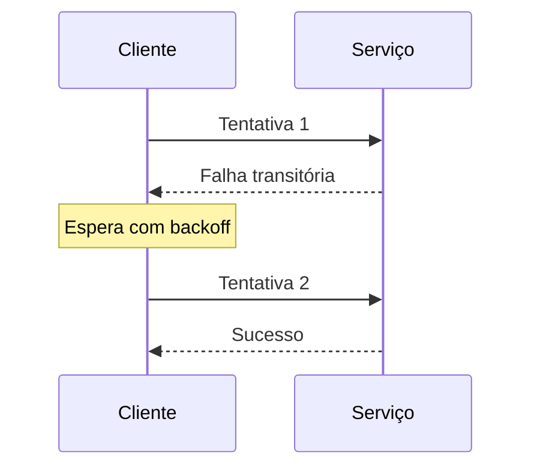

# Retry Pattern

## 1. O que é
Retry Pattern é uma técnica usada para lidar com falhas transitórias em chamadas de rede, dependências externas ou operações que podem falhar por causa de instabilidade temporária. O princípio é simples: quando uma operação falha por um erro plausivelmente temporário, o sistema tenta executá-la novamente após um intervalo de tempo. Em ambientes distribuídos, esse padrão é extremamente comum porque falhas transitórias são normais.

No mercado, você também verá os termos retry policy, exponential backoff, jitter, retry storm e transient failure handling. A ideia central é que retries ajudam a aumentar a confiabilidade sem exigir mudanças no contrato do serviço.

## 2. Por que existe (o problema que resolve)
O problema que esse padrão resolve é a presença de falhas temporárias em sistemas distribuídos. Redes podem perder pacotes, serviços podem ficar sobrecarregados, conexões podem cair e dependências podem ser momentaneamente indisponíveis. Antes de adotar retries bem planejados, sistemas frequentemente falhavam porque uma única tentativa já era suficiente para gerar erro e cancelar a operação.

Esse padrão ganhou relevância com o crescimento de arquiteturas baseadas em rede e microsserviços, especialmente com a popularização de APIs e sistemas distribuídos onde timeouts e erros transitórios são parte do cotidiano operacional.

## 3. Como funciona
O fluxo clássico é:
1. O cliente tenta executar uma operação.
2. Se ela falhar por um erro transitório, o sistema espera um intervalo.
3. O sistema repete a tentativa, geralmente com backoff exponencial.
4. Se o número máximo de tentativas for atingido, a operação é abandonada e o erro é propagado.

Componentes envolvidos:
- Cliente ou consumidor: dispara a operação.
- Dependência remota: serviço, banco, fila ou API externa.
- Retry policy: define limites, intervalos e condições.
- Backoff strategy: controla o tempo entre tentativas.
- Observabilidade: mede quantas retries ocorreram e onde falhou.

## 4. Casos de uso reais
- Chamadas a APIs externas de terceiros.
- Comunicação entre microsserviços.
- Operações com bancos de dados ou filas temporariamente indisponíveis.
- Processamento de mensagens com reenvio de eventos.

Quando não usar:
- Quando a falha é permanente ou indica bug de negócio.
- Quando a operação não é segura para reexecução.
- Quando retries podem causar sobrecarga em cascata e amplificar o problema.

## 5. Cenários práticos e trade-offs
Cenário 1: Timeout em API externa
- O serviço tenta duas ou três vezes antes de desistir.
- Trade-offs: maior chance de sucesso, mas mais latência total.

Cenário 2: Falha de uma instância de serviço
- Uma instância cai momentaneamente e depois volta.
- Trade-offs: retries ajudam a absorver o problema, mas podem aumentar pressão na infraestrutura.

Cenário 3: Retry storm
- Várias chamadas tentam novamente ao mesmo tempo e saturam o sistema.
- Trade-offs: a técnica melhora resiliência, mas exige backoff, jitter e limites de taxa.

Trade-offs gerais:
- Latência: aumenta em caso de falha transitória.
- Confiabilidade: melhora muito.
- Custo operacional: exige monitoramento e política bem definida.
- Consistência: pode criar efeitos colaterais se a operação não for idempotente.

## 6. Diagrama e fluxo visual
a) Diagrama em Mermaid



b) Prompt para geração de imagem

“Create a conceptual illustration of the retry pattern in distributed systems. Show a client making repeated attempts to a service after a temporary failure, with exponential backoff and a final successful response.”

## 7. Exemplo aplicado — Java + Spring
```java
package com.example.retry;

import org.springframework.boot.SpringApplication;
import org.springframework.boot.autoconfigure.SpringBootApplication;
import org.springframework.retry.annotation.Backoff;
import org.springframework.retry.annotation.Recover;
import org.springframework.retry.annotation.Retryable;
import org.springframework.stereotype.Service;

@SpringBootApplication
public class RetryApplication {
    public static void main(String[] args) {
        SpringApplication.run(RetryApplication.class, args);
    }
}

@Service
class PaymentService {
    private int attempts = 0;

    @Retryable(value = RuntimeException.class, maxAttempts = 3, backoff = @Backoff(delay = 200))
    public String charge(String orderId) {
        attempts++;
        if (attempts < 3) {
            throw new RuntimeException("Temporary failure");
        }
        return "Charged " + orderId;
    }

    @Recover
    public String recover(RuntimeException ex, String orderId) {
        return "Fallback after retries for " + orderId;
    }
}
```

Pontos-chave:
- A anotação @Retryable abstrai a lógica de retry.
- O backoff define o intervalo entre tentativas.
- O método @Recover evita falha total quando as tentativas acabam.

## 8. Exemplo aplicado — TypeScript + NestJS
```ts
import { Injectable } from '@nestjs/common';

@Injectable()
class PaymentService {
  private attempts = 0;

  async charge(orderId: string): Promise<string> {
    this.attempts++;
    if (this.attempts < 3) {
      throw new Error('Temporary failure');
    }
    return `Charged ${orderId}`;
  }
}
```

Pontos-chave:
- Em NestJS, a política de retry pode ser implementada explicitamente.
- Para produção, seria melhor encapsular essa regra em um decorator ou utilitário reutilizável.

## 9. Comparação e armadilhas comuns
Comparação rápida:
- Retry x Circuit Breaker: retry tenta novamente; circuit breaker interrompe o fluxo para evitar sobrecarregar um sistema falho.
- Retry x Idempotência: retry só é seguro se a operação for idempotente ou se o efeito colateral puder ser controlado.

Erros comuns:
1. Usar retry para erros permanentes de validação.
2. Não aplicar backoff e jitter, causando retry storm.
3. Ignorar a idempotência da operação.

## 10. Perguntas para fixação
1. Quando um retry é apropriado e quando ele é um anti-pattern?
2. Como você implementaria backoff exponencial com jitter?
3. Qual a relação entre retry e idempotência?
