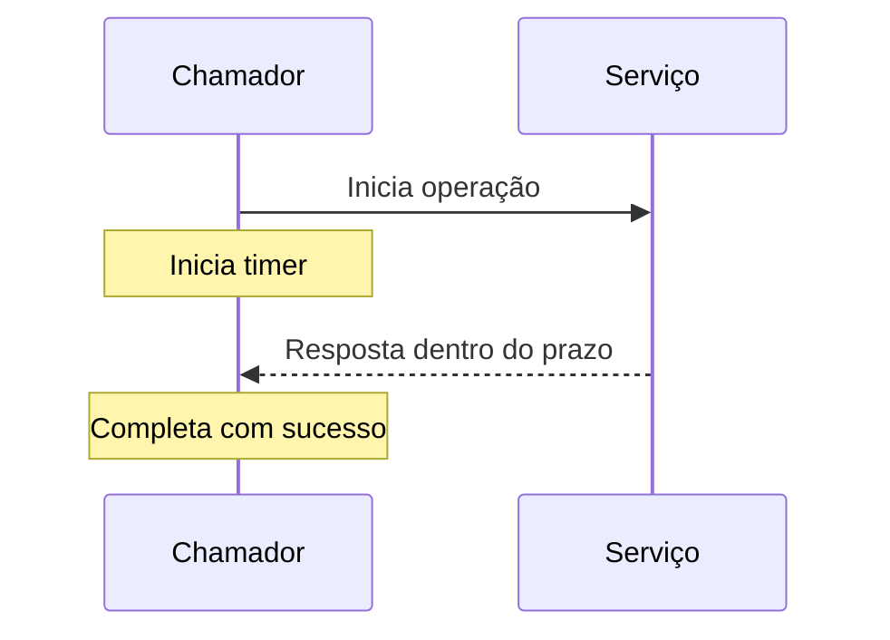

# Timeout Pattern

## 1. O que é

Timeout Pattern é uma estratégia de resiliência em que uma operação é interrompida após um limite de tempo predefinido. O objetivo é evitar que um sistema fique indefinidamente aguardando a resposta de uma dependência lenta ou indisponível. Em vez de travar uma requisição inteira, o sistema abandona a tentativa e toma uma ação apropriada, como falhar rápido ou usar fallback.

Você também pode encontrar os termos `deadline`, `request timeout`, `operation timeout` e `fail fast`. O padrão é essencial para evitar que uma dependência lenta derrube toda a experiência do cliente.

## 2. Por que existe (o problema que resolve)

O problema que resolve é o efeito cascata causado por chamadas bloqueantes. Quando um serviço depende de outro e esse outro fica lento, o chamador pode ficar preso esperando indefinidamente. Isso consome threads, conexões e memória, piorando a situação e aumentando a latência para todo o sistema.

Esse padrão tornou-se importante com a popularização de sistemas distribuídos e de APIs síncronas, onde a latência de uma dependência pode se tornar um gargalo global.

## 3. Como funciona

O fluxo é:

1. O chamador inicia uma operação.
2. Um timer é configurado com um limite máximo.
3. Se a resposta não chega até o deadline, a operação é cancelada.
4. O chamador pode retornar erro, fazer fallback ou tentar novamente de forma controlada.

Componentes envolvidos:

- Chamador: inicia a operação.
- Dependência alvo: serviço, banco, fila ou API externa.
- Timeout policy: limita o tempo máximo de espera.
- Cancelamento: interrompe a operação em andamento.
- Observabilidade: mede a distribuição de latência e a frequência de timeouts.

## 4. Casos de uso reais

- Chamada a APIs externas de pagamentos e notificações.
- Consultas a bancos de dados em ambientes de alta latência.
- Comunicação entre microsserviços com SLAs definidos.
- Operações em filas e workflows assíncronos com deadlines.

Quando não usar:

- Quando o timeout for tão curto que cause falsos negativos frequentes.
- Quando a operação é crítica e não pode ser abortada sem impacto forte.
- Quando o sistema depende de long-running operations e o timeout não faz sentido.

## 5. Cenários práticos e trade-offs

Cenário 1: Consulta lenta a um serviço externo

- O timeout de 300 ms evita que a request espere demais.
- Trade-offs: melhor resiliência, mas maior chance de erro para a requisição.

Cenário 2: Falha de dependência em cascata

- Um backend começa a responder devagar.
- Trade-offs: o timeout impede encolhimento, mas pode aumentar o número de falhas percebidas pelo cliente.

Cenário 3: Operação longa de processamento

- Um processo de geração de relatório não deveria usar timeout curto.
- Trade-offs: ajustar timeout corretamente é crucial para evitar interrupções indevidas.

Trade-offs gerais:

- Latência percebida: o timeout reduz espera prolongada, mas pode levar a falhas cedo.
- Confiabilidade: melhora porque evita bloqueio.
- Experiência do usuário: pode piorar se o timeout for agressivo demais.
- Complexidade: exige configuração e testes alinhados ao SLA.

## 6. Diagrama e fluxo visual

a) Diagrama em Mermaid



b) Prompt para geração de imagem

“Create a conceptual illustration of the timeout pattern in distributed systems. Show a client starting an operation with a timer, canceling it if the dependency does not respond in time, and returning a fail-fast result.”

## 7. Exemplo aplicado — Java + Spring

```java
package com.example.timeout;

import org.springframework.boot.SpringApplication;
import org.springframework.boot.autoconfigure.SpringBootApplication;
import org.springframework.web.client.RestTemplate;
import org.springframework.web.client.ResourceAccessException;
import org.springframework.web.client.RestTemplateBuilder;

import java.time.Duration;

@SpringBootApplication
public class TimeoutApplication {
    public static void main(String[] args) {
        SpringApplication.run(TimeoutApplication.class, args);
    }
}

class ExternalClient {
    private final RestTemplate restTemplate;

    ExternalClient(RestTemplateBuilder builder) {
        this.restTemplate = builder
            .setConnectTimeout(Duration.ofSeconds(2))
            .setReadTimeout(Duration.ofSeconds(3))
            .build();
    }

    public String fetch() {
        try {
            return restTemplate.getForObject("https://example.com", String.class);
        } catch (ResourceAccessException ex) {
            throw new RuntimeException("Timeout or connection issue", ex);
        }
    }
}
```

Pontos-chave:

- Connect timeout e read timeout definem limites explícitos.
- O chamador falha rápido em vez de esperar indefinidamente.

## 8. Exemplo aplicado — TypeScript + NestJS

```ts
import { Injectable } from '@nestjs/common';

@Injectable()
class ExternalClient {
  async fetch(): Promise<string> {
    const controller = new AbortController();
    const timeout = setTimeout(() => controller.abort(), 3000);

    try {
      const response = await fetch('https://example.com', { signal: controller.signal });
      return await response.text();
    } finally {
      clearTimeout(timeout);
    }
  }
}
```

Pontos-chave:

- O AbortController permite cancelar a requisição de forma explícita.
- Isso é uma forma prática de implementar um timeout no lado do cliente.

## 9. Comparação e armadilhas comuns

Comparação rápida:

- Timeout x Retry: timeout define o limite de espera; retry tenta novamente depois de um timeout.
- Timeout x Circuit Breaker: timeout evita bloqueio; circuit breaker interrompe o fluxo para evitar repetição contínua de chamadas ruins.

Erros comuns:

1. Configurar timeouts sem medir latência real do sistema.
2. Usar timeout curto demais e gerar falsos negativos.
3. Não combinar timeout com fallback ou retry apropriado.

## 10. Perguntas para fixação

1. Como você definiria um timeout adequado para uma dependência externa?
2. O que acontece se o timeout for muito curto em relação ao SLA do sistema?
3. Quando um timeout se torna um anti-pattern?
