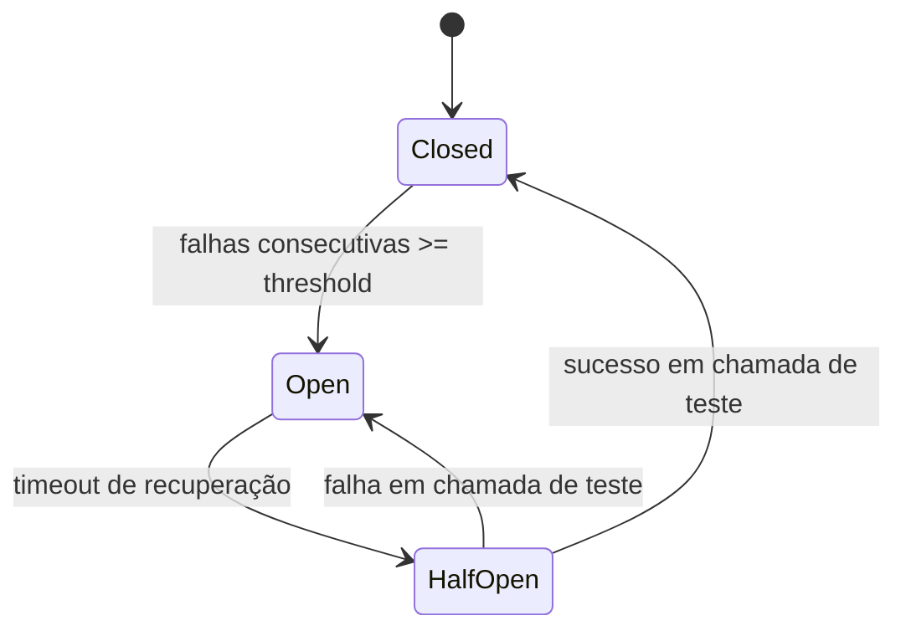

# Circuit Breaker

## 1. O que é
Circuit Breaker é um padrão de resiliência que evita que chamadas a um serviço falho continuem sendo feitas em excesso. Ele atua como um interruptor eletrônico: quando o destino começa a falhar repetidamente, o circuito “abre”, interrompendo temporariamente as chamadas e permitindo que o sistema recupere. Depois de um tempo, o circuito entra em estado de teste e, se as chamadas voltarem a funcionar, fecha novamente.

No mercado, você verá os termos circuit breaker, open/closed/half-open states e fail-fast. O padrão é particularmente útil para evitar cascata de falhas em arquiteturas distribuídas.

## 2. Por que existe (o problema que resolve)
O problema que esse padrão resolve é a cascata de falhas. Quando um serviço depende de outro que está lento ou indisponível, o chamador pode continuar tentando repetidamente, consumindo recursos e piorando o problema. Esse comportamento pode levar a uma situação em que o sistema inteiro fica sobrecarregado, mesmo que o problema original seja localizado.

Esse conceito foi popularizado por arquiteturas reativas e por sistemas distribuídos que operam em ambientes com falhas inevitáveis. Ele tem raiz em princípios de resiliência e em padrões de proteção de sistemas.

## 3. Como funciona
O circuito breaker possui estados:
1. Closed: as chamadas passam normalmente.
2. Open: as chamadas são bloqueadas imediatamente para evitar pressão sobre o serviço falho.
3. Half-open: após um período de cool down, algumas chamadas de teste são permitidas.
4. Se elas funcionarem, o circuito fecha; se não, volta a abrir.

Componentes envolvidos:
- Chamador: tenta acessar a dependência.
- Dependência: serviço remoto ou recurso externo.
- State machine: controla os estados do breaker.
- Thresholds: definem quantas falhas acionam a abertura.
- Recovery window: determina quanto tempo o circuito permanece aberto.

## 4. Casos de uso reais
- Integrações com APIs de terceiros.
- Comunicação entre microsserviços.
- Serviços de pagamento, envio de email e autenticação.
- Sistemas com dependências sujeitas a picos e interrupções.

Quando não usar:
- Quando a dependência é local e confiável.
- Quando o sistema não pode tolerar fallback ou degradação.
- Quando o timeout e o retry já são suficientes e o custo do breaker é desnecessário.

## 5. Cenários práticos e trade-offs
Cenário 1: API externa indisponível
- O breaker abre após múltiplas falhas consecutivas.
- Trade-offs: evita repetir chamadas ruins, mas pode aumentar a taxa de erro percebida pelo cliente.

Cenário 2: Recuperação gradual
- O circuito entra em half-open para testar a dependência.
- Trade-offs: melhora recuperação, mas exige cuidado para não sobrecarregar o serviço quando ele volta.

Cenário 3: Falha de cascata
- Uma dependência lenta faz várias outras dependerem dela.
- Trade-offs: o breaker protege o ecossistema, mas pode deslocar o problema para um fallback ou para uma degradação controlada.

Trade-offs gerais:
- Disponibilidade: melhora em cenários de falha.
- Latência: pode aumentar para o cliente se o fallback estiver mais lento.
- Complexidade: adiciona uma máquina de estados e monitoramento.
- Consistência: não resolve problemas de dados, apenas de fluxo.

## 6. Diagrama e fluxo visual
a) Diagrama em Mermaid



b) Prompt para geração de imagem

“Create a conceptual illustration of a circuit breaker pattern in distributed systems. Show a switch that moves from closed to open when failures exceed a threshold, then to half-open during recovery, with arrows and service icons.”

## 7. Exemplo aplicado — Java + Spring
```java
package com.example.circuitbreaker;

import io.github.resilience4j.circuitbreaker.annotation.CircuitBreaker;
import org.springframework.stereotype.Service;

@Service
public class PaymentService {
    @CircuitBreaker(name = "paymentService", fallbackMethod = "fallback")
    public String charge(String orderId) {
        return callExternalPaymentGateway(orderId);
    }

    public String fallback(String orderId, Exception ex) {
        return "Payment fallback for " + orderId;
    }

    private String callExternalPaymentGateway(String orderId) {
        throw new RuntimeException("Gateway unavailable");
    }
}
```

Pontos-chave:
- A anotação da Resilience4j simplifica a implementação.
- O fallback é acionado quando o circuito abre.

## 8. Exemplo aplicado — TypeScript + NestJS
```ts
import { Injectable } from '@nestjs/common';

@Injectable()
class PaymentService {
  private failures = 0;
  private open = false;

  async charge(orderId: string): Promise<string> {
    if (this.open) {
      return `Fallback for ${orderId}`;
    }

    try {
      this.failures++;
      if (this.failures >= 3) {
        this.open = true;
        return `Fallback for ${orderId}`;
      }
      throw new Error('Gateway unavailable');
    } catch (error) {
      return `Fallback for ${orderId}`;
    }
  }
}
```

Pontos-chave:
- O comportamento é simples e didático.
- Em produção, seria ideal usar uma biblioteca ou um estado de recuperação mais robusto.

## 9. Comparação e armadilhas comuns
Comparação rápida:
- Circuit breaker x retry: retry repete chamadas; circuit breaker interrompe chamadas para evitar pressão sobre um sistema falho.
- Circuit breaker x timeout: timeout limita espera; circuit breaker protege o chamador de depender repetidamente de uma dependência ruim.

Erros comuns:
1. Usar thresholds muito altos e não abrir cedo o suficiente.
2. Ignorar o estado half-open e a recuperação gradual.
3. Não combinar com fallback e observabilidade.

## 10. Perguntas para fixação
1. Em que situação um circuit breaker é preferível a um retry?
2. Como você definiria os thresholds para abrir um circuito?
3. O que acontece se o fallback também falhar?
