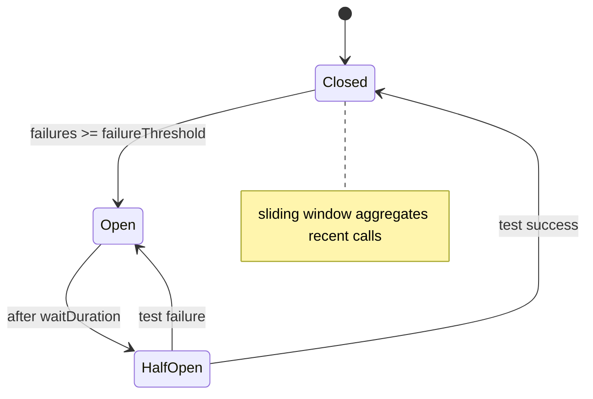

# Circuit Breaker

## 1. O que é

Circuit Breaker é um padrão de resiliência que evita que chamadas a um serviço falho continuem sendo feitas em excesso. Funciona como um interruptor: quando uma dependência começa a falhar além de uma tolerância configurada, o circuito “abre” e impede novas chamadas para proteger recursos do chamador. Após um período, o circuito entra em estado de teste (`half-open`) e, se as chamadas voltarem a funcionar, fecha novamente.

Termos correlatos usados no mercado:

- circuit breaker
- open/closed/half-open states
- fail-fast
- outlier detection

Variações / camadas relevantes (serão detalhadas na Seção 3):

- Closed
- Open
- Half Open
- Sliding Window (time-based / count-based)
- Failure Threshold (count or percentage)
- Slow Call Threshold
- Fallback

## 2. Por que existe (o problema que resolve)

O padrão surgiu para impedir cascata de falhas em arquiteturas distribuídas: sem proteção, clientes continuam a enviar requisições para um downstream degradado, consumindo conexões, threads e CPU até causar falhas em cadeia (thundering herd). Antes de circuit breakers e outras estratégias de resiliência, operações transitórias agravavam-se por causa de retries e falta de proteção.

Na prática, bibliotecas como Hystrix (Netflix) popularizaram a adoção do padrão, e projetos mais recentes (Resilience4j, Envoy, Istio) evoluíram as implementações com métricas, sliding windows e integração com tracing/telemetria.

## 3. Tipos e características

Nesta seção detalhamos os subcomponentes e variações citadas na Seção 1.

### Closed

- Como funciona: estado padrão em que todas as chamadas são permitidas e métricas (sucesso/falha/latência) são coletadas.
- Prós: baixa latência e operação normal quando o downstream está saudável.
- Contras: sem thresholds bem calibrados, o breaker pode demorar a abrir.
- Camada: aplicação, bibliotecas de cliente, API gateway.

### Open

- Como funciona: o circuito bloqueia chamadas imediatamente; o chamador recebe um erro rápido (fail-fast) ou segue para um `fallback`.
- Prós: evita gastar recursos com chamadas inúteis.
- Contras: pode aumentar erros percebidos pelo cliente se o fallback for inadequado.
- Camada: aplicação, gateway, proxy.

### Half Open

- Como funciona: após um período de `waitDuration`, o breaker permite um número limitado de chamadas de teste; se bem-sucedidas, fecha; caso contrário, reabre.
- Prós: permite recuperação automática.
- Contras: número de chamadas em half-open precisa ser afinado para evitar nova sobrecarga.

### Sliding Window

- Como funciona: decisões são baseadas em métricas agregadas sobre uma janela deslizante (baseada em contagem de chamadas ou tempo).
- Prós: sensível a comportamento recente; evita reação a eventos antigos.
- Contras: requer armazenamento de métricas e tuning (tamanho da janela, mínimo de chamadas).

### Failure Threshold

- Como funciona: número absoluto ou percentual de falhas dentro da janela que dispara a abertura do circuito.
- Prós: controle direto sobre sensibilidade.
- Contras: thresholds mal calibrados causam aberturas prematuras ou tardias.

### Slow Call Threshold

- Como funciona: chamadas cuja latência excede um limite são contadas como "slow" e podem contribuir para o failure threshold.
- Prós: detecta degradação de latência (prevenindo problemas antes de erros explícitos).
- Contras: exige métricas de latência fiáveis.

### Fallback

- Como funciona: caminho alternativo executado quando o circuito está aberto ou a chamada falha; ex.: valor em cache, resposta padrão, enfileiramento para retry posterior.
- Prós: mantém degradação graciosa do serviço.
- Contras: risco de inconsistência se o fallback não for cuidadosamente projetado.

## 4. Como funciona (mecanismo interno)

Passo a passo técnico:

1. Cada chamada ao downstream é observada pelo `Circuit Breaker` (sucesso, erro, latência).
2. Esses resultados alimentam um store de métricas (ring buffer, contador ou store distribuído).
3. O `Policy Evaluator` (regra) calcula, sobre a janela configurada, se o `failure threshold` foi ultrapassado (ex.: 50% das últimas 20 chamadas falharam).
4. Se o threshold for atingido, o state machine transiciona para `Open` e inicia `waitDuration`.
5. Enquanto `Open`, chamadas recebem fail-fast ou segue `fallback` imediatamente.
6. Ao fim do `waitDuration`, o estado vai para `Half-Open` e são permitidas `N` chamadas de teste.
7. Se as chamadas de teste forem bem-sucedidas segundo a política, o estado volta a `Closed`; caso contrário, reabre e repete o ciclo.

Componentes envolvidos:

- State machine: mantém `Closed/Open/Half-Open` e transições.
- Metrics store: ring buffer (in-memory) ou store distribuído (Redis, Prometheus metrics expostas).
- Policy evaluator: aplica `failure threshold`, `slow call threshold`, e lógica de `sliding window`.
- Timer/scheduler: controla `waitDuration` e permissões em `half-open`.
- Fallback handler: executa caminho alternativo.

Algoritmos/práticas comuns:

- Count-based consecutive failures: abre após N falhas consecutivas.
- Percentage-based sliding window (time or count): abre quando X% das últimas M chamadas falharam.
- Slow-call detection: contribui para a métrica de falha quando latência > threshold.
- Adaptive recovery: ajustar `waitDuration` com base em sinais de carga.

## 5. Onde e como se aplica na prática

### Nível de máquina/processo único

Bibliotecas locais:

- Java: Resilience4j, Failsafe
- Node.js: opossum, HystrixJS
- Python: pybreaker, tenacity (para retry combinado)

Implementação local protege apenas o processo que o contém.

### Nível de infraestrutura on-premise/self-managed

Ferramentas e pontos de integração:

- Envoy: outlier detection e circuit breaking em proxies (configurável por cluster/host)
- HAProxy: pode aplicar limites e health checks; circuit breaking mais sofisticado via Envoy
- API Gateways (Kong, Tyk): plugins/filters para fallback e throttling

### Nível de nuvem/managed service

- AWS App Mesh / API Gateway: integração com retry/backoff e mecanismos de failover
- GCP Traffic Director / Cloud Load Balancing: health checks + roteamento por estado
- Azure Application Gateway / Service Fabric: padrões de resiliência em nível de plataforma

### Nível de orquestração/Kubernetes

- Istio: outlier detection, circuit breaking e retry policies
- Linkerd: retry/failfast primitives
- Service meshes e sidecars são locais comuns para aplicar políticas centralizadas

## 6. Casos de uso reais e quando NÃO usar

Casos de uso reais:

1. Gateways de pagamento (use `Failure Threshold` + `Fallback` para operações críticas sem bloquear o fluxo).
2. Serviços de autenticação e sessão (use `Slow Call Threshold` para detectar degradação antes de falhas).
3. Integrações com provedores externos (SMS, e-mail) onde custo e latência são sensíveis (usar `Open` e enfileirar mensagens).
4. Serviços de backend replicados com falhas intermitentes (usar `Sliding Window` para evitar decisões baseado em ruído).

Quando NÃO usar:

- Em dependências estritamente locais e confiáveis (overhead e complexidade sem ganho).
- Em operações transacionais onde fallback pode causar inconsistência sem processo de compensação.
- Quando outros mecanismos (throttling, bulkhead) já resolvem o problema sem necessidade de breaker.

## 7. Cenários práticos e trade-offs

### Cenário 1 — Falha rápida (consecutive failures)

1. Tráfego normal, backend responde com erro em 3 chamadas consecutivas.
2. Breaker com `consecutiveFailureThreshold = 3` abre (`Open`).
3. Chamador recebe fail-fast; sistema ativa fallback e evita saturação.
4. Após `waitDuration`, entra `Half-Open` e permite 1-3 chamadas de teste.
5. Se sucesso, volta a `Closed`.

### Cenário 2 — Degradação por latência (slow-call)

1. Backend fica lento; muitas chamadas excedem `slowCallDurationThreshold`.
2. Essas chamadas contam como "slow" e aumentam a taxa de falhas na `sliding window`.
3. Se a taxa excede `failureThreshold`, breaker abre para proteger o sistema.

### Cenário 3 — Picos e janela deslizante (edge case)

1. Pico curto de erros pode disparar break se a janela for curta.
2. Se a janela for grande demais, o breaker pode não reagir rápido o suficiente.
3. A calibragem da janela e do mínimo de chamadas (`minimumNumberOfCalls`) é crítica.

Tabela de trade-offs

| Mecanismo | Latência | Consistência | Custo operacional | Complexidade | Resiliência |
|---|---:|---|---:|---:|---:|
| Count-based (consecutive) | Baixa | Boa | Baixo | Baixa | Média |
| Sliding-window (percentage) | Baixa a média | Boa | Médio | Média | Alta |
| Slow-call detection | Média | Boa | Médio | Média | Alta |
| Fallback | Variável | Depende | Médio | Média | Alta |

## 8. Diagrama e fluxo visual

### a) Diagrama em Mermaid



### b) Prompt para geração de imagem

"Create a conceptual illustration of a circuit breaker in distributed systems: show a client calling a downstream, a state machine with Closed/Open/Half-Open, a sliding-window metric chart, thresholds and a fallback path. Modern cloud icons, clear labels and a monitoring dashboard."

## 9. Exemplo aplicado — Java + Spring

```java
package com.example.circuitbreaker;

import io.github.resilience4j.circuitbreaker.CircuitBreaker;
import io.github.resilience4j.circuitbreaker.CircuitBreakerConfig;
import io.github.resilience4j.circuitbreaker.CircuitBreakerRegistry;
import java.time.Duration;

public class ResilienceExample {
    public static void main(String[] args) throws Exception {
        CircuitBreakerConfig config = CircuitBreakerConfig.custom()
            .failureRateThreshold(50) // %
            .slowCallRateThreshold(50) // % of slow calls
            .slowCallDurationThreshold(Duration.ofSeconds(2))
            .slidingWindowType(CircuitBreakerConfig.SlidingWindowType.TIME_BASED)
            .slidingWindowSize(10) // window size (time-based)
            .minimumNumberOfCalls(5)
            .waitDurationInOpenState(Duration.ofSeconds(10))
            .permittedNumberOfCallsInHalfOpenState(3)
            .build();

        CircuitBreakerRegistry registry = CircuitBreakerRegistry.of(config);
        CircuitBreaker cb = registry.circuitBreaker("paymentService");

        for (int i = 0; i < 20; i++) {
            try {
                String result = CircuitBreaker.decorateSupplier(cb, () -> callExternal(i)).get();
                System.out.println(result);
            } catch (Exception ex) {
                System.out.println("Fallback or open: " + ex.getMessage());
            }
            Thread.sleep(500);
        }
    }

    static String callExternal(int i) {
        if (i % 3 != 0) throw new RuntimeException("remote failure");
        return "ok:" + i;
    }
}
```

Pontos-chave:

- `failureRateThreshold` e `slidingWindow` controlam a sensibilidade do breaker.
- `slowCallDurationThreshold` permite detectar degradação por latência.
- `waitDurationInOpenState` define a duração do estado `Open` antes do teste.

## 10. Exemplo aplicado — TypeScript + NestJS

```ts
import { Injectable } from '@nestjs/common';

interface BreakerState { open: boolean; failures: number; lastOpenAt?: number }

@Injectable()
export class PaymentService {
  private state: BreakerState = { open: false, failures: 0 };
  private readonly failureThreshold = 3;
  private readonly recoveryMs = 10000;

  async charge(orderId: string): Promise<string> {
    if (this.state.open) {
      if (Date.now() - (this.state.lastOpenAt || 0) > this.recoveryMs) {
        // half-open probe
        return this.probe(orderId);
      }
      return `Fallback for ${orderId}`;
    }

    try {
      await this.callExternal(orderId);
      this.state.failures = 0;
      return `charged:${orderId}`;
    } catch (e) {
      this.state.failures++;
      if (this.state.failures >= this.failureThreshold) {
        this.state.open = true;
        this.state.lastOpenAt = Date.now();
      }
      return `Fallback for ${orderId}`;
    }
  }

  private async probe(orderId: string) {
    try {
      await this.callExternal(orderId);
      this.state = { open: false, failures: 0 };
      return `charged:${orderId}`;
    } catch (e) {
      this.state.lastOpenAt = Date.now();
      return `Fallback for ${orderId}`;
    }
  }

  private async callExternal(orderId: string): Promise<void> {
    throw new Error('remote failure');
  }
}
```

## 11. Comparação e armadilhas comuns

Diferenças rápidas:

- `Circuit Breaker` vs `Retry`: retry tenta reexecução; breaker corta o fluxo para evitar sobrecarga.
- `Circuit Breaker` vs `Bulkhead`: bulkhead isola recursos; breaker protege contra downstream falho.

Erros comuns:

1. Thresholds mal calibrados (muito alto/baixo).
2. Ignorar chamadas lentas como sinal de degradação.
3. Fallbacks que introduzem inconsistência.
4. Falta de métricas/tracing.

## 12. Perguntas para fixação

1. Em que situação um circuit breaker é preferível a um retry?
2. Como você definiria thresholds para abrir um circuito em um serviço com picos periódicos?
3. Como o `slow call threshold` ajuda a detectar degradação antes de erros explícitos?
4. Como você escolheria `permittedNumberOfCallsInHalfOpenState` em um ambiente com alta concorrência?
