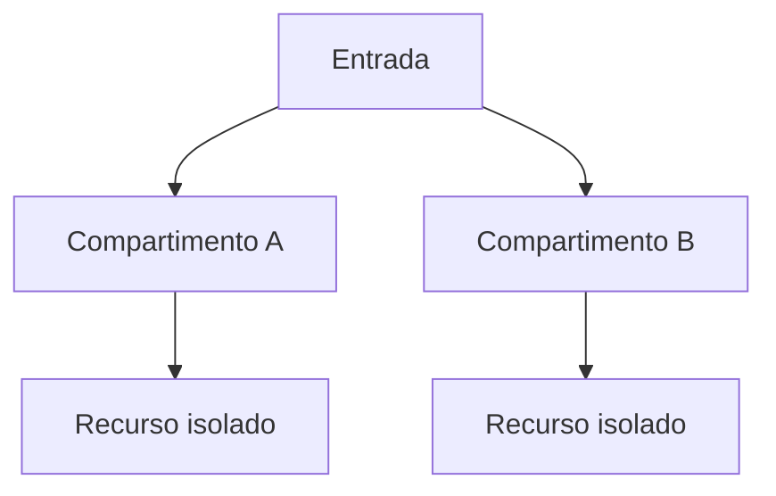

# Bulkhead

## 1. O que é

Bulkhead é um padrão de resiliência que isola recursos para impedir que uma parte do sistema comprometa o restante. O nome vem da compartimentação de um navio: se uma seção afunda, as demais continuam intactas. Na arquitetura de software, isso significa separar pools de threads, conexões, memória, filas ou instâncias para reduzir o impacto de uma falha localizada.

Também é chamado de resource isolation ou partition isolation. O ponto central é garantir que uma sobrecarga ou falha em um componente não consuma todos os recursos do sistema.

## 2. Por que existe (o problema que resolve)

O problema que esse padrão resolve é o efeito de “noisy neighbor” e a contaminação de recursos compartilhados. Quando uma operação muito pesada ou um componente instável consome recursos demais, outras partes do sistema podem perder desempenho ou até falhar. Em sistemas monolíticos e distribuídos, isso é comum quando há concorrência, pools compartilhados ou dependências com comportamento imprevisível.

Esse conceito foi popularizado em arquiteturas resilientes e é um dos pilares da resiliência por isolamento.

## 3. Como funciona

O mecanismo é baseado em isolamento de recursos:

1. O sistema separa recursos em compartimentos distintos.
2. Cada compartimento tem limites próprios de uso.
3. Se um compartimento falhar ou ficar saturado, os demais continuam operando.
4. O sistema pode rejeitar ou reduzir tráfego para o compartimento problemático.

Componentes envolvidos:

- Recursos compartilhados: threads, conexões, memória, CPU, filas.
- Compartimentos: pools isolados ou grupos de capacidade.
- Política de limite: define quotas e thresholds.
- Monitoramento: mede uso e saturação.

## 4. Casos de uso reais

- APIs com diferentes tipos de carga, como leitura e escrita.
- Sistemas com pools de conexão separados por cliente ou serviço.
- Plataformas de streaming e processamento assíncrono.
- Aplicações com trabalho pesado e tráfego interativo misturados.

Quando não usar:

- Quando há poucos recursos e a sobrecarga não justifica isolamento.
- Quando a complexidade operacional do isolamento supera o benefício.
- Quando o sistema já é naturalmente particionado por arquitetura.

## 5. Cenários práticos e trade-offs

Cenário 1: API pública e processamento em background

- A API segura e os workers têm pools separados.
- Trade-offs: maior resiliência, mas menos eficiência de utilização de recursos.

Cenário 2: Saturação de uma fila

- Uma fila lenta consome threads e bloqueia outras operações.
- Trade-offs: o bulkhead isola o problema, mas pode causar rejeição de requisições.

Cenário 3: Falha de uma dependência externa

- As conexões de uma dependência ruim são isoladas de outras.
- Trade-offs: o sistema continua operando, mas parte da capacidade fica indisponível.

Trade-offs gerais:

- Resiliência: melhora bastante.
- Utilização: pode diminuir a eficiência por excesso de isolamento.
- Complexidade: exige planejamento de quotas e observabilidade.
- Custo: pode implicar mais infraestrutura ou limites de capacidade.

## 6. Diagrama e fluxo visual

a) Diagrama em Mermaid



b) Prompt para geração de imagem

“Create a conceptual illustration of the bulkhead pattern. Show several isolated compartments in a software system that prevent one overloaded component from consuming all resources, with clear boundaries and traffic flow.”

## 7. Exemplo aplicado — Java + Spring

```java
package com.example.bulkhead;

import io.github.resilience4j.bulkhead.annotation.Bulkhead;
import org.springframework.stereotype.Service;

@Service
public class SearchService {
    @Bulkhead(name = "searchService", type = Bulkhead.Type.THREADPOOL)
    public String search(String query) {
        return "Search result for " + query;
    }
}
```

Pontos-chave:

- Pools isolados evitam que uma operação pesada consuma toda a capacidade do sistema.
- O uso de bulkhead é especialmente útil em ambientes com alta concorrência.

## 8. Exemplo aplicado — TypeScript + NestJS

```ts
import { Injectable } from '@nestjs/common';

@Injectable()
class SearchService {
  async search(query: string): Promise<string> {
    return `Search result for ${query}`;
  }
}
```

Pontos-chave:

- O conceito pode ser implementado com filas e limites próprios por operação.
- Em produção, seria comum separar workers e pools por domínio de carga.

## 9. Comparação e armadilhas comuns

Comparação rápida:

- Bulkhead x Circuit Breaker: bulkhead isola recursos; circuit breaker corta o fluxo para dependências problemáticas.
- Bulkhead x Queue: a fila desacopla produção e consumo; o bulkhead limita a contaminação entre fluxos.

Erros comuns:

1. Isolar demais e desperdiçar capacidade.
2. Não ajustar os limites conforme a carga real.
3. Ignorar monitoramento de saturação.

## 10. Perguntas para fixação

1. Como o bulkhead difere de um simples rate limiting?
2. Em que parte do sistema você aplicaria isolamento de recursos primeiro?
3. Quais sinais indicam que seu sistema precisa de bulkhead?

___

## 🛒 O Cenário Prático

Imagine uma API de E-commerce com duas integrações externas:

1. Serviço de Pagamento (Crítico e rápido)
2. Serviço de Inventário (Lento e instável)

Se o Serviço de Inventário ficar lento, muitas requisições vão se acumular esperando a resposta dele. Sem o Bulkhead, essas requisições lentas vão consumir todas as threads do seu servidor web. O resultado? Quando um cliente tentar fazer um Pagamento, a sua API não terá threads disponíveis para processar a requisição, e o sistema inteiro "cai".

O Bulkhead resolve isso limitando quantas requisições simultâneas podem ir para o Inventário.

### Exemplo com Java + Spring

```java
resilience4j.bulkhead:
  instances:
    servicoInventario:
      maxConcurrentCalls: 5 # Máximo de 5 chamadas simultâneas para o inventário
      maxWaitDuration: 0 # Se já tiver 5 rodando, as próximas falham imediatamente sem esperar


import io.github.resilience4j.bulkhead.annotation.Bulkhead;
import org.springframework.stereotype.Service;
import org.slf4j.Logger;
import org.slf4j.LoggerFactory;

@Service
public class InventarioService {

    private static final Logger log = LoggerFactory.getLogger(InventarioService.class);

    // O "name" deve bater exatamente com o que está no application.yml
    // O "fallbackMethod" é acionado se o Bulkhead estiver cheio
    @Bulkhead(name = "servicoInventario", fallbackMethod = "inventarioFallback")
    public String consultarEstoque(String produtoId) {
        log.info("Consultando estoque no sistema legado para o produto: {}", produtoId);
        
        // Simulando uma chamada externa que demora 10 segundos
        try {
            Thread.sleep(10000); 
        } catch (InterruptedException e) {
            Thread.currentThread().interrupt();
        }
        
        return "Estoque disponível para o produto " + produtoId;
    }

    // Método de fallback: deve ter a mesma assinatura e receber a Exception no final
    public String inventarioFallback(String produtoId, Exception e) {
        log.warn("Bulkhead cheio! Protegendo a aplicação. Rejeitando requisição para: {}", produtoId);
        return "Não foi possível verificar o estoque no momento (Serviço sobrecarregado).";
    }
}
```

___

## Outro caso de uso

Existe um endpoint:

```http
GET /loan/{id}
```

Para responder essa requisição ele consulta:

- Banco de dados
- Serviço de Score
- Serviço de Fraude
- Serviço de Notificações (para registrar acesso)

```md
        Loan API
            |
----------------------------
|     |        |          |
DB   Score   Fraude   Notificações
```

Com o bulkhead, vamos ter pool separados

```md
Pool Principal
150 threads

Pool Notificações
20 threads

Pool Score
20 threads

Pool Fraude
10 threads
```

Visualmente

```md
        Loan API

+--------------------+
| Pool Principal      |
+--------------------+

    |        |
    |        |
Score Pool   Fraud Pool

    |
Notification Pool
```

O Bulkhead tem um objetivo simples, mas muito poderoso:

- `Problema`: uma parte lenta ou com falha pode consumir todos os recursos da aplicação.
- `Solução`: separar recursos (threads, conexões, filas, pods, CPU etc.) por domínio ou dependência.
- `Benefício`: a falha fica contida naquele "compartimento", permitindo que o restante do sistema continue operando.
