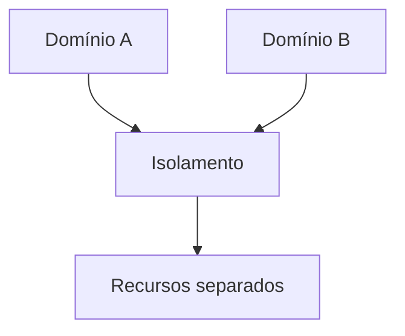

# Isolamento Estático vs Isolation Pattern

## 1. O que é
Isolamento estático e isolation pattern são abordagens para separar componentes ou recursos para aumentar resiliência. O isolamento estático é uma forma de particionar recursos de forma previsível e fixa, como separar instâncias por domínio, por cliente ou por função. O isolation pattern é o modelo mais amplo de isolamento em arquitetura, em que o sistema cria fronteiras de execução ou responsabilidade para impedir que falhas se espalhem.

No mercado, você também verá termos como partitioning, fault isolation, blast radius reduction e compartmentalization. A ideia central é reduzir o impacto de um problema localizado.

## 2. Por que existe (o problema que resolve)
O problema que esse conceito resolve é o espalhamento de falhas em sistemas complexos. Quando tudo compartilha os mesmos recursos, uma falha em uma parte pode afetar o restante. Isso é especialmente crítico em sistemas monolíticos, serviços com muitos consumidores e ambientes com overcommit de recursos.

Esse princípio é antigo na engenharia de sistemas, mas se tornou ainda mais importante com a adoção de microsserviços e plataformas cloud, onde a operação em escala exige isolamento explícito.

## 3. Como funciona
O fluxo é:
1. O sistema identifica os recursos ou domínios que precisam ser isolados.
2. Ele cria limites claros entre esses domínios.
3. As falhas são contidas dentro do compartimento afetado.
4. O restante do sistema continua funcionando com degradação controlada.

Componentes envolvidos:
- Domínios ou módulos: partes do sistema a serem isoladas.
- Recursos compartilhados: CPU, memória, rede, filas ou conexões.
- Limites de isolamento: quotas, pools ou namespaces.
- Observabilidade: mede o impacto de falhas. 

## 4. Casos de uso reais
- Microserviços com isolamento por domínio de negócio.
- Plataformas multi-tenant com separação de recursos.
- Sistemas com ambientes de produção e staging separados.
- Aplicações com múltiplos tipos de carga e prioridades diferentes.

Quando não usar:
- Quando o isolamento cria demasiada fragmentação e custo operacional.
- Quando o sistema é pequeno demais para justificar complexidade.
- Quando a dependência entre domínios é tão alta que o isolamento destrói a funcionalidade.

## 5. Cenários práticos e trade-offs
Cenário 1: Isolamento por domínio
- Um serviço de cobrança é separado de um serviço de catálogo.
- Trade-offs: reduz impacto de falha, mas aumenta complexidade de comunicação.

Cenário 2: Falha de um tenant
- Um cliente pesado consome recursos demais e afeta outros.
- Trade-offs: isolamento melhora resiliência, mas exige governança e quotas.

Cenário 3: Ambiente de produção com múltiplos ciclos
- O sistema é separado por namespace ou cluster.
- Trade-offs: mais segurança e estabilidade, mas mais custo e operação.

Trade-offs gerais:
- Resiliência: melhora muito.
- Complexidade: aumenta.
- Custo: tende a subir.
- Escalabilidade: pode ficar mais difícil se o isolamento for excessivo.

## 6. Diagrama e fluxo visual
a) Diagrama em Mermaid



b) Prompt para geração de imagem

“Create a conceptual illustration of isolation patterns in software architecture. Show multiple domains or services separated by clear boundaries to contain failures and reduce blast radius.”

## 7. Exemplo aplicado — Java + Spring
```java
package com.example.isolation;

import org.springframework.stereotype.Service;

@Service
public class InvoiceService {
    public String createInvoice() {
        return "Invoice created";
    }
}
```

Pontos-chave:
- O isolamento pode ser aplicado por módulos, serviços e recursos dedicados.
- Em sistemas maiores, isso se torna uma decisão arquitetural importante.

## 8. Exemplo aplicado — TypeScript + NestJS
```ts
import { Injectable } from '@nestjs/common';

@Injectable()
class InvoiceService {
  createInvoice() {
    return 'Invoice created';
  }
}
```

Pontos-chave:
- O princípio é simples de entender, mas exige desenho arquitetural claro.
- O abuso de compartilhamento de recursos sem limites costuma gerar problemas.

## 9. Comparação e armadilhas comuns
Comparação rápida:
- Isolation pattern x Bulkhead: bulkhead é uma forma concreta de isolation pattern.
- Isolamento estático x isolamento dinâmico: o primeiro é fixo; o segundo pode ser adaptativo conforme carga e risco.

Erros comuns:
1. Aplicar isolamento sem medir o impacto operacional.
2. Confiar em isolamento lógico quando o problema é de recursos compartilhados reais.
3. Isolar demais e aumentar acoplamento de operação.

## 10. Perguntas para fixação
1. Como você definiria o “blast radius” de um componente em seu sistema?
2. Quando o isolamento estático é mais útil do que um isolamento baseado em runtime?
3. Quais limites você colocaria para reduzir o impacto de um serviço problemático?
