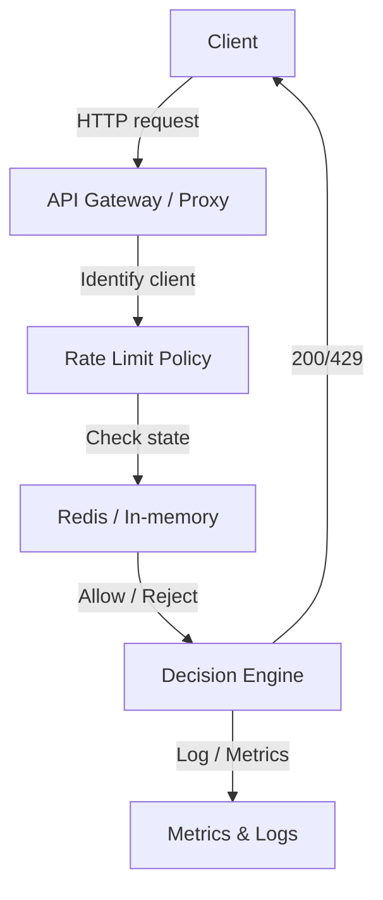

# Rate Limiting e Throttling

## 1. O que é

Rate limiting é o controle de quantas requisições, eventos ou recursos um cliente ou serviço pode consumir em um intervalo de tempo definido. Throttling é a redução ativa da taxa de processamento para manter o sistema dentro de limites seguros.

Sinônimos / nomes alternativos:

- Rate limiting
- Throttling
- Traffic shaping
- Request limiting
- Quota enforcement
- Admission control
- API rate control

Variações / camadas reconhecidas:

- Fixed window rate limiting
- Sliding window log
- Sliding window counter
- Token bucket
- Leaky bucket
- Concurrent request limiting
- Quota-based limiting
- Client-side rate limiting
- Server-side throttling
- API gateway rate limiting
- Network-level traffic shaping
- Backpressure

## 2. Por que existe (o problema que resolve)

Rate limiting e throttling existem para proteger sistemas de sobrecarga, ataques de negação de serviço, uso excessivo e acessos fora do padrão. Antes dessa prática, serviços em produção frequentemente falhavam silenciosamente por saturação de CPU, saturação de conexões ou estouro de filas, criando cascatas de falhas.

A origem prática vem de provedores de API e serviços web no início dos anos 2000, como Google, Amazon e Twitter, que precisavam limitar clientes para preservar estabilidade e equidade. O conceito também conta com fundamentos teóricos em controle de admissão e teoria de filas, mas ganhou maturidade em sistemas distribuídos quando APIs públicas e microserviços se tornaram onipresentes.

## 3. Tipos e características

### 3.1 Fixed window rate limiting

Como funciona:

- Conta requisições em janelas de tempo fixas (por exemplo, 1000 requisições por minuto).
- Ao final do intervalo, o contador reinicia.

Prós:

- Simples de implementar e entender.
- Baixo custo de memória.

Contras:

- Sujeito a rajadas no limite das janelas (burstiness).
- Pode permitir duas rajadas consecutivas em janelas adjacentes.

Camada:

- Aplicação, API Gateway, edge.

Quando usar:

- Quando a simplicidade é mais importante do que suavidade precisa.
- Para limites de API gerais e proteção inicial.

### 3.2 Sliding window log

Como funciona:

- Registra timestamps de cada requisição e conta quantas ocorrências caem dentro da janela deslizante.

Prós:

- Precisão real no controle de taxa.
- Suaviza rajadas comparado ao fixed window.

Contras:

- Alto custo de armazenamento e processamento para grandes volumes.

Camada:

- Aplicação ou middleware de gateway.

Quando usar:

- Quando a precisão é crucial e há menos de centenas de milhares de requisições por segundo.

### 3.3 Sliding window counter

Como funciona:

- Divide a janela em sub-janelas menores e estima a taxa usando contadores ponderados.

Prós:

- Melhor eficiência que o log completo.
- Mais suavidade do que o fixed window.

Contras:

- Ainda possui aproximação e algum erro.

Camada:

- Gateway, serviço de autenticação.

Quando usar:

- Em APIs de tráfego médio onde a precisão é necessária sem custo extremo.

### 3.4 Token bucket

Como funciona:

- Mantém um balde de tokens que são adicionados a uma taxa constante.
- Cada requisição consome um token; se o balde estiver vazio, a requisição é rejeitada ou enfileirada.

Prós:

- Permite rajadas controladas até um máximo de capacidade.
- Muito usado para tráfego com bursts previsíveis.

Contras:

- Requer gerenciamento de estado para cada entidade limitada.

Camada:

- Rede, gateway, aplicação.

Quando usar:

- Para limites de banda ou requisição, quando bursts são aceitáveis.

### 3.5 Leaky bucket

Como funciona:

- Enfileira requisições e processa-as a uma taxa constante ou limitada.
- Excesso é descartado ou devolvido com erro.

Prós:

- Suaviza bursts e controla fluxo com constância.
- Aproxima comportamento de uma fila em taxa fixa.

Contras:

- Latência aumentada para requisições que aguardam na fila.
- Pode introduzir head-of-line blocking.

Camada:

- Application / middleware.

Quando usar:

- Para operações assíncronas ou downstream instáveis que exigem ritmo constante.

### 3.6 Concurrent request limiting

Como funciona:

- Controla o número de requisições simultâneas ativas, não apenas a taxa ao longo do tempo.

Prós:

- Protege serviços com recursos limitados ou threads escassos.
- Previne saturação por concorrência excessiva.

Contras:

- Não limita a taxa de novos clientes fora da janela de concorrência.

Camada:

- Servidor de aplicação, proxy reverso.

Quando usar:

- Para serviços onde cada requisição consome recurso fixo e alto.

### 3.7 Quota-based limiting

Como funciona:

- Define limites de consumo em um período mais amplo, como 1000 requisições por dia ou 10 GB por mês.

Prós:

- Adequado para planos de API e billing.
- Mais previsível para clientes.

Contras:

- Menos sensível a picos instantâneos.

Camada:

- API management, billing.

Quando usar:

- Para controle de uso de longo prazo e monetização.

## 4. Como funciona (mecanismo interno)

1. Identificação: o sistema extrai o identificador do cliente, token, API key, IP ou usuário.
2. Política: consulta a regra aplicável (por cliente, plano, endpoint, IP, método).
3. Estado: acessa o contador, balde ou fila associado ao identificador.
4. Avaliação: aplica o algoritmo de rate limiting ou throttling.
5. Ação: permite, rejeita (HTTP 429), coloca em espera, ou reduz a taxa.
6. Feedback: adiciona cabeçalhos como `Retry-After`, `X-RateLimit-Limit`, `X-RateLimit-Remaining`.
7. Atualização: persiste o novo estado no armazenamento (Redis, in-memory, banco de dados) e retorna a resposta.

Componentes envolvidos:

- Policy engine: regras de limite e quotas.
- Storage/state store: Redis, Memcached, DynamoDB, in-memory.
- Middleware/proxy: aplica o controle antes da lógica de negócio.
- Client identifier extractor: determina agrupamentos.
- Response builder: emite cabeçalhos e códigos apropriados.
- Metrics collector: mede hits, rejeições e latência.

Algoritmos/estratégias:

- Fixed window
- Sliding window log
- Sliding window counter
- Token bucket
- Leaky bucket
- Atomic increments e scripts Redis
- Lua scripts e Redis `INCRBY`, `EXPIRE`

## 5. Onde e como se aplica na prática

### Nível de máquina/processo único

- Um único serviço Spring Boot pode usar Bucket4j ou Resilience4j in-memory para limitar chamadas ao endpoint.
- Em NestJS, `express-rate-limit` ou `rate-limiter-flexible` pode aplicar limites no próprio processo.
- Útil para proteger aplicações standalone em ambientes não distribuídos.

### Nível de infraestrutura on-premise/self-managed

- NGINX com `limit_req_zone` e `limit_conn_zone` para throttling HTTP.
- HAProxy com `stick-table` e `clamp /conn_rate`.
- Envoy com `rate_limit` HTTP filter e Redis-backed rate limit service.
- Kong API Gateway, Tyk, Apigee Edge e Traefik com plugins de rate limiting.
- Redis ou Memcached como armazenamento de estado para limites distribuídos.

### Nível de nuvem/managed service

- AWS API Gateway rate limiting e throttling para APIs REST/HTTP.
- AWS App Mesh e App Runner com limitadores em proxies.
- GCP API Gateway e Cloud Endpoints.
- Azure API Management com políticas de rate limit e quota.
- Cloudflare Rate Limiting e AWS WAF bot control.
- Kong Konnect e NGINX Plus em managed services.

### Nível de orquestração/Kubernetes

- Istio e Linkerd com `RateLimit` CRDs ou Envoy filter.
- Kubernetes Ingress controllers com rate limiting por IP ou path.
- Kong Ingress Controller e Ambassador API Gateway.
- Service Mesh mais sidecar proxies para aplicar throttling na borda de cada pod.

## 6. Casos de uso reais e quando NÃO usar

### Casos de uso reais

- Twitter: proteção de APIs públicas para evitar abuso e garantir uso justo. Tipo: fixed window / token bucket.
- Stripe: limita chamadas de pagamento por cliente e por recurso para prevenir abuso e reduzir fraude. Tipo: token bucket + quota.
- GitHub: rate limits por endpoint e por IP para preservar APIs e evitar scraping agressivo. Tipo: fixed window e headers de feedback.
- AWS API Gateway: throttling automático em picos para evitar backend overload. Tipo: token bucket com burst.
- Netflix: uso de rate limiting em client-side e edge para proteger microserviços. Tipo: client-side + server-side.

### Quando NÃO usar ou evitar

- Evite rate limiting pesado em endpoints de login ou autenticação sem um tratamento de retry/backoff, pois pode causar bloqueio de usuários legítimos.
- Não use throttling baseado apenas em IP quando clientes compartilharem IPs NAT ou proxies; isso penaliza usuários por vizinhança.
- Evite armazenar estado de limitação apenas em memória em clusters distribuídos: leva a inconsistências e bypass.
- Não aplique limites rígidos em APIs internas críticas sem considerar SLAs internos; isso pode gerar falhas em cascata.

## 7. Cenários práticos e trade-offs

### Cenário 1: Escala/Pico

Durante um lançamento de produto, uma API de registro de e-mail recebe 20x tráfego. O API Gateway aplica token bucket com burst e limite de 100 requisições por minuto por IP. Requisições em excesso recebem 429 e o sistema mantém backend disponível.

### Cenário 2: Falha / caso de borda

Um cliente malicioso dispara 1000 requisições por segundo. O NGINX `limit_req` bloqueia abusos e reduz temporariamente a taxa para 50 rps. Sem isso, o serviço de autenticação teria saturado e afetado outros clientes.

### Cenário 3: Quota por plano

Uma API de pagamentos permite 5000 requisições por dia para planos free e 100.000 para planos enterprise. O serviço calcula o consumo diário e bloqueia quando o cliente excede, retornando cabeçalhos de quota.

### Tabela de trade-offs

| Tipo | Latência | Consistência | Custo operacional | Complexidade | Resiliência |
|---|---|---|---|---|---|
| Fixed window | Muito baixa | Baixa | Baixo | Baixa | Média |
| Sliding window log | Média | Alta | Alto | Médio | Alta |
| Sliding window counter | Média | Alta | Médio | Médio | Alta |
| Token bucket | Média | Alta | Médio | Médio | Alta |
| Leaky bucket | Média | Alta | Médio | Médio | Alta |
| Concurrent limit | Muito baixa | Alta | Baixo | Médio | Alta |

## 8. Diagrama e fluxo visual



**Prompt de imagem em inglês**

"Create a conceptual illustration of rate limiting and throttling in a distributed system: a gateway checking API keys and IPs against token buckets, rejecting excess traffic with 429, and showing redis-backed counters and metrics dashboards. Use a modern cloud-native observability style."

## 9. Exemplo aplicado — Java + Spring

### Dependência

`pom.xml`:

```xml
<dependency>
  <groupId>com.github.vladimir-bukhtoyarov</groupId>
  <artifactId>bucket4j-core</artifactId>
  <version>8.1.0</version>
</dependency>
<dependency>
  <groupId>com.github.vladimir-bukhtoyarov</groupId>
  <artifactId>bucket4j-redis</artifactId>
  <version>8.1.0</version>
</dependency>
```

### Configuração de rate limiting com Redis

`RateLimitConfig.java`:

```java
import io.github.bucket4j.Bandwidth;
import io.github.bucket4j.Bucket;
import io.github.bucket4j.Bucket4j;
import io.github.bucket4j.Refill;
import io.github.bucket4j.redis.redisson.RedissonBasedProxyManager;
import org.redisson.api.RedissonClient;
import org.springframework.context.annotation.Bean;
import org.springframework.context.annotation.Configuration;
import java.time.Duration;
import java.util.function.Supplier;

@Configuration
public class RateLimitConfig {
  @Bean
  public Supplier<Bucket> bucketSupplier(RedissonClient redissonClient) {
    RedissonBasedProxyManager proxyManager = new RedissonBasedProxyManager(redissonClient.getMap("buckets"));
    Bandwidth limit = Bandwidth.classic(100, Refill.greedy(100, Duration.ofMinutes(1)));
    return () -> Bucket4j.builder().addLimit(limit).build(proxyManager); 
  }
}
```

### Filtro de throttle

`RateLimitFilter.java`:

```java
import io.github.bucket4j.Bucket;
import org.springframework.stereotype.Component;
import org.springframework.web.filter.OncePerRequestFilter;
import javax.servlet.FilterChain;
import javax.servlet.http.HttpServletRequest;
import javax.servlet.http.HttpServletResponse;

@Component
public class RateLimitFilter extends OncePerRequestFilter {
  private final Supplier<Bucket> bucketSupplier;

  public RateLimitFilter(Supplier<Bucket> bucketSupplier) {
    this.bucketSupplier = bucketSupplier;
  }

  @Override
  protected void doFilterInternal(HttpServletRequest request, HttpServletResponse response, FilterChain filterChain) throws java.io.IOException, javax.servlet.ServletException {
    String apiKey = request.getHeader("X-Api-Key");
    Bucket bucket = bucketSupplier.get();

    if (bucket.tryConsume(1)) {
      response.setHeader("X-RateLimit-Limit", "100");
      response.setHeader("X-RateLimit-Remaining", String.valueOf(bucket.getAvailableTokens()));
      filterChain.doFilter(request, response);
    } else {
      response.setStatus(HttpServletResponse.SC_TOO_MANY_REQUESTS);
      response.setHeader("Retry-After", "60");
      response.getWriter().write("Rate limit exceeded");
    }
  }
}
```

Pontos-chave:

- Bucket4j implementa token bucket distribuído com Redis.
- O filtro aplica o limite antes da lógica de negócio.
- `X-RateLimit-*` devolve feedback para o cliente.

## 10. Exemplo aplicado — TypeScript + NestJS

### Dependências

`package.json`:

```json
"dependencies": {
  "@nestjs/common": "^10.0.0",
  "@nestjs/core": "^10.0.0",
  "express-rate-limit": "^6.0.0",
  "rate-limit-redis": "^1.7.0",
  "ioredis": "^5.0.0"
}
```

### Configuração

`main.ts`:

```ts
import { NestFactory } from '@nestjs/core';
import * as rateLimit from 'express-rate-limit';
import * as RedisStore from 'rate-limit-redis';
import { AppModule } from './app.module';
import Redis from 'ioredis';

async function bootstrap() {
  const app = await NestFactory.create(AppModule);
  const redisClient = new Redis({ host: 'localhost', port: 6379 });

  app.use(
    rateLimit({
      store: new RedisStore({ sendCommand: (...args) => redisClient.call(...args) }),
      windowMs: 60 * 1000,
      max: 60,
      message: 'Too many requests, please try again later.',
      standardHeaders: true,
      legacyHeaders: false,
    }),
  );

  await app.listen(3000);
}
bootstrap();
```

Pontos-chave:

- `express-rate-limit` aplica throttling no middleware Express.
- `rate-limit-redis` compartilha estado entre instâncias.
- O limite é por janela de 60 segundos.

## 11. Comparação e armadilhas comuns

### Comparação com Circuit Breaker

- Rate limiting controla a taxa de entrada.
- Circuit breaker interrompe chamadas a um downstream falho.
- Diferença: rate limiting protege contra abuso e tráfego alto; circuit breaker protege contra dependências instáveis.

### Comparação com Backpressure

- Backpressure desacelera produtores quando consumidores não conseguem acompanhar.
- Throttling rejeita ou atrasa requisições antes da falha.
- Diferença: backpressure é um mecanismo de fluxo interno; throttling é controle de admissão externo.

### Erros comuns

- Usar IP como única chave em ambientes NAT: penaliza múltiplos usuários sob o mesmo IP.
- Limitar sem fornecer cabeçalhos de feedback: clientes não conseguem ajustar o comportamento.
- Armazenar estado apenas em memória em instâncias múltiplas: causa limites inconsistentes e bypass.
- Ignorar diferenças entre burst e taxa sustentada: pode aceitar rajadas indesejadas ou bloquear uso legítimo.

## 12. Perguntas para fixação

- Qual é a diferença entre rate limiting e throttling?
- Quando um token bucket é preferível a um fixed window?
- Por que o sliding window log é mais preciso do que o fixed window?
- Como você aplicaria rate limiting em um ambiente Kubernetes com múltiplas réplicas?
- Quais são os riscos de usar apenas a chave IP para limitar requisições?

___

### Throttling (Limitacao de velocidade)

O Throttling controla a velocidade com que o sistema processa as requisições.

Nem sempre significa bloquear.

O sistema pode:

- atrasar a resposta
- colocar em fila
- reduzir throughput
- processar apenas X requisições por segundo

`Ex.:`

```md
O cliente envia 1000 req/s
O Servidor suporta 100 req/s
Em vez de rejeitar tudo, ele pode:

Fila
1000 chegam
↓
processa 100/s
processa 100/s
processa 100/s
...

Ou seja:

Rate Limiting controla quantas requisições podem ser feitas.
Throttling controla a velocidade com que elas são processadas.
```

### Rate Limit (Limitacao de taxa)

O Rate Limiting define um limite máximo de requisições em uma janela de tempo.

`Ex.:`

- 100 requisições por minuto
- 1000 requisições por hora
- 10 requisições por segundo

`Quando o limite é atingido, normalmente acontece:`:

- HTTP 429 (Too Many Requests)
- cliente deve esperar
- pode existir um header `Retry-After`

O objetivo principal é:

- evitar abuso
- proteger recursos
- garantir justiça entre clientes

```md
100 req/min

0s -----------------------------60s

Cliente envia:

100 requisições ✅
101ª ❌ 429
102ª ❌ 429
```
