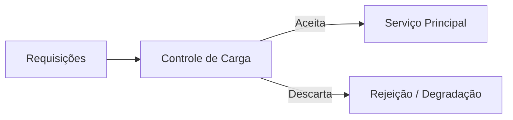

# Load Shedding

## 1. O que é
Load shedding é a prática de rejeitar ou reduzir voluntariamente parte do tráfego quando o sistema está sob pressão. Em vez de deixar a infraestrutura degradar de forma descontrolada, o sistema escolhe quais requisições serão atendidas e quais serão descartadas ou priorizadas de outra forma. O objetivo é preservar a disponibilidade do serviço principal e evitar colapso total.

Também é conhecido como traffic shedding ou selective shedding. O padrão é muito comum em sistemas sob carga extrema ou em cenários de degradação controlada.

## 2. Por que existe (o problema que resolve)
O problema que resolve é a incapacidade de atender toda a demanda quando os recursos se esgotam. Sem load shedding, o sistema pode ficar lento, saturado, perder conexões e falhar de forma ampla. Em vez de tentar servir tudo igualmente mal, a arquitetura decide que parte da carga será sacrificada para manter a função crítica em execução.

Esse conceito é associado ao design de sistemas resilientes e a ambientes de alta concorrência, onde a estratégia de “tentar servir tudo” é tecnicamente pior do que “servir o essencial”.

## 3. Como funciona
O fluxo é:
1. O sistema monitora sinais de saturação, como CPU, fila, latência ou taxa de erro.
2. Quando um threshold é alcançado, ele aplica uma política de descarte.
3. Requisições menos prioritárias são rejeitadas ou adiadas.
4. O sistema preserva o atendimento para as funções críticas.

Componentes envolvidos:
- Monitoramento: mede situação de pressão.
- Política de priorização: decide quais requisições devem continuar.
- Accept/Reject layer: aplica o descarte.
- Cliente: recebe a rejeição ou uma resposta degradada.

## 4. Casos de uso reais
- APIs públicas em picos de tráfego.
- Plataformas de vídeo e streaming.
- Sistemas de recomendação e analytics sob carga.
- Serviços financeiros em cenários de contorno.

Quando não usar:
- Quando a rejeição de tráfego pode comprometer a missão crítica do sistema.
- Quando o sistema precisa de um comportamento totalmente consistente e sem perdas.
- Quando o sistema não possui uma estratégia clara de priorização.

## 5. Cenários práticos e trade-offs
Cenário 1: Pico de tráfego em campanha
- O sistema rejeita tráfego não essencial para preservar checkout e autenticação.
- Trade-offs: mantém o core vivo, mas parte das funcionalidades fica indisponível.

Cenário 2: Saturação de fila
- A fila de background começa a crescer e o sistema descarta eventos menos prioritários.
- Trade-offs: reduz pressão, mas pode perder eventos.

Cenário 3: Falha parcial de dependência
- O sistema corta tráfego para recursos menos críticos.
- Trade-offs: melhora sobrevivência do serviço, mas pode reduzir a qualidade percebida pelo usuário.

Trade-offs gerais:
- Disponibilidade: melhora para o core.
- Consistência: pode ser sacrificada por perdas temporárias.
- Qualidade percebida: pode piorar para alguns clientes.
- Complexidade operacional: exige governança de prioridades.

## 6. Diagrama e fluxo visual
a) Diagrama em Mermaid



b) Prompt para geração de imagem

“Create a conceptual illustration of load shedding. Show incoming traffic being filtered by a control layer that drops low-priority requests during overload, while keeping critical services running.”

## 7. Exemplo aplicado — Java + Spring
```java
package com.example.shedding;

import org.springframework.stereotype.Service;

@Service
public class OrderService {
    public String createOrder() {
        return "Order created";
    }
}
```

Pontos-chave:
- A lógica pode ser aplicada na camada de entrada, como gateway ou filtro.
- O ponto importante é decidir o que é crítico e o que pode ser descartado.

## 8. Exemplo aplicado — TypeScript + NestJS
```ts
import { Injectable } from '@nestjs/common';

@Injectable()
class OrderService {
  createOrder() {
    return 'Order created';
  }
}
```

Pontos-chave:
- O NestJS pode implementar esse comportamento em interceptors e middleware.
- A estratégia precisa ser explícita para evitar decisões arbitrárias.

## 9. Comparação e armadilhas comuns
Comparação rápida:
- Load shedding x rate limiting: o primeiro descarta tráfego sob pressão; o segundo limita o tráfego antes da saturação.
- Load shedding x circuit breaker: o primeiro rejeita carga; o segundo corta chamadas para dependência problemáticas.

Erros comuns:
1. Aplicar shedding sem priorização clara.
2. Não comunicar ao cliente que a requisição foi descartada.
3. Confundir shedding com falha total do sistema.

## 10. Perguntas para fixação
1. Como você definiria o que é “tráfego crítico” em uma aplicação?
2. Quando load shedding é preferível a aumentar a capacidade?
3. Como você comunicaria ao cliente que uma requisição foi descartada?
