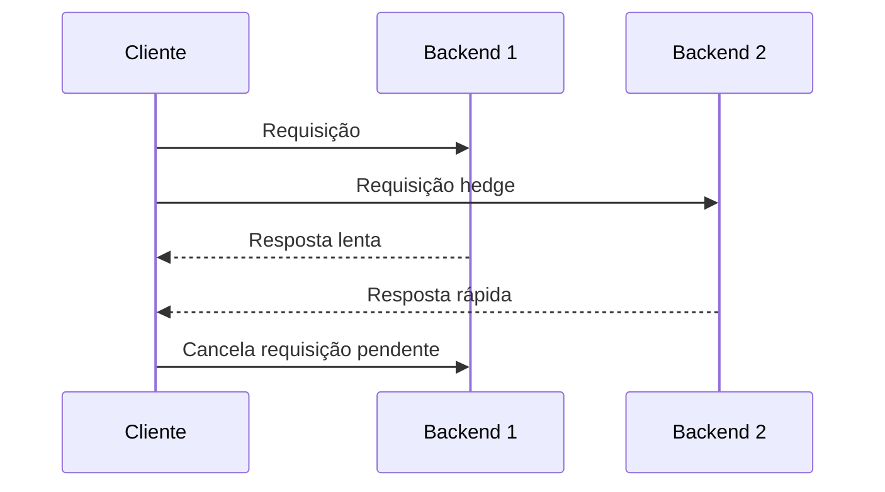

# Request Hedging Pattern

## 1. O que é
Request Hedging Pattern é uma técnica usada para reduzir latência de cauda em sistemas distribuídos. Em vez de esperar uma única resposta lenta, o cliente envia a mesma requisição para múltiplos backends em paralelo e aceita a primeira resposta bem-sucedida. As demais requisições em andamento são canceladas ou ignoradas.

Também é chamado de speculative execution ou hedged requests. O padrão é particularmente útil quando a latência de resposta varia muito entre instâncias ou entre caminhos de rede.

## 2. Por que existe (o problema que resolve)
O problema que resolve é a latência de cauda: a situação em que uma pequena fração das requisições demora muito mais do que a maior parte. Em sistemas distribuídos, essa variação pode ser causada por sobrecarga, garbage collection, contended locks, problemas de rede ou degradação de uma instância específica. Esperar uma única resposta aumenta o tempo percebido pelo cliente.

Esse padrão ganhou relevância em ambientes de alta escala, em especial em sistemas que servem milhões de requisições e onde pequenas melhorias em latência percebida geram impacto grande na experiência.

## 3. Como funciona
O fluxo é:
1. O cliente envia a requisição original para um backend primário.
2. Um timer ou threshold de latência define quando uma segunda tentativa deve ser iniciada.
3. A mesma requisição é enviada para um backend secundário.
4. A primeira resposta bem-sucedida vence.
5. As demais são canceladas para evitar desperdício de recursos.

Componentes envolvidos:
- Cliente ou gateway: inicia a requisição.
- Backends: servem a mesma operação.
- Hedging policy: define quando duplicar a execução.
- Cancelamento: interrompe requisições redundantes.
- Observabilidade: mede latência e eficiência do hedge.

## 4. Casos de uso reais
- Sistemas com latência de cauda significativa.
- APIs públicas e gateways com diversidade de backends.
- Serviços de recomendação, busca e leitura de dados distribuídos.
- Plataformas com múltiplas réplicas e alta variabilidade de resposta.

Quando não usar:
- Quando a operação não é idempotente e duplicar execução pode causar efeitos colaterais.
- Quando a latência da cauda não é um problema relevante.
- Quando o custo adicional de recursos supera o benefício da redução de latência.

## 5. Cenários práticos e trade-offs
Cenário 1: Busca em múltiplas réplicas
- Uma requisição para a réplica primária demora, então uma segunda é enviada.
- Trade-offs: melhora o tempo de resposta, mas consome mais recursos.

Cenário 2: Falha de uma instância específica
- Uma réplica fica lenta ou saturada.
- Trade-offs: o hedge reduz a chance de uma resposta muito lenta, mas pode aumentar pressão no sistema.

Cenário 3: Operação não idempotente
- A mesma ação é executada em dois backends.
- Trade-offs: o padrão pode ser útil, mas só se a operação for segura para duplicação.

Trade-offs gerais:
- Latência: reduz muito a latência de cauda.
- Custo: aumenta uso de CPU, rede e capacidade.
- Complexidade: exige controle de cancelamento e idempotência.
- Consistência: pode ser um problema se a operação não for segura para execução duplicada.

## 6. Diagrama e fluxo visual
a) Diagrama em Mermaid



b) Prompt para geração de imagem

“Create a conceptual illustration of the request hedging pattern. Show a client sending the same request to two backend replicas, with one response arriving faster and the other being canceled.”

## 7. Exemplo aplicado — Java + Spring
```java
package com.example.hedging;

import org.springframework.boot.SpringApplication;
import org.springframework.boot.autoconfigure.SpringBootApplication;
import org.springframework.web.client.RestTemplate;

import java.util.concurrent.CompletableFuture;

@SpringBootApplication
public class HedgingApplication {
    public static void main(String[] args) {
        SpringApplication.run(HedgingApplication.class, args);
    }
}

class HedgingClient {
    private final RestTemplate restTemplate = new RestTemplate();

    public String fetch() {
        CompletableFuture<String> primary = CompletableFuture.supplyAsync(() -> restTemplate.getForObject("http://backend-a", String.class));
        CompletableFuture<String> secondary = CompletableFuture.supplyAsync(() -> restTemplate.getForObject("http://backend-b", String.class));

        return CompletableFuture.anyOf(primary, secondary).join().toString();
    }
}
```

Pontos-chave:
- O cliente dispara duas chamadas e usa a primeira resposta.
- O padrão é útil para reduzir latência de cauda em sistemas distribuídos.

## 8. Exemplo aplicado — TypeScript + NestJS
```ts
import { Injectable } from '@nestjs/common';

@Injectable()
class HedgingService {
  async fetch(): Promise<string> {
    const primary = fetch('http://backend-a');
    const secondary = fetch('http://backend-b');
    const response = await Promise.race([primary, secondary]);
    return response.text();
  }
}
```

Pontos-chave:
- O uso de Promise.race é uma forma simples de implementar o conceito.
- Em produção, é importante garantir idempotência para evitar efeitos colaterais.

## 9. Comparação e armadilhas comuns
Comparação rápida:
- Request hedging x retry: retry tenta a mesma operação após falha; hedging dispara duplicação paralela para reduzir latência.
- Request hedging x load balancing: o balanceador escolhe um destino; o hedge tenta mais de um destino ao mesmo tempo para lidar com variação de resposta.

Erros comuns:
1. Usar hedging em operações não idempotentes.
2. Não controlar o número de cópias em voo.
3. Ignorar o custo de recursos adicionais.

## 10. Perguntas para fixação
1. Quando request hedging é mais adequado do que um retry simples?
2. Como você definiria o threshold para disparar um hedge?
3. O que torna uma operação segura para hedging?
