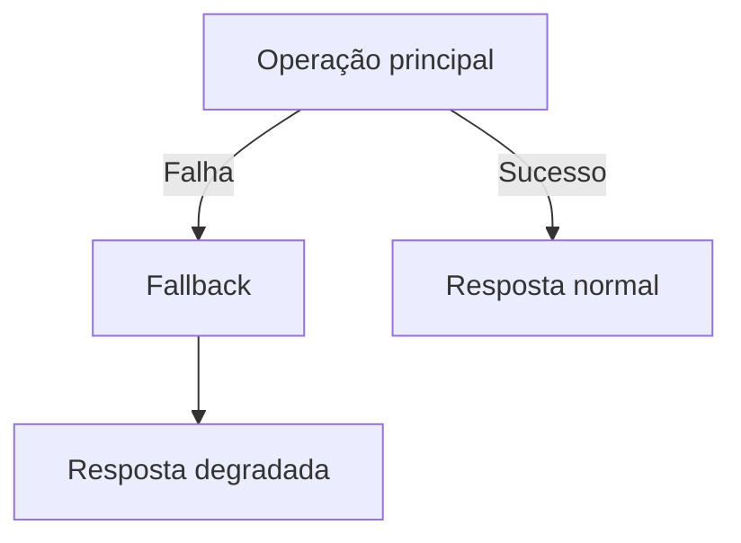

# Fallback Pattern

## 1. O que é

Fallback Pattern é uma estratégia de resiliência em que, quando uma operação principal falha, o sistema usa uma alternativa de menor custo, menor complexidade ou menor fidelidade para continuar entregando valor. Em vez de quebrar totalmente a experiência, o sistema degrada de forma controlada e continua oferecendo uma resposta aceitável.

Também é conhecido como graceful degradation strategy ou degraded mode. O ponto central é garantir que o usuário ou o sistema continue operando mesmo quando uma parte do ambiente falhou.

## 2. Por que existe (o problema que resolve)

O problema que esse padrão resolve é a dependência excessiva de componentes que podem falhar. Quando um serviço externo ou um módulo interno falha, a aplicação pode quebrar de forma completa. O fallback oferece uma saída para manter a experiência mínima, preservar disponibilidade e reduzir impacto de falhas.

Esse padrão ganhou relevância com sistemas distribuídos e com a evolução de arquiteturas orientadas a serviços, nas quais uma falha local pode se tornar um problema sistêmico.

## 3. Como funciona

O fluxo é:

1. O sistema tenta executar a operação principal.
2. Se ela falhar ou exceder limites, ele executa um caminho alternativo.
3. O fallback pode retornar um valor padrão, dados em cache, resposta simplificada ou uma mensagem de indisponibilidade.
4. O sistema registra o evento e monitora a queda de qualidade.

Componentes envolvidos:

- Operação principal: funcionalidade preferida.
- Fallback path: alternativa de execução.
- Circuit breaker ou timeout: acionam a estratégia de fallback.
- Cache ou estado temporário: pode servir como fonte de fallback.
- Observabilidade: mede o impacto da degradação.

## 4. Casos de uso reais

- APIs que retornam dados em cache quando o backend principal falha.
- Plataformas de recomendação que degradam para resultados genéricos.
- E-commerces que permitem checkout parcial quando um serviço de frete falha.
- Serviços de autenticação que usam cache de sessão em caso de indisponibilidade do provider.

Quando não usar:

- Quando o fallback pode gerar inconsistência ou violar regras críticas.
- Quando o cliente precisa de uma resposta exata e não aceita degradação.
- Quando o fallback também é complexo demais e pode introduzir novos problemas.

## 5. Cenários práticos e trade-offs

Cenário 1: Sistema de recomendação

- Se o motor principal falha, um fallback simples retorna itens populares.
- Trade-offs: mantém a experiência, mas reduz personalização.

Cenário 2: API externa indisponível

- O sistema usa cache para responder com dados recentes.
- Trade-offs: melhora disponibilidade, mas pode servir conteúdo desatualizado.

Cenário 3: Falha de uma dependência crítica

- O checkout continua com uma mensagem de atraso, em vez de quebrar.
- Trade-offs: melhora resiliência, mas pode reduzir a confiança do cliente.

Trade-offs gerais:

- Disponibilidade: melhora muito.
- Qualidade: pode cair.
- Consistência: pode haver divergência entre resposta principal e fallback.
- Complexidade: exige política clara e monitoramento.

## 6. Diagrama e fluxo visual

a) Diagrama em Mermaid



b) Prompt para geração de imagem

“Create a conceptual illustration of the fallback pattern. Show a primary service path failing and a secondary fallback path taking over to provide a degraded but functional response.”

## 7. Exemplo aplicado — Java + Spring

```java
package com.example.fallback;

import org.springframework.stereotype.Service;

@Service
public class ProductService {
    public String getProduct(String id) {
        try {
            return callPrimaryService(id);
        } catch (Exception ex) {
            return "Fallback product list";
        }
    }

    private String callPrimaryService(String id) {
        throw new RuntimeException("Primary service unavailable");
    }
}
```

Pontos-chave:

- O fallback é acionado quando a operação principal falha.
- O sistema continua operando, embora com menor fidelidade.

## 8. Exemplo aplicado — TypeScript + NestJS

```ts
import { Injectable } from '@nestjs/common';

@Injectable()
class ProductService {
  getProduct(id: string): string {
    try {
      return this.callPrimaryService(id);
    } catch (error) {
      return 'Fallback product list';
    }
  }

  private callPrimaryService(id: string): string {
    throw new Error('Primary service unavailable');
  }
}
```

Pontos-chave:

- A lógica é simples e pode ser adaptada para cache ou resposta simplificada.
- É importante documentar o que o fallback representa para o cliente.

## 9. Comparação e armadilhas comuns

Comparação rápida:

- Fallback x graceful degradation: o fallback é a estratégia; graceful degradation é o resultado percebido.
- Fallback x circuit breaker: o breaker evita novas chamadas ruins; o fallback define o que fazer quando elas falham.

Erros comuns:

1. Usar fallback sem definir claramente o contrato de degradação.
2. Confiar em fallback que também depende da dependência principal.
3. Ignorar o impacto ético ou de negócio da degradação.

## 10. Perguntas para fixação

1. Como você decide se uma resposta degradada ainda é aceitável?
2. Em que cenário fallback é melhor do que simplesmente falhar?
3. Como você evitaria que o fallback vire uma solução escondida para problemas recorrentes?
