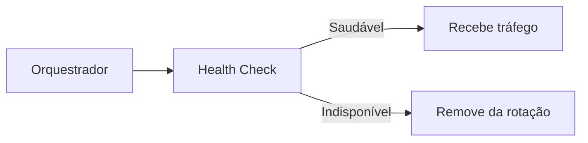

# Health Check Pattern

## 1. O que é

Health Check Pattern é um mecanismo usado para verificar se um serviço, instância ou dependência está saudável e apto a receber tráfego. O sistema realiza testes leves e regulares para detectar falhas, indisponibilidade ou degradação antes que o problema alcance o usuário. Em geral, o resultado é exposto por endpoints ou sinais de monitoramento.

Também é conhecido como liveliness probe, readiness probe e heartbeat. O padrão é uma das bases da operação de sistemas distribuídos e da automação de recuperação.

## 2. Por que existe (o problema que resolve)

O problema que resolve é a dificuldade de identificar falhas de forma antecipada e automatizada. Sem health checks, o sistema pode continuar enviando tráfego para nós indisponíveis ou com desempenho ruim. Isso aumenta falhas e reduz a confiabilidade. Com health checks, o ambiente pode remover automaticamente nós problemáticos, redirecionar tráfego e facilitar recuperação.

Esse padrão se tornou essencial em ambientes de containers, orquestração e infra de nuvem, onde instâncias mudam com frequência e a detecção automática é fundamental.

## 3. Como funciona

O fluxo é:

1. Um processo externo ou orquestrador envia uma verificação ao serviço.
2. O serviço responde com status saudável ou não saudável.
3. O resultado é interpretado como ready, live ou unhealthy.
4. O sistema usa esse estado para rotear tráfego, reiniciar instâncias ou alertar operadores.

Componentes envolvidos:

- Serviço alvo: recurso a ser verificado.
- Probe ou endpoint: caminho de verificação.
- Orquestrador ou load balancer: consome o resultado.
- Observabilidade: armazena e exibe métricas de saúde.

## 4. Casos de uso reais

- Kubernetes readiness e liveness probes.
- Load balancers e ingress controllers.
- Serviços que precisam de auto-healing.
- Plataformas de observabilidade e SRE.

Quando não usar:

- Quando o check é muito pesado e impacta a aplicação.
- Quando ele mede algo inadequado e gera falsos positivos.
- Quando não há automação para agir com base no resultado.

## 5. Cenários práticos e trade-offs

Cenário 1: Instância em deadlock

- O health check detecta a instância como indisponível.
- Trade-offs: o tráfego é removido, mas há um tempo de detecção.

Cenário 2: Readiness antes do warm-up

- O serviço não está pronto para receber tráfego, mas o check não reflete isso.
- Trade-offs: pode evitar sobrecarga, mas exige configuração correta.

Cenário 3: Falha de check

- Um endpoint de saúde está em erro por causa de uma dependência externa.
- Trade-offs: o sistema remove a instância, mas pode ser uma reação exagerada se o check for ruim.

Trade-offs gerais:

- Resiliência: melhora muito.
- Latência: pode adicionar um pouco de overhead.
- Complexidade operacional: aumenta com automação.
- Falsos positivos: podem gerar remoção indevida de nós.

## 6. Diagrama e fluxo visual

a) Diagrama em Mermaid



b) Prompt para geração de imagem

“Create a conceptual illustration of a health check pattern. Show a monitoring component probing an application instance and marking it healthy or unhealthy to control traffic routing.”

## 7. Exemplo aplicado — Java + Spring

```java
package com.example.health;

import org.springframework.boot.SpringApplication;
import org.springframework.boot.autoconfigure.SpringBootApplication;
import org.springframework.web.bind.annotation.GetMapping;
import org.springframework.web.bind.annotation.RestController;

@SpringBootApplication
public class HealthApplication {
    public static void main(String[] args) {
        SpringApplication.run(HealthApplication.class, args);
    }
}

@RestController
class HealthController {
    @GetMapping("/health")
    public String health() {
        return "UP";
    }
}
```

Pontos-chave:

- O endpoint /health serve como probe simples e padronizado.
- Em produção, ele pode incluir verificações de dependência e estado interno.

## 8. Exemplo aplicado — TypeScript + NestJS

```ts
import { Controller, Get } from '@nestjs/common';

@Controller()
class HealthController {
  @Get('health')
  health() {
    return { status: 'UP' };
  }
}
```

Pontos-chave:

- O controller expõe um endpoint simples para orquestradores e balanceadores.
- Com isso é possível integrar facilmente com K8s ou load balancers.

## 9. Comparação e armadilhas comuns

Comparação rápida:

- Health check x monitoring: o check é uma verificação proativa; monitoring é a coleta e análise de métricas.
- Health check x readiness probe: readiness é uma forma específica de health check para servir tráfego.

Erros comuns:

1. Implementar checks que dependem de recursos caros.
2. Não diferenciar readiness e liveness.
3. Ignorar correlação com dependências e métricas reais.

## 10. Perguntas para fixação

1. Qual a diferença entre liveness e readiness?
2. Como você definiria um health check confiável para um serviço crítico?
3. Quando um health check pode dar um falso positivo?
