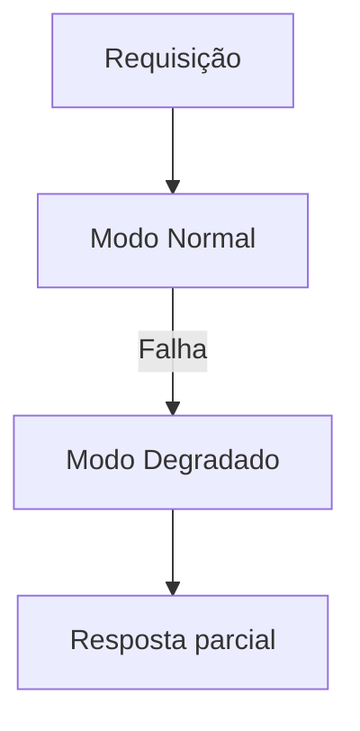

# Graceful Degradation

## 1. O que é
Graceful degradation é a capacidade de um sistema continuar operando, ainda que com menor qualidade ou funcionalidade, quando parte da infraestrutura ou da lógica falha. Em vez de parar completamente, o sistema entra em um modo degradado e preserva a experiência essencial para o usuário. Esse conceito é muito usado em sistemas distribuídos e em aplicações que precisam permanecer disponíveis sob pressão.

Também é chamado de degraded mode ou fail-soft. O princípio é reduzir o escopo da funcionalidade sem quebrar o sistema inteiro.

## 2. Por que existe (o problema que resolve)
O problema que resolve é a inevitabilidade de falhas parciais em sistemas complexos. Em ambientes distribuídos, é comum que uma dependência falhe, uma parte do serviço fique lenta ou uma feature seja incapaz de operar. Sem um plano de degradação, a falha se espalha e a plataforma inteira entra em colapso. Com graceful degradation, a equipe define antecipadamente o que pode ser sacrificado para manter o sistema vivo.

Esse padrão é especialmente relevante em produtos de grande escala, onde a disponibilidade percebida é mais importante do que a entrega completa de todas as funções em cada instante.

## 3. Como funciona
O fluxo é:
1. O sistema detecta uma falha ou limitação.
2. Uma estratégia de degradação é acionada.
3. O sistema reduz a complexidade ou a fidelidade da operação.
4. A experiência continua, embora com menos funcionalidade.

Componentes envolvidos:
- Orquestrador de degradação: decide quando e como degradar.
- Dependências: componentes que podem falhar.
- Estratégia de fallback: suplanta o comportamento principal.
- Cliente: percebe a degradação, mas continua a operar.

## 4. Casos de uso reais
- Serviços de recomendação que retornam resultados genéricos.
- E-commerces em que o frete ou pagamento parcial é desativado temporariamente.
- Redes sociais que reduzem a qualidade dos feeds durante pico.
- Sistemas que limitam recursos premium quando a infraestrutura fica pressionada.

Quando não usar:
- Quando a degradação pode violar regras críticas de negócio.
- Quando a qualidade mínima não é suficiente para o cliente.
- Quando o sistema não possui estratégia de priorização e resposta clara.

## 5. Cenários práticos e trade-offs
Cenário 1: Serviço de busca degradado
- Se o motor avançado falha, o sistema retorna busca simples por texto.
- Trade-offs: melhora disponibilidade, mas reduz precisão.

Cenário 2: Checkout parcial
- O pagamento continua operando, mas o rastreio fica desativado por algum tempo.
- Trade-offs: mantém o fluxo principal, mas reduz a experiência completa.

Cenário 3: Falha de recomendação
- O sistema substitui recomendações personalizadas por notícias ou itens populares.
- Trade-offs: preserva a navegação, mas perde personalização.

Trade-offs gerais:
- Disponibilidade: aumenta muito.
- Qualidade: diminui.
- Complexidade: exige desenho explícito de degradação.
- Confiança do cliente: pode cair se a degradação for percebida como falha completa.

## 6. Diagrama e fluxo visual
a) Diagrama em Mermaid



b) Prompt para geração de imagem

“Create a conceptual illustration of graceful degradation. Show a system switching from full functionality to a reduced but still functional mode when a dependency fails, with a clear visual contrast between normal and degraded states.”

## 7. Exemplo aplicado — Java + Spring
```java
package com.example.degradation;

import org.springframework.stereotype.Service;

@Service
public class SearchService {
    public String search(String query) {
        try {
            return callAdvancedSearch(query);
        } catch (Exception ex) {
            return "Simple search fallback for " + query;
        }
    }

    private String callAdvancedSearch(String query) {
        throw new RuntimeException("Advanced search unavailable");
    }
}
```

Pontos-chave:
- O sistema continua funcionando com um fluxo mais simples.
- A estratégia de degradação é explícita e previsível.

## 8. Exemplo aplicado — TypeScript + NestJS
```ts
import { Injectable } from '@nestjs/common';

@Injectable()
class SearchService {
  search(query: string): string {
    try {
      return this.callAdvancedSearch(query);
    } catch (error) {
      return `Simple search fallback for ${query}`;
    }
  }

  private callAdvancedSearch(query: string): string {
    throw new Error('Advanced search unavailable');
  }
}
```

Pontos-chave:
- O comportamento degradado fica localizado e claro.
- Isso é importante para não esconder falhas no código.

## 9. Comparação e armadilhas comuns
Comparação rápida:
- Graceful degradation x fallback: fallback é a técnica; graceful degradation é a experiência geral do sistema.
- Graceful degradation x circuit breaker: o breaker corta fluxo ruim; a degradação define como continuar operando.

Erros comuns:
1. Tornar a degradação invisível para o cliente.
2. Degradar tão agressivamente que o sistema vira uma experiência ruim.
3. Não documentar o que é essencial e o que pode ser sacrificado.

## 10. Perguntas para fixação
1. Como você decidiria o que pode ser removido em um modo degradado?
2. Quando uma degradação controlada é melhor do que um erro total?
3. Como você mede se a degradação está sendo percebida de forma aceitável?
